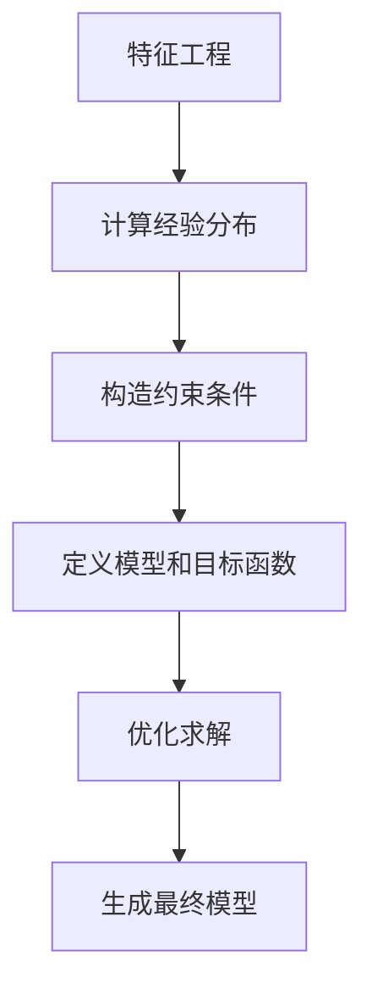

# 最大熵模型 (Maximum Entropy Models) 原理与代码实例讲解

## 1. 背景介绍

### 1.1 什么是最大熵模型?

最大熵模型(Maximum Entropy Models)是一种基于信息论原理的有监督机器学习模型。它旨在从训练数据中学习概率分布,并在满足已知约束条件的前提下,选择熵(即不确定性)最大的概率分布作为模型。

最大熵模型广泛应用于自然语言处理、信息检索、计算机视觉等领域,尤其擅长于处理具有许多相关特征的分类和预测问题。

### 1.2 最大熵模型的优势

- **数据驱动**: 最大熵模型直接从训练数据中学习,无需人工构造规则。
- **容纳多种特征**: 可以整合多种特征,包括数值型和类别型特征。
- **无偏估计**: 在满足约束条件的情况下,选择熵最大的模型,避免了主观假设。
- **灵活性强**: 通过设计不同的特征函数,可以应用于多种领域。

## 2. 核心概念与联系

### 2.1 熵(Entropy)

熵是信息论中一个重要概念,用于衡量随机变量的不确定性。在最大熵模型中,熵的定义如下:

$$
H(P) = -\sum_{x,y} \tilde{P}(x,y) \log P(y|x)
$$

其中, $\tilde{P}(x,y)$ 是经验分布(训练数据的分布), $P(y|x)$ 是模型需要学习的条件概率分布。

### 2.2 最大熵原理

最大熵原理认为,在满足已知约束条件的情况下,应当选择熵最大的概率分布作为模型。这样的分布不仅满足约束条件,而且除此之外不作任何其他假设,是最无偏的分布。

因此,最大熵模型的目标是最大化熵,同时满足训练数据的约束条件:

$$
\begin{align*}
P^* &= \arg\max_{P \in \mathcal{P}} H(P) \\
    &\text{s.t.} \quad E_{\tilde{P}}[f_i(x,y)] = E_P[f_i(x,y)], \quad i=1,2,...,n
\end{align*}
$$

其中, $\mathcal{P}$ 是所有概率分布的集合, $f_i(x,y)$ 是特征函数,描述了训练数据的统计特性。

### 2.3 模型形式

最大熵模型的形式可以表示为:

$$
P(y|x) = \frac{1}{Z(x)}\exp\left(\sum_{i=1}^n \lambda_i f_i(x,y)\right)
$$

其中:

- $Z(x)$ 是归一化因子,确保概率和为1。
- $\lambda_i$ 是特征权重,需要从训练数据中学习。
- $f_i(x,y)$ 是特征函数,描述了 $(x,y)$ 的某个属性。

这种对数线性模型形式,使得最大熵模型能够容纳多种特征,并通过学习特征权重来拟合训练数据。

## 3. 核心算法原理具体操作步骤

最大熵模型的训练过程可以分为以下几个步骤:

1. **特征工程**: 设计特征函数 $f_i(x,y)$,用于描述输入 $x$ 和输出 $y$ 之间的关系。
2. **计算经验分布**: 统计训练数据中每个 $(x,y)$ 对的出现频率,得到经验分布 $\tilde{P}(x,y)$。
3. **构造约束条件**: 根据经验分布计算每个特征函数的期望值 $E_{\tilde{P}}[f_i(x,y)]$,作为约束条件。
4. **定义模型和目标函数**: 根据最大熵原理,定义模型形式和目标函数(最大化熵,同时满足约束条件)。
5. **优化求解**: 使用数值优化算法(如梯度下降、拟牛顿法等),求解最优的特征权重 $\lambda_i$。
6. **生成最终模型**: 将学习到的特征权重 $\lambda_i$ 代入模型形式,得到最终的概率预测模型 $P(y|x)$。

以上步骤可以用以下流程图直观地表示:



## 4. 数学模型和公式详细讲解举例说明

为了更好地理解最大熵模型的数学原理,我们来看一个具体的例子。假设我们有一个二分类问题,需要根据文本 $x$ 预测其类别 $y \in \{0, 1\}$。

### 4.1 定义特征函数

首先,我们需要定义特征函数 $f_i(x,y)$。这些特征函数用于描述文本 $x$ 和类别 $y$ 之间的关系。例如:

- $f_1(x,y) = \begin{cases} 1 & \text{if } y=1 \\ 0 & \text{otherwise} \end{cases}$,表示文本属于正类的指示函数。
- $f_2(x,y) = \begin{cases} \text{count}(x, \text{'good'}) & \text{if } y=1 \\ 0 & \text{otherwise} \end{cases}$,表示文本中"good"这个词出现的次数(如果是正类)。
- $f_3(x,y) = \begin{cases} \text{count}(x, \text{'bad'}) & \text{if } y=0 \\ 0 & \text{otherwise} \end{cases}$,表示文本中"bad"这个词出现的次数(如果是负类)。

上面的特征函数只是一些简单的例子,实际应用中可以设计更多描述性更强的特征函数。

### 4.2 计算经验分布和约束条件

假设我们有以下训练数据:

| 文本 $x$ | 类别 $y$ |
|-----------|-----------|
| 这是一个好产品 | 1 |
| 这是一个坏产品 | 0 |
| 这是一个非常好的产品 | 1 |

我们可以计算经验分布 $\tilde{P}(x,y)$ 和每个特征函数的期望值(约束条件):

- $\tilde{P}(\text{'这是一个好产品'}, 1) = 1/3$
- $\tilde{P}(\text{'这是一个坏产品'}, 0) = 1/3$
- $\tilde{P}(\text{'这是一个非常好的产品'}, 1) = 1/3$
- $E_{\tilde{P}}[f_1(x,y)] = 2/3$
- $E_{\tilde{P}}[f_2(x,y)] = 2$
- $E_{\tilde{P}}[f_3(x,y)] = 1$

### 4.3 定义模型形式和目标函数

根据最大熵原理,我们定义模型形式为:

$$
P(y|x) = \frac{1}{Z(x)}\exp\left(\lambda_1 f_1(x,y) + \lambda_2 f_2(x,y) + \lambda_3 f_3(x,y)\right)
$$

其中, $\lambda_1$, $\lambda_2$, $\lambda_3$ 是需要学习的特征权重。

目标函数是最大化熵,同时满足约束条件:

$$
\begin{align*}
\max_{\lambda_1,\lambda_2,\lambda_3} &\quad H(P) = -\sum_{x,y} \tilde{P}(x,y) \log P(y|x) \\
\text{s.t.} &\quad E_{\tilde{P}}[f_i(x,y)] = E_P[f_i(x,y)], \quad i=1,2,3
\end{align*}
$$

### 4.4 优化求解

我们可以使用数值优化算法(如梯度下降、拟牛顿法等)来求解最优的特征权重 $\lambda_1$, $\lambda_2$, $\lambda_3$。优化过程需要计算目标函数和约束条件的梯度,并迭代更新权重值,直到收敛。

经过优化求解,假设我们得到的最优特征权重为:

- $\lambda_1 = 0.5$
- $\lambda_2 = 1.2$
- $\lambda_3 = -0.8$

### 4.5 生成最终模型

将学习到的特征权重代入模型形式,我们可以得到最终的概率预测模型:

$$
P(y=1|x) = \frac{1}{Z(x)}\exp\left(0.5 f_1(x,1) + 1.2 f_2(x,1) - 0.8 f_3(x,1)\right)
$$

$$
P(y=0|x) = \frac{1}{Z(x)}\exp\left(0.5 f_1(x,0) + 1.2 f_2(x,0) - 0.8 f_3(x,0)\right)
$$

其中, $Z(x)$ 是归一化因子,确保 $P(y=1|x) + P(y=0|x) = 1$。

现在,对于任意一个新的文本 $x$,我们可以使用上述模型计算 $P(y=1|x)$ 和 $P(y=0|x)$,并预测其类别为概率值更大的那一类。

## 5. 项目实践: 代码实例和详细解释说明

为了更好地理解最大熵模型,我们来看一个使用Python实现的代码示例。这个示例使用了scikit-learn库中的最大熵模型。

### 5.1 导入所需库

```python
from sklearn.datasets import make_blobs
import numpy as np
from sklearn.model_selection import train_test_split
from sklearn.metrics import accuracy_score
from sklearn.linear_model import LogisticRegression
```

### 5.2 生成示例数据

```python
# 生成示例数据
X, y = make_blobs(n_samples=1000, centers=2, n_features=5, random_state=0)
```

### 5.3 划分训练集和测试集

```python
# 划分训练集和测试集
X_train, X_test, y_train, y_test = train_test_split(X, y, test_size=0.2, random_state=0)
```

### 5.4 训练最大熵模型

```python
# 训练最大熵模型
maxent = LogisticRegression(multi_class='multinomial', solver='lbfgs')
maxent.fit(X_train, y_train)
```

在这里,我们使用了scikit-learn库中的`LogisticRegression`类来训练最大熵模型。`multi_class='multinomial'`参数表示这是一个多分类问题,`solver='lbfgs'`参数指定了使用拟牛顿法进行优化。

### 5.5 评估模型性能

```python
# 评估模型性能
y_pred = maxent.predict(X_test)
accuracy = accuracy_score(y_test, y_pred)
print(f"Accuracy: {accuracy:.2f}")
```

我们使用`predict`方法对测试集进行预测,并计算预测准确率。

### 5.6 查看特征权重

```python
# 查看特征权重
print("Feature weights:")
for i, weight in enumerate(maxent.coef_[0]):
    print(f"Feature {i}: {weight:.2f}")
```

最大熵模型学习到的特征权重存储在`maxent.coef_`属性中。我们可以打印出每个特征的权重,以了解它们对模型预测的影响程度。

通过这个示例,你可以看到如何使用scikit-learn库来训练和评估最大熵模型。虽然这只是一个简单的示例,但它展示了最大熵模型的基本用法。在实际应用中,你需要根据具体问题设计合适的特征函数,并对模型进行调优,以获得更好的性能。

## 6. 实际应用场景

最大熵模型在自然语言处理、信息检索、计算机视觉等领域有着广泛的应用。下面是一些典型的应用场景:

### 6.1 文本分类

最大熵模型可以用于文本分类任务,如新闻分类、垃圾邮件过滤、情感分析等。通过设计合适的特征函数(如词袋模型、n-gram等),最大熵模型可以学习文本的语义信息,并对其进行分类。

### 6.2 序列标注

在序列标注任务中,需要为序列中的每个元素赋予一个标签。例如,在命名实体识别中,需要识别出文本中的人名、地名、组织机构名等。最大熵模型可以通过设计特征函数来捕捉序列元素之间的依赖关系,从而实现准确的标注。

### 6.3 机器翻译

在机器翻译领