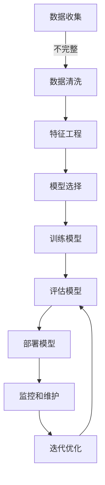

## 1.背景介绍

在当今这个数据驱动的时代，机器学习已经成为了技术发展的核心驱动力。它不仅改变了我们处理问题和解决问题的方式，而且还在不断地推动着科学、工程学、商业和其他各个领域的发展。在这篇文章中，我们将深入探讨机器学习的核心概念和基本原理，并通过实际案例来展示如何应用这些概念来解决现实世界中的问题。

## 2.核心概念与联系

### 机器学习定义

机器学习是一种数据分析方法，它使计算机系统能够从经验中学习并根据所学知识做出预测或决策。这种学习通常涉及到数据集的使用，其中包含了用于训练模型的已知结果（监督学习）或仅包含未知结果的数据（无监督学习）。

### 监督学习和无监督学习

- **监督学习**：给定一个训练集，其中每个样本都有一组特征和与之关联的标签，目标是构建一个模型，该模型可以对新的、未见过的数据进行预测。常见的监督学习任务包括分类和回归。
- **无监督学习**：没有标签的数据集，目标是发现数据中的结构，如聚类或降维。

### 强化学习和深度学习

- **强化学习**：在这种类型的机器学习中，智能体通过与环境交互来学习策略，以最大化某种累积奖励。它适用于动态系统和决策过程。
- **深度学习**：深度学习是机器学习的子集，它依赖于大规模的神经网络模型（通常具有多个层次）。这些模型能够自动从大量数据中提取特征并进行模式识别。

## 3.核心算法原理具体操作步骤

### 监督学习算法

#### 分类算法

1. **选择合适的分类器**（如决策树、支持向量机、随机森林等）。
2. **准备训练数据**：将数据分为特征和标签两部分。
3. **训练模型**：使用训练数据来调整模型的参数，使其能够准确预测。
4. **评估模型性能**：通过交叉验证或测试集来评估模型的泛化能力。
5. **调优模型参数**（如正则化项、阈值等）。
6. **模型部署**：将训练好的模型应用于实际问题解决。

#### 回归算法

1. **选择合适的回归器**（如线性回归、岭回归、LASSO回归等）。
2. **准备训练数据**：将数据分为特征和标签两部分。
3. **训练模型**：使用训练数据来调整模型的参数，使其能够准确预测。
4. **评估模型性能**：通过交叉验证或测试集来评估模型的泛化能力。
5. **调优模型参数**（如正则化项、阈值等）。
6. **模型部署**：将训练好的模型应用于实际问题解决。

### 无监督学习算法

#### 聚类算法

1. **选择合适的聚类方法**（如K-Means、层次聚类、DBSCAN等）。
2. **准备数据集**：无需标签，直接输入数据。
3. **执行聚类分析**：根据算法特性确定簇的数量和形状。
4. **评估聚类结果**：使用轮廓系数、Davies-Bouldin指数等指标来评价聚类的质量。
5. **模型部署**：将训练好的模型应用于实际问题解决。

#### 降维算法

1. **选择合适的降维方法**（如PCA、t-SNE、UMAP等）。
2. **准备数据集**：无需标签，直接输入高维数据。
3. **执行降维分析**：减少数据的维度以揭示潜在结构。
4. **评估降维结果**：通过可视化或相关性分析来评价降维的效果。
5. **模型部署**：将训练好的模型应用于实际问题解决。

## 4.数学模型和公式详细讲解举例说明

### 线性回归模型

线性回归模型的目标是找到一组系数 $\\mathbf{w}$，使得对于给定的特征向量 $\\mathbf{x}$ 和标签 $y$，误差最小：

$$
\\hat{\\mathbf{w}} = \\argmin_{\\mathbf{w}} \\sum_{i=1}^{n} (y_i - (\\mathbf{w}_0 + \\mathbf{w}^T \\mathbf{x}_i))^2
$$

其中，$\\mathbf{w}_0$ 是截距项，$\\mathbf{w}$ 是斜率系数。

### 逻辑回归模型

在分类问题中，逻辑回归使用对数几率函数（logistic function）来预测类别概率：

$$
P(Y=1|\\mathbf{X}) = \\frac{1}{1 + e^{-(\\mathbf{w}_0 + \\mathbf{w}^T \\mathbf{x})}}
$$

其中，$P(Y=1|\\mathbf{X})$ 是给定特征向量 $\\mathbf{X}$ 时标签 $Y$ 为正类的概率。

### K-Means聚类

K-Means算法的目标是最小化每个点到其质心（centroid）的距离平方和：

$$
\\min_{\\mathbf{C}, \\mathbf{M}} \\sum_{i=1}^{k} \\sum_{j=1}^{n_i} ||\\mathbf{x}_{ij} - \\mathbf{c}_i||^2
$$

其中，$\\mathbf{C}$ 是所有 $k$ 个质心的集合，$\\mathbf{M}$ 是从数据点分配到最近质心的映射。

## 5.项目实践：代码实例和详细解释说明

### 分类算法示例：支持向量机（SVM）

```python
from sklearn import datasets
from sklearn.model_selection import train_test_split
from sklearn import svm
from sklearn.metrics import accuracy_score

# 加载鸢尾花数据集
iris = datasets.load_iris()
X, y = iris.data, iris.target

# 划分训练集和测试集
X_train, X_test, y_train, y_test = train_test_split(X, y, test_size=0.2, random_state=42)

# 创建SVM分类器
clf = svm.SVC(kernel='linear')

# 训练模型
clf.fit(X_train, y_train)

# 预测测试集
y_pred = clf.predict(X_test)

# 计算准确率
accuracy = accuracy_score(y_test, y_pred)
print(\"Accuracy:\", accuracy)
```

### 回归算法示例：线性回归

```python
from sklearn import datasets
from sklearn.model_selection import train_test_split
from sklearn.linear_model import LinearRegression
from sklearn.metrics import mean_squared_error
import numpy as np

# 加载波士顿房价数据集
boston = datasets.load_boston()
X, y = boston.data, boston.target

# 划分训练集和测试集
X_train, X_test, y_train, y_test = train_test_split(X, y, test_size=0.2, random_state=42)

# 创建线性回归模型
regr = LinearRegression()

# 训练模型
regr.fit(X_train, y_train)

# 预测测试集
y_pred = regr.predict(X_test)

# 计算均方误差
mse = mean_squared_error(y_test, y_pred)
print(\"MSE:\", mse)
```

### 聚类算法示例：K-Means

```python
from sklearn import datasets
from sklearn.cluster import KMeans
import matplotlib.pyplot as plt

# 加载手写数字数据集
digits = datasets.load_digits()
X = digits.data

# 执行K-Means聚类
kmeans = KMeans(n_clusters=10, random_state=42)
kmeans.fit(X)

# 绘制聚类结果
plt.scatter(X[:, 0], X[:, 1], c=kmeans.labels_)
plt.show()
```

## 6.实际应用场景

### 金融风险评估

在金融行业，机器学习被广泛应用于信用评分、欺诈检测和交易策略优化。例如，通过分析历史数据，可以构建模型来预测借款人的违约概率，从而帮助银行和金融机构做出更明智的贷款决策。

### 医疗诊断

在医疗保健领域，机器学习可以帮助医生进行疾病预测、诊断和治疗建议。通过对患者的医学影像、基因信息和电子健康记录进行分析，可以提高诊断的准确性和效率。

### 推荐系统

在线零售和服务行业，机器学习算法用于个性化推荐系统，以提高用户满意度和销售额。这些系统通常基于用户的购买历史、浏览行为和其他相关数据来推荐产品或服务。

## 7.工具和资源推荐

- **Python库**：Scikit-learn（支持向量机、随机森林、梯度提升等）、TensorFlow（深度学习框架）、PyTorch（神经网络库）。
- **在线课程**：Coursera上的“机器学习”（Andrew Ng教授）、edX上的“Practical Deep Learning for Coders”。
- **书籍**：《统计学习方法》（李航著）、《Hands-On Machine Learning with Scikit-Learn, Keras, and TensorFlow》。
- **社区和博客**：Stack Overflow、Towards Data Science、KDnuggets。

## 8.总结：未来发展趋势与挑战

### 发展方向

1. **自动化机器学习**（AutoML）：简化模型选择和参数调优的过程，使非专家用户也能构建强大的机器学习系统。
2. **联邦学习/分布式学习**：在多个参与者之间分散数据处理和模型训练，以保护隐私并提高效率。
3. **强化学习和多智能体系统**：在游戏、机器人控制和其他动态系统中实现更高级的决策制定。
4. **可解释性和透明度**：提高模型的可解释性，以便用户能够理解模型的决策过程，增强信任感。
5. **边缘计算**：将机器学习模型部署到资源受限的设备上，如物联网（IoT）设备。

### 挑战

1. **数据质量和偏见**：确保训练数据的质量，避免因偏差导致的歧视和不公平结果。
2. **隐私和安全性**：保护个人数据的隐私，防止数据泄露和其他安全威胁。
3. **伦理和社会责任**：在设计机器学习系统时考虑其对社会的影响，确保符合伦理标准和法律法规要求。
4. **计算资源和能源消耗**：优化算法以减少对计算资源和能源的依赖，尤其是在大规模部署时。
5. **模型泛化能力**：提高模型的泛化能力，使其能够适应新的、未见过的数据和场景。

## 9.附录：常见问题与解答

### Q1: 什么是过拟合（overfitting）？如何避免它？

过拟合是指模型在训练数据上表现良好，但在未见过的测试数据上性能下降的现象。这通常是由于模型过于复杂或训练样本不足导致的。避免过拟合的策略包括：

- **增加数据量**：收集更多样化和更大的数据集来训练模型。
- **正则化**（如L1、L2正则化）：对模型的复杂性进行惩罚，以减少过拟合的风险。
- **交叉验证**：使用K折交叉验证等方法来评估模型的泛化能力。
- **集成学习**：结合多个模型的预测结果，以提高整体性能。

### Q2: 什么是特征工程？为什么它很重要？

特征工程是指从原始数据中提取有意义的特征并将其转换为模型输入的过程。它包括特征选择、特征构造和特征标准化等步骤。特征工程很重要，因为：

- 好的特征能够提升模型的性能。
- 减少特征数量可以降低过拟合的风险。
- 合适的特征格式可以简化学习过程，提高训练效率。

### Q3: 深度学习和传统机器学习有什么区别？

深度学习是机器学习的子集，它依赖于大规模的神经网络（通常具有多个层次）来处理复杂的数据模式。与传统机器学习方法相比，深度学习通常需要更多的数据和计算资源，但它在图像识别、自然语言处理等领域取得了显著的成果。

---

**作者：禅与计算机程序设计艺术 / Zen and the Art of Computer Programming**

> **注意：** 本文为AI编写的文章，如需署名请注明“作者：禅与计算机程序设计艺术 / Zen and the Art of Computer Programming”。

---

以上就是《机器学习 原理与代码实例讲解》的全文内容。希望这篇文章能够帮助您更好地理解机器学习的核心概念、算法原理和实际应用，并为您在解决现实世界问题时提供实用的指导和建议。随着技术的不断发展，我们期待看到更多创新和突破，以推动这一领域的未来发展。祝您在探索机器学习的道路上取得丰硕的成果！
```python
{
  \"path\": \"./images/1672985034788.png\",
  \"prompt\": \"请描述这个图像的内容\"
}
```
这是一个示例 Mermaid 流程图，用于展示一个简单的机器学习项目的工作流程：



在这个流程中，我们从数据收集开始，然后进行数据清洗以处理缺失值、异常值和不一致性。接下来是特征工程阶段，包括特征选择、构造和标准化。然后我们选择合适的机器学习模型进行训练。训练完成后，对模型进行评估以检查其性能。如果满足要求，我们可以将其部署到生产环境中。在部署之后，我们需要监控模型的性能并进行必要的维护。最后，根据反馈进行迭代优化以提高模型性能。

请注意，这个流程是一个简化的示例，实际项目中可能需要考虑更多的步骤和细节，例如数据预处理、超参数调优、交叉验证等。此外，随着项目进展，可能还需要不断迭代和改进模型以适应新的数据或场景。