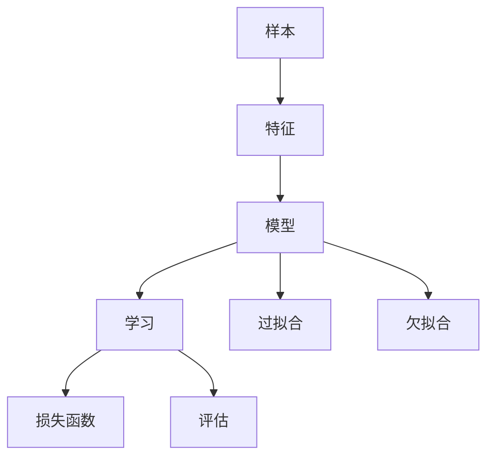

# 机器学习 原理与代码实例讲解

## 1.背景介绍

### 1.1 机器学习的定义与发展历程

机器学习是人工智能的一个重要分支,其目标是通过算法让计算机从数据中自动分析获得规律,并利用规律对未知数据进行预测。机器学习源于上世纪50年代,经过70多年的发展,已成为当前最热门、发展最快的计算机科学分支之一。

### 1.2 机器学习的分类

根据学习方式和任务类型,机器学习主要可分为以下几类:

- 监督学习:从标记数据中学习预测模型,代表算法有决策树、支持向量机、神经网络等。
- 无监督学习:从无标记数据中发现数据内在结构和规律,代表算法有聚类、降维、关联规则等。  
- 强化学习:通过最大化累积奖赏来学习最优策略,代表算法有Q学习、策略梯度等。
- 半监督学习:同时利用少量标记数据和大量无标记数据来学习模型。
- 迁移学习:利用已学习的知识来解决新的相关任务。

### 1.3 机器学习的应用场景

机器学习在各个领域都有广泛应用,例如:

- 计算机视觉:图像分类、目标检测、人脸识别等
- 自然语言处理:文本分类、情感分析、机器翻译、问答系统等  
- 语音识别:语音转文本、说话人识别等
- 推荐系统:个性化推荐、协同过滤等
- 异常检测:欺诈检测、故障诊断等
- 医疗健康:疾病诊断、药物发现等

## 2.核心概念与联系

### 2.1 特征(Feature)

特征是样本的属性或性质的度量,是机器学习算法的基本输入。通常将样本表示为特征向量。特征既可以是数值型的,也可以是类别型的。好的特征对提高模型性能至关重要。

### 2.2 模型(Model)

模型定义了从输入到输出的映射函数,是机器学习的核心。常见的模型有线性模型、决策树、神经网络等。模型通过参数来刻画这种映射关系,通过学习来优化这些参数。

### 2.3 学习(Learning)

学习是根据训练数据来优化模型参数,使模型在某个性能度量上达到最优。常用的学习方法有:

- 经验风险最小化:最小化模型在训练集上的平均损失
- 结构风险最小化:在经验风险上加上表示模型复杂度的正则化项
- 最大似然估计:最大化模型参数对数据的概率

### 2.4 损失函数(Loss Function)

损失函数用来度量模型预测值与真实值之间的差距。通过最小化损失函数来得到最优模型参数。常用的损失函数有均方误差、交叉熵、Hinge损失等。

### 2.5 评估(Evaluation)

评估是用来度量模型在新数据上的表现,需要使用一个独立的测试集。常用的评估指标有准确率、精确率、召回率、F1值、AUC等。

### 2.6 过拟合与欠拟合

过拟合是指模型过于复杂,在训练集上表现很好但在测试集上表现较差。欠拟合是指模型过于简单,无法很好地拟合数据。我们需要通过交叉验证、正则化等方法来权衡模型复杂度,以达到最佳的泛化性能。

以下是这些概念之间的关系图:



## 3.核心算法原理具体操作步骤

下面我们以几个经典的机器学习算法为例,详细讲解其原理和步骤。

### 3.1 K近邻(K-Nearest Neighbor)

K近邻是一种基本的分类与回归方法。对于一个新样本,根据其与训练集中K个最相似(最近)样本的标记来决定其标记。

算法步骤:
1. 计算新样本与每个训练样本的距离(如欧氏距离)
2. 选择距离最近的K个训练样本 
3. 对于分类任务,新样本的标记由K个样本中出现最多的标记决定;对于回归任务,新样本的值由这K个样本的值的平均值决定

优点是模型简单,易于理解,适合对稀疏的高维数据分类。缺点是计算开销大,需要存储所有训练样本。

### 3.2 决策树(Decision Tree)

决策树通过树形结构来进行决策,内部节点对应于特征,叶节点对应于决策结果。

算法步骤:
1. 选择最优划分特征:如信息增益、基尼指数 
2. 根据该特征对训练集进行划分
3. 对每个子集重复上述步骤,直到满足停止条件(如所有样本属于同一类别,达到最大深度等)
4. 将每个叶节点标记为其所含样本最多的类别

决策树易于解释,可处理数值型和类别型特征,也能很好地拟合复杂的非线性关系。但容易过拟合,对特征缺失、噪声敏感。

### 3.3 支持向量机(Support Vector Machine)

支持向量机试图在特征空间中找到一个最大间隔超平面来分隔不同类别的样本。

算法步骤:
1. 将问题转化为凸二次规划问题:最大化几何间隔,同时满足分类约束(函数间隔大于1)
2. 引入拉格朗日乘子,应用拉格朗日对偶性,转化为其对偶问题  
3. 用SMO等算法求解对偶问题,得到最优的拉格朗日乘子
4. 根据最优乘子求出最优权重向量和偏置,得到分离超平面
5. 对于线性不可分问题,通过核技巧将样本映射到高维空间,在高维空间构建最优分类超平面

SVM是一个强大的线性分类器,通过核技巧也能处理非线性问题。不过对核函数和惩罚参数敏感,计算开销大。

## 4.数学模型和公式详细讲解举例说明

这里我们以线性回归为例,详细讲解其数学模型和公式。

### 4.1 线性回归模型

线性回归试图学得一个线性模型以尽可能准确地预测输入实例的输出。其模型形式为:
$$h(x)=\sum_{i=0}^nw_ix_i=w^Tx$$
其中,$x=(x_0,x_1,...,x_n)$为输入,$x_0$恒为1,$w=(w_0,w_1,...,w_n)$为模型参数。$w_0$为偏置项。

### 4.2 损失函数

用均方误差作为损失函数来度量预测值与真实值之间的差距:

$$J(w)=\frac{1}{2m}\sum_{i=1}^m(h(x^{(i)})-y^{(i)})^2$$

其中,$m$为样本数,$y^{(i)}$为第$i$个样本的真实值。

### 4.3 最小二乘法求解

要找到最优参数,只需最小化损失函数。将损失函数对$w$求导并令其为0:

$$\frac{\partial}{\partial {w_j}}J(w)=\frac{1}{m}\sum_{i=1}^m(h(x^{(i)})-y^{(i)})x_j^{(i)}$$

整理可得:

$$w=(X^TX)^{-1}X^Ty$$

其中,

$$X=\begin{bmatrix}
(x^{(1)})^T\\
(x^{(2)})^T\\
\vdots \\
(x^{(m)})^T
\end{bmatrix},
y=\begin{bmatrix}
y^{(1)}\\
y^{(2)}\\
\vdots \\
y^{(m)}
\end{bmatrix}
$$

这就是最小二乘法的矩阵表示形式,可直接求解出最优$w$。

### 4.4 梯度下降法求解

另一种求解方法是梯度下降。其思想是:从初始点出发,按照损失函数下降最快的方向逐步迭代更新参数,直到收敛。

$$w_j:=w_j-\alpha\frac{\partial}{\partial {w_j}}J(w)$$

其中$\alpha$为学习率。将前面求得的导数代入,迭代更新公式为:

$$w_j:=w_j+\alpha\frac{1}{m}\sum_{i=1}^m(y^{(i)}-h(x^{(i)}))x_j^{(i)}$$

## 5.项目实践:代码实例和详细解释说明

下面我们用Python实现一个简单的K近邻分类器。

```python
import numpy as np
from collections import Counter

class KNN:
    def __init__(self, k=3):
        self.k = k
        
    def fit(self, X, y):
        # 训练阶段仅保存数据
        self.X_train = X
        self.y_train = y
        
    def predict(self, X):
        y_pred = [self._predict(x) for x in X]
        return np.array(y_pred)
    
    def _predict(self, x):
        # 计算样本间距离
        distances = [self._euclidean_distance(x, x_train) for x_train in self.X_train]
        # 获取最近邻索引
        k_idx = np.argsort(distances)[:self.k]
        # 获取最近邻标签
        k_labels = [self.y_train[i] for i in k_idx]  
        # 投票
        most_common = Counter(k_labels).most_common(1)
        return most_common[0][0]
    
    def _euclidean_distance(self, x1, x2):
        return np.sqrt(np.sum((x1 - x2) ** 2))
```

代码解释:

- 初始化时设置超参数k,默认为3
- fit方法保存训练数据
- predict方法对每个测试样本调用_predict方法进行预测
- _predict方法:
  - 计算测试样本与每个训练样本的欧氏距离
  - 选择距离最近的k个样本的索引
  - 根据索引获取这k个样本的标签
  - 对这k个标签进行投票,得到最终预测标签
- _euclidean_distance方法计算两个样本的欧氏距离

使用示例:

```python
from sklearn.datasets import load_iris
from sklearn.model_selection import train_test_split
from sklearn.metrics import accuracy_score

iris = load_iris()
X, y = iris.data, iris.target
X_train, X_test, y_train, y_test = train_test_split(X, y, test_size=0.2, random_state=42)

knn = KNN(k=5)
knn.fit(X_train, y_train)
y_pred = knn.predict(X_test)

print(accuracy_score(y_test, y_pred))
```

## 6.实际应用场景

机器学习在现实世界中有着广泛的应用,这里列举几个典型场景:

### 6.1 垃圾邮件过滤

可以将邮件的各种特征(如发件人、主题、内容中的关键词等)作为输入,训练一个分类模型,自动判断某个邮件是否为垃圾邮件。常用的模型有朴素贝叶斯、SVM等。

### 6.2 商品推荐

利用用户的历史行为数据(如浏览、购买记录)训练推荐模型,给用户推荐可能感兴趣的商品。常用的方法有协同过滤、矩阵分解等。

### 6.3 人脸识别

将人脸图像的特征(如SIFT、HOG等)作为输入,训练一个分类模型,能够识别出图像中的人是谁。常用的模型有KNN、SVM、深度学习等。

### 6.4 智能客服

通过对历史客服对话数据的学习,训练一个聊天机器人模型,能够自动回答用户的常见问题。常用的方法有规则系统、检索系统、生成系统等。

### 6.5 疾病诊断

利用患者的各项生理指标,训练一个分类或回归模型,辅助医生进行疾病诊断和病情评估。常见的应用如糖尿病预测、肿瘤分类等。

## 7.工具和资源推荐

### 7.1 常用工具包

- scikit-learn:Python的经典机器学习库,提供了全面的机器学习算法和工具
- TensorFlow:由Google开发的深度学