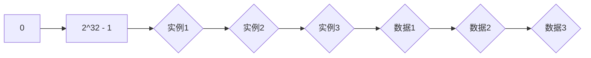

# 架构设计中的无状态和有状态服务

## 1.背景介绍

在现代分布式系统架构中,无状态(Stateless)和有状态(Stateful)服务是两种广泛采用的设计模式。它们对应着不同的系统状态管理方式,直接影响着系统的可扩展性、可用性和一致性等关键指标。随着云原生架构和微服务的兴起,无状态和有状态服务的设计选择变得更加关键和值得探讨。

### 1.1 什么是无状态服务?

无状态服务指的是服务实例本身不存储任何与请求相关的状态数据,每个请求都是独立处理的。无状态服务通常依赖外部存储(如数据库或缓存)来维护应用程序状态。这种设计模式具有很高的可伸缩性和容错性,因为服务实例之间是相互独立的,可以根据需求动态地添加或删除实例。

### 1.2 什么是有状态服务?

与之相反,有状态服务则在服务实例内部存储与请求相关的状态数据。这种设计模式通常用于需要维护会话状态或长期运行状态的场景,如在线游戏服务器、流媒体会话等。有状态服务的可扩展性较差,因为需要确保请求被路由到正确的实例以维护状态一致性。

## 2.核心概念与联系

无状态和有状态服务的核心区别在于状态管理的方式。理解这两种模式的优缺点及适用场景,对于设计高性能、可扩展的分布式系统至关重要。

### 2.1 无状态服务的优势

- **高度可扩展性**: 由于无状态服务实例之间相互独立,可以根据需求动态地添加或删除实例,从而实现水平扩展。
- **高可用性**: 如果某个实例发生故障,请求可以自动路由到其他实例,不会影响整体服务的可用性。
- **简单部署**: 无状态服务实例通常是无差别的,可以直接进行滚动升级或蓝绿部署,降低了部署风险。

### 2.2 有状态服务的优势

- **维护会话状态**: 对于需要维护会话状态或长期运行状态的场景(如在线游戏、流媒体会话等),有状态服务是必需的。
- **数据局部性**: 由于状态数据存储在本地,有状态服务可以提供更低的延迟和更高的吞吐量。
- **事务一致性**: 有状态服务可以更好地支持事务一致性,因为状态数据是本地存储的。

### 2.3 两者的联系

无状态和有状态服务实际上是一种设计权衡。无状态服务更注重可扩展性和高可用性,而有状态服务则更注重维护状态和数据局部性。在实际系统设计中,通常需要结合两种模式来满足不同的需求。例如,可以将系统分解为无状态的前端服务和有状态的后端服务,前者负责请求路由和负载均衡,后者负责维护状态和处理业务逻辑。

## 3.核心算法原理具体操作步骤

### 3.1 无状态服务的核心算法原理

无状态服务的核心算法原理是请求路由和负载均衡。由于每个实例都是相互独立的,因此需要一个中央协调器(如负载均衡器或API网关)来将请求路由到可用的实例上。常见的路由算法包括:

1. **轮询(Round Robin)**: 按照固定的顺序将请求依次分配给每个实例。
2. **加权轮询(Weighted Round Robin)**: 根据实例的权重分配请求,权重高的实例会获得更多的请求。
3. **最少连接(Least Connections)**: 将请求分配给当前活跃连接数最少的实例。
4. **基于位置(Location-based)**: 根据客户端与实例的网络距离,将请求分配给最近的实例。

这些算法的目标是实现高可用性、负载均衡和最佳性能。

### 3.2 有状态服务的核心算法原理

有状态服务的核心算法原理是状态管理和一致性。由于状态数据存储在实例内部,因此需要确保请求被路由到正确的实例,并且在实例故障或扩展时保持状态的一致性。常见的算法包括:

1. **会话粘性(Session Stickiness)**: 将来自同一客户端的请求始终路由到同一个实例,以维护会话状态。
2. **一致性哈希(Consistent Hashing)**: 使用哈希函数将请求映射到实例,并在实例扩展或故障时重新映射部分请求,以最小化状态迁移。
3. **复制和分区(Replication and Partitioning)**: 将状态数据复制到多个实例,并根据分区规则将请求路由到正确的实例。
4. **事务和并发控制**: 使用分布式事务和并发控制机制(如两阶段提交、乐观并发控制等)来保证状态的一致性。

这些算法的目标是在提供高可用性和扩展性的同时,确保状态的一致性和数据的完整性。

## 4.数学模型和公式详细讲解举例说明

### 4.1 一致性哈希算法

一致性哈希算法是一种常用的无状态服务路由算法,它可以在实例扩展或故障时最小化状态迁移。该算法的核心思想是将实例和数据映射到同一个哈希环上,并根据一定规则将数据映射到最近的实例。

假设我们有一个哈希环,其哈希值范围为 $[0, 2^{32}-1]$。我们将实例和数据都映射到这个哈希环上,如下图所示:



对于一个给定的数据 $key$,我们计算它的哈希值 $hash(key)$,并在哈希环上顺时针查找第一个大于或等于 $hash(key)$ 的实例。该实例就是负责存储和处理这个数据的实例。

数学上,我们可以用下面的公式表示:

$$
node(key) = \min\limits_{n \in N}\{n | n \geq hash(key)\}
$$

其中 $N$ 是所有实例的集合,而 $node(key)$ 就是负责处理 $key$ 的实例。

当实例扩展或故障时,只有部分数据需要重新映射到新的实例,从而最小化了状态迁移的开销。

### 4.2 加权轮询算法

加权轮询算法是一种常用的无状态服务负载均衡算法,它根据实例的权重分配请求,权重高的实例会获得更多的请求。

假设我们有 $n$ 个实例,每个实例的权重分别为 $w_1, w_2, \ldots, w_n$,则每个实例应该获得的请求比例为:

$$
p_i = \frac{w_i}{\sum\limits_{j=1}^n w_j}
$$

我们可以构建一个循环队列,将每个实例按照其权重重复放入队列中。例如,如果我们有三个实例,权重分别为 2、3 和 5,则队列为:

```
[实例1, 实例1, 实例2, 实例2, 实例2, 实例3, 实例3, 实例3, 实例3, 实例3]
```

然后,我们按照队列的顺序依次将请求分配给实例。当队列遍历完毕后,再从头开始遍历。

这种算法可以确保每个实例获得的请求数量与其权重成正比,从而实现合理的负载均衡。

## 5.项目实践:代码实例和详细解释说明

### 5.1 无状态服务示例:使用 Nginx 进行负载均衡

Nginx 是一个高性能的 Web 服务器和反向代理服务器,它可以用于实现无状态服务的负载均衡。以下是一个简单的 Nginx 配置示例:

```nginx
upstream backend {
    server backend1.example.com;
    server backend2.example.com;
    server backend3.example.com;
}

server {
    listen 80;
    server_name example.com;

    location / {
        proxy_pass http://backend;
        proxy_set_header Host $host;
        proxy_set_header X-Real-IP $remote_addr;
        proxy_set_header X-Forwarded-For $proxy_add_x_forwarded_for;
    }
}
```

在这个示例中,我们定义了一个名为 `backend` 的上游服务器组,包含三个后端服务器 `backend1.example.com`、`backend2.example.com` 和 `backend3.example.com`。这些后端服务器可以是无状态的 Web 应用程序实例。

然后,在 `server` 块中,我们配置了一个反向代理,将所有对 `example.com` 的请求代理到 `backend` 上游服务器组。Nginx 会使用默认的轮询算法将请求均衡地分发到后端实例。

你还可以使用 `ip_hash` 指令来实现会话粘性,确保来自同一客户端的请求始终被路由到同一个后端实例:

```nginx
upstream backend {
    ip_hash;
    server backend1.example.com;
    server backend2.example.com;
    server backend3.example.com;
}
```

### 5.2 有状态服务示例:使用 Redis 实现分布式会话管理

在 Web 应用程序中,会话管理是一种典型的有状态服务场景。传统的基于文件或内存的会话管理方式存在可扩展性和高可用性问题。我们可以使用 Redis 来实现分布式会话管理,提高可扩展性和可用性。

以下是一个使用 Node.js 和 Express 框架实现的示例:

```javascript
const express = require('express');
const redis = require('redis');
const session = require('express-session');
const RedisStore = require('connect-redis')(session);

const app = express();
const redisClient = redis.createClient();

app.use(session({
  store: new RedisStore({ client: redisClient }),
  secret: 'your-secret-key',
  resave: false,
  saveUninitialized: true
}));

app.get('/', (req, res) => {
  if (!req.session.views) {
    req.session.views = 0;
  }
  req.session.views++;
  res.send(`You have visited this page ${req.session.views} times.`);
});

app.listen(3000, () => {
  console.log('Server started on port 3000');
});
```

在这个示例中,我们使用 `express-session` 中间件来管理会话,并将会话数据存储在 Redis 中。我们创建了一个 Redis 客户端实例 `redisClient`,并将其传递给 `connect-redis` 模块创建的 `RedisStore` 实例。

每次用户访问 `/` 路由时,我们都会检查会话中是否存在 `views` 计数器,如果不存在则初始化为 0。然后,我们将 `views` 计数器加 1,并在响应中返回访问次数。

由于会话数据存储在 Redis 中,因此我们可以轻松地扩展 Web 应用程序实例,而不会丢失会话状态。此外,Redis 还提供了高可用性和持久性功能,确保了会话数据的安全性。

## 6.实际应用场景

无状态和有状态服务在实际应用中都有广泛的应用场景,选择哪种模式取决于具体的需求和约束条件。

### 6.1 无状态服务的应用场景

- **Web 应用程序**: 许多 Web 应用程序,如电子商务网站、新闻门户网站等,都可以设计为无状态服务。它们可以依赖数据库或缓存来存储应用程序状态,并通过负载均衡器实现水平扩展。
- **API 网关**: API 网关通常被设计为无状态服务,它们负责路由和负载均衡,将请求转发到后端服务。
- **消息队列**: 消息队列系统,如 RabbitMQ 和 Apache Kafka,通常采用无状态设计,以实现高可用性和可扩展性。
- **流处理系统**: 流处理系统,如 Apache Flink 和 Apache Spark Streaming,通常将计算任务分解为无状态的任务,以实现更好的并行性和容错性。

### 6.2 有状态服务的应用场景

- **在线游戏服务器**: 在线游戏需要维护玩家的游戏状态,如角色位置、装备等,因此通常采用有状态服务设计。
- **流媒体会话**: 流