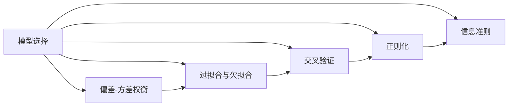

# 模型选择 (Model Selection)

## 1. 背景介绍
### 1.1 模型选择的重要性
在机器学习和数据科学领域,模型选择是一个至关重要的过程。它决定了我们如何从众多候选模型中选择出最适合手头任务的模型。一个好的模型选择策略可以显著提高模型的性能,减少过拟合的风险,并节省宝贵的计算资源。

### 1.2 模型选择面临的挑战
然而,模型选择并非易事。我们经常面临以下挑战:
- 候选模型数量众多,难以穷举
- 模型超参数组合的搜索空间巨大
- 数据量有限,难以准确估计模型性能
- 计算资源有限,无法对所有模型进行彻底评估

### 1.3 本文的目标
本文将深入探讨模型选择的核心概念、常用算法、数学原理以及实践应用。我们的目标是帮助读者全面理解模型选择,掌握关键技术,并能够在实际项目中灵活运用。

## 2. 核心概念与联系
### 2.1 偏差-方差权衡 (Bias-Variance Tradeoff)
- 偏差(Bias):模型的期望预测值与真实值之间的差距。偏差高意味着模型过于简单,无法很好地拟合数据。
- 方差(Variance):模型预测的变化量。方差高意味着模型过于复杂,对噪声敏感,容易过拟合。
- 权衡:降低偏差通常会提高方差,反之亦然。模型选择的目标是找到偏差和方差的最佳平衡点。

### 2.2 过拟合与欠拟合 (Overfitting and Underfitting)
- 过拟合:模型过于复杂,对训练数据拟合得过于精确,但在新数据上表现不佳。通常伴随高方差。
- 欠拟合:模型过于简单,无法很好地捕捉数据的内在模式。通常伴随高偏差。
- 模型选择的目标是避免过拟合和欠拟合,选出泛化能力强的模型。

### 2.3 交叉验证 (Cross-Validation)
- 定义:将数据分为多个互斥的子集,轮流将每个子集作为验证集,其余作为训练集,最后将多次的结果取平均。
- 目的:用有限的数据评估模型在新数据上的表现,避免过拟合,提高模型选择的可靠性。
- 常见方法:k-fold交叉验证、留一交叉验证、分层k-fold交叉验证等。

### 2.4 正则化 (Regularization)
- 定义:在损失函数中引入模型复杂度的惩罚项,限制模型复杂度,减少过拟合风险。
- 常见方法:L1正则化(Lasso)、L2正则化(Ridge)、弹性网络(Elastic Net)等。
- 正则化强度(超参数):控制惩罚项的权重,需要通过模型选择来确定最优值。

### 2.5 信息准则 (Information Criteria)
- 定义:用于衡量模型拟合优度和复杂度的指标,通常基于似然函数和参数数量。
- 常见准则:赤池信息量准则(AIC)、贝叶斯信息准则(BIC)、最小描述长度(MDL)等。
- 原理:在拟合优度和模型复杂度之间寻求平衡,选择得分最低的模型。

以下是这些核心概念之间的联系图(Mermaid流程图):



## 3. 核心算法原理具体操作步骤
### 3.1 网格搜索 (Grid Search)
1. 确定需要优化的超参数及其取值范围
2. 生成超参数的所有组合(网格)
3. 对每个超参数组合,训练模型并评估性能(通常使用交叉验证)
4. 选择性能最优的超参数组合

### 3.2 随机搜索 (Random Search)
1. 确定需要优化的超参数及其取值分布
2. 从分布中随机采样一定数量的超参数组合
3. 对每个超参数组合,训练模型并评估性能(通常使用交叉验证)
4. 选择性能最优的超参数组合

### 3.3 贝叶斯优化 (Bayesian Optimization)
1. 选择初始超参数点,训练模型并评估性能
2. 基于已评估的点,建立目标函数的概率模型(通常为高斯过程)
3. 使用获得函数(Acquisition Function)来选择下一个最有潜力的超参数点
4. 重复步骤2-3,直到达到预算或满足停止条件
5. 返回性能最优的超参数组合

### 3.4 遗传算法 (Genetic Algorithm)
1. 随机初始化一定数量的超参数组合(种群)
2. 对每个超参数组合,训练模型并评估性能(适应度)
3. 基于适应度,选择部分优秀个体作为父代
4. 对父代个体进行交叉和变异,生成新的子代
5. 重复步骤2-4,直到达到预设代数或满足停止条件
6. 返回性能最优的超参数组合

## 4. 数学模型和公式详细讲解举例说明
### 4.1 偏差-方差分解
给定数据集 $D=\{(x_1,y_1),(x_2,y_2),...,(x_n,y_n)\}$,我们的目标是学习一个函数 $f(x)$ 来预测 $y$。模型的期望预测误差可以分解为:

$$
\begin{aligned}
Err(x) &= E[(y-f(x))^2] \\
       &= (E[f(x)] - y)^2 + E[(f(x) - E[f(x)])^2] \\
       &= Bias^2(x) + Variance(x)
\end{aligned}
$$

其中, $Bias(x) = E[f(x)] - y$ 表示模型的偏差, $Variance(x) = E[(f(x) - E[f(x)])^2]$ 表示模型的方差。

### 4.2 k-fold交叉验证
将数据集 $D$ 随机划分为 $k$ 个大小相似的子集 $\{D_1,D_2,...,D_k\}$,每次选择其中一个子集 $D_i$ 作为验证集,其余 $k-1$ 个子集的并集作为训练集。重复 $k$ 次,每次选择不同的子集作为验证集。最后,模型的性能估计为:

$$\hat{Err} = \frac{1}{k} \sum_{i=1}^k Err_i$$

其中, $Err_i$ 表示第 $i$ 次交叉验证的误差。

### 4.3 L1和L2正则化
- L1正则化(Lasso):在损失函数中加入参数绝对值的和作为惩罚项

$$\min_w \sum_{i=1}^n L(y_i, f(x_i;w)) + \lambda \sum_{j=1}^p |w_j|$$

- L2正则化(Ridge):在损失函数中加入参数平方和的一半作为惩罚项

$$\min_w \sum_{i=1}^n L(y_i, f(x_i;w)) + \lambda \sum_{j=1}^p w_j^2$$

其中, $L(y_i, f(x_i;w))$ 表示第 $i$ 个样本的损失函数, $\lambda$ 是控制正则化强度的超参数。

### 4.4 信息准则
- 赤池信息量准则(AIC):

$$AIC = 2k - 2\ln(L)$$

- 贝叶斯信息准则(BIC):

$$BIC = k\ln(n) - 2\ln(L)$$

其中, $k$ 表示模型的参数数量, $n$ 表示样本数量, $L$ 表示模型的最大似然估计。

## 5. 项目实践：代码实例和详细解释说明
下面我们以Python中的scikit-learn库为例,演示如何进行模型选择。

### 5.1 网格搜索
```python
from sklearn.datasets import load_iris
from sklearn.svm import SVC
from sklearn.model_selection import GridSearchCV

# 加载数据集
iris = load_iris()
X, y = iris.data, iris.target

# 定义超参数网格
param_grid = {
    'C': [0.1, 1, 10], 
    'kernel': ['linear', 'rbf'],
    'gamma': [0.01, 0.1, 1]
}

# 创建SVM模型
svc = SVC()

# 执行网格搜索
grid_search = GridSearchCV(svc, param_grid, cv=5, scoring='accuracy')
grid_search.fit(X, y)

# 输出最优超参数组合和性能
print("Best parameters: ", grid_search.best_params_)
print("Best score: ", grid_search.best_score_)
```

### 5.2 随机搜索
```python
from sklearn.datasets import load_iris
from sklearn.svm import SVC
from sklearn.model_selection import RandomizedSearchCV
from scipy.stats import uniform, randint

# 加载数据集
iris = load_iris()
X, y = iris.data, iris.target

# 定义超参数分布
param_dist = {
    'C': uniform(0.1, 10),
    'kernel': ['linear', 'rbf'],
    'gamma': uniform(0.01, 1)
}

# 创建SVM模型
svc = SVC()

# 执行随机搜索
random_search = RandomizedSearchCV(svc, param_dist, n_iter=20, cv=5, scoring='accuracy', random_state=42)
random_search.fit(X, y)

# 输出最优超参数组合和性能
print("Best parameters: ", random_search.best_params_)
print("Best score: ", random_search.best_score_)
```

### 5.3 交叉验证
```python
from sklearn.datasets import load_iris
from sklearn.svm import SVC
from sklearn.model_selection import cross_val_score

# 加载数据集
iris = load_iris()
X, y = iris.data, iris.target

# 创建SVM模型
svc = SVC(kernel='linear', C=1)

# 执行5折交叉验证
scores = cross_val_score(svc, X, y, cv=5, scoring='accuracy')

# 输出每折的性能和平均性能
print("Cross-validation scores: ", scores)
print("Mean score: ", scores.mean())
```

## 6. 实际应用场景
模型选择在各种实际应用中都扮演着重要角色,例如:
- 医疗诊断:选择最佳的疾病预测模型,提高诊断准确率
- 金融风控:选择最佳的违约预测模型,降低坏账风险
- 推荐系统:选择最佳的用户兴趣预测模型,提高推荐的准确性和多样性
- 自然语言处理:选择最佳的文本分类、命名实体识别、机器翻译等模型
- 计算机视觉:选择最佳的图像分类、目标检测、语义分割等模型

## 7. 工具和资源推荐
- scikit-learn:Python机器学习库,提供了丰富的模型选择工具
- Hyperopt:Python库,提供了多种超参数优化算法
- Optuna:自动化超参数优化框架,支持多种算法和并行化
- AutoML工具:如Auto-sklearn、AutoKeras、H2O AutoML等,提供了自动化的模型选择功能
- 竞赛平台:如Kaggle、天池等,提供了大量真实数据集和模型选择实践机会

## 8. 总结：未来发展趋势与挑战
### 8.1 自动化模型选择(AutoML)
随着机器学习应用的普及,自动化模型选择(AutoML)技术正在蓬勃发展。AutoML旨在自动化整个机器学习流程,包括数据预处理、特征工程、模型选择和超参数优化等。未来,AutoML有望大大降低机器学习的门槛,使非专业人士也能轻松构建高质量的模型。

### 8.2 元学习(Meta-Learning)
元学习是一种利用历史任务的经验来指导新任务学习的方法。在模型选择领域,元学习可以利用过去的模型选择经验,快速为新数据集选择合适的模型和超参数。这种"学会学习"的能力有望显著提高模型选择的效率和效果。

### 8.3 资源受限下的模型选择
在许多实际应用中,我们面临计算资源和时间的限制。如何在资源受限的情况下高效地进行模型选择,是一个亟待解决的挑战。未来,我们需要研究更{"msg_type":"generate_answer_finish","data":"","from_module":null,"from_unit":null}