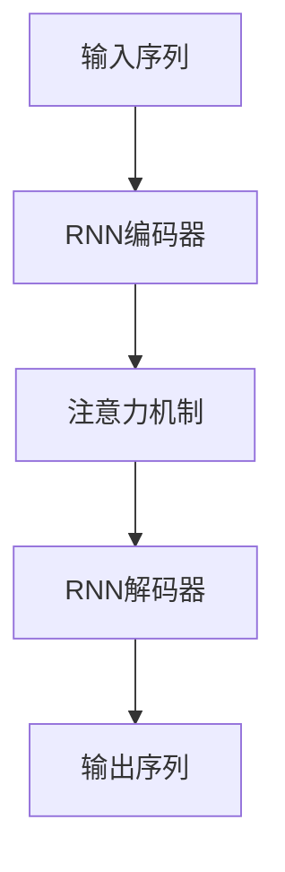

# 注意力机制在RNN中的应用

## 1. 背景介绍
### 1.1 RNN的局限性
#### 1.1.1 长期依赖问题
#### 1.1.2 信息压缩问题
#### 1.1.3 固定长度上下文向量的限制
### 1.2 注意力机制的提出
#### 1.2.1 注意力机制的灵感来源
#### 1.2.2 注意力机制的核心思想
#### 1.2.3 注意力机制的优势

## 2. 核心概念与联系
### 2.1 编码器-解码器框架
#### 2.1.1 编码器的作用
#### 2.1.2 解码器的作用
#### 2.1.3 编码器-解码器框架的局限性
### 2.2 注意力机制的核心概念
#### 2.2.1 查询(Query)、键(Key)、值(Value) 
#### 2.2.2 注意力权重的计算
#### 2.2.3 注意力向量的生成
### 2.3 注意力机制与RNN的结合
#### 2.3.1 在编码器中引入注意力机制
#### 2.3.2 在解码器中引入注意力机制
#### 2.3.3 端到端的注意力机制

## 3. 核心算法原理具体操作步骤
### 3.1 基于内容的注意力机制
#### 3.1.1 点积注意力
#### 3.1.2 乘性注意力 
#### 3.1.3 加性注意力
### 3.2 自注意力机制
#### 3.2.1 Scaled Dot-Product Attention
#### 3.2.2 Multi-Head Attention
#### 3.2.3 Self-Attention在RNN中的应用
### 3.3 层次注意力机制
#### 3.3.1 词级注意力
#### 3.3.2 句子级注意力
#### 3.3.3 层次注意力在文本分类中的应用

## 4. 数学模型和公式详细讲解举例说明
### 4.1 注意力权重的计算公式
#### 4.1.1 点积注意力的计算公式
#### 4.1.2 乘性注意力的计算公式
#### 4.1.3 加性注意力的计算公式
### 4.2 注意力向量的生成公式
#### 4.2.1 基于内容的注意力向量生成
#### 4.2.2 多头注意力的注意力向量生成
#### 4.2.3 层次注意力的注意力向量生成
### 4.3 注意力机制在seq2seq模型中的数学表示
#### 4.3.1 编码器中的注意力机制数学表示
#### 4.3.2 解码器中的注意力机制数学表示
#### 4.3.3 端到端注意力机制的数学表示

## 5. 项目实践：代码实例和详细解释说明
### 5.1 基于Keras实现注意力机制
#### 5.1.1 点积注意力的Keras实现
#### 5.1.2 乘性注意力的Keras实现 
#### 5.1.3 加性注意力的Keras实现
### 5.2 基于PyTorch实现注意力机制
#### 5.2.1 自注意力机制的PyTorch实现
#### 5.2.2 多头注意力的PyTorch实现
#### 5.2.3 层次注意力的PyTorch实现
### 5.3 注意力机制在机器翻译中的应用实例
#### 5.3.1 数据预处理和词嵌入
#### 5.3.2 带有注意力机制的编码器-解码器模型构建
#### 5.3.3 模型训练与评估

## 6. 实际应用场景
### 6.1 机器翻译
#### 6.1.1 基于注意力机制的神经机器翻译
#### 6.1.2 Transformer模型在机器翻译中的应用
#### 6.1.3 低资源语言的神经机器翻译
### 6.2 文本摘要
#### 6.2.1 基于注意力机制的抽取式摘要
#### 6.2.2 基于注意力机制的生成式摘要
#### 6.2.3 层次注意力在文本摘要中的应用
### 6.3 图像描述生成
#### 6.3.1 基于注意力机制的图像描述生成模型
#### 6.3.2 自注意力机制在图像描述生成中的应用
#### 6.3.3 多模态注意力机制的图像描述生成

## 7. 工具和资源推荐
### 7.1 深度学习框架
#### 7.1.1 TensorFlow
#### 7.1.2 PyTorch
#### 7.1.3 Keras
### 7.2 预训练模型和数据集
#### 7.2.1 Transformer预训练模型
#### 7.2.2 BERT预训练模型
#### 7.2.3 常用的NLP数据集
### 7.3 相关论文和教程
#### 7.3.1 注意力机制的经典论文
#### 7.3.2 Transformer模型的论文
#### 7.3.3 注意力机制的教程和博客

## 8. 总结：未来发展趋势与挑战
### 8.1 注意力机制的发展历程
#### 8.1.1 从基于内容的注意力到自注意力
#### 8.1.2 从单头注意力到多头注意力
#### 8.1.3 从RNN到Transformer
### 8.2 注意力机制的未来发展趋势
#### 8.2.1 注意力机制与知识图谱的结合
#### 8.2.2 注意力机制在多模态学习中的应用
#### 8.2.3 注意力机制与强化学习的结合
### 8.3 注意力机制面临的挑战
#### 8.3.1 注意力机制的可解释性
#### 8.3.2 注意力机制的计算效率
#### 8.3.3 注意力机制的鲁棒性

## 9. 附录：常见问题与解答
### 9.1 注意力机制与记忆网络的区别
### 9.2 自注意力机制与卷积神经网络的比较
### 9.3 如何选择合适的注意力机制



注意力机制在深度学习领域，尤其是在自然语言处理任务中得到了广泛的应用。RNN（循环神经网络）是处理序列数据的重要模型，但是它存在一些局限性，如长期依赖问题和信息压缩问题。注意力机制的引入可以有效地缓解这些问题，提高RNN的性能。

注意力机制的核心思想是在生成每个输出时，通过一个权重分配机制，动态地关注输入序列中的相关部分，而不是将输入序列压缩成一个固定长度的上下文向量。这使得模型能够更好地捕捉输入序列中的长距离依赖关系，并且在生成每个输出时可以有选择性地关注输入序列中的不同部分。

常见的注意力机制可以分为三类：基于内容的注意力、自注意力和层次注意力。基于内容的注意力根据当前的隐藏状态和输入序列计算注意力权重，常见的有点积注意力、乘性注意力和加性注意力。自注意力是Transformer模型的核心，通过计算序列中元素之间的相关性来获取注意力权重。层次注意力则在不同的粒度上（如词级和句子级）应用注意力机制。

在实际应用中，注意力机制被广泛用于机器翻译、文本摘要、图像描述生成等任务。以机器翻译为例，传统的编码器-解码器框架将整个输入序列编码为一个固定长度的向量，然后解码器根据该向量生成翻译结果。引入注意力机制后，解码器在生成每个目标语言单词时，可以动态地关注输入序列中的相关部分，从而提高翻译质量。

注意力机制的数学原理可以用以下公式来表示：

$Attention(Q,K,V) = softmax(\frac{QK^T}{\sqrt{d_k}})V$

其中，$Q$表示查询向量，$K$表示键向量，$V$表示值向量，$d_k$是缩放因子。该公式计算了查询向量和键向量的相似度，然后通过softmax函数将其转化为注意力权重，最后用注意力权重对值向量进行加权求和，得到注意力向量。

以下是一个基于Keras实现点积注意力的代码示例：

```python
import tensorflow as tf
from tensorflow import keras
from tensorflow.keras import layers

class DotProductAttention(layers.Layer):
    def __init__(self, **kwargs):
        super(DotProductAttention, self).__init__(**kwargs)

    def call(self, queries, keys, values, mask=None):
        # 计算查询向量和键向量的点积
        scores = tf.matmul(queries, keys, transpose_b=True)

        # 应用mask（如果有）
        if mask is not None:
            scores += (mask * -1e9)

        # 计算注意力权重
        attention_weights = tf.nn.softmax(scores, axis=-1)

        # 加权求和得到注意力向量
        attention_output = tf.matmul(attention_weights, values)

        return attention_output, attention_weights
```

注意力机制的引入极大地提升了RNN等序列模型的性能，成为了自然语言处理领域的重要工具。未来，注意力机制有望与知识图谱、多模态学习、强化学习等方向结合，进一步拓展其应用范围。同时，注意力机制也面临着可解释性、计算效率、鲁棒性等挑战，需要研究者们继续探索和优化。

总之，注意力机制为RNN等序列模型带来了新的活力，使其能够更好地处理长序列和捕捉长距离依赖关系。相信通过进一步的研究和创新，注意力机制会在更多领域发挥重要作用，推动人工智能的发展。

作者：禅与计算机程序设计艺术 / Zen and the Art of Computer Programming