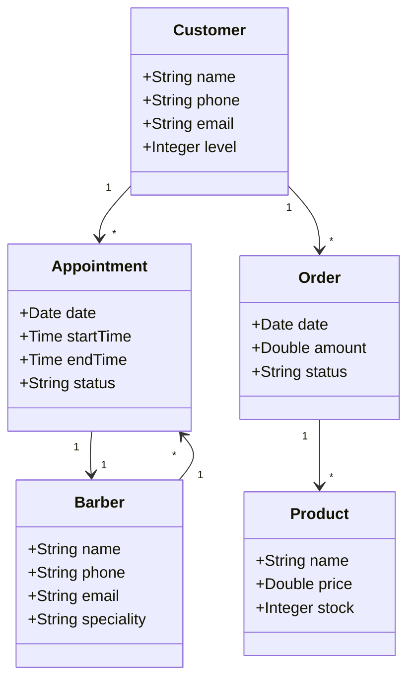
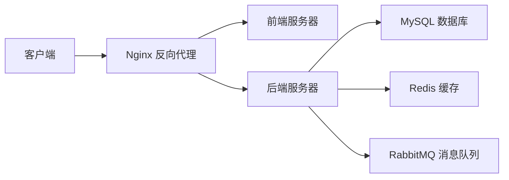

# 理发管理系统详细设计与具体代码实现

## 1. 背景介绍
### 1.1 理发管理系统的意义
在现代社会中,理发店已经成为人们日常生活中不可或缺的一部分。为了更好地管理理发店的日常运营,提高服务质量和效率,开发一套功能完善、易于使用的理发管理系统显得尤为重要。
### 1.2 理发管理系统的主要功能
一个优秀的理发管理系统应该包括以下主要功能:
- 客户管理:管理客户的基本信息、消费记录、会员等级等。
- 预约管理:允许客户在线预约,合理安排理发师的工作时间。
- 库存管理:管理店内的产品库存,如洗发水、染发剂等。
- 财务管理:记录店内的收支情况,生成财务报表。
- 员工管理:管理理发师的基本信息、工作时间、绩效等。
### 1.3 理发管理系统的开发技术
为了开发一个高质量的理发管理系统,我们需要选择合适的开发技术。本文将主要使用以下技术:
- 前端:HTML、CSS、JavaScript、Vue.js
- 后端:Java、Spring Boot、MyBatis
- 数据库:MySQL
- 其他:Redis、RabbitMQ、Docker

## 2. 核心概念与联系
### 2.1 领域模型
在设计理发管理系统时,我们首先需要明确系统中的核心概念及其之间的关系。下面是一个简单的领域模型示意图:

### 2.2 系统架构
理发管理系统采用前后端分离的架构,前端使用 Vue.js 框架,后端使用 Spring Boot 框架。系统架构如下图所示:



## 3. 核心算法原理具体操作步骤
### 3.1 预约时间冲突检测
为了避免预约时间冲突,我们需要在客户预约时检测该时间段是否已被占用。具体步骤如下:
1. 根据客户选择的理发师 ID 和预约时间段,从数据库中查询该理发师在该时间段内是否有其他预约。
2. 如果存在冲突的预约,则返回预约失败的提示信息。
3. 如果不存在冲突,则将预约信息保存到数据库中,并返回预约成功的提示信息。

### 3.2 库存预警
为了避免库存不足影响正常营业,我们需要设置库存预警机制。具体步骤如下:
1. 定期(如每天凌晨)扫描产品表,检查每个产品的库存量。
2. 如果某个产品的库存量低于预设的警戒值,则通过短信或邮件的方式通知管理员进行采购。
3. 如果所有产品的库存量都在正常范围内,则不进行任何操作。

## 4. 数学模型和公式详细讲解举例说明
### 4.1 客户等级计算
为了鼓励客户多消费,我们可以根据客户的累计消费金额计算客户等级。假设等级划分如下:
- 累计消费金额小于 1000 元,为普通会员。
- 累计消费金额大于等于 1000 元,小于 5000 元,为白银会员。 
- 累计消费金额大于等于 5000 元,小于 10000 元,为黄金会员。
- 累计消费金额大于等于 10000 元,为钻石会员。

我们可以使用分段函数来表示客户等级:
$$
level(x) = 
\begin{cases}
普通会员, & x < 1000 \\
白银会员, & 1000 \leq x < 5000 \\
黄金会员, & 5000 \leq x < 10000 \\
钻石会员, & x \geq 10000
\end{cases}
$$
其中,$x$表示客户的累计消费金额。

### 4.2 员工绩效计算
为了公平地评估员工的工作表现,我们可以根据员工的服务次数和服务质量来计算员工绩效。假设绩效计算公式如下:
$$
performance = 0.6 \times \frac{count}{avg\_count} + 0.4 \times \frac{rating}{5}
$$
其中,$count$表示员工的服务次数,$avg\_count$表示所有员工的平均服务次数,$rating$表示员工的平均服务质量评分(满分为5分)。

## 5. 项目实践：代码实例和详细解释说明
下面是一些关键功能的代码实例和说明。
### 5.1 预约管理
#### 5.1.1 预约时间冲突检测
```java
@Service
public class AppointmentService {
    @Autowired
    private AppointmentMapper appointmentMapper;

    public boolean checkConflict(Long barberId, Date date, Time startTime, Time endTime) {
        List<Appointment> appointments = appointmentMapper.selectByBarberAndTime(barberId, date, startTime, endTime);
        return appointments.size() > 0;
    }
}
```
该方法用于检测指定理发师在指定时间段内是否有预约冲突。首先根据理发师ID、日期和时间段从数据库中查询预约记录,如果返回的列表不为空,则说明存在冲突。

#### 5.1.2 创建预约
```java
@Service
public class AppointmentService {
    @Autowired
    private AppointmentMapper appointmentMapper;

    @Transactional
    public void createAppointment(Appointment appointment) {
        if (checkConflict(appointment.getBarberId(), appointment.getDate(), appointment.getStartTime(), appointment.getEndTime())) {
            throw new RuntimeException("预约时间冲突");
        }
        appointmentMapper.insert(appointment);
    }
}
```
该方法用于创建一个新的预约。首先调用`checkConflict`方法检测预约时间是否冲突,如果存在冲突则抛出异常。如果不存在冲突,则将预约信息插入到数据库中。

### 5.2 库存管理
#### 5.2.1 库存预警
```java
@Service
public class ProductService {
    @Autowired
    private ProductMapper productMapper;
    @Autowired
    private MailService mailService;

    @Scheduled(cron = "0 0 0 * * ?")
    public void checkStock() {
        List<Product> products = productMapper.selectAll();
        for (Product product : products) {
            if (product.getStock() < 10) {
                mailService.sendWarningMail(product.getName(), product.getStock());
            }
        }
    }
}
```
该方法使用Spring的定时任务功能,每天凌晨执行一次库存检查。首先从数据库中查询所有产品信息,然后遍历产品列表,如果发现某个产品的库存量小于警戒值(这里设为10),就调用邮件服务发送预警邮件。

## 6. 实际应用场景
理发管理系统可以应用于各种规模的理发店,从小型个人理发店到大型连锁理发店。它可以帮助理发店提高管理效率,改善客户体验,增加客户粘性。

以下是一些具体的应用场景:
- 客户可以通过在线预约功能,随时随地预约理发服务,避免排队等待。
- 理发师可以通过系统查看自己的工作安排,合理安排时间,提高工作效率。
- 管理员可以通过系统实时监控店内的运营情况,及时处理各种问题。
- 系统可以根据客户的消费记录,自动计算客户等级,给予相应的优惠和服务。
- 系统可以帮助管理员进行库存管理,避免因库存不足影响正常营业。

## 7. 工具和资源推荐
以下是一些开发理发管理系统可能用到的工具和资源:
- IDEA:Java 开发必备的 IDE。
- VS Code:前端开发必备的编辑器。
- Vue.js:流行的前端框架,学习曲线平缓。
- Spring Boot:Java 后端开发的利器,大大简化了开发过程。
- MyBatis:优秀的 Java 持久层框架,与 Spring Boot 配合使用效果更佳。
- MySQL:开源免费的关系型数据库,社区生态丰富。
- Redis:高性能的 key-value 内存数据库,常用于缓存。
- RabbitMQ:开源的消息队列系统,用于系统解耦和异步通信。
- Docker:应用容器引擎,可以大大简化部署过程。
- Jenkins:流行的 CI/CD 工具,可以实现自动化构建和部署。

## 8. 总结：未来发展趋势与挑战
随着移动互联网的普及和人工智能技术的发展,理发管理系统也面临着新的机遇和挑战。

未来的理发管理系统可能会具备以下特点:
- 移动化:客户可以通过手机 App 完成预约、支付等操作,理发师也可以通过手机 App 接收预约和管理工作。
- 智能化:系统可以利用人工智能技术,根据客户的偏好和历史记录,智能推荐理发师和发型。
- 个性化:系统可以为每位客户提供个性化的服务,如发型设计、养护建议等。
- 社交化:系统可以集成社交功能,让客户可以分享自己的新发型,给理发师点赞等。

同时,理发管理系统也面临着一些挑战:
- 数据安全:系统需要存储大量的客户信息和消费记录,必须采取严格的数据安全措施。
- 用户体验:系统需要提供简洁友好的用户界面,让客户和理发师都能轻松上手。
- 系统性能:随着业务量的增长,系统需要具备良好的性能和可扩展性。
- 市场竞争:理发管理系统市场竞争激烈,需要不断创新和完善功能,才能保持竞争力。

## 9. 附录：常见问题与解答
### 9.1 如何处理预约冲突?
当出现预约冲突时,系统应该及时提示用户,并引导用户重新选择时间或理发师。如果冲突是由于理发师临时请假等原因造成的,系统应该主动联系受影响的客户,并给予适当的补偿。

### 9.2 如何保证数据安全?
系统应该采取以下措施来保证数据安全:
- 使用 HTTPS 加密传输数据。
- 