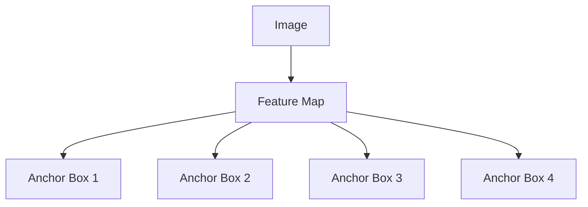

# 目标检测算法概述:从传统方法到深度学习

## 1.背景介绍

目标检测是计算机视觉领域中一个重要且具有挑战性的任务。它旨在自动定位图像或视频中的目标对象,并绘制出每个目标的边界框。目标检测在许多领域都有广泛应用,如安防监控、自动驾驶、机器人视觉等。随着深度学习的兴起,目标检测算法取得了长足进步,但传统方法仍有其独特价值。本文将概述目标检测算法的发展历程,从传统方法到深度学习方法,深入探讨其核心思想和技术细节。

## 2.核心概念与联系

目标检测算法需要解决两个关键问题:

1. **目标分类(Classification)**: 确定图像中存在哪些目标类别。
2. **目标定位(Localization)**: 精确地定位每个目标在图像中的位置和大小。

传统方法和深度学习方法在解决这两个问题的思路上存在显著差异,但也有一些共通之处。

### 2.1 滑动窗口与候选区域

无论采用何种方法,目标检测算法通常都需要生成大量的候选区域(Region Proposal),然后对每个候选区域进行分类和精细化定位。滑动窗口(Sliding Window)是一种常用的生成候选区域的技术,即在图像上以固定步长滑动一个固定大小的窗口,每个窗口都作为一个候选区域。这种方法计算量很大,深度学习方法引入了更高效的候选区域生成算法,如选择性搜索(Selective Search)和区域候选网络(Region Proposal Network, RPN)。

### 2.2 特征提取

目标检测算法需要提取图像的特征,用于后续的分类和定位任务。传统方法通常采用手工设计的特征提取器,如HOG(方向梯度直方图)、SIFT(尺度不变特征变换)等,而深度学习方法则通过卷积神经网络自动学习特征表示。

### 2.3 分类器与定位器

分类器用于确定候选区域中是否存在目标,以及目标的类别。传统方法常用支持向量机(SVM)、Adaboost等经典分类器,而深度学习方法则采用卷积神经网络进行端到端的目标分类。定位器则用于精确确定目标在图像中的位置和大小,常用的方法包括边界框回归(Bounding Box Regression)等。

## 3.核心算法原理具体操作步骤

### 3.1 传统方法

传统目标检测算法主要分为两个阶段:生成候选区域和分类回归。

#### 3.1.1 生成候选区域

1. **滑动窗口**: 在图像上以固定步长滑动一个固定大小的窗口,每个窗口作为一个候选区域。
2. **选择性搜索(Selective Search)**: 通过分割图像,合并相似的区域,生成候选区域。

#### 3.1.2 分类回归

1. **特征提取**: 对每个候选区域提取特征,如HOG、SIFT等手工设计的特征。
2. **分类**: 使用经典分类器(如SVM、Adaboost等)对每个候选区域进行分类,确定是否存在目标及其类别。
3. **边界框回归**: 对于存在目标的候选区域,进一步优化其边界框位置和大小。

经典算法的代表有Viola-Jones目标检测器、基于HOG特征的线性SVM目标检测器等。

### 3.2 深度学习方法

深度学习方法将目标检测任务转化为端到端的学习问题,主要分为两类:基于候选区域的两阶段方法和基于密集采样的一阶段方法。

#### 3.2.1 两阶段方法

1. **候选区域生成**:
   - 选择性搜索
   - 区域候选网络(RPN)
2. **分类回归头**:
   - 对每个候选区域进行特征提取
   - 分类和边界框回归

代表算法有R-CNN、Fast R-CNN、Faster R-CNN等。

#### 3.2.2 一阶段方法

1. **密集采样**: 在图像上均匀采样大量先验锚框(Prior Anchors)
2. **单阶段检测头**:
   - 对每个锚框进行特征提取
   - 直接预测锚框是否为目标,以及目标类别和边界框坐标

代表算法有YOLO、SSD等。

## 4.数学模型和公式详细讲解举例说明

目标检测算法中有一些重要的数学模型和公式,下面将详细讲解其中的几个关键部分。

### 4.1 锚框(Anchor Box)

锚框是目标检测算法中的一个重要概念,尤其在一阶段检测器中发挥关键作用。锚框是一组预先定义的边界框,具有不同的尺度和长宽比,用于匹配图像中的目标。

在具体实现中,锚框通常在特征图(Feature Map)的每个位置均匀分布,如下图所示:



锚框的数学表示为:

$$
\text{anchors}(x, y) = \{(x_a, y_a, w_a, h_a)\}
$$

其中 $(x, y)$ 表示特征图上的位置, $(x_a, y_a, w_a, h_a)$ 分别表示锚框的中心坐标、宽度和高度。

在训练阶段,每个锚框都需要与ground truth边界框进行匹配,匹配策略通常采用IoU(交并比)阈值。对于正样本(存在目标)锚框,网络需要预测其类别和精细化的边界框坐标;对于负样本锚框,网络需要预测为背景类。

### 4.2 边界框回归(Bounding Box Regression)

边界框回归是目标检测算法中另一个关键部分,它用于精细化锚框或候选区域,获得更准确的目标边界框。

设ground truth边界框为 $(x, y, w, h)$,预测边界框为 $(x', y', w', h')$,则边界框回归的目标是学习一个映射函数:

$$
(x, y, w, h) = f(x', y', w', h'; \theta)
$$

其中 $\theta$ 为映射函数的参数。

常用的映射函数有:

- 平移和对数空间变换:

$$
\begin{aligned}
x &= x' + x_a \cdot d_x \\
y &= y' + y_a \cdot d_y \\
w &= w_a \cdot \exp(d_w) \\
h &= h_a \cdot \exp(d_h)
\end{aligned}
$$

其中 $(d_x, d_y, d_w, d_h)$ 为网络需要预测的偏移量。

- 边界框参数化:

$$
\begin{aligned}
d_x &= \frac{x - x_a}{w_a} \\
d_y &= \frac{y - y_a}{h_a} \\
d_w &= \log\frac{w}{w_a} \\
d_h &= \log\frac{h}{h_a}
\end{aligned}
$$

网络直接预测归一化的偏移量 $(d_x, d_y, d_w, d_h)$。

通过边界框回归,可以从粗略的锚框或候选区域获得更精确的目标边界框。

### 4.3 非极大值抑制(Non-Maximum Suppression, NMS)

由于目标检测算法会生成大量重叠的边界框,因此需要使用非极大值抑制(NMS)算法去除冗余的边界框。

NMS算法的基本思路是:对于每个目标类别,按置信度从高到低排序所有边界框,然后从置信度最高的边界框开始,移除与其IoU值超过阈值的所有其他边界框。

具体步骤如下:

1. 对所有边界框按置信度从高到低排序
2. 选择置信度最高的边界框 $B_1$
3. 对其余所有边界框 $B_i$:
   - 计算 $B_i$ 与 $B_1$ 的IoU
   - 如果 IoU > 阈值,则移除 $B_i$
4. 重复步骤3,直到所有边界框被处理完毕
5. 重复步骤2-4,对剩余的边界框进行处理

通过NMS,可以有效地去除大量冗余的边界框,提高目标检测的精确度。

## 5.项目实践:代码实例和详细解释说明

为了更好地理解目标检测算法,我们将通过一个基于PyTorch的实例项目来演示其实现细节。本例使用PASCAL VOC数据集,并采用Faster R-CNN作为目标检测器。

### 5.1 数据准备

```python
import torchvision

# 加载VOC数据集
dataset = torchvision.datasets.VOCDetection(
    root='data/VOCdevkit',
    year='2012',
    image_set='train',
    download=True,
    transform=None
)

# 定义数据加载器
data_loader = torch.utils.data.DataLoader(
    dataset, batch_size=2, shuffle=True, num_workers=4
)
```

上述代码加载了PASCAL VOC 2012训练集,并创建了一个数据加载器用于迭代读取数据。

### 5.2 模型定义

```python
import torchvision
from torchvision.models.detection.faster_rcnn import FastRCNNPredictor

# 加载预训练模型
model = torchvision.models.detection.fasterrcnn_resnet50_fpn(pretrained=True)

# 替换分类头,使其适配VOC数据集的类别数
num_classes = 21  # 20个类别 + 背景
in_features = model.roi_heads.box_predictor.cls_score.in_features
model.roi_heads.box_predictor = FastRCNNPredictor(in_features, num_classes)
```

这里我们加载了预训练的Faster R-CNN模型,并替换了分类头以适配VOC数据集的类别数。

### 5.3 模型训练

```python
import torch.optim as optim

# 设置训练参数
num_epochs = 10
lr = 0.005

# 设置优化器和学习率调度器
params = [p for p in model.parameters() if p.requires_grad]
optimizer = optim.SGD(params, lr=lr, momentum=0.9, weight_decay=0.0005)
lr_scheduler = optim.lr_scheduler.StepLR(optimizer, step_size=3, gamma=0.1)

# 训练循环
for epoch in range(num_epochs):
    for images, targets in data_loader:
        # 前向传播
        loss_dict = model(images, targets)
        losses = sum(loss for loss in loss_dict.values())
        
        # 反向传播
        optimizer.zero_grad()
        losses.backward()
        optimizer.step()
    
    # 更新学习率
    lr_scheduler.step()
```

上述代码定义了优化器、学习率调度器,并执行了训练循环。在每个epoch中,我们对数据进行前向传播计算损失,然后执行反向传播更新模型参数。

### 5.4 模型评估

```python
from torchvision.ops import nms

# 评估函数
@torch.no_grad()
def evaluate(model, data_loader):
    cpu_device = torch.device("cpu")
    model.eval()
    
    all_boxes = []
    all_scores = []
    all_labels = []
    
    for images, targets in data_loader:
        images = list(img.to(device) for img in images)
        outputs = model(images)
        
        for i, image in enumerate(images):
            boxes = outputs[i]['boxes'].data.cpu().numpy()
            scores = outputs[i]['scores'].data.cpu().numpy()
            labels = outputs[i]['labels'].data.cpu().numpy()
            
            boxes = boxes[nms(boxes, scores, 0.3)]
            
            all_boxes.append(boxes)
            all_scores.append(scores)
            all_labels.append(labels)
    
    # 计算mAP
    ...

# 在测试集上评估
evaluate(model, test_data_loader)
```

上述代码定义了一个评估函数,用于在测试集上评估模型的性能。我们首先将模型设置为评估模式,然后对测试集进行前向传播,获取预测的边界框、置信度和类别标签。接下来,我们使用非极大值抑制(NMS)算法去除冗余的边界框。最后,我们可以计算模型在测试集上的mAP(平均精度)等指标。

通过上述实例,我们可以更好地理解目标检测算法的实现细节,包括数据准备、模型定义、训练过程和评估方法。

## 6.实际应用场景

目标检测算法在现实世界中有广泛的应用场景,下面列举了几个