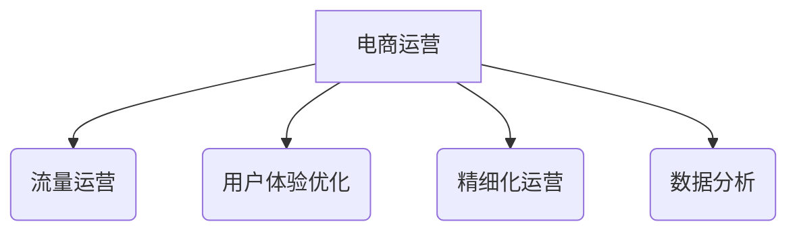

# 第四部分：电商运营实战

## 1.背景介绍

随着互联网和移动互联网的快速发展,电子商务已经成为了一种主流的商业模式。电商运营是电子商务企业的核心,直接关系到企业的盈利能力和市场竞争力。本文将探讨电商运营的关键要素和实战技巧,帮助读者更好地理解和执行电商运营策略。

## 2.核心概念与联系

电商运营涉及多个核心概念,包括:

### 2.1 流量运营

流量运营是指通过各种营销渠道和策略,吸引潜在客户流量进入电商平台。常见的流量运营手段有:

- 搜索引擎营销(SEM)
- 社交媒体营销
- 内容营销
- 邮件营销
- 联盟营销

### 2.2 用户体验优化

用户体验优化(UX Optimization)是指优化电商平台的浏览、搜索、下单等环节,提升用户体验,降低购物流失率。常见手段包括:

- 网站/APP界面优化
- 搜索体验优化
- 支付流程优化

### 2.3 精细化运营

精细化运营是指根据用户画像、行为数据等,对产品、营销策略等进行精准定制和优化,提高转化率。包括:

- 个性化推荐
- 用户分层营销
- 场景化营销

### 2.4 数据分析

数据分析贯穿电商运营的方方面面,包括流量分析、用户行为分析、营销效果分析等,为运营策略优化提供依据。



## 3.核心算法原理具体操作步骤

### 3.1 流量运营算法

#### 3.1.1 关键词广告投放算法

关键词广告投放算法的核心是计算每个关键词的预期收益,并根据预算进行投放优化。算法步骤如下:

1) 估计每个关键词的点击率(CTR)
2) 估计每个关键词的转化率(CVR)
3) 计算每个关键词的预期收益: 预期收益 = 出价 * CTR * CVR * 客单价
4) 根据预算,对预期收益最高的关键词进行投放

$$
\begin{aligned}
\text{预期收益} &= \text{出价} \times \text{CTR} \times \text{CVR} \times \text{客单价} \\
&= \text{出价} \times P(\text{点击}) \times P(\text{转化}|\text{点击}) \times \text{客单价}
\end{aligned}
$$

其中CTR和CVR可以使用机器学习模型(如Logistic回归)进行预估。

#### 3.1.2 社交媒体广告算法

社交媒体广告算法需要考虑用户的社交关系和内容偏好,算法步骤如下:

1) 构建用户兴趣画像
2) 分析用户社交关系网络
3) 根据用户画像和社交关系,为每个用户推荐感兴趣的广告
4) 根据用户反馈(点击、转化等),不断优化广告策略

常用的算法有协同过滤、图算法(如PageRank)等。

### 3.2 用户体验优化算法

#### 3.2.1 A/B测试算法

A/B测试是优化用户体验的常用手段,通过对照测试不同版本的界面、流程等,选择最优方案。算法步骤:

1) 定义测试目标(如提高转化率)
2) 确定测试样本的流量分配比例(如9:1)
3) 进行多组A/B测试
4) 根据转化率等指标,选择最优方案

需要注意的是,A/B测试要确保样本量足够大,并对结果进行统计显著性检验。

#### 3.2.2 搜索相关性算法

搜索相关性算法旨在为用户的查询词匹配最合适的商品,提高搜索体验。算法步骤:

1) 对查询词和商品标题、描述等进行分词、去停用词等文本预处理
2) 计算查询词与商品的相关性分数(如TF-IDF、BM25等)
3) 根据相关性分数对商品进行排序
4) 根据用户反馈(点击、购买等)不断优化算法模型

常用的相关性模型有学习到排序(LTR)、语义匹配模型等。

### 3.3 精细化运营算法

#### 3.3.1 个性化推荐算法

个性化推荐算法根据用户的历史行为、偏好等数据,为用户推荐感兴趣的商品。算法步骤:

1) 构建用户画像和商品知识库
2) 计算用户-商品的相关性分数
3) 根据相关性分数对候选商品进行排序
4) 根据用户反馈不断优化算法模型

常用的推荐算法有协同过滤(如矩阵分解)、内容相似度计算等。

#### 3.3.2 RFM用户分层算法 

RFM(Recency、Frequency、Monetary Value)是常用的用户价值分析模型,可用于用户分层营销。算法步骤:

1) 计算每个用户的R(最近一次消费时间)、F(消费频率)、M(消费金额)
2) 对R、F、M分别打分并相加,得到用户综合得分
3) 根据综合得分,将用户划分为不同层级
4) 针对不同层级用户,制定差异化营销策略

### 3.4 数据分析算法

#### 3.4.1 RFM聚类分析

除了用于用户分层,RFM模型还可用于用户聚类分析,发现用户群体的共性特征。算法步骤:

1) 计算所有用户的RFM值
2) 使用聚类算法(如K-Means)对用户进行聚类
3) 分析每个聚类的RFM特征,给予明确定义(如"重要保持客户"、"新客户"等)
4) 针对不同类型用户群体,制定差异化营销策略

#### 3.4.2 购物车/浏览足迹分析

分析用户的购物车和浏览足迹数据,可以发现用户的兴趣偏好和购物习惯,优化营销策略。算法步骤:

1) 收集用户的购物车和浏览足迹数据
2) 对数据进行清洗、处理,构建用户行为序列
3) 使用序列模式挖掘算法(如FP-Growth)发现频繁项集
4) 根据发现的模式,优化推荐、广告等营销策略

## 4.数学模型和公式详细讲解举例说明

### 4.1 CTR/CVR预估模型

点击率(CTR)和转化率(CVR)是流量运营中的两个关键指标,可以使用Logistic回归等机器学习模型进行预估。

Logistic回归模型的公式如下:

$$
P(y=1|x) = \frac{1}{1 + e^{-w^Tx}}
$$

其中:
- $y$是标签(0表示未点击/未转化,1表示点击/转化)
- $x$是特征向量,包括广告关键词、用户画像等特征
- $w$是权重向量,需要通过训练数据进行学习

对数似然函数:

$$
\begin{aligned}
l(w) &= \sum_{i=1}^N \Big[ y_i \log P(y_i=1|x_i) + (1-y_i)\log P(y_i=0|x_i) \Big] \\
     &= \sum_{i=1}^N \Big[ y_i \log \frac{1}{1+e^{-w^Tx_i}} + (1-y_i)\log \frac{e^{-w^Tx_i}}{1+e^{-w^Tx_i}}\Big]
\end{aligned}
$$

使用梯度上升法求解$w$:

$$
w := w + \alpha \sum_{i=1}^N (y_i - P(y_i=1|x_i))x_i
$$

其中$\alpha$是学习率。

### 4.2 个性化推荐模型

个性化推荐常用的是协同过滤算法,如基于矩阵分解的模型。假设有$M$个用户、$N$个商品,构建$M \times N$的用户-商品评分矩阵$R$,目标是预测缺失的评分。

矩阵分解模型将$R$分解为两个低维矩阵的乘积:

$$
R \approx P^TQ
$$

其中$P$是$M \times K$的用户隐语义矩阵,$Q$是$N \times K$的商品隐语义矩阵。

模型目标是最小化如下损失函数:

$$
\min_{P,Q} \sum_{(i,j) \in \mathcal{K}} (R_{ij} - p_i^Tq_j)^2 + \lambda(||P||^2 + ||Q||^2)
$$

其中:

- $\mathcal{K}$是已知评分的集合
- $p_i$和$q_j$分别是$P$和$Q$的第$i$行和第$j$列
- $\lambda$是正则化系数,避免过拟合

可以使用随机梯度下降等优化算法求解$P$和$Q$。预测时,对于未知的$(i,j)$对,计算$p_i^Tq_j$作为预测评分。

## 5.项目实践：代码实例和详细解释说明

以下是一个使用TensorFlow实现的简单协同过滤推荐系统示例:

```python
import numpy as np
import tensorflow as tf

# 构造训练数据
R = np.array([
    [5, 3, 0, 1],
    [4, 0, 0, 1],
    [1, 1, 0, 5],
    [1, 0, 0, 4],
    [0, 1, 5, 4]
], dtype=np.float32)

# 超参数
K = 2  # 隐语义维度
lambda_reg = 0.1  # 正则化系数
epochs = 1000
learning_rate = 0.01

# 构建模型
num_users, num_items = R.shape

# 用户隐语义矩阵
P = tf.Variable(tf.random_normal((num_users, K)))
# 商品隐语义矩阵  
Q = tf.Variable(tf.random_normal((num_items, K)))

# 预测评分
predictions = tf.matmul(P, Q, transpose_b=True)

# 损失函数
mask = tf.sign(R)
mse = tf.square(mask * (R - predictions))
loss = tf.reduce_sum(mse) + lambda_reg * (tf.reduce_sum(tf.square(P)) + tf.reduce_sum(tf.square(Q)))

# 优化器
optimizer = tf.train.GradientDescentOptimizer(learning_rate)
train_op = optimizer.minimize(loss)

# 训练
sess = tf.Session()
sess.run(tf.global_variables_initializer())

for epoch in range(epochs):
    _, curr_loss = sess.run([train_op, loss])
    if epoch % 100 == 0:
        print(f"Epoch {epoch}: loss = {curr_loss}")

# 预测
predictions = sess.run(predictions)
print("Predicted ratings:")
print(predictions)
```

上述代码实现了一个基于矩阵分解的协同过滤推荐算法。具体解释如下:

1. 首先构造一个示例评分矩阵`R`,包含5个用户对4个商品的评分。
2. 定义超参数,包括隐语义维度`K`、正则化系数`lambda_reg`、训练轮数`epochs`和学习率`learning_rate`。
3. 使用TensorFlow构建模型,包括用户隐语义矩阵`P`和商品隐语义矩阵`Q`。
4. 通过`P`和`Q`的矩阵乘积计算预测评分`predictions`。
5. 定义损失函数,包括预测评分与真实评分的均方差,以及`P`和`Q`的L2正则化项。
6. 使用梯度下降优化器`GradientDescentOptimizer`最小化损失函数。
7. 在会话`Session`中训练模型,每100轮打印一次当前损失值。
8. 训练结束后,使用会话计算预测评分矩阵`predictions`并打印出来。

需要注意的是,这只是一个简单的示例,实际应用中需要考虑更多因素,如数据预处理、特征工程、模型调优等。

## 6.实际应用场景

电商运营技术在多个场景下发挥着重要作用:

1. **个性化推荐系统**:通过分析用户行为数据,为用户推荐感兴趣的商品,提高购买转化率。主要应用了协同过滤、内容相似度等算法。

2. **智能营销决策系统**:通过对