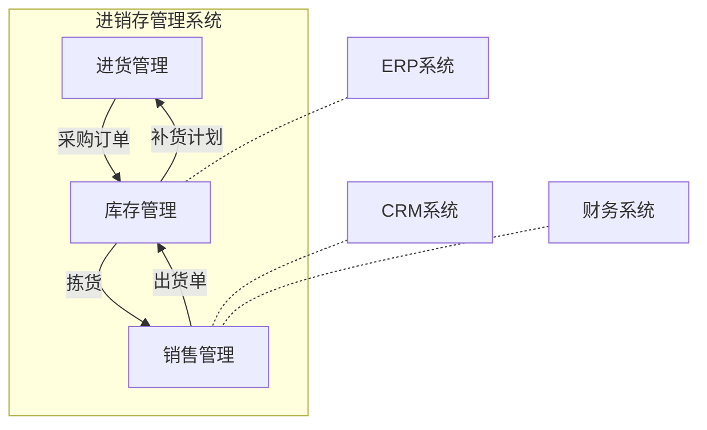

# 药品公司进销存管理系统详细设计与具体代码实现

## 1.背景介绍

在当今快节奏的商业环境中，药品公司必须高效管理其库存和销售流程。一个健全的进销存管理系统对于确保药品供应链的顺畅运行至关重要。本文将探讨如何设计和实现一个全面的药品公司进销存管理系统。

### 1.1 进销存管理的重要性

进销存管理系统是企业运营的核心支柱之一。它帮助公司:

- 实时跟踪库存水平
- 优化订单履行流程
- 减少死库存和缺货情况
- 提高运营效率和成本控制

对于药品公司而言,进销存管理的重要性更是不言而喻。药品的生产、储存和运输都需要严格的质量控制和法规遵从,这使得高效的库存管理系统变得至关重要。

### 1.2 面临的挑战

设计和实现一个健全的进销存管理系统并非一蹴而就。药品公司面临着诸多挑战:

- 复杂的供应链和分销渠道
- 药品批次管理和追溯要求
- 遵守GMP、GSP等行业法规
- 集成现有的ERP、CRM等系统

因此,我们需要一个灵活、可扩展且符合法规的解决方案。

## 2.核心概念与联系

在深入探讨系统设计之前,我们先了解一些核心概念:

### 2.1 进货管理

进货管理包括采购订单处理、货品验收入库等流程。关键点有:

- 供应商管理和供货计划
- 采购订单审批和跟踪
- 货品质量检验和入库

### 2.2 销售管理

销售管理囊括了从订单处理到发货的全过程。主要环节有:

- 客户订单审核和处理
- 库存分配和拣货复核 
- 出货单和发票开具
- 收款和应收账款管理

### 2.3 库存管理

库存管理贯穿整个供应链流程,是进销存系统的核心。重点包括:

- 实时库存查询和批次管理
- 库存盘点和库存报表
- 安全库存和补货策略
- 仓储物流和库位管理

### 2.4 系统集成

进销存系统需要与企业的其他系统无缝集成,如ERP、CRM、财务系统等。接口和数据交换是关键。



## 3.核心算法原理具体操作步骤

### 3.1 采购订单处理流程

1. 供应商维护和供货计划制定
2. 采购需求审核和采购订单生成
3. 订单审批流程
4. 发送采购订单给供应商
5. 跟踪订单状态和到货时间
6. 验收入库和开具付款凭证

### 3.2 销售订单处理流程  

1. 客户订单审核,包括信用审核、产品库存检查等
2. 生成销售订单和发货计划
3. 仓库拣货和复核
4. 生成出货单和发票
5. 发货和物流跟踪
6. 收款和应收账款管理

### 3.3 库存管理算法

#### 3.3.1 安全库存计算

安全库存是维持一定的库存水平以应对需求波动。计算公式:

$$安全库存 = 再订货周期(天) \times 平均日用量 + 安全系数 \times 标准差$$

其中安全系数通常取1.65或2.33,对应95%或99%的服务水平。

#### 3.3.2 经济订货量(EOQ)模型

EOQ模型用于确定每次采购的最佳订单量,以平衡订货成本和库存持有成本:

$$EOQ = \sqrt{\frac{2DC_o}{C_c}}$$

- D为年度需求量
- $C_o$为每次订货成本  
- $C_c$为年库存持有成本

#### 3.3.3 ABC分类法

ABC分类将物料按重要程度分为A、B、C三类,用于制定不同的库存策略。

- A类:占库存金额70%,实施严格控制
- B类:占20%,适度控制  
- C类:占10%,简单管理

#### 3.3.4 其他算法

- 订货点(ROP)计算
- 产品生命周期管理
- 仓库优化算法
- ...

## 4.数学模型和公式详细讲解举例说明

### 4.1 安全库存计算举例

某药品公司生产X药品,已知:

- 再订货周期为14天 
- 平均日用量为500单位
- 过去12个月日用量标准差为100单位
- 要求达到99%的服务水平

根据安全库存计算公式:

$$安全库存 = 14 \times 500 + 2.33 \times 100 = 7700单位$$

因此,公司应保持7700单位的X药品安全库存。

### 4.2 EOQ模型应用

某原料药年需求量为50000公斤,每次订货成本为200元,年库存持有成本为原料药价值的20%,原料药单价为50元/公斤。

将这些数据代入EOQ公式:

$$EOQ = \sqrt{\frac{2 \times 50000 \times 200}{50 \times 0.2}} \approx 2236公斤$$

因此,最佳订货量为2236公斤/次。

### 4.3 ABC分类实例

某药品公司有100种产品,按年度库存金额从高到低排序:

- 前20种产品占总金额的70%,为A类
- 接下来30种产品占20%,为B类
- 剩余50种产品占10%,为C类

对A类产品实施严格控制,如设置较高的安全库存;对B类产品适度控制;对C类产品简单管理即可。

## 5.项目实践:代码实例和详细解释说明

为了实现上述功能,我们可以使用Python编写进销存管理系统。以下是一些核心代码示例:

### 5.1 产品和库存模型

```python
class Product:
    def __init__(self, sku, name, unit, price):
        self.sku = sku 
        self.name = name
        self.unit = unit 
        self.price = price

class Inventory:
    def __init__(self, product, location):
        self.product = product
        self.location = location
        self.batches = []

    def add_batch(self, batch):
        self.batches.append(batch)

    def total_qty(self):
        return sum(b.qty for b in self.batches)

class Batch:
    def __init__(self, ref, qty, prod_date, exp_date):
        self.ref = ref
        self.qty = qty
        self.prod_date = prod_date
        self.exp_date = exp_date
```

这些类定义了产品、库存和批次的基本属性和方法。`Inventory`类中的`batches`列表用于跟踪同一产品在库存中的不同批次。

### 5.2 采购订单处理

```python
from datetime import date

class PurchaseOrder:
    def __init__(self, supplier, lines):
        self.supplier = supplier
        self.lines = lines
        self.order_date = date.today()
        self.status = "PENDING"

    def receive(self, batch_refs):
        for line, ref in zip(self.lines, batch_refs):
            product = line.product
            inv = get_inventory(product, "MAIN_WH")
            batch = Batch(ref, line.qty, date.today(), ...)
            inv.add_batch(batch)
        self.status = "RECEIVED"

class PurchaseOrderLine:
    def __init__(self, product, qty):
        self.product = product
        self.qty = qty
```

`PurchaseOrder`类表示一个采购订单,包含供应商、订单行和状态等信息。`receive`方法用于验收入库,创建新的库存批次。

### 5.3 销售订单处理

```python
from collections import defaultdict

class SalesOrder:
    def __init__(self, customer, lines):
        self.customer = customer
        self.lines = lines
        self.allocation = defaultdict(int)

    def allocate(self):
        for line in self.lines:
            product = line.product
            inv = get_inventory(product, "MAIN_WH")
            batches = inv.batches
            # 根据FEFO规则分配库存
            batches.sort(key=lambda b: (b.exp_date, b.prod_date))
            for batch in batches:
                if line.qty <= 0:
                    break
                allocated = min(batch.qty, line.qty)
                self.allocation[batch] += allocated
                batch.qty -= allocated
                line.qty -= allocated

    def ship(self):
        for batch, qty in self.allocation.items():
            batch.qty -= qty
        # 生成出货单和发票
```

`SalesOrder`类表示一个销售订单,包含客户、订单行和库存分配情况。`allocate`方法根据FEFO(先效期先出)规则从库存中分配订单需求量。`ship`方法执行出货并生成相关单据。

上述代码只是进销存系统的一小部分,在实际项目中还需要实现更多功能模块,如供应商管理、仓储物流、报表统计等。此外,还需要设计合理的数据库模型,并实现系统的用户界面。

## 6.实际应用场景

进销存管理系统在药品公司的多个环节发挥着重要作用:

1. **采购管理**:根据库存情况自动生成采购计划和订单,跟踪订单状态,验收入库。
2. **销售订单处理**:审核订单、分配库存、拣货发货、开具发票和收款。
3. **库存控制**:实时查看库存水平、批次状态,执行库存盘点,监控安全库存。
4. **质量管理**:追溯产品批次,处理退货和召回事务。
5. **供应链协作**:与供应商、物流商数据交换,实现供应链可视化。
6. **决策分析**:根据销售、库存和成本数据,制定采购、生产和营销策略。

通过信息化手段对上述流程的自动化和优化,药品公司可以提高运营效率、降低成本、遵从法规、提升客户满意度。

## 7.工具和资源推荐

实施进销存管理系统需要多方面的工具和资源:

1. **编程语言和框架**:Python、Java、.NET等,结合Web、移动应用框架。
2. **数据库**:关系型数据库(MySQL、PostgreSQL)和NoSQL数据库(MongoDB)。 
3. **云平台**:AWS、Azure、阿里云等提供基础设施和服务。
4. **项目管理工具**:Jira、Trello等,协助团队协作。
5. **设计工具**:Visio、Draw.io等,用于绘制系统架构和流程图。
6. **版本控制**:Git、SVN等,管理代码变更。
7. **自动化测试工具**:Selenium、Appium等,确保系统质量。
8. **集成工具**:Apache Camel、Mulesoft等,实现系统集成。
9. **监控工具**:Zabbix、Grafana等,监视系统运行状况。
10. **文档资源**:官方文档、行业标准、最佳实践指南等。

根据项目需求和预算,合理选择并组合使用这些工具,可以极大提高开发效率和系统质量。

## 8.总结:未来发展趋势与挑战

进销存管理系统将随着新技术的发展而不断演进:

1. **人工智能与大数据分析**:利用机器学习算法优化库存策略,预测需求,实现智能决策。
2. **物联网与自动化**:通过传感器、RFID等技术实现仓储物流的自动化和可视化。
3. **区块链**:提高供应链的透明度和追溯能力,确保药品来源可信。
4. **云计算与微服务架构**:支持系统的灵活扩展和敏捷开发。
5. **移动应用与增强现实**:提升现场作业效率和用户体验。

与此同时,药品公司在实施智能化进销存系统时也面临诸多挑战:

1. **数据质量与集成**:来自多个系统的数据需要清洗和集成。
2. **系统性能与可扩展性**:大规模并发访问和数据处理的性能要求。
3. **安全与合规**:严格的数据安全和行业法规遵从要求。
4. **变革管理**:系统上线需要完善的变革管理和用户培训。

只有持续创新,与时俱进,药品公司才能在日益激烈的市场竞争中保持