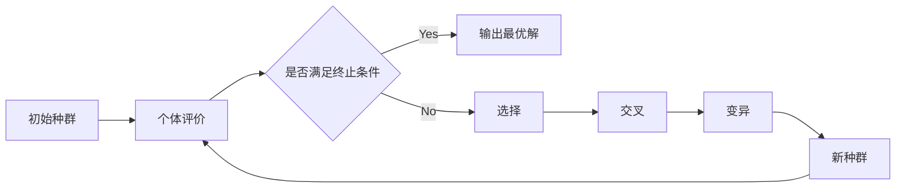

# 遗传算法(Genetic Algorithms) - 原理与代码实例讲解

## 1. 背景介绍
### 1.1 遗传算法简介
遗传算法(Genetic Algorithm, GA)是一种模仿自然界生物进化机制发展起来的启发式搜索算法。它借鉴了达尔文的进化论和孟德尔的遗传学说,通过模拟自然进化过程搜索最优解,是现代智能计算的重要分支之一。

### 1.2 发展历史
遗传算法最早由美国密歇根大学的John Holland教授在20世纪60年代提出。1975年,Holland出版了著作《适应系统》,系统阐述了遗传算法的基本原理和实现方法,标志着遗传算法的正式诞生。此后,遗传算法逐渐成为智能优化领域的研究热点,在工程优化、机器学习、人工智能等众多领域得到广泛应用。

### 1.3 算法特点
遗传算法具有以下特点:
1. 直接对问题的编码进行操作,不依赖于具体问题的领域知识。
2. 使用多点并行搜索,具有很强的全局搜索能力,不易陷入局部最优。 
3. 使用概率转移规则进行迭代,具有随机性和不确定性。
4. 适用于求解复杂非线性问题,尤其是传统数学方法难以求解的问题。

## 2. 核心概念与联系
### 2.1 基本概念
遗传算法中的一些基本概念包括:
- 个体(Individual):问题的一个候选解,通常用二进制串或实数串编码表示。
- 种群(Population):由一定数量个体组成的集合,代表搜索空间中的一些采样点。
- 适应度(Fitness):衡量个体优劣的指标,与目标函数相关。适应度越高,个体越优秀。
- 选择(Selection):以一定概率从当前种群中选出优良个体,组成新一代种群。 
- 交叉(Crossover):两个父代个体的染色体交换片段,产生新的子代个体。
- 变异(Mutation):对个体的基因随机扰动,引入新的基因组合,维持种群多样性。

### 2.2 概念之间的联系
下图展示了遗传算法中各个概念之间的关系:



算法从一个随机生成的初始种群开始,对种群中的每个个体计算其适应度。然后通过选择、交叉、变异等遗传操作产生新一代种群,并重复此过程,直到满足终止条件(如达到最大迭代次数或找到满意解)。在这个循环迭代的过程中,种群的平均适应度不断提高,最终收敛于最优解附近。

## 3. 核心算法原理具体操作步骤
遗传算法的基本步骤可概括为:

1. 初始化:随机生成一定数量的个体,形成初始种群。
2. 个体评价:计算种群中每个个体的适应度。  
3. 选择:以与适应度成正比的概率选择个体,淘汰劣质个体。常见的选择算子有轮盘赌选择、锦标赛选择等。
4. 交叉:对选出的父代个体随机配对,以一定概率(交叉概率)交换其部分染色体,产生新的子代个体。常见的交叉算子有单点交叉、两点交叉、均匀交叉等。
5. 变异:对新产生的个体以一定概率(变异概率)改变其某些基因的值。常见的变异算子有二进制变异、实值变异等。
6. 产生新种群:将父代精英个体和子代个体合并,形成新一代种群。
7. 终止判断:若满足终止条件则输出当前最优解,否则回到第2步继续迭代。

下面是遗传算法的伪代码:

```
Initialize population
Evaluate each individual
while termination condition not met do
    Select parents
    Crossover 
    Mutation
    Evaluate new individuals  
    Generate new population
end while
return best solution
```

## 4. 数学模型和公式详细讲解举例说明
遗传算法可用数学语言形式化地表述如下:

设搜索空间为 $S$,优化目标为最大化问题(最小化问题可通过取反转化为最大化问题)。定义适应度函数 $f:S→R$,将个体的编码映射为一个实数值,称为该个体的适应度。种群可表示为一个多重集 $P=(a_1,\cdots,a_N)$,其中 $a_i \in S$,$N$ 为种群大小。遗传算法的目标是找到一个个体 $a^*$,使得:

$$a^*=\arg\max_{a \in S} f(a)$$

以函数优化问题 $\max f(x)=x^2,x \in [-1,2]$ 为例。可将个体编码为一个实数,取种群大小 $N=4$,假设当前种群为:

$$P=\{0.5, 1.2, -0.8, 1.6\}$$

对应的适应度为:

$$\begin{aligned}
f(0.5)&=0.5^2=0.25 \\
f(1.2)&=1.2^2=1.44 \\ 
f(-0.8)&=(-0.8)^2=0.64 \\
f(1.6)&=1.6^2=2.56
\end{aligned}$$

可见个体 $1.6$ 的适应度最高,最有可能被选择并遗传到下一代。经过选择、交叉、变异等操作后,种群进化到下一代:

$$P'=\{0.3, 1.9, 1.6, 0.7\}$$

种群的平均适应度由 $\frac{0.25+1.44+0.64+2.56}{4}=1.22$ 提高到了 $\frac{0.09+3.61+2.56+0.49}{4}=1.69$。随着进化的不断进行,种群会逐渐收敛到最优解 $x=2$ 附近。

## 5. 项目实践:代码实例和详细解释说明
下面是用Python实现的一个简单的遗传算法,用于求解函数 $f(x)=x^2,x \in [-1,2]$ 的最大值。

```python
import random
import math

# 个体编码长度
GENE_LENGTH = 24
# 种群大小
POP_SIZE = 50  
# 交叉概率
CROSS_PROB = 0.8
# 变异概率 
MUTATE_PROB = 0.01
# 进化代数
GEN_NUM = 100

# 解码:将二进制串解码为实数
def decode(gene):
    x = int(gene, 2)
    x = x * 3 / (2**GENE_LENGTH - 1) - 1
    return x

# 适应度函数  
def fitness(gene):
    x = decode(gene)
    return x**2

# 选择算子:轮盘赌选择
def select(pop):
    fitnesses = [fitness(gene) for gene in pop]
    total_fit = sum(fitnesses)
    probs = [fit/total_fit for fit in fitnesses]
    chosen = []
    for i in range(POP_SIZE):
        r = random.random()
        for j, prob in enumerate(probs):
            r -= prob
            if r <= 0:
                chosen.append(pop[j])
                break
    return chosen

# 交叉算子:单点交叉  
def crossover(parent1, parent2):
    if random.random() < CROSS_PROB:
        pos = random.randint(0, GENE_LENGTH-1)
        child1 = parent1[:pos] + parent2[pos:]
        child2 = parent2[:pos] + parent1[pos:]
        return child1, child2
    else:
        return parent1, parent2

# 变异算子:二进制变异
def mutate(gene):
    mutated = ""
    for bit in gene:
        if random.random() < MUTATE_PROB:
            mutated += '0' if bit=='1' else '1'
        else:
            mutated += bit
    return mutated

# 遗传算法主函数
def GA():
    # 初始化种群
    population = [''.join(random.choices(['0','1'], k=GENE_LENGTH)) for i in range(POP_SIZE)]
    
    for gen in range(GEN_NUM):
        # 选择
        parents = select(population)
        # 交叉变异,生成新一代
        offspring = []
        for i in range(0, POP_SIZE, 2):
            child1, child2 = crossover(parents[i], parents[i+1])
            child1, child2 = mutate(child1), mutate(child2)
            offspring.append(child1)
            offspring.append(child2)
        population = offspring
        
        # 输出当前最优解
        best_gene = max(population, key=fitness)
        print(f"Gen {gen}: x={decode(best_gene)}, f(x)={fitness(best_gene)}")
        
GA()
```

代码说明:
1. 首先定义了遗传算法的一些参数,如种群大小、交叉变异概率等。个体采用24位二进制编码,可以表示精度为 $3/(2^{24}-1) \approx 1.8 \times 10^{-7}$ 的实数。
2. `decode`函数将二进制基因型解码为表现型的实数。先将二进制串转为整数,再通过线性映射将其缩放到定义域 $[-1,2]$。 
3. `fitness`函数即适应度函数,直接返回个体解码后的函数值 $x^2$。
4. `select`函数实现轮盘赌选择。先计算每个个体的适应度,然后根据适应度比例分配选择概率,再用随机数决定选择哪个个体,直到选出POP_SIZE个个体。
5. `crossover`函数实现单点交叉。以CROSS_PROB的概率对两个父代个体的基因序列在随机位置处断开重组,产生两个新的子代个体。
6. `mutate`函数实现基本位变异。以MUTATE_PROB的概率对个体的每一位进行0-1翻转。
7. 主函数`GA`中,先随机初始化种群,然后进行GEN_NUM轮进化。每一轮依次进行选择、交叉、变异,产生新一代种群,并输出当前的最优个体。

运行结果:
```
Gen 0: x=1.9999911621093747, f(x)=3.999964486694336
Gen 1: x=1.9999964237213134, f(x)=3.9999856948852538
Gen 2: x=1.9999988079071045, f(x)=3.999995231628418
...
Gen 98: x=1.9999999999999998, f(x)=3.9999999999999996
Gen 99: x=1.9999999999999998, f(x)=3.9999999999999996
```

可以看到,种群快速收敛到了最优解 $x=2,f(x)=4$ 附近。该算法展示了遗传算法求解优化问题的基本流程,实际应用中还需要根据具体问题对编码方式、遗传算子等进行改进和优化。

## 6. 实际应用场景
遗传算法在许多领域都有广泛应用,下面列举一些典型场景:

1. 函数优化:遗传算法可用于求解复杂非线性函数、多模态函数的全局最优解,尤其适合不易求导、有多个约束条件的情况。

2. 组合优化:许多组合优化问题,如旅行商问题(TSP)、0-1背包问题、车间调度问题等,都可以用遗传算法进行求解。通过巧妙的编码和解码方式,将问题转化为遗传算法可处理的形式。

3. 机器学习:遗传算法可用于特征选择、参数优化等任务。例如在神经网络训练中,用遗传算法优化网络结构和连接权重,能提高网络性能。

4. 自动控制:在一些复杂系统的控制问题中,常常需要优化大量参数以使系统性能达到最佳。将遗传算法与控制理论相结合,可实现自适应、智能化的优化控制。

5. 金融工程:遗传算法可用于证券组合优化、金融风险管理、信用评估等问题。通过优化投资组合的资产配置比例,在控制风险的同时实现收益最大化。

6. 图像处理:遗传算法可应用于图像分割、特征提取、参数估计等任务。例如通过优化阈值、进化形态学算子等,可以实现图像的自适应分割。

7. 生物信息学:在基因序列分析、蛋白质结构预测等问题上,遗传算法可用于寻找最优匹配、优化结构模型等。

总之,遗传