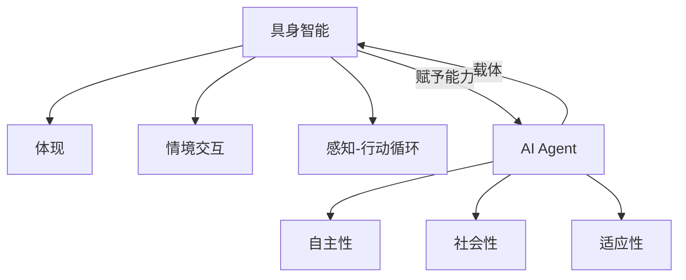

# AI Agent: AI的下一个风口 具身机器人的发展趋势

## 1.背景介绍
### 1.1 人工智能的发展历程
#### 1.1.1 人工智能的起源与早期发展
#### 1.1.2 人工智能的三次浪潮
#### 1.1.3 当前人工智能的现状与局限

### 1.2 具身智能的概念
#### 1.2.1 具身智能的定义
#### 1.2.2 具身智能与传统人工智能的区别
#### 1.2.3 具身智能的研究意义

### 1.3 AI Agent的兴起
#### 1.3.1 AI Agent的定义与特点 
#### 1.3.2 AI Agent的发展历程
#### 1.3.3 AI Agent的应用现状

## 2.核心概念与联系
### 2.1 具身智能的核心概念
#### 2.1.1 体现
#### 2.1.2 情境交互
#### 2.1.3 感知-行动循环

### 2.2 AI Agent的核心概念
#### 2.2.1 自主性
#### 2.2.2 社会性
#### 2.2.3 适应性

### 2.3 具身智能与AI Agent的关系
#### 2.3.1 AI Agent是具身智能的载体
#### 2.3.2 具身智能赋予AI Agent更强大的能力
#### 2.3.3 二者相辅相成、互为促进



## 3.核心算法原理具体操作步骤
### 3.1 强化学习
#### 3.1.1 马尔可夫决策过程
#### 3.1.2 Q-Learning算法
#### 3.1.3 策略梯度算法

### 3.2 深度学习
#### 3.2.1 卷积神经网络(CNN)
#### 3.2.2 循环神经网络(RNN)
#### 3.2.3 生成对抗网络(GAN)

### 3.3 迁移学习
#### 3.3.1 迁移学习的定义与分类
#### 3.3.2 基于特征的迁移学习
#### 3.3.3 基于实例的迁移学习

## 4.数学模型和公式详细讲解举例说明
### 4.1 马尔可夫决策过程(MDP)
MDP可以用一个五元组 $\langle S,A,P,R,\gamma \rangle$ 来表示:

- $S$: 状态空间，表示智能体所有可能的状态集合
- $A$: 动作空间，表示智能体在每个状态下可以采取的动作集合
- $P$: 状态转移概率矩阵，$P(s'|s,a)$ 表示在状态 $s$ 下采取动作 $a$ 后转移到状态 $s'$ 的概率
- $R$: 奖励函数，$R(s,a)$ 表示智能体在状态 $s$ 下采取动作 $a$ 后获得的即时奖励
- $\gamma$: 折扣因子，$\gamma \in [0,1]$，表示未来奖励的折现程度

智能体的目标是最大化累积期望奖励:

$$
\max_{\pi} \mathbb{E}\left[ \sum_{t=0}^{\infty} \gamma^t R(s_t,a_t) \right]
$$

其中 $\pi$ 表示智能体的策略，即在每个状态下采取何种动作的概率分布。

### 4.2 Q-Learning算法
Q-Learning是一种常用的无模型、异策略的强化学习算法。其核心思想是学习动作-状态值函数 $Q(s,a)$，表示在状态 $s$ 下采取动作 $a$ 的长期期望回报。

Q-Learning的更新公式为:

$$
Q(s_t,a_t) \leftarrow Q(s_t,a_t) + \alpha \left[ r_t + \gamma \max_{a} Q(s_{t+1},a) - Q(s_t,a_t) \right]
$$

其中 $\alpha$ 是学习率，$r_t$ 是 $t$ 时刻获得的即时奖励，$s_{t+1}$ 是采取动作 $a_t$ 后转移到的下一个状态。

### 4.3 策略梯度算法
策略梯度算法直接对策略函数 $\pi_{\theta}(a|s)$ 的参数 $\theta$ 进行优化。其目标函数为:

$$
J(\theta) = \mathbb{E}_{\tau \sim \pi_{\theta}} \left[ \sum_{t=0}^T R(\tau) \right]
= \mathbb{E}_{\tau \sim \pi_{\theta}} \left[ \sum_{t=0}^T \gamma^t r_t \right]
$$

其中 $\tau$ 表示一条轨迹 $\{s_0,a_0,r_0,s_1,a_1,r_1,...,s_T\}$。

使用梯度上升法对 $J(\theta)$ 进行优化:

$$
\theta \leftarrow \theta + \alpha \nabla_{\theta} J(\theta)
$$

其中梯度 $\nabla_{\theta} J(\theta)$ 可以用蒙特卡洛方法进行估计:

$$
\nabla_{\theta} J(\theta) \approx \frac{1}{N} \sum_{n=1}^N \sum_{t=0}^T \nabla_{\theta} \log \pi_{\theta}(a_t^n|s_t^n) R(\tau^n)
$$

## 5.项目实践：代码实例和详细解释说明
下面我们用PyTorch实现一个简单的Q-Learning算法，并应用于经典的 CartPole 问题:

```python
import gym
import numpy as np
import torch
import torch.nn as nn
import torch.optim as optim

# 定义Q网络
class QNet(nn.Module):
    def __init__(self, state_dim, action_dim):
        super(QNet, self).__init__()
        self.fc1 = nn.Linear(state_dim, 128)
        self.fc2 = nn.Linear(128, 128)
        self.fc3 = nn.Linear(128, action_dim)

    def forward(self, x):
        x = torch.relu(self.fc1(x))
        x = torch.relu(self.fc2(x))
        x = self.fc3(x)
        return x

# 定义训练函数
def train(env, q_net, optimizer, episodes=1000, gamma=0.99, epsilon=0.1):
    for episode in range(episodes):
        state = env.reset()
        done = False
        while not done:
            if np.random.rand() < epsilon:
                action = env.action_space.sample()
            else:
                action = q_net(torch.FloatTensor(state)).argmax().item()
            next_state, reward, done, _ = env.step(action)
            
            q_values = q_net(torch.FloatTensor(state))
            next_q_values = q_net(torch.FloatTensor(next_state))
            target_q_value = reward + gamma * next_q_values.max().item()
            
            loss = (q_values[action] - target_q_value)**2
            
            optimizer.zero_grad()
            loss.backward()
            optimizer.step()

            state = next_state

# 创建环境
env = gym.make('CartPole-v1')

# 初始化Q网络和优化器
q_net = QNet(env.observation_space.shape[0], env.action_space.n)
optimizer = optim.Adam(q_net.parameters(), lr=0.001)

# 训练Q网络
train(env, q_net, optimizer)

# 测试训练好的策略
state = env.reset()
done = False
while not done:
    action = q_net(torch.FloatTensor(state)).argmax().item()
    state, _, done, _ = env.step(action)
    env.render()
env.close()
```

这个例子中，我们首先定义了一个简单的三层全连接神经网络 `QNet` 来拟合 Q 函数。然后在训练函数 `train` 中，我们使用 $\epsilon$-greedy 策略来平衡探索和利用，并使用时序差分(TD)误差来更新 Q 网络的参数。最后，我们用训练好的 Q 网络来测试 CartPole 游戏。

## 6.实际应用场景
### 6.1 智能家居
#### 6.1.1 智能音箱
#### 6.1.2 扫地机器人
#### 6.1.3 智能安防

### 6.2 无人驾驶
#### 6.2.1 自动驾驶汽车
#### 6.2.2 无人配送机器人
#### 6.2.3 农业机器人

### 6.3 医疗健康
#### 6.3.1 手术机器人
#### 6.3.2 康复机器人
#### 6.3.3 智能义肢

## 7.工具和资源推荐
### 7.1 开发平台
#### 7.1.1 ROS(Robot Operating System)
#### 7.1.2 NVIDIA Isaac
#### 7.1.3 Microsoft Bonsai

### 7.2 仿真环境
#### 7.2.1 Gazebo
#### 7.2.2 Unity ML-Agents
#### 7.2.3 MuJoCo

### 7.3 学习资源
#### 7.3.1 《Reinforcement Learning: An Introduction》
#### 7.3.2 《Deep Learning》
#### 7.3.3 《Probabilistic Robotics》

## 8.总结：未来发展趋势与挑战
### 8.1 多模态感知与融合
### 8.2 人机协同与交互
### 8.3 连续学习与终身学习
### 8.4 安全性与可解释性
### 8.5 伦理与法律问题

## 9.附录：常见问题与解答
### 9.1 具身智能与符号主义、连接主义的区别是什么？
### 9.2 AI Agent 与传统机器人的区别在哪里？ 
### 9.3 具身机器人面临的主要技术挑战有哪些？
### 9.4 AI Agent 的发展对人类社会可能带来哪些影响？
### 9.5 如何看待 AI Agent 可能带来的失业问题？

作者：禅与计算机程序设计艺术 / Zen and the Art of Computer Programming