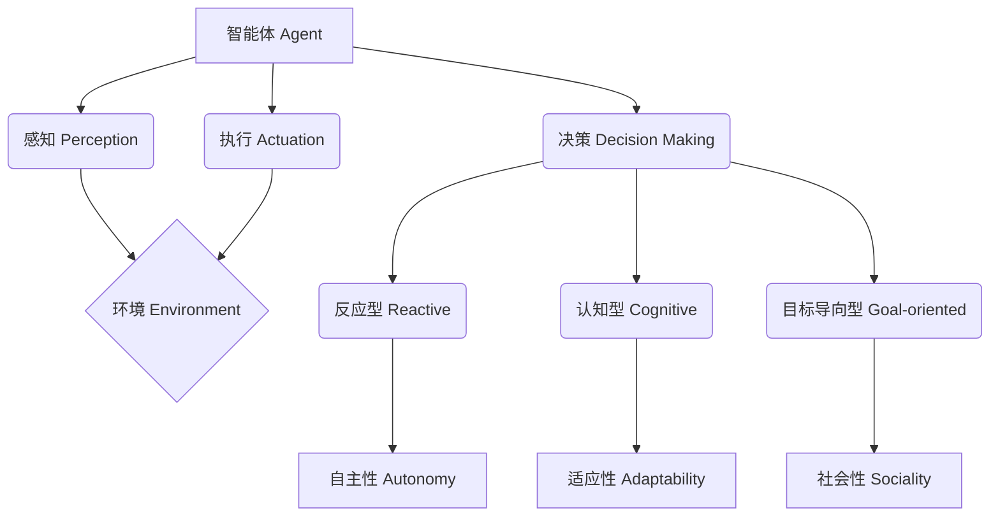

# AI Agent: AI的下一个风口 智能体的核心技术

## 1. 背景介绍
### 1.1 人工智能的发展历程
#### 1.1.1 早期的人工智能
#### 1.1.2 机器学习的崛起  
#### 1.1.3 深度学习的突破

### 1.2 智能体(Agent)的概念
#### 1.2.1 智能体的定义
#### 1.2.2 智能体与传统AI的区别
#### 1.2.3 智能体的发展现状

### 1.3 智能体技术的重要意义
#### 1.3.1 智能体在人工智能领域的地位
#### 1.3.2 智能体技术的应用前景
#### 1.3.3 智能体技术的研究价值

## 2. 核心概念与联系
### 2.1 智能体的组成要素
#### 2.1.1 感知(Perception)
#### 2.1.2 决策(Decision Making)
#### 2.1.3 执行(Actuation)

### 2.2 智能体的分类
#### 2.2.1 反应型智能体(Reactive Agent)
#### 2.2.2 认知型智能体(Cognitive Agent)
#### 2.2.3 目标导向型智能体(Goal-oriented Agent)

### 2.3 智能体的关键特性
#### 2.3.1 自主性(Autonomy)
#### 2.3.2 适应性(Adaptability)  
#### 2.3.3 社会性(Sociality)

### 2.4 智能体技术的核心概念关系图


## 3. 核心算法原理具体操作步骤
### 3.1 强化学习(Reinforcement Learning)
#### 3.1.1 马尔可夫决策过程(Markov Decision Process)
#### 3.1.2 Q-Learning算法
#### 3.1.3 策略梯度(Policy Gradient)算法

### 3.2 多智能体系统(Multi-Agent System)
#### 3.2.1 博弈论(Game Theory)基础
#### 3.2.2 纳什均衡(Nash Equilibrium) 
#### 3.2.3 多智能体强化学习(Multi-Agent Reinforcement Learning)

### 3.3 智能体的规划与搜索
#### 3.3.1 经典规划算法(Classical Planning)
#### 3.3.2 启发式搜索(Heuristic Search)
#### 3.3.3 蒙特卡洛树搜索(Monte Carlo Tree Search)

## 4. 数学模型和公式详细讲解举例说明
### 4.1 马尔可夫决策过程(Markov Decision Process)
马尔可夫决策过程(MDP)是一种数学框架,用于对序列决策问题进行建模。一个MDP由状态集合$S$、动作集合$A$、转移概率$P$和奖励函数$R$组成,可以表示为一个元组:

$$MDP = (S, A, P, R)$$

其中,转移概率$P(s'|s,a)$表示在状态$s$下执行动作$a$后转移到状态$s'$的概率。奖励函数$R(s,a)$表示在状态$s$下执行动作$a$后获得的即时奖励。

MDP的目标是找到一个最优策略$\pi^*$,使得从任意初始状态出发,按照该策略选择动作,能够最大化累积奖励的期望值。最优策略$\pi^*$满足贝尔曼最优方程(Bellman Optimality Equation):

$$V^*(s) = \max_{a \in A} \left\{ R(s,a) + \gamma \sum_{s' \in S} P(s'|s,a) V^*(s') \right\}$$

其中,$V^*(s)$表示状态$s$的最优状态值函数,$\gamma$是折扣因子,用于衡量未来奖励的重要性。

### 4.2 Q-Learning算法
Q-Learning是一种常用的无模型强化学习算法,用于解决MDP问题。Q-Learning的核心思想是学习一个动作-状态值函数$Q(s,a)$,表示在状态$s$下执行动作$a$的长期累积奖励期望。

Q-Learning的更新规则如下:

$$Q(s,a) \leftarrow Q(s,a) + \alpha \left[ r + \gamma \max_{a'} Q(s',a') - Q(s,a) \right]$$

其中,$\alpha$是学习率,$r$是即时奖励,$\gamma$是折扣因子,$s'$是执行动作$a$后转移到的下一个状态。

Q-Learning算法的具体步骤如下:
1. 初始化Q表格$Q(s,a)$为任意值(通常为0)。
2. 重复以下步骤直到收敛:
   - 根据当前状态$s$,使用$\epsilon-greedy$策略选择一个动作$a$。
   - 执行动作$a$,观察奖励$r$和下一个状态$s'$。
   - 根据上述更新规则更新$Q(s,a)$。
   - 将当前状态$s$更新为$s'$。

### 4.3 策略梯度(Policy Gradient)算法
策略梯度算法是一类基于参数化策略的强化学习算法。与Q-Learning不同,策略梯度算法直接学习一个参数化的策略函数$\pi_\theta(a|s)$,表示在状态$s$下选择动作$a$的概率。

策略梯度算法的目标是最大化期望累积奖励$J(\theta)$:

$$J(\theta) = \mathbb{E}_{\tau \sim p_\theta(\tau)} \left[ \sum_{t=0}^T R(s_t,a_t) \right]$$

其中,$\tau$表示一条轨迹$(s_0,a_0,r_0,s_1,a_1,r_1,\dots)$,$p_\theta(\tau)$表示在策略$\pi_\theta$下生成轨迹$\tau$的概率。

策略梯度定理给出了$J(\theta)$对参数$\theta$的梯度:

$$\nabla_\theta J(\theta) = \mathbb{E}_{\tau \sim p_\theta(\tau)} \left[ \sum_{t=0}^T \nabla_\theta \log \pi_\theta(a_t|s_t) Q^{\pi_\theta}(s_t,a_t) \right]$$

其中,$Q^{\pi_\theta}(s_t,a_t)$表示在状态$s_t$下执行动作$a_t$的状态-动作值函数。

策略梯度算法的具体步骤如下:
1. 初始化策略参数$\theta$。
2. 重复以下步骤直到收敛:
   - 使用当前策略$\pi_\theta$生成一批轨迹数据。
   - 估计每个轨迹中每个状态-动作对的优势函数$\hat{A}(s_t,a_t)$。
   - 根据策略梯度定理计算梯度$\nabla_\theta J(\theta)$。
   - 使用梯度上升法更新策略参数$\theta$。

## 5. 项目实践：代码实例和详细解释说明
下面我们通过一个简单的例子来演示如何使用Python实现Q-Learning算法。考虑一个网格世界环境,智能体的目标是从起点出发,尽快到达终点。

```python
import numpy as np

# 定义网格世界环境
class GridWorld:
    def __init__(self, width, height, start, goal):
        self.width = width
        self.height = height
        self.start = start
        self.goal = goal
        self.agent_pos = start
        
    def reset(self):
        self.agent_pos = self.start
        return self.agent_pos
    
    def step(self, action):
        x, y = self.agent_pos
        if action == 0:  # 向上
            x = max(0, x - 1)
        elif action == 1:  # 向右
            y = min(self.width - 1, y + 1)
        elif action == 2:  # 向下
            x = min(self.height - 1, x + 1)
        elif action == 3:  # 向左
            y = max(0, y - 1)
        self.agent_pos = (x, y)
        reward = -1
        done = (self.agent_pos == self.goal)
        return self.agent_pos, reward, done

# 定义Q-Learning智能体
class QLearningAgent:
    def __init__(self, env, alpha, gamma, epsilon):
        self.env = env
        self.alpha = alpha
        self.gamma = gamma
        self.epsilon = epsilon
        self.Q = np.zeros((env.height, env.width, 4))
        
    def choose_action(self, state):
        if np.random.uniform(0, 1) < self.epsilon:
            action = np.random.choice(4)
        else:
            action = np.argmax(self.Q[state[0], state[1], :])
        return action
    
    def update(self, state, action, reward, next_state):
        td_target = reward + self.gamma * np.max(self.Q[next_state[0], next_state[1], :])
        td_error = td_target - self.Q[state[0], state[1], action]
        self.Q[state[0], state[1], action] += self.alpha * td_error

# 创建网格世界环境
env = GridWorld(width=5, height=5, start=(0, 0), goal=(4, 4))

# 创建Q-Learning智能体
agent = QLearningAgent(env, alpha=0.1, gamma=0.9, epsilon=0.1)

# 训练智能体
num_episodes = 1000
for episode in range(num_episodes):
    state = env.reset()
    done = False
    while not done:
        action = agent.choose_action(state)
        next_state, reward, done = env.step(action)
        agent.update(state, action, reward, next_state)
        state = next_state

# 测试智能体
state = env.reset()
done = False
while not done:
    action = np.argmax(agent.Q[state[0], state[1], :])
    next_state, _, done = env.step(action)
    print(f"State: {state}, Action: {action}, Next State: {next_state}")
    state = next_state
```

在这个例子中,我们首先定义了一个简单的网格世界环境`GridWorld`,智能体可以执行上、右、下、左四个动作,目标是从起点(0, 0)走到终点(4, 4)。我们还定义了一个Q-Learning智能体`QLearningAgent`,它使用Q表格来存储状态-动作值函数,并根据Q-Learning的更新规则来更新Q表格。

在训练阶段,我们让智能体与环境进行交互,使用$\epsilon-greedy$策略选择动作,并根据观察到的奖励和下一个状态来更新Q表格。经过1000个episode的训练后,智能体学会了一条从起点到终点的最优路径。

在测试阶段,我们让智能体根据学习到的Q表格来选择动作,可以看到智能体能够成功地从起点走到终点。

通过这个简单的例子,我们演示了如何使用Q-Learning算法来训练一个智能体解决网格世界导航问题。在实际应用中,我们可以根据具体问题的特点,选择合适的算法和模型来设计和训练智能体。

## 6. 实际应用场景
智能体技术在许多领域都有广泛的应用,下面列举几个典型的应用场景:

### 6.1 自动驾驶
智能体技术是实现自动驾驶的关键。自动驾驶汽车可以看作一个智能体,它需要通过传感器感知周围环境,根据道路情况和交通规则做出实时决策,并控制车辆执行相应的动作。强化学习算法如Deep Q-Network(DQN)和Deep Deterministic Policy Gradient(DDPG)被广泛应用于自动驾驶的决策和控制模块。

### 6.2 智能客服
智能客服是另一个智能体技术的重要应用场景。传统的客服系统通常采用基于规则的方式,难以处理复杂的用户询问。引入智能体技术后,智能客服系统可以通过自然语言处理和对话管理技术,理解用户意图,并根据上下文生成恰当的回复。深度强化学习算法如Deep Reinforcement Learning for Dialogue Generation(DRDG)可以用于训练智能客服系统。

### 6.3 智能推荐
智能推荐系统也是智能体技术的一个重要应用方向。传统的推荐系统主要基于协同过滤等算法,只考虑用户的历史行为数据,难以捕捉用户的动态偏好。引入智能体技术后,推荐系统可以建模为一个多智能体系统,其中每个用户和每个商品都是一个智能体。通过智能体之间的交互和博弈,系统可以实时学习用户的偏好,并根据用户的反