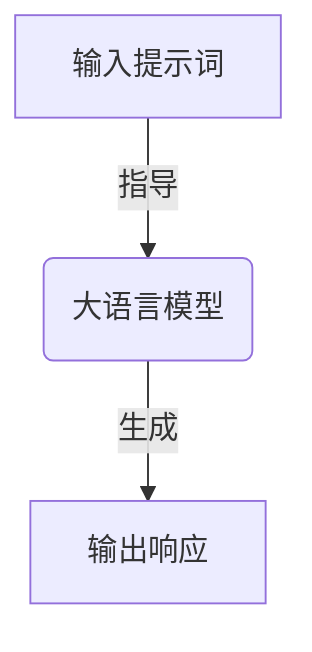
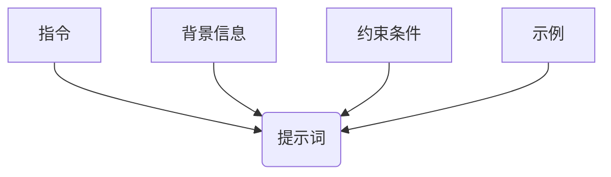
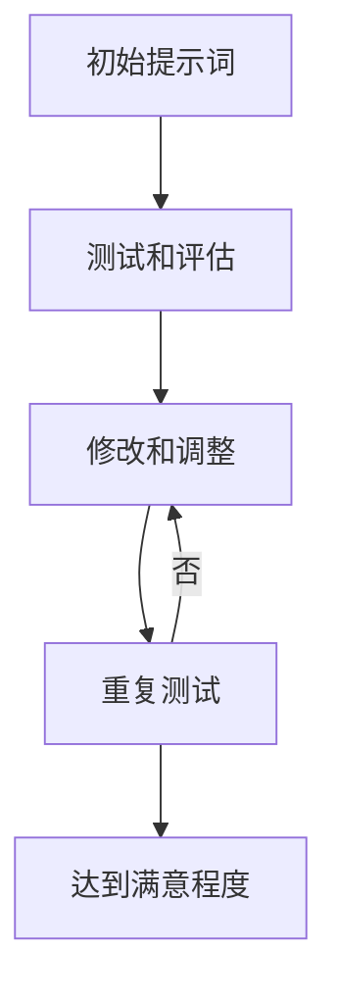

# AIGC从入门到实战：ChatGPT需要懂得写提示词的人

## 1.背景介绍

### 1.1 人工智能新时代的到来

人工智能(Artificial Intelligence, AI)已经成为当今科技领域最炙手可热的话题之一。随着计算能力的不断提升和算法的持续创新,AI技术正在以前所未有的速度渗透到我们生活的方方面面。其中,大语言模型(Large Language Model, LLM)的崛起,尤其是ChatGPT的问世,无疑将人工智能推向了一个新的里程碑。

### 1.2 ChatGPT的革命性意义

ChatGPT是一种基于GPT-3.5架构训练的对话式人工智能,由OpenAI于2022年11月推出。它能够理解和生成人类语言,并在多个领域提供有见地的响应。ChatGPT的出现不仅展示了大语言模型在自然语言处理方面的卓越能力,更重要的是,它为人机交互提供了全新的范式,让人们能够以前所未有的方式与AI进行对话和协作。

### 1.3 AIGC时代的到来

ChatGPT的成功也标志着人工智能生成内容(AI-Generated Content, AIGC)时代的到来。AIGC是指利用人工智能技术自动生成文本、图像、音频、视频等内容。在AIGC时代,人工智能不仅能够理解和分析内容,更能够创造出高质量的原创内容。这为内容创作和知识传播带来了革命性的变革。

## 2.核心概念与联系

### 2.1 提示词(Prompt)

要充分利用ChatGPT等大语言模型的强大功能,关键在于编写高质量的提示词(Prompt)。提示词是输入给语言模型的一段文本,用于指导模型生成所需的输出。一个好的提示词不仅能够清晰地表达出期望的输出内容和格式,还能够为模型提供足够的背景信息和上下文线索,从而生成更加准确、相关和高质量的响应。



### 2.2 提示词工程(Prompt Engineering)

提示词工程是一门新兴的学科,旨在研究如何设计和优化提示词,以最大限度地发挥大语言模型的潜力。它涉及多个方面,包括:

- 提示词结构和格式
- 提示词中的指令和约束条件
- 提示词中的示例和参考
- 提示词的迭代和优化

通过提示词工程,我们可以更好地控制和引导语言模型的输出,提高其准确性、相关性和创造性。

### 2.3 AIGC与提示词工程的关系

在AIGC时代,提示词工程扮演着至关重要的角色。高质量的提示词不仅能够指导语言模型生成优秀的内容,更能够让AIGC系统理解和满足特定的需求和场景。掌握提示词工程,就等于掌握了驾驭AIGC技术的钥匙。只有熟练运用提示词,我们才能真正释放AIGC的无限潜能,在内容创作、知识传播等领域实现创新和突破。

## 3.核心算法原理具体操作步骤

### 3.1 提示词的基本结构

一个典型的提示词通常包含以下几个部分:

1. **指令(Instruction)**: 明确告知语言模型你期望它执行的任务,如"写一篇博客文章"、"翻译一段文本"等。
2. **背景信息(Context)**: 为语言模型提供相关的背景知识和上下文线索,使其更好地理解和完成任务。
3. **约束条件(Constraints)**: 对输出结果的格式、长度、风格等方面提出具体要求,帮助语言模型生成符合预期的内容。
4. **示例(Examples)**: 给出一两个成功案例,让语言模型了解你的期望,并从中获取启发。



### 3.2 提示词优化的迭代过程

编写高质量的提示词往往需要反复迭代和优化。一个常见的优化流程如下:

1. **初始提示词**: 根据任务需求,编写一个初始版本的提示词。
2. **测试和评估**: 将初始提示词输入语言模型,获取输出结果,并评估其质量和符合度。
3. **修改和调整**: 根据评估结果,对提示词进行修改和调整,包括重新表述指令、补充背景信息、调整约束条件、添加或修改示例等。
4. **重复测试**: 将优化后的提示词再次输入语言模型,获取新的输出结果,并进行评估。
5. **迭代优化**: 重复第3步和第4步,直到输出结果达到满意程度。



通过不断迭代和优化,我们可以逐步改进提示词的质量,从而获得更加准确、相关和高质量的输出结果。

## 4.数学模型和公式详细讲解举例说明

### 4.1 大语言模型的基本原理

大语言模型(LLM)是一种基于深度学习的自然语言处理(NLP)模型,它可以从大量文本数据中学习语言模式和知识,并用于生成、理解和处理人类语言。

LLM的核心是一种称为"Transformer"的神经网络架构,它由编码器(Encoder)和解码器(Decoder)两部分组成。编码器将输入的文本序列编码为一系列向量表示,而解码器则根据这些向量表示生成输出序列。

令输入序列为$X = (x_1, x_2, \dots, x_n)$,输出序列为$Y = (y_1, y_2, \dots, y_m)$,则LLM的目标是最大化条件概率$P(Y|X)$,即给定输入$X$时,输出$Y$的概率。根据贝叶斯公式,我们有:

$$P(Y|X) = \frac{P(X|Y)P(Y)}{P(X)}$$

其中,$P(X)$是输入$X$的边缘概率,对于给定的输入是一个常数。因此,我们只需要最大化$P(X|Y)P(Y)$的乘积。

$P(Y)$是语言模型的先验概率,它反映了输出序列$Y$本身的概率分布,通常由一个单独的语言模型来估计。$P(X|Y)$是条件概率,它表示给定输出$Y$时,输入$X$出现的概率,由编码器-解码器模型来计算。

在训练过程中,LLM会最大化训练数据的对数似然,即最小化负对数似然损失:

$$\mathcal{L} = -\sum_{(X,Y)} \log P(Y|X)$$

通过反向传播算法和优化器(如Adam),模型可以不断调整参数,从而提高对训练数据的拟合程度,并获得更好的生成能力。

### 4.2 注意力机制(Attention Mechanism)

Transformer架构的关键创新之一是自注意力(Self-Attention)机制,它允许模型在编码和解码过程中,充分利用输入序列中的上下文信息。

对于输入序列$X = (x_1, x_2, \dots, x_n)$,自注意力机制会计算每个位置$i$的向量表示$h_i$与所有其他位置$j$的向量表示$h_j$之间的相关性得分$e_{ij}$:

$$e_{ij} = \frac{(h_i W^Q)(h_j W^K)^T}{\sqrt{d_k}}$$

其中,$W^Q$和$W^K$分别是查询(Query)和键(Key)的线性变换矩阵,而$d_k$是缩放因子,用于防止点积过大导致梯度消失或爆炸。

然后,这些相关性得分会通过软最大值(Softmax)函数转换为注意力权重$\alpha_{ij}$:

$$\alpha_{ij} = \text{softmax}(e_{ij}) = \frac{\exp(e_{ij})}{\sum_k \exp(e_{ik})}$$

最后,注意力权重$\alpha_{ij}$会与值(Value)向量$h_j W^V$相乘,并对所有$j$求和,得到位置$i$的新表示$z_i$:

$$z_i = \sum_j \alpha_{ij}(h_j W^V)$$

通过自注意力机制,模型可以动态地捕捉输入序列中不同位置之间的依赖关系,从而更好地编码和解码序列。

## 5.项目实践:代码实例和详细解释说明

为了更好地理解如何使用ChatGPT进行AIGC,我们来看一个实际的代码示例。在这个示例中,我们将使用Python和OpenAI的API,生成一篇关于"机器学习算法"的技术博客文章。

### 5.1 安装依赖库

首先,我们需要安装`openai`库,用于与OpenAI的API进行交互。

```
pip install openai
```

### 5.2 导入必要的模块

```python
import openai
```

### 5.3 设置API密钥

在使用OpenAI的API之前,我们需要设置API密钥。你可以从OpenAI的网站上获取密钥。

```python
openai.api_key = "your_api_key_here"
```

### 5.4 定义提示词

接下来,我们定义一个提示词,用于指导ChatGPT生成博客文章。

```python
prompt = """
请以"机器学习算法"为主题,写一篇技术博客文章。文章应包括以下内容:

1. 简要介绍机器学习算法的背景和概念。
2. 详细解释3-5种常见的机器学习算法,包括它们的原理、适用场景和优缺点。
3. 给出一些实际应用案例,说明机器学习算法在不同领域的应用。
4. 讨论机器学习算法的未来发展趋势和挑战。
5. 提供一些学习资源,如书籍、在线课程或工具。

文章字数控制在1500-2000字左右,使用简洁明了的语言,确保内容易于理解。请以Markdown格式输出文章。
"""
```

### 5.5 调用OpenAI的API生成文章

现在,我们可以调用OpenAI的API,使用提示词生成博客文章。

```python
response = openai.Completion.create(
    engine="text-davinci-003",
    prompt=prompt,
    max_tokens=3000,
    n=1,
    stop=None,
    temperature=0.7,
)

article = response.choices[0].text
print(article)
```

在这个示例中,我们使用了`text-davinci-003`引擎,它是OpenAI最新的大语言模型之一。`max_tokens`参数指定了生成文本的最大长度,而`temperature`参数控制了输出的随机性和创造性。

运行这段代码后,ChatGPT会根据提示词生成一篇关于"机器学习算法"的技术博客文章,并以Markdown格式输出。

### 5.6 提示词优化

如果生成的文章质量不尽人意,你可以尝试优化提示词,例如:

- 调整提示词的结构和格式
- 添加更多背景信息和上下文线索
- 修改约束条件,如字数要求或内容要求
- 提供更多示例,帮助ChatGPT更好地理解你的期望

通过反复迭代和优化提示词,你可以不断提高生成内容的质量,直到达到满意的程度。

## 6.实际应用场景

掌握了提示词工程,我们就能够将ChatGPT和AIGC技术应用到各种实际场景中,大大提高工作效率和创造力。以下是一些典型的应用场景:

### 6.1 内容创作

无论是写作博客文章、新闻报道、小说故事,还是创作广告文案、社交媒体内容,AIGC都可以为你提供强有力的辅助。你只需提供一个好的提示词,ChatGPT就能根据你的要求生成高质量的原创内容。

### 6.2 代码生成

对于程序员来说,AIGC可以用于生成代码片段、函数、甚至整个程序。你只需描述你想要实现的功能,ChatGPT就能生成对应的代码,大大提高开发效率。

###