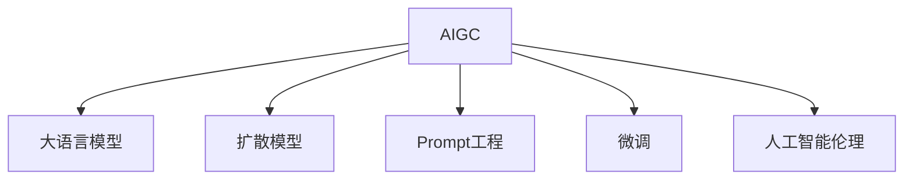

# AIGC从入门到实战：基于大模型的人工智能应用的涌现和爆发

## 1.背景介绍

人工智能生成内容(AIGC, AI-Generated Content)正在掀起一场新的技术革命浪潮。随着自然语言处理、计算机视觉等人工智能技术的飞速发展,尤其是以ChatGPT、Midjourney、Stable Diffusion等为代表的大语言模型和扩散模型的出现,AIGC开始在文本、图像、视频、音频等领域大放异彩。AIGC让机器像人一样进行创作,生成栩栩如生的文字、图画和声音,极大拓展了人工智能的应用边界。

本文将全面剖析AIGC的发展历程、技术原理和实践应用,带你从入门到实战,掌握这一前沿科技的精髓要义。我们将探讨AIGC的核心概念,解析其背后的算法模型,分享实战项目的代码实例,展望AIGC未来的发展趋势与挑战。无论你是AI初学者还是资深开发者,相信本文都能让你对AIGC有更加全面和深入的认知。

### 1.1 人工智能的发展简史
#### 1.1.1 人工智能的起源与概念
#### 1.1.2 人工智能发展的三次浪潮 
#### 1.1.3 深度学习的崛起

### 1.2 AIGC的诞生与意义
#### 1.2.1 AIGC的定义与内涵
#### 1.2.2 AIGC的发展历程
#### 1.2.3 AIGC的现实意义

## 2. 核心概念与联系

要理解AIGC,首先需要掌握其背后的一些核心概念。这些概念环环相扣,共同构建起AIGC的理论基础。

### 2.1 大语言模型(LLM)
大语言模型是AIGC的核心引擎之一。它通过海量文本数据的训练,让机器掌握了语言的语法、语义、逻辑,具备了接近人类的语言理解和生成能力。代表模型有GPT系列、BERT、T5等。

### 2.2 扩散模型(Diffusion Model) 
扩散模型是AIGC另一大利器,主要应用于图像、音频领域。它通过对噪声数据进行逐步去噪,最终生成高质量的图像或音频。代表模型有Stable Diffusion、Dall-E等。

### 2.3 Prompt工程
Prompt工程是设计优质Prompt(输入)的艺术。通过精心设计的Prompt,我们可以引导AIGC模型生成我们期望的输出内容。优质的Prompt需要同时考虑清晰、简洁、信息量大等多方面因素。

### 2.4 微调(Fine-tuning)
微调是在预训练语言模型的基础上,用特定领域数据进行二次训练,使其更好地适应特定任务。微调能显著提升模型在特定领域的表现。

### 2.5 人工智能伦理
随着AIGC的能力越来越强,如何确保其健康、安全、可控的发展是一个重大课题。这需要在隐私保护、知识产权、算法偏见等方面进行深入探讨和防范。

下图展示了这些核心概念之间的联系:



## 3. 核心算法原理具体操作步骤

AIGC的核心算法主要包括大语言模型和扩散模型两大类。下面我们以GPT和Stable Diffusion为例,详细讲解其工作原理和操作步骤。

### 3.1 GPT的工作原理
GPT全称Generative Pre-trained Transformer,是一种基于Transformer结构的自回归语言模型。其核心思想是通过Unsupervised Learning从海量无标注文本数据中学习语言的统计规律和生成规律。

GPT的训练分为两个阶段:

1. 预训练阶段:在大规模语料上进行自回归式语言建模,让模型学会语言的基本规律。
2. 微调阶段:在下游任务的小规模标注数据上进行Supervised Fine-tuning,让模型适应特定任务。

GPT的生成过程遵循以下步骤:

1. 输入prompt。
2. 将prompt编码为向量。
3. 将向量输入GPT模型,通过Self-Attention、Feed Forward等Transformer结构进行特征提取。
4. 模型输出下一个词的概率分布。
5. 根据概率分布采样生成下一个词。
6. 重复步骤3-5,直到生成所需长度的文本。

### 3.2 Stable Diffusion的工作原理
Stable Diffusion是一种文本到图像生成(Text-to-Image)模型,属于扩散模型的一种。其核心思想是通过逐步去噪,将高斯噪声图片还原成高质量图像。

Stable Diffusion的训练过程如下:

1. 正向过程:将真实图像x0逐步添加高斯噪声,得到一系列噪声图像x1,x2,...,xT。
2. 反向过程:训练一个去噪自编码器,将噪声图像还原为真实图像。
3. 重复步骤1-2,最小化重构误差,优化模型参数。

Stable Diffusion的生成过程如下:

1. 输入文本prompt。
2. 将prompt编码为条件向量。
3. 随机采样一个高斯噪声图像xT。
4. 将xT和条件向量输入去噪自编码器,生成去噪后的图像xT-1。
5. 重复步骤4,最终得到一张高质量生成图像x0。

## 4. 数学模型和公式详细讲解举例说明

接下来我们从数学角度对AIGC的核心模型进行更加深入的讲解。

### 4.1 Transformer的数学原理

Transformer是GPT的核心组件,其数学原理可以表示为:

$$Attention(Q,K,V) = softmax(\frac{QK^T}{\sqrt{d_k}})V$$

其中,$Q$是查询矩阵,$K$是键矩阵,$V$是值矩阵,$d_k$是$K$的维度。

举个例子,假设我们有一个输入序列"我爱人工智能",Transformer的计算过程如下:

1. 将输入序列编码为矩阵$Q$,$K$,$V$。
2. 计算$QK^T$,得到注意力得分矩阵。
3. 将注意力得分矩阵除以$\sqrt{d_k}$,并过softmax,得到注意力权重矩阵。
4. 用注意力权重矩阵乘以$V$,得到输出表示。

通过这种注意力机制,Transformer可以学习到输入序列中不同位置之间的相关性,从而更好地理解和生成语言。

### 4.2 扩散模型的数学原理

扩散模型的核心是马尔科夫链的思想。其数学原理可以表示为:

正向过程:
$$q(x_t|x_{t-1}) = N(x_t;\sqrt{1-\beta_t}x_{t-1},\beta_tI)$$

反向过程:
$$p_\theta(x_{t-1}|x_t) = N(x_{t-1};\mu_\theta(x_t,t),\sigma_\theta(x_t,t)I)$$

其中,$q$代表正向添加噪声的过程,$p_\theta$代表反向去噪的过程,$\beta_t$是噪声强度的超参数,$\mu_\theta$和$\sigma_\theta$是去噪自编码器的均值和方差。

举个例子,假设我们要生成一张512x512的图像,扩散模型的过程如下:

1. 随机采样一个高斯噪声图像$x_T$。
2. 根据$p_\theta(x_{t-1}|x_t)$计算均值和方差,对$x_T$进行去噪,得到$x_{T-1}$。
3. 重复步骤2,最终得到生成图像$x_0$。

通过这种逐步去噪的过程,扩散模型可以生成高质量、高分辨率的图像。

## 5. 项目实践：代码实例和详细解释说明

下面我们通过具体的代码实例,演示如何使用AIGC进行文本生成和图像生成。

### 5.1 使用GPT进行文本生成

```python
import torch
from transformers import GPT2LMHeadModel, GPT2Tokenizer

# 加载预训练的GPT-2模型和tokenizer
model = GPT2LMHeadModel.from_pretrained('gpt2')
tokenizer = GPT2Tokenizer.from_pretrained('gpt2')

# 设置生成参数
prompt = "Once upon a time"
max_length = 100
num_return_sequences = 3

# 对prompt进行编码
input_ids = tokenizer.encode(prompt, return_tensors='pt')

# 使用模型生成文本
output = model.generate(input_ids, 
                        max_length=max_length,
                        num_return_sequences=num_return_sequences)

# 解码并打印生成的文本
for i in range(num_return_sequences):
    print(f"Generated text {i+1}: {tokenizer.decode(output[i], skip_special_tokens=True)}")
```

这段代码的主要步骤如下:

1. 加载预训练的GPT-2模型和tokenizer。
2. 设置生成参数,包括prompt、最大长度、生成序列数等。
3. 对prompt进行编码,转换为模型可以接受的输入格式。
4. 调用model.generate方法,生成指定数量的文本序列。
5. 对生成的文本进行解码,并打印输出结果。

### 5.2 使用Stable Diffusion生成图像

```python
from diffusers import StableDiffusionPipeline

# 加载Stable Diffusion模型
model_id = "CompVis/stable-diffusion-v1-4"
pipe = StableDiffusionPipeline.from_pretrained(model_id)

# 设置生成参数  
prompt = "a photo of an astronaut riding a horse on mars"
num_images = 4

# 使用模型生成图像
images = pipe(prompt, num_images_per_prompt=num_images).images

# 保存生成的图像
for i, image in enumerate(images):
    image.save(f"astronaut_rides_horse_{i}.png")
```

这段代码的主要步骤如下:

1. 加载预训练的Stable Diffusion模型。
2. 设置生成参数,包括prompt、生成图像数量等。
3. 调用pipe方法,根据prompt生成指定数量的图像。
4. 遍历生成的图像,并将其保存到本地文件。

通过这些简单的代码,我们就可以利用AIGC的强大能力,生成丰富多彩的文本和图像内容。

## 6. 实际应用场景

AIGC在各行各业都有广泛的应用前景,下面列举几个典型场景:

### 6.1 智能写作助手
AIGC可以作为智能写作助手,帮助人们更高效地撰写文章、报告、邮件等。比如Jasper.ai、Copy.ai等写作工具,就是利用GPT等语言模型,根据用户输入的关键信息,自动生成完整的文章内容,大大提高了写作效率。

### 6.2 虚拟客服/智能对话
AIGC可以用于构建智能客服系统,与用户进行自然流畅的多轮对话。相比传统的规则或检索式对话系统,基于大语言模型的对话系统可以更好地理解用户意图,生成更加个性化、人性化的回复,从而提升用户体验。

### 6.3 智能设计创作
AIGC正在重塑设计创意行业。设计师可以利用Midjourney、Stable Diffusion等AIGC工具,根据文本描述快速生成各种创意图像,用于广告、海报、UI设计等,极大提高设计效率和创意水平。未来AIGC有望成为每个设计师的得力助手。

### 6.4 教育与培训
AIGC可以应用于教育领域,作为智能教学助理,为学生提供个性化的学习内容和指导。比如根据学生的学习进度和能力,自动生成习题和解析;为写作课自动批改作文并提供修改建议;为艺术课生成示例和启发灵感。AIGC有望让因材施教成为现实。

### 6.5 娱乐与游戏
AIGC正在重新定义内容创作方式。有了AI编剧,影视剧本创作的效率将大大提升;有了AI画师,游戏的美术资源可以无限扩充;有了AI音乐家,每个游戏玩家都能拥有专属BGM。AIGC让娱乐内容更加丰富多元,带来更加沉