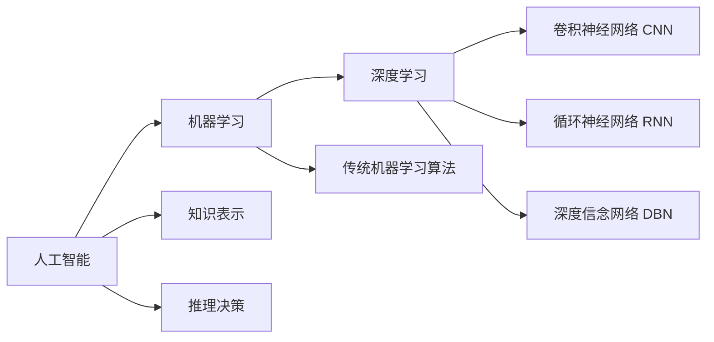

# AI人工智能深度学习算法：在航空航天中的应用

## 1. 背景介绍
### 1.1 人工智能与深度学习的发展历程
#### 1.1.1 人工智能的起源与发展
#### 1.1.2 机器学习的兴起 
#### 1.1.3 深度学习的崛起

### 1.2 航空航天领域的现状与挑战
#### 1.2.1 航空航天技术的发展现状
#### 1.2.2 航空航天领域面临的挑战
#### 1.2.3 人工智能在航空航天领域的应用前景

### 1.3 深度学习在航空航天领域的应用意义
#### 1.3.1 提高航空航天系统的智能化水平
#### 1.3.2 优化航空航天任务的决策与控制
#### 1.3.3 增强航空航天数据的分析与处理能力

## 2. 核心概念与联系
### 2.1 人工智能的核心概念
#### 2.1.1 感知
#### 2.1.2 认知
#### 2.1.3 决策

### 2.2 机器学习的核心概念
#### 2.2.1 监督学习
#### 2.2.2 无监督学习  
#### 2.2.3 强化学习

### 2.3 深度学习的核心概念
#### 2.3.1 人工神经网络
#### 2.3.2 深度神经网络
#### 2.3.3 卷积神经网络
#### 2.3.4 循环神经网络

### 2.4 深度学习与传统机器学习的区别
#### 2.4.1 数据规模与特征学习
#### 2.4.2 模型复杂度与泛化能力
#### 2.4.3 计算资源需求与训练效率



## 3. 核心算法原理具体操作步骤
### 3.1 卷积神经网络(CNN)
#### 3.1.1 卷积层
#### 3.1.2 池化层
#### 3.1.3 全连接层
#### 3.1.4 CNN训练过程

### 3.2 循环神经网络(RNN) 
#### 3.2.1 基本RNN结构
#### 3.2.2 长短期记忆网络(LSTM)
#### 3.2.3 门控循环单元(GRU)  
#### 3.2.4 RNN训练过程

### 3.3 生成对抗网络(GAN)
#### 3.3.1 生成器与判别器
#### 3.3.2 对抗训练过程
#### 3.3.3 GAN的变体与改进

### 3.4 深度强化学习(DRL)
#### 3.4.1 马尔可夫决策过程
#### 3.4.2 Q-Learning算法
#### 3.4.3 深度Q网络(DQN) 
#### 3.4.4 策略梯度算法

## 4. 数学模型和公式详细讲解举例说明
### 4.1 神经网络的数学表示
#### 4.1.1 神经元模型
$$ y = f(\sum_{i=1}^{n} w_i x_i + b) $$
其中，$y$为神经元输出，$f$为激活函数，$w_i$为权重，$x_i$为输入，$b$为偏置。

#### 4.1.2 前向传播
$$ a^{(l)} = f(z^{(l)}) $$
$$ z^{(l)} = W^{(l)}a^{(l-1)} + b^{(l)} $$
其中，$a^{(l)}$为第$l$层的激活值，$z^{(l)}$为第$l$层的加权输入，$W^{(l)}$和$b^{(l)}$分别为第$l$层的权重矩阵和偏置向量。

#### 4.1.3 反向传播
$$ \delta^{(L)} = \nabla_a C \odot f'(z^{(L)}) $$
$$ \delta^{(l)} = ((W^{(l+1)})^T \delta^{(l+1)}) \odot f'(z^{(l)}) $$
$$ \frac{\partial C}{\partial W^{(l)}} = \delta^{(l)} (a^{(l-1)})^T $$
$$ \frac{\partial C}{\partial b^{(l)}} = \delta^{(l)} $$
其中，$\delta^{(l)}$为第$l$层的误差项，$C$为损失函数，$\nabla_a C$为损失函数对输出层激活值的梯度，$\odot$为Hadamard积。

### 4.2 卷积神经网络的数学表示
#### 4.2.1 卷积运算
$$ s(i,j) = (I * K)(i,j) = \sum_m \sum_n I(i+m, j+n) K(m,n) $$
其中，$I$为输入特征图，$K$为卷积核，$*$为卷积运算符，$s(i,j)$为卷积结果。

#### 4.2.2 池化运算
$$ y(i,j) = \max_{m,n \in R} x(i+m, j+n) $$
其中，$x$为输入特征图，$R$为池化窗口，$\max$为最大池化操作，$y(i,j)$为池化结果。

### 4.3 循环神经网络的数学表示
#### 4.3.1 基本RNN模型
$$ h_t = f(W_{hh} h_{t-1} + W_{xh} x_t + b_h) $$
$$ y_t = W_{hy} h_t + b_y $$
其中，$h_t$为$t$时刻的隐藏状态，$x_t$为$t$时刻的输入，$y_t$为$t$时刻的输出，$W$和$b$为权重矩阵和偏置向量。

#### 4.3.2 LSTM模型
$$ i_t = \sigma(W_{xi} x_t + W_{hi} h_{t-1} + b_i) $$
$$ f_t = \sigma(W_{xf} x_t + W_{hf} h_{t-1} + b_f) $$
$$ o_t = \sigma(W_{xo} x_t + W_{ho} h_{t-1} + b_o) $$
$$ \tilde{C}_t = \tanh(W_{xc} x_t + W_{hc} h_{t-1} + b_c) $$
$$ C_t = f_t \odot C_{t-1} + i_t \odot \tilde{C}_t $$
$$ h_t = o_t \odot \tanh(C_t) $$
其中，$i_t$、$f_t$、$o_t$分别为输入门、遗忘门和输出门，$C_t$为细胞状态，$\tilde{C}_t$为候选细胞状态，$\sigma$为sigmoid激活函数。

### 4.4 生成对抗网络的数学表示
#### 4.4.1 生成器与判别器的目标函数
$$ \min_G \max_D V(D,G) = \mathbb{E}_{x \sim p_{data}(x)}[\log D(x)] + \mathbb{E}_{z \sim p_z(z)}[\log (1 - D(G(z)))] $$
其中，$G$为生成器，$D$为判别器，$p_{data}$为真实数据分布，$p_z$为噪声分布，$\mathbb{E}$为期望。

#### 4.4.2 生成器与判别器的优化过程
$$ \theta_D \leftarrow \theta_D + \alpha \nabla_{\theta_D} \frac{1}{m} \sum_{i=1}^m [\log D(x^{(i)}) + \log (1 - D(G(z^{(i)})))] $$
$$ \theta_G \leftarrow \theta_G - \alpha \nabla_{\theta_G} \frac{1}{m} \sum_{i=1}^m \log (1 - D(G(z^{(i)}))) $$
其中，$\theta_D$和$\theta_G$分别为判别器和生成器的参数，$\alpha$为学习率，$m$为小批量样本数。

## 5. 项目实践：代码实例和详细解释说明
### 5.1 基于CNN的航空器目标检测
```python
import tensorflow as tf

# 定义卷积神经网络模型
class AircraftDetectionCNN(tf.keras.Model):
    def __init__(self):
        super(AircraftDetectionCNN, self).__init__()
        self.conv1 = tf.keras.layers.Conv2D(32, (3,3), activation='relu', input_shape=(224,224,3))
        self.pool1 = tf.keras.layers.MaxPooling2D((2,2))
        self.conv2 = tf.keras.layers.Conv2D(64, (3,3), activation='relu')
        self.pool2 = tf.keras.layers.MaxPooling2D((2,2))
        self.conv3 = tf.keras.layers.Conv2D(64, (3,3), activation='relu')
        self.flatten = tf.keras.layers.Flatten()
        self.fc1 = tf.keras.layers.Dense(64, activation='relu')
        self.fc2 = tf.keras.layers.Dense(10)
        
    def call(self, x):
        x = self.conv1(x)
        x = self.pool1(x)
        x = self.conv2(x)
        x = self.pool2(x)
        x = self.conv3(x)
        x = self.flatten(x)
        x = self.fc1(x)
        return self.fc2(x)

# 创建模型实例
model = AircraftDetectionCNN()

# 编译模型
model.compile(optimizer='adam',
              loss=tf.keras.losses.SparseCategoricalCrossentropy(from_logits=True),
              metrics=['accuracy'])
              
# 训练模型
history = model.fit(train_images, train_labels, epochs=10, 
                    validation_data=(test_images, test_labels))
                    
# 评估模型
test_loss, test_acc = model.evaluate(test_images,  test_labels, verbose=2)
print('Test accuracy:', test_acc)
```
上述代码实现了一个基于卷积神经网络的航空器目标检测模型。首先定义了一个包含三个卷积层、两个池化层和两个全连接层的CNN模型类`AircraftDetectionCNN`。然后创建模型实例，并使用`compile`方法配置模型的优化器、损失函数和评估指标。接着，使用`fit`方法在训练数据上训练模型，并在验证数据上进行验证。最后，使用`evaluate`方法在测试数据上评估模型的性能。

### 5.2 基于RNN的航空器轨迹预测
```python
import tensorflow as tf

# 定义循环神经网络模型
class AircraftTrajectoryRNN(tf.keras.Model):
    def __init__(self):
        super(AircraftTrajectoryRNN, self).__init__()
        self.lstm = tf.keras.layers.LSTM(64, return_sequences=True, input_shape=(None, 4))
        self.fc = tf.keras.layers.Dense(2)
        
    def call(self, x):
        x = self.lstm(x)
        return self.fc(x)

# 创建模型实例
model = AircraftTrajectoryRNN()

# 编译模型
model.compile(optimizer='adam', loss='mse')

# 训练模型
history = model.fit(train_data, train_labels, epochs=10, 
                    validation_data=(test_data, test_labels))
                    
# 预测轨迹
predictions = model.predict(test_data)
```
上述代码实现了一个基于循环神经网络的航空器轨迹预测模型。首先定义了一个包含一个LSTM层和一个全连接层的RNN模型类`AircraftTrajectoryRNN`。然后创建模型实例，并使用`compile`方法配置模型的优化器和损失函数。接着，使用`fit`方法在训练数据上训练模型，并在验证数据上进行验证。最后，使用`predict`方法对测试数据进行轨迹预测。

## 6. 实际应用场景
### 6.1 航空器目标检测与识别
- 机场安全监控
- 军事侦察与打击
- 无人机避障与跟踪

### 6.2 航空器轨迹预测与异常检测
- 空中交通管制
- 航线规划与优化
- 飞行安全监测

### 6.3 航空发动机健康监测与故障诊断
- 预测性维护
- 剩余使用寿命估计
- 故障原因分析

### 6.4 航天器自主导航与控制
- 在轨服务与维护
- 交会对接与编队飞行
- 深空探测任务规划

### 6.5 卫星遥感图像分析
- 地物分类与变化检测
- 目标提取与识别
- 灾害监测与评估

## 7. 工具和资源推荐
### 7.1 深度学习框架
- TensorFlow: https://www.tensorflow.org
- PyTorch: https://pytorch.org
- Keras: https://keras.io

### 7.2 航空航天数据集
- 