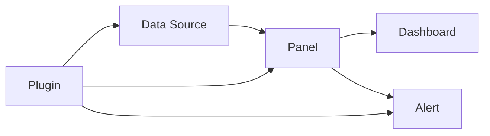

# AI系统Grafana原理与代码实战案例讲解

## 1. 背景介绍
### 1.1 AI系统监控的重要性
在当今快速发展的人工智能时代,AI系统已经渗透到各行各业,成为推动生产力发展的重要力量。然而,随着AI系统规模和复杂度的不断增加,对其进行有效监控和管理变得越来越具有挑战性。AI系统的稳定运行直接关系到企业的生产效率和经济效益,因此建立一套完善的AI系统监控方案势在必行。

### 1.2 Grafana在AI系统监控中的应用
Grafana是一款开源的数据可视化和监控平台,凭借其灵活的插件架构和丰富的图表展示功能,在IT运维领域得到了广泛应用。近年来,Grafana也逐渐被用于AI系统的监控,通过集成各种数据源,实现对AI系统的多维度实时监控,为AI系统的稳定运行提供了有力保障。

### 1.3 本文的主要内容
本文将重点介绍Grafana在AI系统监控中的应用原理和实践。内容涵盖Grafana的核心概念、架构设计、关键技术、实战案例等多个方面。通过本文的学习,读者可以全面了解Grafana的技术特点,掌握基于Grafana进行AI系统监控的基本方法,并能够根据实际需求设计和实现高可用的AI系统监控方案。

## 2. 核心概念与联系
### 2.1 数据源(Data Source) 
数据源是Grafana的核心概念之一,它代表了Grafana可以访问的数据来源,如时序数据库、关系型数据库、日志系统等。Grafana通过数据源的抽象,屏蔽了不同数据源之间的差异,提供了统一的查询和展示接口。在AI系统监控中,常见的数据源包括Prometheus、InfluxDB、Elasticsearch等。

### 2.2 面板(Panel)
面板是Grafana用于展示数据的基本单元。一个面板通常由一个或多个查询语句和可视化组件组成,可以展示各种类型的图表,如折线图、柱状图、饼图、热力图等。面板支持丰富的自定义配置,如设置图表的颜色、样式、阈值等,以满足不同的展示需求。

### 2.3 仪表盘(Dashboard)
仪表盘是由多个面板组成的集合,用于提供对系统或应用的整体监控视图。通过灵活的布局和排列,仪表盘可以将多个关键指标以直观的方式呈现给用户,帮助用户快速了解系统的运行状态。Grafana提供了丰富的仪表盘模板和分享机制,用户可以基于模板快速创建自己的监控仪表盘。

### 2.4 告警(Alert)
告警是Grafana提供的一项重要功能,用于在监控指标满足特定条件时自动发出通知。告警支持多种触发方式,如阈值告警、变化率告警等,并可以与各种通知渠道集成,如邮件、短信、Slack等。通过合理设置告警规则,可以第一时间发现AI系统的异常情况,减少故障的影响范围。

### 2.5 插件(Plugin)
插件是Grafana的重要扩展机制,通过插件可以增强Grafana的功能和适用场景。Grafana提供了丰富的官方和社区插件,涵盖数据源、面板、告警等多个方面。用户也可以根据需求开发自己的插件,与内部系统进行集成。

下图展示了Grafana的核心概念之间的关系:



## 3. 核心算法原理与具体操作步骤
### 3.1 数据查询与聚合
Grafana的数据查询和聚合功能主要由后端的数据源插件实现。以时序数据库为例,常见的查询和聚合算法包括:

1. 时间序列选择: 根据面板的时间范围,从数据源中选择相应的时间序列数据。
2. 数据采样: 对原始时间序列数据进行采样,减少前端渲染的数据量。常用的采样算法有直接采样、平均值采样、最大值采样等。
3. 数据聚合: 对采样后的数据进行聚合计算,生成面板需要展示的统计指标。常见的聚合函数包括求和、求平均、求最大值等。
4. 数据插值: 对缺失的数据点进行插值,确保时间序列的连续性。常用的插值算法有线性插值、样条插值等。

具体操作步骤如下:

1. 用户在面板中配置数据源和查询语句,指定需要查询的时间序列和聚合函数。
2. 面板将查询请求发送给后端的数据源插件进行处理。 
3. 数据源插件根据查询条件,从底层数据库中获取原始时间序列数据。
4. 数据源插件对原始数据进行采样、聚合和插值处理,生成面板需要的统计指标。
5. 数据源插件将处理后的结果返回给面板进行渲染和展示。

### 3.2 面板可视化渲染
Grafana面板的可视化渲染主要由前端的面板插件实现。以折线图为例,常见的渲染算法包括:

1. 数据映射: 将后端返回的数据映射到图表的坐标系中,确定每个数据点的位置。
2. 线段绘制: 根据数据点的位置,绘制折线图的线段。常用的绘制算法有Bresenham算法、Xiaolin Wu算法等。
3. 样式渲染: 根据面板的配置,对折线图进行样式渲染,如设置线条颜色、宽度、填充颜色等。
4. 交互处理: 处理用户的交互事件,如鼠标悬停、点击等,提供交互式的数据探索功能。

具体操作步骤如下:

1. 面板从后端接收到聚合后的时间序列数据。
2. 面板将数据映射到图表的坐标系中,计算每个数据点的位置。
3. 面板根据数据点的位置,使用线段绘制算法绘制折线图。
4. 面板根据配置对折线图进行样式渲染,如设置颜色、宽度等。
5. 面板监听用户的交互事件,提供数据探索功能,如显示数据点的详细信息等。

## 4. 数学模型和公式详细讲解举例说明
在Grafana的可视化渲染过程中,常常涉及到一些数学模型和公式。下面以折线图的线性插值为例,对其中用到的数学模型和公式进行详细讲解。

线性插值是一种常用的数据插值算法,用于估计两个已知数据点之间的未知点的值。假设有两个数据点$(x_1, y_1)$和$(x_2, y_2)$,需要估计$x$点处的值$y$,线性插值公式如下:

$$y = y_1 + \frac{y_2 - y_1}{x_2 - x_1}(x - x_1)$$

该公式的几何意义是,在$(x_1, y_1)$和$(x_2, y_2)$两点之间连接一条直线,然后根据$x$在该直线上的位置,计算出对应的$y$值。

举例说明,假设有两个数据点$(1, 2)$和$(5, 10)$,需要估计$x=3$处的值。代入线性插值公式:

$$y = 2 + \frac{10 - 2}{5 - 1}(3 - 1) = 2 + \frac{8}{4} \times 2 = 6$$

因此,在$x=3$处的估计值为$y=6$。

在Grafana中,当时间序列数据出现缺失值时,可以使用线性插值算法来填充缺失的数据点,确保折线图的连续性。同时,线性插值算法也可以用于数据采样,通过减少数据点的数量来提高前端渲染的性能。

## 5. 项目实践：代码实例和详细解释说明
下面通过一个具体的代码实例,演示如何使用Grafana和Prometheus实现对AI系统的监控。

### 5.1 Prometheus数据源配置
首先,需要在Grafana中配置Prometheus数据源。以下是数据源配置的示例代码:

```yaml
apiVersion: 1
datasources:
  - name: Prometheus
    type: prometheus
    url: http://prometheus:9090
    access: proxy
    basicAuth: false
```

这里定义了一个名为`Prometheus`的数据源,类型为`prometheus`,URL为Prometheus服务的访问地址。`access`字段指定了数据源的访问模式,`proxy`表示通过Grafana服务器代理访问。`basicAuth`字段指定是否启用基本认证。

### 5.2 Prometheus监控指标采集
接下来,需要在Prometheus中配置对AI系统的监控指标采集。以下是Prometheus配置文件的示例代码:

```yaml
global:
  scrape_interval: 15s
  evaluation_interval: 15s

scrape_configs:
  - job_name: 'ai-system'
    metrics_path: /metrics
    static_configs:
      - targets: ['ai-system:8080']
```

这里定义了一个名为`ai-system`的监控任务,`metrics_path`指定了采集指标的路径,`static_configs`指定了要采集的目标服务器地址。`scrape_interval`和`evaluation_interval`分别指定了指标采集和评估的时间间隔。

### 5.3 Grafana面板配置
最后,在Grafana中创建一个面板,展示采集到的AI系统监控指标。以下是面板配置的示例代码:

```json
{
  "title": "AI System Monitoring",
  "panels": [
    {
      "title": "CPU Usage",
      "type": "graph",
      "datasource": "Prometheus",
      "targets": [
        {
          "expr": "cpu_usage_idle{instance=\"ai-system:8080\"}",
          "legendFormat": "CPU Usage"
        }
      ]
    },
    {
      "title": "Memory Usage",
      "type": "graph",      
      "datasource": "Prometheus",
      "targets": [
        {
          "expr": "memory_usage{instance=\"ai-system:8080\"}",
          "legendFormat": "Memory Usage"
        }
      ]
    }
  ]
}
```

这里定义了一个名为`AI System Monitoring`的面板,包含两个子面板,分别展示AI系统的CPU使用率和内存使用量。`datasource`字段指定了面板使用的数据源,`targets`字段指定了要查询的Prometheus指标表达式。`legendFormat`字段指定了图例的格式。

通过以上配置,就可以在Grafana中实时监控AI系统的运行状态,并根据需要设置相应的告警规则。这种基于Grafana和Prometheus的监控方案,具有灵活、可扩展、易于集成的特点,已经被广泛应用于各种AI系统的监控场景中。

## 6. 实际应用场景
Grafana在AI系统监控中有着广泛的应用,下面列举几个典型的应用场景:

### 6.1 模型训练监控
在深度学习模型的训练过程中,需要实时监控各种指标,如训练误差、验证准确率、学习率等。通过Grafana,可以将这些指标以直观的方式展示出来,帮助研究人员及时了解模型的训练进展,发现潜在的问题。

### 6.2 推理服务监控
对于部署上线的AI推理服务,需要对其可用性、性能、资源使用等方面进行监控。Grafana可以集成Prometheus等监控数据源,实时采集推理服务的各项指标,并以仪表盘的形式展示出来。通过设置合适的告警规则,可以第一时间发现推理服务的异常,保障服务的稳定性。

### 6.3 数据管道监控
AI系统通常依赖复杂的数据管道进行数据的采集、清洗、转换和存储。为了确保数据管道的正常运转,需要对数据的处理延迟、吞吐量、错误率等指标进行监控。Grafana可以很好地展示数据管道的运行状态,帮助数据工程师发现和定位问题。

### 6.4 硬件资源监控
AI系统对计算资源,特别是GPU资源有很高的要求。通过Grafana,可以实时监控GPU的利用率、显存占用、温度等指标,优化资源的调度和分配。同时,对于其他硬件资源如CPU、内存、磁盘等,也可以通过Grafana进行统一的监