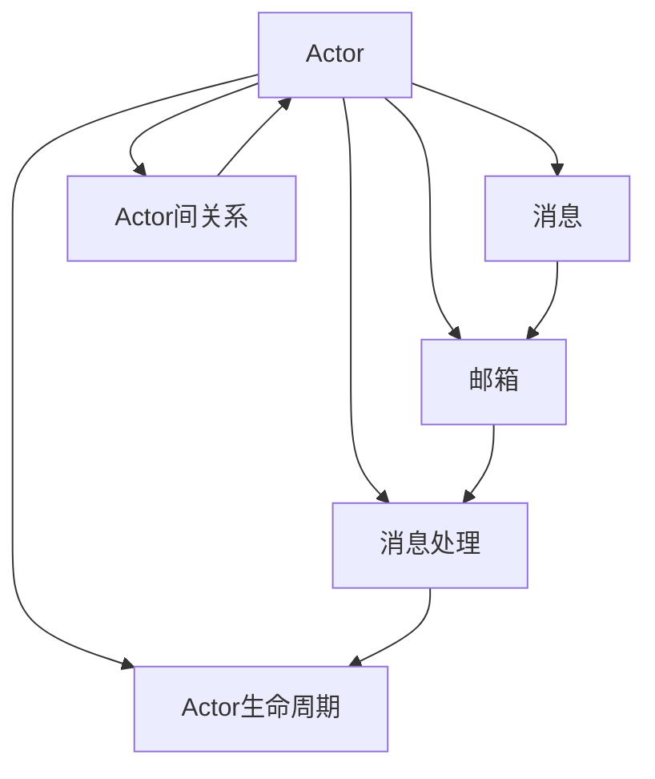

# Actor Model原理与代码实例讲解

## 1. 背景介绍

### 1.1 并发编程的挑战

在当今高度互联和数据密集型的计算世界中,并发编程已成为一个至关重要的课题。传统的多线程并发模型虽然强大,但也存在一些固有的复杂性和陷阱,例如:

- 共享可变状态导致的竞争条件(Race Condition)
- 死锁(Deadlock)和活锁(Livelock) 
- 上下文切换开销大
- 难以推断程序行为

为了应对并发编程的挑战,人们提出了各种并发模型,Actor Model就是其中一种备受瞩目的模型。

### 1.2 Actor Model的起源

Actor Model最早由Carl Hewitt等人在1973年的论文《A Universal Modular ACTOR Formalism for Artificial Intelligence》中提出。该模型借鉴了物理学中的粒子模型,将并发实体抽象为一组独立的、异步通信的Actor。

此后,Actor Model在学术界得到广泛研究,并在Erlang、Akka等编程框架中得到实践应用,展现出其在构建高并发、分布式系统方面的优势。

## 2. 核心概念与联系

### 2.1 Actor

Actor是Actor Model的基本单元,代表了一个并发实体。每个Actor都有如下特点:

- 拥有唯一标识符
- 维护自己的私有状态
- 通过异步消息与其他Actor通信
- 收到消息后可以进行计算、改变自身状态、创建新Actor、发送消息

### 2.2 消息

Actor之间通过发送消息来进行通信。消息具有如下特点:

- 不可变性:消息一旦发出即不可更改
- 异步性:消息发送无需等待接收方处理完毕
- 均一性:消息可以是任意数据类型,包括Actor引用本身

### 2.3 邮箱

每个Actor都有一个邮箱(Mailbox),用于缓存发送给该Actor的消息。邮箱具有如下特点:

- 先进先出:遵循FIFO规则
- 缓冲无限:理论上邮箱可以无限存储消息

### 2.4 消息处理

Actor收到消息后,根据消息内容进行相应的计算或操作。消息处理具有如下特点:

- 串行处理:同一个Actor只能串行处理消息,保证内部状态一致性
- 原子性:消息处理要么全部完成,要么全部回滚,不存在中间状态

### 2.5 Actor生命周期

Actor的生命周期包括:

- 创建:由其他Actor通过发送消息创建
- 运行:不断从邮箱中取出消息进行处理
- 销毁:显式停止或被垃圾回收

### 2.6 Actor间关系

Actor之间可以形成以下关系:

- 父子关系:父Actor负责创建和监督子Actor
- 链接关系:建立链接的Actor之间可以感知彼此的终止
- 监督关系:监督者Actor负责重启、恢复失败的Actor

下图展示了Actor Model的核心概念与联系:



## 3. 核心算法原理具体操作步骤

Actor Model的核心算法可以总结为以下步骤:

1. Actor创建:
   - 分配唯一标识符
   - 初始化Actor状态
   - 创建邮箱
2. 消息发送:  
   - 将消息添加到目标Actor邮箱
   - 如果目标Actor忙,消息在邮箱中等待
3. 消息处理:
   - Actor从邮箱中取出一条消息
   - 根据消息内容进行计算或状态转移
   - 可能向其他Actor发送新消息
   - 可能创建新Actor
   - 原子性地完成消息处理
4. Actor终止:
   - 显式停止Actor
   - 垃圾回收不再使用的Actor
   
这个处理流程可以用下面的伪代码表示:

```
actor = createActor(initialState)
loop
    message = waitForMessage(actor.mailbox) 
    newState = processMessage(actor, message)
    actor.state = newState
    if shouldTerminate(actor, message) then
        break
    end
end
stopActor(actor)
```

## 4. 数学模型和公式详细讲解举例说明

Actor Model可以用形式化的数学模型来描述。假设一个Actor系统由一组Actor $A=\{a_1,a_2,...,a_n\}$ 组成,每个Actor $a_i$ 的行为可以用一个三元组 $(S_i,M_i,F_i)$ 表示,其中:

- $S_i$ 表示Actor $a_i$ 的状态集合
- $M_i$ 表示Actor $a_i$ 可以接收的消息集合
- $F_i: S_i \times M_i \rightarrow S_i \times A \times M_i$ 表示Actor $a_i$ 的状态转移函数

当Actor $a_i$ 处于状态 $s \in S_i$ 时,收到一条消息 $m \in M_i$,则执行状态转移函数:

$$F_i(s, m) = (s', a', m')$$

其中:
- $s' \in S_i$ 表示新的状态
- $a' \in A$ 表示要发送消息的目标Actor
- $m' \in M_i$ 表示要发送的消息

举例说明,假设有一个简单的计数器Actor,其状态为当前计数 $count$,可以接收两种消息:

- $Increment$:将计数加1
- $GetCount(replyTo)$:将当前计数发送给 $replyTo$ Actor

该计数器Actor可以用如下三元组表示:

- $S=\mathbb{N}$ (非负整数集)
- $M=\{Increment, GetCount(replyTo) | replyTo \in A\}$  
- $F(count, Increment) = (count+1, None, None)$
- $F(count, GetCount(replyTo)) = (count, replyTo, count)$

可以看出,该Actor根据收到的消息,执行不同的状态转移和消息发送操作。这个简单的例子体现了Actor Model中状态、消息、行为的抽象和封装。

## 5. 项目实践:代码实例和详细解释说明

下面我们用Akka这个流行的Actor框架,来实现上述的计数器Actor:

```scala
import akka.actor.{Actor, ActorRef, Props}

class CounterActor extends Actor {
  var count = 0

  def receive: Receive = {
    case Increment => 
      count += 1
    case GetCount(replyTo) =>
      replyTo ! count
  }
}

object CounterActor {
  case object Increment
  case class GetCount(replyTo: ActorRef)
  
  def props: Props = Props(new CounterActor)
}
```

代码解释:

1. 首先我们定义了 `CounterActor` 类,它继承了Akka的 `Actor` trait,表示这是一个Actor。

2. `count` 变量表示Actor的内部状态,初始值为0。

3. `receive` 方法定义了Actor的消息处理逻辑,使用Scala的偏函数语法进行模式匹配:
   - 收到 `Increment` 消息时,将 `count` 加1
   - 收到 `GetCount(replyTo)` 消息时,将当前 `count` 发送给 `replyTo` 这个Actor引用

4. `CounterActor` 伴生对象中定义了该Actor可以接收的消息类型:
   - `Increment` 是一个case对象,表示递增消息
   - `GetCount` 是一个case类,包含了一个 `ActorRef` 类型的 `replyTo` 字段,表示回复对象

5. `props` 方法用于创建该Actor的 `Props` 配置,用于后续的Actor创建

这个例子展示了如何用Akka定义一个简单的Actor。实际应用中,我们还需要创建Actor系统、实例化Actor、发送消息等,这里不再赘述。

## 6. 实际应用场景

Actor Model在许多实际场景中得到应用,特别适合解决以下问题:

- 高并发系统:如网络服务器、Web爬虫等,Actor可以很好地利用多核资源提高并发性能
- 分布式系统:如分布式缓存、分布式计算等,Actor天然适合分布式环境,可以透明地进行远程通信
- 容错系统:如电信系统、金融系统等,Actor的层次化监督机制可以实现故障的快速隔离和恢复
- 复杂业务系统:如工作流系统、规则引擎等,Actor可以将复杂业务逻辑拆分为多个协作的实体,提高可维护性

一些著名的应用Actor Model的项目包括:

- Erlang/OTP:Erlang语言内置了Actor支持,在电信领域得到广泛应用
- Akka:基于Scala/Java的Actor框架,应用于许多互联网公司的微服务架构
- Orleans:微软开发的基于Actor的分布式框架,应用于Halo等大型游戏
- Theron:C++的Actor框架,应用于高性能计算领域

总的来说,Actor Model特别适合解决大规模并发、分布式、容错、异步通信等问题,在现代计算机系统中有着广阔的应用前景。

## 7. 工具和资源推荐

如果你想进一步学习和应用Actor Model,这里有一些推荐的工具和资源:

1. Akka官方文档:提供了详尽的Akka使用指南和API参考
   https://doc.akka.io

2. 《Akka in Action》:一本全面介绍Akka的书籍,包含大量实例
   https://www.manning.com/books/akka-in-action

3. 《Actor Model》课程:Coursera上的一门免费课程,介绍Actor Model的基本概念
   https://www.coursera.org/lecture/parprog1/actor-model-qpzZb

4. Erlang官方网站:Erlang语言的权威资源,包含文档、教程等
   https://www.erlang.org

5. Proto.Actor:一个跨平台的Actor框架,支持Go、C#、Java等多种语言
   http://proto.actor

6. Orleans官方文档:Orleans框架的文档和示例 
   https://dotnet.github.io/orleans/

7. Theron官方网站:Theron框架的文档和教程
   https://www.theron-library.com

8. 《Seven Concurrency Models in Seven Weeks》:一本介绍多种并发模型(包括Actor)的书籍
   https://pragprog.com/book/pb7con/seven-concurrency-models-in-seven-weeks

总之,学习Actor Model有许多优质的资源可供参考。建议先掌握基本概念,再动手实践,多思考Actor解决现实问题的方式,逐步深入理解。

## 8. 总结:未来发展趋势与挑战

Actor Model在过去的几十年中,从一个理论模型发展成为许多实际系统的基础。展望未来,我认为Actor Model还有以下几个发展趋势和挑战:

1. 成为主流并发模型:随着CPU核数的增加和分布式系统的普及,Actor Model有望成为主流的并发编程模型之一,与多线程、CSP等模型并驾齐驱。

2. 融合其他并发模型:Actor Model并非银弹,在某些场景下,结合其他并发模型(如STM、Future等)可能获得更好的性能或表达力。未来Actor框架可能会集成更多并发模型。

3. 改进Actor定位和通信:目前Actor的定位和通信还主要依赖于本地代理或全局注册表,在超大规模系统中可能成为瓶颈。未来可能需要更高效、去中心化的Actor定位和路由机制。

4. 形式化验证:尽管Actor Model简化了并发编程,但如何确保Actor系统的正确性仍是一个挑战。未来需要更多基于形式化方法的工具,如模型检查、定理证明等,来验证Actor系统的属性。

5. 支持新的硬件架构:量子计算、神经拟态等新硬件可能颠覆传统的计算模型。Actor Model需要适应这些变化,在新的硬件架构上发挥作用。

6. 结合机器学习:Actor与多Agent系统有许多相似之处。未来Actor Model可以与机器学习相结合,实现智能化的分布式协作。

总之,尽管Actor Model已经发展了近50年,但它的潜力还远未发掘完全。未来,Actor Model还将在并发、分布式、智能化等领域扮演重要角色,值得我们持续关注和研究。

## 9. 附录:常见问题与解答

1. Actor Model与多线程的区别是什么?
   答:主要区别在于,多线程共享内存、互斥同步,而Actor封装状态、异步通信