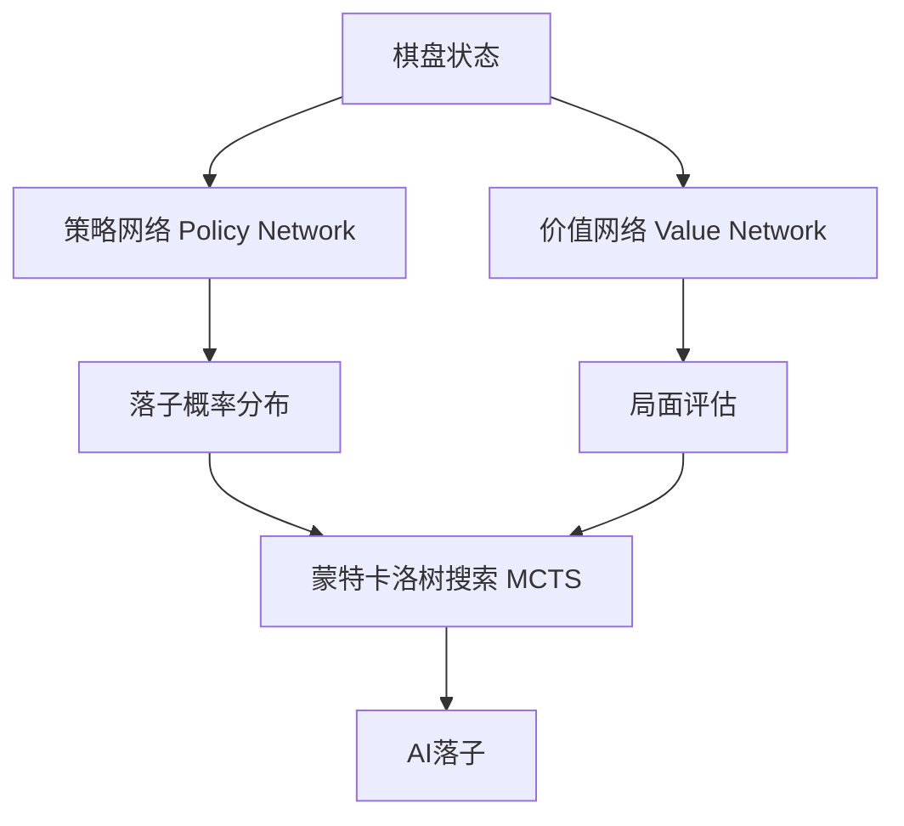

# AlphaGo原理与代码实例讲解

## 1. 背景介绍
### 1.1 人工智能与围棋
#### 1.1.1 人工智能的发展历程
#### 1.1.2 围棋的复杂性与挑战
#### 1.1.3 传统围棋AI的局限性
### 1.2 DeepMind与AlphaGo的诞生
#### 1.2.1 DeepMind公司简介
#### 1.2.2 AlphaGo项目的提出
#### 1.2.3 AlphaGo的历史性突破

## 2. 核心概念与联系
### 2.1 深度学习
#### 2.1.1 人工神经网络
#### 2.1.2 卷积神经网络(CNN)
#### 2.1.3 残差网络(ResNet)
### 2.2 强化学习  
#### 2.2.1 马尔可夫决策过程(MDP)
#### 2.2.2 Q-Learning
#### 2.2.3 策略梯度(Policy Gradient)
### 2.3 蒙特卡洛树搜索(MCTS)
#### 2.3.1 MCTS的基本原理
#### 2.3.2 选择(Selection)、扩展(Expansion)、仿真(Simulation)和回溯(Backpropagation)
#### 2.3.3 Upper Confidence Bound(UCB)算法
### 2.4 AlphaGo架构概览


## 3. 核心算法原理与具体操作步骤
### 3.1 策略网络(Policy Network)
#### 3.1.1 策略网络的作用与结构
#### 3.1.2 SL策略网络训练
#### 3.1.3 RL策略网络训练
### 3.2 价值网络(Value Network) 
#### 3.2.1 价值网络的作用与结构
#### 3.2.2 价值网络训练
### 3.3 蒙特卡洛树搜索(MCTS)
#### 3.3.1 MCTS在AlphaGo中的应用
#### 3.3.2 MCTS的并行化实现
#### 3.3.3 MCTS的优化技巧

## 4. 数学模型和公式详细讲解举例说明
### 4.1 策略网络的损失函数
$$L_{\pi}(\theta)=\sum_{s} P(s) \sum_{a} \pi^{*}(a \mid s) \log \pi(a \mid s ; \theta)$$
其中$\pi^{*}$为专家棋谱的行动概率分布，$\pi(a|s;\theta)$为策略网络输出的行动概率分布。
### 4.2 价值网络的损失函数
$$L_{v}(\theta)=\sum_{s} P(s)\left(v^{*}(s)-v(s ; \theta)\right)^{2}$$
其中$v^{*}(s)$为根据棋局结果估计的真实值，$v(s;\theta)$为价值网络的输出。
### 4.3 MCTS中的UCB公式
$$\operatorname{UCB}(s, a)=Q(s, a)+c P(s, a) \frac{\sqrt{\sum_{b} N(s, b)}}{1+N(s, a)}$$
其中$Q(s,a)$为行动价值，$P(s,a)$为先验概率，$N(s,a)$为访问次数，$c$为探索常数。

## 5. 项目实践：代码实例和详细解释说明
### 5.1 策略网络的实现
```python
class PolicyNetwork(nn.Module):
    def __init__(self, num_channels, num_actions):
        super(PolicyNetwork, self).__init__()
        self.conv = nn.Sequential(
            nn.Conv2d(num_channels, 256, kernel_size=3, stride=1, padding=1),
            nn.BatchNorm2d(256),
            nn.ReLU(),
            # ... 省略部分卷积层
        )
        self.fc = nn.Sequential(
            nn.Linear(256 * 9 * 9, 1024),
            nn.ReLU(),
            nn.Linear(1024, num_actions),
            nn.Softmax(dim=1)
        )
        
    def forward(self, x):
        x = self.conv(x)
        x = x.view(x.size(0), -1) 
        x = self.fc(x)
        return x
```
### 5.2 价值网络的实现
```python
class ValueNetwork(nn.Module):
    def __init__(self, num_channels):
        super(ValueNetwork, self).__init__()
        self.conv = nn.Sequential(
            nn.Conv2d(num_channels, 256, kernel_size=3, stride=1, padding=1),
            nn.BatchNorm2d(256),
            nn.ReLU(),
            # ... 省略部分卷积层
        )
        self.fc = nn.Sequential(
            nn.Linear(256 * 9 * 9, 1024),
            nn.ReLU(),
            nn.Linear(1024, 1),
            nn.Tanh()
        )
        
    def forward(self, x):
        x = self.conv(x)
        x = x.view(x.size(0), -1)
        x = self.fc(x)
        return x
```
### 5.3 MCTS的实现
```python
class MCTS:
    def __init__(self, policy_network, value_network, c_puct=5, num_simulations=1600):
        self.policy_network = policy_network
        self.value_network = value_network
        self.c_puct = c_puct
        self.num_simulations = num_simulations
        
    def search(self, state):
        root = Node(state)
        
        for _ in range(self.num_simulations):
            node = root
            # Selection and Expansion
            while node.is_expanded():
                action, node = node.select(self.c_puct)
            value = node.expand(self.policy_network, self.value_network)
            # Backpropagation  
            while node is not None:
                node.update(value)
                node = node.parent
                
        return root.get_action_probs(temperature=0)
```

## 6. 实际应用场景
### 6.1 AlphaGo Master/Zero的进一步改进
#### 6.1.1 只使用自我对弈数据训练
#### 6.1.2 双头神经网络结构  
#### 6.1.3 更大的神经网络与更多的计算资源
### 6.2 其他游戏领域的应用
#### 6.2.1 国际象棋
#### 6.2.2 日本将棋
#### 6.2.3 星际争霸II
### 6.3 在现实问题中的应用探索
#### 6.3.1 药物发现
#### 6.3.2 材料设计
#### 6.3.3 交通优化

## 7. 工具和资源推荐
### 7.1 AlphaGo论文与学习资源
#### 7.1.1 AlphaGo Nature论文
#### 7.1.2 AlphaGo Zero Nature论文
#### 7.1.3 DeepMind官方博客
### 7.2 深度学习框架
#### 7.2.1 TensorFlow
#### 7.2.2 PyTorch
#### 7.2.3 Keras
### 7.3 开源AlphaGo实现
#### 7.3.1 MuGo
#### 7.3.2 MiniGo
#### 7.3.3 AlphaGo.js

## 8. 总结：未来发展趋势与挑战
### 8.1 AlphaGo的局限性
#### 8.1.1 域内知识的泛化能力
#### 8.1.2 跨领域迁移学习的困难
#### 8.1.3 可解释性与可控性
### 8.2 通用人工智能的探索
#### 8.2.1 元学习与少样本学习
#### 8.2.2 多任务学习与迁移学习
#### 8.2.3 因果推理与逻辑推理
### 8.3 人机协同与AI安全
#### 8.3.1 人机混合智能系统
#### 8.3.2 AI的透明度与可解释性
#### 8.3.3 AI安全与伦理问题

## 9. 附录：常见问题与解答
### 9.1 AlphaGo与传统围棋引擎有何不同？
### 9.2 AlphaGo的训练需要多少计算资源？
### 9.3 AlphaGo能否适用于其他回合制游戏？
### 9.4 AlphaGo的思考方式是否类似人类棋手？
### 9.5 如何评价AlphaGo对人工智能发展的贡献？

作者：禅与计算机程序设计艺术 / Zen and the Art of Computer Programming