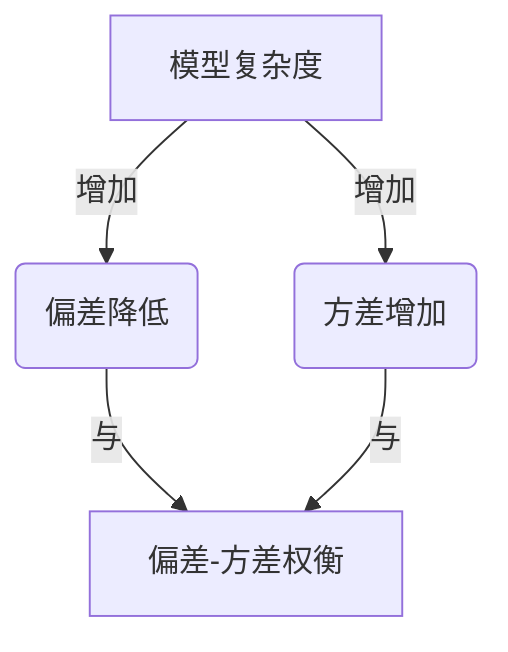
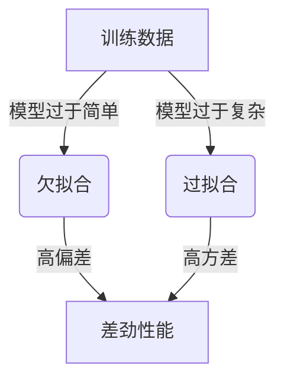

# Bias-Variance Tradeoff 原理与代码实战案例讲解

## 1. 背景介绍

在机器学习和统计学习理论中,偏差(Bias)和方差(Variance)是评估模型性能的两个关键指标。偏差描述了模型与真实数据之间的差异,而方差则描述了模型对于数据扰动的稳定性。理解偏差-方差权衡(Bias-Variance Tradeoff)对于选择合适的模型、调整模型复杂度以及防止过拟合或欠拟合至关重要。

## 2. 核心概念与联系

### 2.1 偏差(Bias)

偏差衡量了模型预测值与真实值之间的系统性差异。高偏差意味着模型过于简单,无法很好地捕捉数据中的模式,从而导致欠拟合(Underfitting)。

### 2.2 方差(Variance)

方差描述了模型对于训练数据扰动的稳定性。高方差意味着模型对训练数据的微小变化过于敏感,可能会导致过拟合(Overfitting),模型捕捉了数据中的噪声而无法很好地泛化。

### 2.3 偏差-方差权衡

偏差和方差通常是一对矛盾体,降低偏差会增加方差,反之亦然。因此,我们需要在两者之间寻找一个合适的平衡点,以获得最佳的模型性能。这种权衡被称为偏差-方差权衡(Bias-Variance Tradeoff)。



## 3. 核心算法原理具体操作步骤

### 3.1 欠拟合与过拟合

欠拟合(Underfitting)是指模型过于简单,无法捕捉数据中的重要模式,导致高偏差。过拟合(Overfitting)则是指模型过于复杂,捕捉了数据中的噪声,导致高方差。



### 3.2 评估偏差和方差

我们可以通过以下步骤来评估模型的偏差和方差:

1. 将数据集划分为训练集和测试集。
2. 在训练集上训练模型,获得训练误差(Training Error)。
3. 在测试集上评估模型,获得测试误差(Test Error)。
4. 偏差可以通过测试误差与训练误差之差来近似估计。
5. 方差可以通过在不同的训练集上训练多个模型,观察测试误差的变化来估计。

### 3.3 调整模型复杂度

为了实现偏差-方差权衡,我们可以调整模型的复杂度。增加模型复杂度(如增加特征数量或模型参数)可以降低偏差,但同时也会增加方差。相反,减小模型复杂度可以降低方差,但会增加偏差。


### 3.4 正则化

正则化是一种常用的技术,可以通过在模型的损失函数中添加惩罚项来控制模型复杂度,从而实现偏差-方差权衡。常见的正则化方法包括L1正则化(Lasso回归)和L2正则化(Ridge回归)。

### 3.5 交叉验证

交叉验证(Cross-Validation)是一种评估模型性能的技术,可以帮助我们选择合适的模型复杂度,从而实现偏差-方差权衡。常见的交叉验证方法包括k-折交叉验证和留一交叉验证。

## 4. 数学模型和公式详细讲解举例说明

### 4.1 均方误差(Mean Squared Error, MSE)

均方误差是一种常用的评估模型性能的指标,它可以分解为偏差和方差两个部分:

$$\text{MSE}(X) = \text{Bias}(X)^2 + \text{Variance}(X) + \text{Irreducible Error}$$

其中:

- $\text{MSE}(X)$ 是模型在数据 $X$ 上的均方误差。
- $\text{Bias}(X)$ 是模型在数据 $X$ 上的偏差。
- $\text{Variance}(X)$ 是模型在数据 $X$ 上的方差。
- $\text{Irreducible Error}$ 是数据本身的噪声,无法通过模型消除。

### 4.2 偏差-方差分解

我们可以将均方误差分解为偏差、方差和不可约误差三个部分,从而更好地理解模型的性能:

$$\begin{align}
\text{MSE}(X) &= \mathbb{E}_{X,Y}\left[ (f(X) - Y)^2 \right] \\
             &= \mathbb{E}_{X}\left[ \left( \mathbb{E}_{Y|X}[f(X)] - \mathbb{E}_{Y|X}[Y] \right)^2 \right] + \mathbb{E}_{X}\left[ \mathbb{E}_{Y|X}\left[ (f(X) - \mathbb{E}_{Y|X}[f(X)])^2 \right] \right] + \mathbb{E}_{X}\left[ \mathbb{E}_{Y|X}\left[ (Y - \mathbb{E}_{Y|X}[Y])^2 \right] \right] \\
             &= \text{Bias}(X)^2 + \text{Variance}(X) + \text{Irreducible Error}
\end{align}$$

其中:

- $f(X)$ 是模型的预测值。
- $Y$ 是真实值。
- $\mathbb{E}_{X}[\cdot]$ 表示对 $X$ 取期望。
- $\mathbb{E}_{Y|X}[\cdot]$ 表示对 $Y$ 给定 $X$ 取条件期望。

### 4.3 正则化的数学模型

正则化是一种控制模型复杂度的有效方法,它通过在损失函数中添加惩罚项来实现。以线性回归为例,带有L2正则化的损失函数可以表示为:

$$J(\theta) = \frac{1}{2m} \sum_{i=1}^m (h_\theta(x^{(i)}) - y^{(i)})^2 + \frac{\lambda}{2m} \sum_{j=1}^n \theta_j^2$$

其中:

- $J(\theta)$ 是带有正则化项的损失函数。
- $m$ 是训练样本的数量。
- $h_\theta(x^{(i)})$ 是模型对于第 $i$ 个样本的预测值。
- $y^{(i)}$ 是第 $i$ 个样本的真实值。
- $\lambda$ 是正则化参数,用于控制正则化项的权重。
- $\theta_j$ 是模型参数向量中的第 $j$ 个参数。

通过调整正则化参数 $\lambda$,我们可以控制模型的复杂度,从而实现偏差-方差权衡。

## 5. 项目实践: 代码实例和详细解释说明

以下是一个使用Python和scikit-learn库实现线性回归模型,并探究偏差-方差权衡的示例代码:

```python
import numpy as np
import matplotlib.pyplot as plt
from sklearn.linear_model import LinearRegression
from sklearn.model_selection import train_test_split
from sklearn.metrics import mean_squared_error

# 生成示例数据
np.random.seed(42)
X = np.random.rand(100, 1)
y = 2 * X + np.random.randn(100, 1)

# 划分训练集和测试集
X_train, X_test, y_train, y_test = train_test_split(X, y, test_size=0.2, random_state=42)

# 创建线性回归模型
model = LinearRegression()

# 训练模型
model.fit(X_train, y_train)

# 评估模型在训练集和测试集上的性能
y_train_pred = model.predict(X_train)
y_test_pred = model.predict(X_test)

train_mse = mean_squared_error(y_train, y_train_pred)
test_mse = mean_squared_error(y_test, y_test_pred)

print(f"训练集均方误差 (MSE): {train_mse:.3f}")
print(f"测试集均方误差 (MSE): {test_mse:.3f}")

# 可视化结果
plt.scatter(X_train, y_train, label="训练数据")
plt.scatter(X_test, y_test, label="测试数据")
plt.plot(X_train, y_train_pred, 'r-', label="训练集预测")
plt.plot(X_test, y_test_pred, 'g-', label="测试集预测")
plt.legend()
plt.show()
```

在这个示例中,我们首先生成了一个简单的线性数据集。然后,我们将数据集划分为训练集和测试集。接着,我们创建了一个线性回归模型,并在训练集上进行训练。

为了评估模型的性能,我们计算了训练集和测试集上的均方误差(MSE)。均方误差可以分解为偏差和方差两个部分,因此它可以反映模型的偏差-方差权衡情况。

最后,我们使用matplotlib库可视化了模型在训练集和测试集上的预测结果。

通过调整模型的复杂度(如增加或减少特征数量)或使用正则化技术,我们可以观察模型在训练集和测试集上的表现变化,从而探究偏差-方差权衡。

## 6. 实际应用场景

偏差-方差权衡在各种机器学习任务中都有广泛的应用,例如:

1. **回归问题**: 在回归任务中,我们需要找到一个能够很好地拟合训练数据并且具有良好泛化能力的模型。过于简单的模型可能会导致高偏差,而过于复杂的模型可能会导致高方差。

2. **分类问题**: 在分类任务中,我们也需要权衡模型的复杂度。例如,在决策树算法中,过度剪枝可能会导致欠拟合,而过度生长可能会导致过拟合。

3. **神经网络**: 在训练神经网络时,我们需要注意网络的深度和宽度。过浅或过窄的网络可能无法捕捉数据中的复杂模式,而过深或过宽的网络则可能会过拟合。

4. **集成学习**: 在集成学习中,我们通常会组合多个弱学习器来构建一个强大的模型。但是,如果弱学习器过于复杂,整个集成模型可能会过拟合。

5. **特征工程**: 在特征工程过程中,我们需要选择合适的特征数量和特征表示方式。过多的特征可能会导致过拟合,而过少的特征可能会导致欠拟合。

通过理解偏差-方差权衡,我们可以更好地调整模型的复杂度,从而获得更好的性能。

## 7. 工具和资源推荐

以下是一些有助于理解和应用偏差-方差权衡的工具和资源:

1. **scikit-learn**: Python中流行的机器学习库,提供了各种模型和评估指标,可以用于探究偏差-方差权衡。

2. **TensorFlow** 和 **PyTorch**: 两个流行的深度学习框架,可以用于训练和调试神经网络模型,探究偏差-方差权衡在深度学习中的应用。

3. **XGBoost** 和 **LightGBM**: 两个高效的梯度提升树库,可以用于构建集成模型,并通过调整参数来控制模型复杂度。

4. **MLxtend**: 一个提供了各种机器学习实用程序的Python库,包括用于评估偏差-方差权衡的函数。

5. **"An Introduction to Statistical Learning"**: 一本经典的机器学习教材,详细介绍了偏差-方差权衡的理论基础。

6. **"Pattern Recognition and Machine Learning"**: 另一本经典的机器学习教材,也包含了对偏差-方差权衡的深入讨论。

7. **在线课程**: 像Coursera、edX和Udacity等平台上提供了许多优质的机器学习在线课程,可以帮助您更好地理解偏差-方差权衡。

8. **博客** 和 **论坛**: 像Towards Data Science、KDnuggets和Stack Overflow等网站上有许多关于偏差-方差权衡的博客文章和讨论,可以提