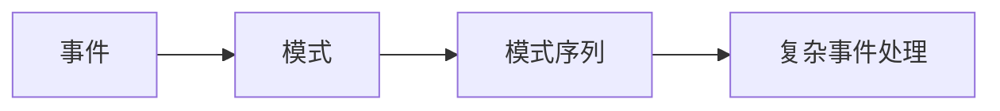

## 1.背景介绍

随着大数据技术的飞速发展，实时数据流处理已经成为了许多企业和组织的关键需求。Apache Flink是一种大规模数据处理引擎，它提供了批处理和流处理的统一架构。Flink的CEP（Complex Event Processing，复杂事件处理）库提供了一种对无界和有界数据流进行模式检测和选择的方式，使得用户能够在数据流上表达复杂的模式序列。本文将对FlinkCEP模式API进行详细解读，帮助读者灵活构建复杂事件规则。

## 2.核心概念与联系

在深入了解FlinkCEP模式API之前，我们首先需要理解以下几个核心概念：

- **事件（Event）**：事件是CEP处理的基本单位，每个事件都有其特定的属性和时间戳。

- **模式（Pattern）**：模式是一系列事件的描述，这些事件需要满足特定的条件和顺序。

- **模式序列（Pattern Sequence）**：模式序列是由一系列模式构成的，表示一种复杂事件的模式。

- **复杂事件处理（CEP）**：CEP是一种处理模式，它寻找数据（事件流）中满足某些特定模式的数据。

这些概念之间的关系可以通过以下Mermaid流程图进行展示：



## 3.核心算法原理具体操作步骤

在FlinkCEP中，模式检测是通过NFA（非确定性有限自动机）实现的。下面将详细介绍FlinkCEP模式API的核心算法原理和具体操作步骤。

### 3.1 创建模式

首先，我们需要创建一个模式。在FlinkCEP中，我们可以使用`Pattern`类的`begin`方法来创建一个模式。例如，我们可以创建一个模式来匹配一个事件属性值大于5的事件。

```java
Pattern<Event, ?> pattern = Pattern.<Event>begin("start").where(new SimpleCondition<Event>() {
    @Override
    public boolean filter(Event value) throws Exception {
        return value.getValue() > 5;
    }
});
```

### 3.2 定义复杂模式

在定义模式时，我们可以使用各种方法来定义复杂的模式。例如，我们可以使用`next`方法来定义一个紧跟在前一个事件之后的事件，使用`followedBy`方法来定义一个跟在前一个事件之后的事件（但不一定是紧跟在后面的），使用`within`方法来定义模式的时间约束。

```java
Pattern<Event, ?> pattern = Pattern.<Event>begin("start").where(new SimpleCondition<Event>() {
    @Override
    public boolean filter(Event value) throws Exception {
        return value.getValue() > 5;
    }
}).next("middle").where(new SimpleCondition<Event>() {
    @Override
    public boolean filter(Event value) throws Exception {
        return value.getValue() < 10;
    }
}).followedBy("end").where(new SimpleCondition<Event>() {
    @Override
    public boolean filter(Event value) throws Exception {
        return value.getValue() == 10;
    }
}).within(Time.seconds(10));
```

### 3.3 应用模式

创建和定义好模式之后，我们可以将模式应用到数据流中，进行模式检测。我们可以使用`CEP.pattern`方法将模式应用到数据流中，然后使用`select`或`flatSelect`方法来选择匹配的事件。

```java
DataStream<Event> input = ...;
PatternStream<Event> patternStream = CEP.pattern(input, pattern);
DataStream<Alert> result = patternStream.select(new PatternSelectFunction<Event, Alert>() {
    @Override
    public Alert select(Map<String, List<Event>> pattern) throws Exception {
        return new Alert("CEP Alert", pattern.get("end").get(0));
    }
});
```

## 4.数学模型和公式详细讲解举例说明

在FlinkCEP中，模式检测的核心是NFA（非确定性有限自动机）。NFA是一种可以用来表示模式的数学模型。在NFA中，每一个状态表示一个模式，每一个转移表示一个事件。当一个事件发生时，NFA会从当前状态通过转移进入下一个状态。如果NFA可以从初始状态通过一系列转移进入接受状态，那么我们就说这个NFA接受了这个事件序列，即这个事件序列匹配了这个模式。

NFA的形式化定义如下：

- $Q$是一个有限的非空状态集合
- $\Sigma$是一个有限的非空输入字母表
- $\delta: Q \times \Sigma \to 2^Q$是转移函数
- $q_0 \in Q$是初始状态
- $F \subseteq Q$是接受状态集

在FlinkCEP中，我们可以使用`Pattern`类来定义一个NFA，每一个`Pattern`对象表示NFA的一个状态，每一个`where`、`next`、`followedBy`等方法调用表示NFA的一个转移。

## 5.项目实践：代码实例和详细解释说明

下面我们通过一个具体的例子来说明如何使用FlinkCEP模式API。在这个例子中，我们将处理一个用户登录事件的数据流，当一个用户在10秒内连续三次登录失败时，我们将生成一个警告。

首先，我们定义了一个`LoginEvent`类来表示用户登录事件，这个类有两个属性：`userId`和`status`。

```java
public class LoginEvent {
    private String userId;
    private String status;

    // getters and setters
}
```

然后，我们创建一个模式来匹配连续三次登录失败的事件。

```java
Pattern<LoginEvent, ?> loginFailPattern = Pattern.<LoginEvent>begin("firstFail").where(new SimpleCondition<LoginEvent>() {
    @Override
    public boolean filter(LoginEvent value) throws Exception {
        return "fail".equals(value.getStatus());
    }
}).next("secondFail").where(new SimpleCondition<LoginEvent>() {
    @Override
    public boolean filter(LoginEvent value) throws Exception {
        return "fail".equals(value.getStatus());
    }
}).next("thirdFail").where(new SimpleCondition<LoginEvent>() {
    @Override
    public boolean filter(LoginEvent value) throws Exception {
        return "fail".equals(value.getStatus());
    }
}).within(Time.seconds(10));
```

接着，我们将模式应用到用户登录事件的数据流中，进行模式检测，并选择匹配的事件。

```java
DataStream<LoginEvent> loginEventStream = ...;
PatternStream<LoginEvent> patternStream = CEP.pattern(loginEventStream.keyBy(LoginEvent::getUserId), loginFailPattern);
DataStream<Alert> result = patternStream.select(new PatternSelectFunction<LoginEvent, Alert>() {
    @Override
    public Alert select(Map<String, List<LoginEvent>> pattern) throws Exception {
        LoginEvent firstFail = pattern.get("firstFail").get(0);
        LoginEvent secondFail = pattern.get("secondFail").get(0);
        LoginEvent thirdFail = pattern.get("thirdFail").get(0);
        return new Alert("Three consecutive login failures", firstFail.getUserId());
    }
});
```

最后，我们可以将生成的警告输出或者存储起来。

```java
result.print();
```

## 6.实际应用场景

FlinkCEP模式API可以广泛应用于各种实际场景，包括但不限于：

- **欺诈检测**：在金融领域，我们可以使用FlinkCEP来检测可能的欺诈行为。例如，如果一个用户在短时间内在不同的地点进行了多次交易，那么这可能是一个欺诈行为。

- **系统监控**：在系统监控中，我们可以使用FlinkCEP来检测系统的异常行为。例如，如果一个服务在短时间内连续多次失败，那么这可能表示系统出现了问题。

- **用户行为分析**：在用户行为分析中，我们可以使用FlinkCEP来分析用户的行为模式。例如，我们可以检测用户的购物行为，以提供更个性化的服务。

## 7.工具和资源推荐

如果你想深入学习FlinkCEP和模式检测，以下是一些有用的工具和资源：

- **Apache Flink官方文档**：Apache Flink的官方文档是学习Flink和FlinkCEP的最好资源。你可以在这里找到详细的API文档和教程。

- **Flink Forward视频**：Flink Forward是一个专门的Flink会议，你可以在这里找到许多关于Flink和FlinkCEP的演讲视频。

- **Flink邮件列表和社区**：Flink有一个活跃的社区，你可以在邮件列表或者社区中提问和讨论。

## 8.总结：未来发展趋势与挑战

随着实时数据流处理的需求日益增长，FlinkCEP和模式检测的重要性也将越来越高。然而，FlinkCEP也面临着一些挑战，例如如何处理大规模的模式和事件，如何提高模式检测的效率，如何支持更复杂的模式等。未来，我们期待FlinkCEP能够提供更强大和灵活的模式检测能力，以满足各种复杂的实时数据流处理需求。

## 9.附录：常见问题与解答

1. **FlinkCEP支持哪些模式操作？**

   FlinkCEP支持各种模式操作，包括`begin`、`next`、`followedBy`、`where`、`or`、`times`、`within`等。

2. **如何处理没有按照模式顺序到达的事件？**

   FlinkCEP支持处理乱序事件。在定义模式时，可以使用`followedBy`而不是`next`来定义一个跟在前一个事件之后的事件（但不一定是紧跟在后面的）。

3. **如何设置模式的时间约束？**

   在定义模式时，可以使用`within`方法来设置模式的时间约束。

4. **如何处理大规模的模式和事件？**

   FlinkCEP使用NFA（非确定性有限自动机）来处理模式和事件。通过将NFA分布在多个并行任务中，FlinkCEP可以处理大规模的模式和事件。

作者：禅与计算机程序设计艺术 / Zen and the Art of Computer Programming