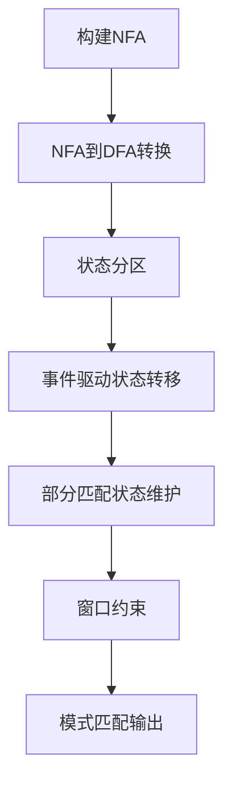
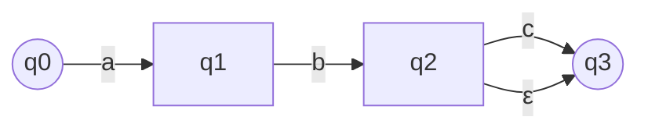
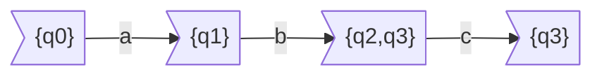

# FlinkCEP社区资源指南：学习与交流平台

## 1.背景介绍

Apache Flink是一个开源的分布式大数据处理引擎,支持有状态计算和准确一次的流处理语义。Flink提供了强大的流处理能力,其中Flink CEP(复杂事件处理)是一个非常重要的特性,允许从无边界的事件流中发现有趣的事件模式。

CEP在许多领域都有广泛应用,例如:

- 金融服务:检测欺诈行为、交易模式等
- 物联网:监控传感器数据,检测异常情况
- 业务流程监控:跟踪业务活动,检测违规操作
- 网络安全:检测入侵和攻击模式
- 用户行为分析:分析用户行为模式,改善用户体验

随着实时数据处理需求的不断增长,Flink CEP也受到了越来越多关注。但是,由于CEP涉及的概念较为复杂,对于初学者来说掌握起来并不容易。因此,本文将介绍Flink CEP的核心概念、原理和实践,并整理一些有价值的社区资源,为读者提供学习和交流的平台。

## 2.核心概念与联系

在深入探讨Flink CEP之前,我们需要先了解一些核心概念:

### 2.1 事件(Event)

事件是CEP处理的基本单元,可以是任何重要的发生情况,如交易记录、传感器读数、日志条目等。事件通常包含时间戳和有效载荷数据。

### 2.2 模式(Pattern)

模式定义了我们想要在事件流中查找的条件,由一个或多个模式原语组成。Flink CEP支持多种模式原语,如:

- 严格连续(严格近邻)
- 非严格连续(宽松近邻)
- 次数约束

### 2.3 模式序列(Pattern Sequence)

模式序列是模式原语的有序组合,用于描述复杂事件。例如,我们可以定义一个模式序列来检测"先登录,然后下单,最后支付"的流程。

### 2.4 部分匹配(Partial Match)

部分匹配指的是事件流中满足模式序列的部分条件,但未完全匹配整个序列的情况。Flink CEP允许保留部分匹配,以便将来可以与新的事件匹配并生成完整匹配。

### 2.5 窗口(Window)

窗口用于设置模式匹配的时间范围和其他约束条件。Flink CEP支持不同类型的窗口,如时间窗口、计数窗口等。

上述概念相互关联,共同构建了Flink CEP的处理逻辑。事件流作为输入,经过模式匹配和窗口约束,产生部分匹配或完整匹配的复杂事件输出。

## 3.核心算法原理具体操作步骤  

Flink CEP的核心算法原理基于有限状态自动机(Deterministic Finite Automaton,DFA)。DFA是一种计算模型,可以高效地在输入序列中识别模式。

Flink CEP将模式序列转换为DFA,然后使用DFA在事件流上执行模式匹配。以下是具体的操作步骤:

1. **构建NFA(Non-Deterministic Finite Automaton)**: 首先,Flink将模式序列转换为NFA。NFA是一种更通用的有限状态自动机,可以有多个可能的转移路径。

2. **NFA到DFA的转换**: 然后,Flink使用子集构造算法将NFA转换为DFA。这一步是为了获得确定性,即对于每个输入和当前状态,DFA只有一个可能的转移路径。

3. **状态分区**: 为了提高性能,Flink对DFA的状态进行分区,将具有相同未来的状态组合在一起。这样可以减少内存使用,并允许并行处理事件。

4. **事件驱动的状态转移**: 当新事件到达时,Flink使用事件的属性在DFA上执行状态转移。如果到达接受状态,则产生模式匹配。

5. **部分匹配的状态维护**: 对于部分匹配,Flink会维护当前的状态,以便将来可以与新事件进行匹配。

6. **窗口约束**: 窗口用于限制模式匹配的时间范围和其他条件,如事件个数上限等。

该算法的优点是高效和可扩展。通过将模式编译为DFA,Flink可以在事件流上执行高速匹配。而状态分区和并行处理则提高了吞吐量。



## 4.数学模型和公式详细讲解举例说明

在上述算法中,NFA到DFA的转换是一个关键步骤,它使用了子集构造算法。该算法的数学模型可以用下面的公式表示:

$$
\begin{align*}
\delta'(T, a) &= \bigcup_{s \in T} \delta(s, a) \\
T_0' &= \{\epsilon\} \\
F' &= \{T \in \mathcal{P}(Q) \mid T \cap F \neq \emptyset\}
\end{align*}
$$

其中:

- $\delta'$ 是DFA的转移函数
- $T$ 是DFA的当前状态集合
- $a$ 是输入符号
- $\delta(s, a)$ 是NFA在状态 $s$ 上读入符号 $a$ 后的下一状态集合
- $T_0'$ 是DFA的初始状态集合,包含NFA的初始状态和 $\epsilon$ 闭包
- $F'$ 是DFA的接受状态集合,包含任何一个NFA接受状态的集合
- $\mathcal{P}(Q)$ 表示 $Q$ 的幂集

以一个简单的模式序列 $a\,b\,c?$ 为例,它匹配事件序列 $a,b$ 或 $a,b,c$。对应的NFA如下:



使用子集构造算法得到的DFA为:



可以看到,DFA的每个状态都是NFA状态的集合。当读入符号 $a$ 时,DFA转移到包含NFA读入 $a$ 后所有可能状态的集合。这样,DFA就能确定地模拟NFA的所有执行路径。

子集构造算法保证了从NFA到DFA的转换是确定性和等价的。这使得Flink CEP能够高效地在事件流上执行模式匹配。

## 5.项目实践:代码实例和详细解释说明

下面是一个使用Flink CEP进行模式匹配的代码示例,我们将检测"先登录,然后下单,最后支付"的流程:

```scala
import org.apache.flink.cep.PatternStream
import org.apache.flink.cep.pattern.Pattern
import org.apache.flink.cep.pattern.conditions.SimpleCondition

// 定义事件类
case class LoginEvent(userId: String, timestamp: Long) extends SensorReading
case class OrderEvent(userId: String, orderId: String, timestamp: Long) extends SensorReading  
case class PaymentEvent(userId: String, orderId: String, timestamp: Long) extends SensorReading

object CEPExample {
  def main(args: Array[String]): Unit = {
    val env = StreamExecutionEnvironment.getExecutionEnvironment
    env.setStreamTimeCharacteristic(TimeCharacteristic.EventTime)

    val inputStream = env.addSource(new SensorSource)

    // 定义模式序列
    val loginPattern = Pattern.begin[SensorReading]("begin").where(_.isInstanceOf[LoginEvent])
    val orderPattern = Pattern.next('order').where(_.isInstanceOf[OrderEvent])
    val paymentPattern = Pattern.next('payment').where(_.isInstanceOf[PaymentEvent])

    val completePattern = Pattern.begin(loginPattern).next(orderPattern).followedBy(paymentPattern)

    // 应用模式匹配
    val patternStream: PatternStream[SensorReading] = CEP.pattern(inputStream.keyBy(_.userId), completePattern)

    val result = patternStream.select((pattern: Map[String, Iterable[SensorReading]]) => {
      val login = pattern.get("begin").get.next()
      val order = pattern.get("order").get.next()
      val payment = pattern.get("payment").get.next()
      
      (login.asInstanceOf[LoginEvent], order.asInstanceOf[OrderEvent], payment.asInstanceOf[PaymentEvent])
    })

    result.print()

    env.execute("CEP Example")
  }
}
```

代码解释:

1. 首先定义了三种事件类型:`LoginEvent`、`OrderEvent`和`PaymentEvent`。

2. 在`main`函数中,创建了一个`StreamExecutionEnvironment`并设置事件时间语义。

3. 使用`addSource`方法添加了一个事件源,这里使用了一个模拟的`SensorSource`。

4. 定义了模式序列,使用`Pattern`API构建了三个模式:`loginPattern`、`orderPattern`和`paymentPattern`。

5. 使用`Pattern.begin`和`next`/`followedBy`将三个模式组合成一个完整的模式序列`completePattern`。

6. 调用`CEP.pattern`方法,将输入流与模式序列相关联,生成一个`PatternStream`。

7. 在`PatternStream`上调用`select`方法,提取匹配的事件并进行处理。这里将匹配的事件元组输出。

8. 最后,启动Flink作业执行。

该示例展示了如何使用Flink CEP的Pattern API定义模式序列,并将其应用于事件流进行模式匹配。通过条件过滤和组合,我们可以构建复杂的模式来检测各种情况。

`select`函数允许我们访问匹配的事件,并对它们执行所需的操作,如过滤、转换或输出。Flink CEP的模式匹配是一个强大而灵活的工具,可以广泛应用于各种场景。

## 6.实际应用场景

Flink CEP在多个领域都有广泛的应用,下面列举了一些典型场景:

### 6.1 金融服务

- **欺诈检测**: 监控交易活动,识别可疑的交易模式,如连续多次小额转账、同一账户短时间内多次大额转账等,有助于发现潜在的欺诈行为。

- **交易监控**: 跟踪交易流程,确保每个步骤按正确顺序执行,如先下单、再支付、最后出货等。任何违反预期流程的情况都可能意味着异常或风险。

- **算法交易**: 在高频交易中,CEP可用于识别特定的价格模式,并触发自动化交易策略。

### 6.2 物联网

- **设备监控**: 分析来自各种传感器的数据流,检测异常读数模式,如温度持续超标、电流骤升等,从而预防设备故障。

- **预测性维护**: 基于历史数据,CEP可以学习设备故障的前兆模式,并在故障发生前发出预警,从而实现预测性维护。

### 6.3 业务流程监控

- **合规审计**: 监控业务活动事件流,检查是否符合法规或内部政策,如审批流程、数据访问等。

- **服务级别协议(SLA)监控**: 跟踪关键业务指标,如响应时间、吞吐量等,当违反SLA约定时发出警报。

### 6.4 网络安全

- **入侵检测**: 分析网络流量和系统日志,识别已知的攻击模式,如端口扫描、暴力破解等。

- **垃圾邮件过滤**: 根据发件模式、邮件内容等特征,过滤垃圾邮件。

### 6.5 用户行为分析

- **用户路径分析**: 跟踪用户在网站/应用中的行为路径,发现常见的导航模式,优化用户体验。

- **个性化推荐**: 基于用户的浏览和购买模式,为其推荐感兴趣的内容或产品。

总的来说,任何需要从数据流中提取有意义的情况模式的场景,都可以考虑使用Flink CEP。它为实时数据处理增加了复杂分析能力,是构建智能应用程序的重要工具。

## 7.工具和资源推荐

学习Flink CEP过程中,以下工具和资源或许能给你一些帮助:

### 7.1