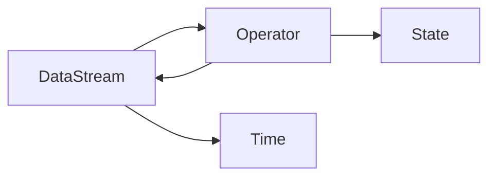

# Flink架构与核心组件解析

## 1. 背景介绍
### 1.1 大数据流处理的重要性
在当今大数据时代,海量数据以流的形式不断产生,实时处理和分析这些数据流对于企业决策、用户体验优化等方面至关重要。传统的批处理框架如Hadoop MapReduce已经无法满足实时性要求,因此流处理框架应运而生。
### 1.2 Flink的崛起 
Apache Flink是一个开源的分布式流处理和批处理框架,其以优秀的性能、灵活的窗口机制、强大的状态管理等特性脱颖而出,成为流处理领域的佼佼者。越来越多的企业开始选择Flink作为其大数据实时计算的基础设施。

## 2. 核心概念与联系
### 2.1 Flink的核心概念
#### 2.1.1 DataStream
DataStream是Flink中核心的数据结构,代表一个无界的、持续生成的数据流。我们可以在DataStream上应用各种转换操作,如map、filter、reduce等。
#### 2.1.2 Operator
Operator表示对DataStream进行的一次转换操作,将一个或多个DataStream转换为新的DataStream。常见的Operator包括map、flatMap、filter、keyBy、reduce、window等。
#### 2.1.3 State
Flink支持有状态的计算,即Operator可以访问并修改每个key的状态值。这使得我们能够实现更加复杂的计算逻辑,如去重、 Session窗口、基于历史数据的统计等。
#### 2.1.4 Time
Flink支持三种时间概念:Processing Time、Event Time和Ingestion Time。Processing Time是指执行操作算子的机器的系统时间,Event Time是数据产生的时间,Ingestion Time是数据进入Flink的时间。
### 2.2 核心概念之间的关系


## 3. 核心算法原理具体操作步骤
### 3.1 窗口机制
#### 3.1.1 滚动窗口(Tumbling Window) 
将数据流按照固定的窗口长度分割成不重叠的窗口。例如,每5秒钟统计一次过去5秒内的数据。
```java
dataStream.keyBy(<key selector>)
  .window(TumblingProcessingTimeWindows.of(Time.seconds(5)))
  .<windowed transformation>(<window function>);
```
#### 3.1.2 滑动窗口(Sliding Window)
滑动窗口有固定的窗口长度和滑动间隔,窗口可以重叠。例如,每2秒钟统计过去5秒内的数据。
```java
dataStream.keyBy(<key selector>)
  .window(SlidingProcessingTimeWindows.of(Time.seconds(5), Time.seconds(2)))
  .<windowed transformation>(<window function>);
```
#### 3.1.3 会话窗口(Session Window) 
将某段时间内活跃度较高的数据组合到一个窗口中,窗口的界限由不活跃的间隔定义。
```java
dataStream.keyBy(<key selector>)
  .window(EventTimeSessionWindows.withGap(Time.seconds(5)))
  .<windowed transformation>(<window function>);
```

### 3.2 状态管理
#### 3.2.1 Keyed State
Keyed State与特定的key绑定,只能用于KeyedStream。常见的Keyed State有ValueState、ListState、MapState等。
```java
public class CountWindowAverage extends RichFlatMapFunction<Tuple2<Long, Long>, Tuple2<Long, Long>> {
    private transient ValueState<Tuple2<Long, Long>> sum;

    @Override
    public void flatMap(Tuple2<Long, Long> input, Collector<Tuple2<Long, Long>> out) throws Exception {
        Tuple2<Long, Long> currentSum = sum.value();
        currentSum.f0 += 1;
        currentSum.f1 += input.f1;
        sum.update(currentSum);

        if (currentSum.f0 >= 3) {
            out.collect(new Tuple2<>(input.f0, currentSum.f1 / currentSum.f0));
            sum.clear();
        }
    }
}
```
#### 3.2.2 Operator State
Operator State与特定的算子任务实例绑定,整个任务的生命周期内可访问,常用于Source或Sink等Operator中。
```java
public class BufferingSink implements SinkFunction<Tuple2<String, Integer>>,
    CheckpointedFunction {

    private final int threshold;
    private transient ListState<Tuple2<String, Integer>> checkpointedState;
    private List<Tuple2<String, Integer>> bufferedElements;

    @Override
    public void invoke(Tuple2<String, Integer> value) throws Exception {
        bufferedElements.add(value);
        if (bufferedElements.size() == threshold) {
            for (Tuple2<String, Integer> element: bufferedElements) {
                // send it to the sink
            }
            bufferedElements.clear();
        }
    }
}
```

## 4. 数学模型和公式详细讲解举例说明
### 4.1 反压(Backpressure)模型
Flink通过反压机制来控制数据流的速度,以适应下游算子的处理能力。当下游算子处理速度慢于上游时,上游算子会收到反压信号而降低发送数据的速度。

反压计算公式:
$backpressure = \frac{下游算子当前待处理数据量}{下游算子缓冲区大小}$

当$backpressure$超过一定阈值(如0.8)时,上游算子就会减缓发送数据的速度。

### 4.2 基于Chandy-Lamport分布式快照算法的Checkpoint
Flink基于Chandy-Lamport分布式快照算法实现了Checkpoint机制,用于保证 exactly-once语义。

Chandy-Lamport算法步骤:
1. 任意一个节点触发Checkpoint,向所有节点发送Marker。
2. 节点收到Marker后,停止处理输入,将当前状态保存为快照,并将Marker继续向下游传递。
3. 下游节点收到所有上游的Marker后,保存快照。
4. 快照完成后,将快照保存到持久化存储,通知Checkpoint完成。

## 5. 项目实践：代码实例和详细解释说明
下面是一个使用Flink进行单词计数的示例代码:
```java
public class WordCount {
    public static void main(String[] args) throws Exception {
        StreamExecutionEnvironment env = StreamExecutionEnvironment.getExecutionEnvironment();
        
        // 从socket读取文本数据
        DataStream<String> text = env.socketTextStream("localhost", 9999);
        
        // 将文本按空格分割为单词,并计算每个单词出现的次数
        DataStream<Tuple2<String, Integer>> counts = text
            .flatMap(new Tokenizer())
            .keyBy(0)
            .sum(1);
        
        counts.print();
        
        env.execute("WordCount");
    }
    
    public static class Tokenizer implements FlatMapFunction<String, Tuple2<String, Integer>> {
        @Override
        public void flatMap(String value, Collector<Tuple2<String, Integer>> out) {
            String[] tokens = value.toLowerCase().split("\\W+");
            for (String token : tokens) {
                if (token.length() > 0) {
                    out.collect(new Tuple2<>(token, 1));
                }
            }
        }
    }
}
```
代码解释:
1. 创建StreamExecutionEnvironment,是Flink程序的入口。
2. 通过socketTextStream从socket读取文本数据。
3. 使用flatMap算子将文本按空格切分为单词,并转换为(word, 1)的形式。
4. 使用keyBy算子按照单词进行分组。
5. 使用sum算子对每个单词的计数进行累加。
6. 使用print算子将结果打印到控制台。
7. 调用execute方法触发程序执行。

## 6. 实际应用场景
Flink广泛应用于各个行业的实时数据处理场景,如:
- 电商:实时计算PV、UV,实时统计订单数据,实时个性化推荐等。
- 物联网:实时处理传感器数据,实时监控设备状态,预测设备故障等。
- 金融:实时计算交易数据,实时风控,实时欺诈检测等。
- 物流:实时计算运输数据,实时调度,实时预测到货时间等。

## 7. 工具和资源推荐
- Flink官方文档:https://ci.apache.org/projects/flink/flink-docs-stable/
- Flink中文社区:https://flink-china.org/
- Ververica Platform:基于Flink构建的企业级流处理平台 https://www.ververica.com/platform
- 《Stream Processing with Apache Flink》:Flink权威指南
- Flink Forward大会:Flink领域内最大的会议,分享最新的应用实践和未来发展方向

## 8. 总结：未来发展趋势与挑战
### 8.1 发展趋势
- 流批一体:Flink将继续打破流处理和批处理的界限,提供更加统一的API和引擎。
- AI融合:Flink将与机器学习平台深度整合,支持实时训练和推理。
- SQL化:Flink将进一步增强SQL支持,提高系统的易用性。
- 云原生:Flink将更好地适配Kubernetes等云原生环境,提供更灵活的部署和运维方式。
### 8.2 挑战
- 大状态管理:如何高效管理TB级别的状态仍然是一个挑战。
- 高性能:如何进一步提高Flink的吞吐量和延迟,尤其是在大规模集群环境下。
- 易用性:如何简化Flink的使用,让更多的用户能够快速上手。

## 9. 附录：常见问题与解答
### 9.1 Flink与Spark Streaming的区别是什么?
Flink是一个纯流式计算引擎,直接支持无界数据流,提供了更低的延迟和更好的性能;而Spark Streaming是一个微批处理引擎,将数据流切分为一个个batch进行处理。此外,Flink支持更灵活的窗口机制和更强大的状态管理。
### 9.2 Flink支持exactly-once语义吗?
支持。Flink基于Chandy-Lamport分布式快照算法实现了一致性检查点(Checkpoint),能够保证exactly-once语义。即使在故障恢复后,数据处理结果也是准确无误的。
### 9.3 Flink的背压机制是如何工作的?
当下游算子处理速度慢于上游时,上游算子会收到反压信号。Flink通过异步IO和基于credit的流控机制来实现背压,动态调整数据处理速率。当反压持续一段时间后,Flink还会触发负载均衡,将压力较大的算子任务迁移到空闲的资源上。

作者：禅与计算机程序设计艺术 / Zen and the Art of Computer Programming