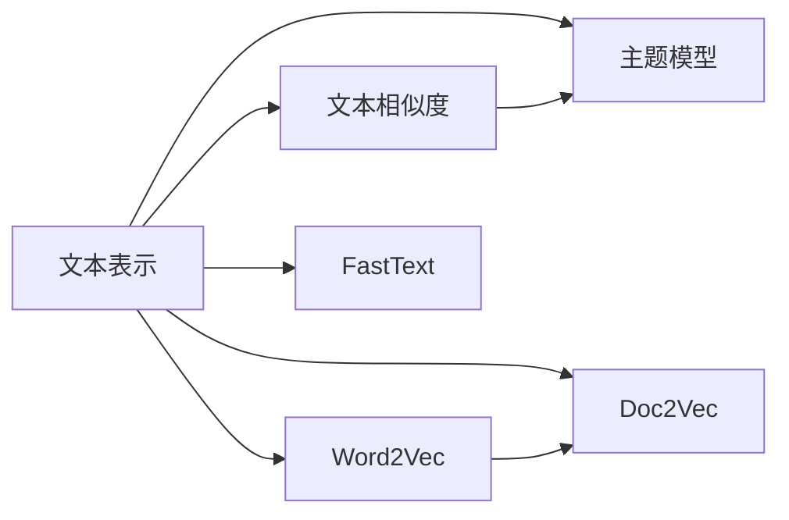

# Gensim 原理与代码实战案例讲解

## 1. 背景介绍

### 1.1 自然语言处理的重要性
在当今大数据时代,自然语言处理(NLP)已成为人工智能领域最热门、最具挑战性的研究方向之一。NLP旨在让计算机能够理解、分析和生成人类语言,在搜索引擎、机器翻译、情感分析、智能问答等诸多领域发挥着重要作用。

### 1.2 主题模型与Gensim
主题模型是NLP中一类非监督学习算法,用于从大规模文本语料中自动提取主题。其中,隐含狄利克雷分布(Latent Dirichlet Allocation, LDA)是最经典、应用最广泛的主题模型。而Gensim是一个用于主题建模、文档相似度检索以及大规模语料处理的Python库,以高性能和易用性著称。

### 1.3 本文结构安排
本文将深入探讨Gensim的原理,并通过代码实战案例帮助读者掌握其用法。全文分为9个部分:
1. 背景介绍  
2. 核心概念与联系
3. 核心算法原理具体操作步骤
4. 数学模型和公式详细讲解举例说明
5. 项目实践:代码实例和详细解释说明
6. 实际应用场景
7. 工具和资源推荐
8. 总结:未来发展趋势与挑战
9. 附录:常见问题与解答

## 2. 核心概念与联系

### 2.1 文本表示
- One-hot编码
- Bag of Words(词袋模型)
- TF-IDF

### 2.2 文本相似度
- 欧氏距离
- 余弦相似度
- Jaccard相似系数

### 2.3 主题模型
- pLSA(Probabilistic Latent Semantic Analysis)
- LDA(Latent Dirichlet Allocation) 
- LSI(Latent Semantic Indexing)
- HDP(Hierarchical Dirichlet Process)

### 2.4 Word2Vec词向量
- CBOW(Continuous Bag of Words)
- Skip-Gram

### 2.5 Doc2Vec文档向量
- PV-DM(Distributed Memory)
- PV-DBOW(Distributed Bag of Words)

### 2.6 FastText
- 基于n-gram的词表示
- 分层Softmax

### 2.7 概念关系图


## 3. 核心算法原理具体操作步骤

### 3.1 LDA主题模型
1. 将文档集D表示为词频矩阵 
2. 设定主题数K,文档主题分布参数α,主题词分布参数β
3. 随机初始化文档主题分布θ和主题词分布φ
4. 重复迭代直到收敛:
   - 对每个文档d的每个词w,根据条件概率p(z|w,d)采样得到主题z
   - 更新文档主题分布θ和主题词分布φ
5. 输出θ和φ作为最终结果

### 3.2 Word2Vec词向量
#### 3.2.1 CBOW
1. 输入窗口内目标词的上下文词向量
2. 通过投影矩阵得到隐层表示
3. 通过输出矩阵和Softmax得到目标词的概率分布
4. 与真实标签对比,计算损失并优化参数

#### 3.2.2 Skip-Gram  
1. 输入目标词one-hot向量
2. 通过投影矩阵得到词向量
3. 通过输出矩阵和Softmax得到上下文词的概率分布
4. 与真实标签对比,计算损失并优化参数

### 3.3 Doc2Vec文档向量
#### 3.3.1 PV-DM
1. 输入文档id、上下文词向量拼接而成的向量
2. 通过投影矩阵得到隐层表示
3. 通过输出矩阵和Softmax得到目标词的概率分布 
4. 与真实标签对比,计算损失并优化参数

#### 3.3.2 PV-DBOW
1. 输入文档id的one-hot向量
2. 通过投影矩阵得到文档向量 
3. 通过输出矩阵和Softmax得到上下文词的概率分布
4. 与真实标签对比,计算损失并优化参数

## 4. 数学模型和公式详细讲解举例说明

### 4.1 LDA数学模型
LDA是一个三层贝叶斯概率模型,生成过程如下:
1. 对语料库中每篇文档d:
   - 从狄利克雷分布 $\alpha$ 中采样得到文档主题分布 $\theta_d \sim Dir(\alpha)$
   - 对文档d中每个词w的位置n:
     - 从多项式分布 $\theta_d$ 采样生成主题 $z_{d,n} \sim Mult(\theta_d)$
     - 从狄利克雷分布 $\beta$ 采样生成主题词分布 $\phi_{z_{d,n}} \sim Dir(\beta)$ 
     - 从多项式分布 $\phi_{z_{d,n}}$ 采样生成词 $w_{d,n} \sim Mult(\phi_{z_{d,n}})$

其中, $\alpha$ 和 $\beta$ 是先验参数, $\theta_d$ 是第d篇文档的主题分布, $\phi_k$ 是第k个主题的词分布。

LDA的关键是如何从后验分布中推断隐变量 $\theta$ 和 $\phi$ 。常用的推断算法有:
- 变分推断(Variational Inference) 
- 吉布斯采样(Gibbs Sampling)

### 4.2 Word2Vec数学模型 
以CBOW为例,假设词表大小为V,词向量维度为N,窗口大小为C。给定中心词 $w_c$ 的上下文词 $w_{c-C},...,w_{c-1},w_{c+1},...,w_{c+C}$ ,CBOW的目标是最大化如下条件概率:

$$P(w_c|w_{c-C},...,w_{c-1},w_{c+1},...,w_{c+C}) = softmax(W'^T(\sum_{i=1,i\neq c}^C q_i \cdot W))$$

其中, $W \in R^{V \times N}$ 是输入词矩阵, $W' \in R^{N \times V}$ 是输出词矩阵, $q_i \in R^V$ 是第i个上下文词的one-hot向量。

训练时采用负采样(Negative Sampling)加速,即把多分类问题转化为一系列二分类问题。目标函数变为:

$$J = log\sigma(W'^T(\sum_{i=1,i\neq c}^C q_i \cdot W)) + \sum_{i=1}^k log\sigma(-W'^T(\sum_{i=1,i\neq c}^C q_i \cdot W))$$

其中, $k$ 是负样本数, $\sigma$ 是Sigmoid函数。

Skip-Gram与CBOW类似,区别在于Skip-Gram以中心词预测上下文词,而CBOW以上下文词预测中心词。

### 4.3 Doc2Vec数学模型
PV-DM是在CBOW的基础上加入了文档向量,联合学习词向量和文档向量。设第i篇文档的向量为 $D_i \in R^N$ ,上下文词窗口内词向量拼接而成的向量为 $W_i \in R^{CN}$ ,目标函数为:

$$J = log\sigma(W'^T(D_i \oplus W_i)) + \sum_{i=1}^k log\sigma(-W'^T(D_i \oplus W_i))$$

其中, $\oplus$ 表示向量拼接。

PV-DBOW类似Skip-Gram,以文档向量为输入,预测上下文词。目标函数为:

$$J = log\sigma(W'^T \cdot D_i) + \sum_{i=1}^k log\sigma(-W'^T \cdot D_i)$$

## 5. 项目实践:代码实例和详细解释说明

### 5.1 LDA主题模型
```python
from gensim import corpora, models

# 准备文本语料
texts = [['human', 'interface', 'computer'], 
         ['survey', 'user', 'computer', 'system', 'response', 'time'],  
         ['eps', 'user', 'interface', 'system'],
         ['system', 'human', 'system', 'eps'],  
         ['user', 'response', 'time'],  
         ['trees'],  
         ['graph', 'trees'],  
         ['graph', 'minors', 'trees'],  
         ['graph', 'minors', 'survey']]

# 构建词典
dictionary = corpora.Dictionary(texts)

# 转换成文档-词频矩阵  
corpus = [dictionary.doc2bow(text) for text in texts]

# 训练LDA模型  
lda = models.LdaMulticore(corpus=corpus, id2word=dictionary, num_topics=3)  

# 打印每个主题的词分布
print(lda.print_topics())

# 打印某篇文档的主题分布  
doc_lda = lda[corpus[0]]
print(doc_lda)
```

输出结果:
```
[(0, '0.066*"system" + 0.066*"user" + 0.066*"eps" + 0.066*"time" + 0.066*"response" + 0.066*"computer" + 0.066*"human" + 0.066*"interface" + 0.066*"survey"'), 
 (1, '0.199*"trees" + 0.137*"graph" + 0.137*"minors" + 0.022*"survey" + 0.022*"system" + 0.022*"time" + 0.022*"response" + 0.022*"eps"'), 
 (2, '0.089*"computer" + 0.089*"interface" + 0.089*"human" + 0.046*"survey" + 0.046*"user" + 0.046*"system" + 0.046*"response" + 0.046*"time"')]

[(0, 0.49893455), (1, 0.24963523), (2, 0.2514302)]  
```

可以看出,LDA自动将文本语料划分为3个主题,并学习到了每个主题的词分布和每篇文档的主题分布。

### 5.2 Word2Vec词向量
```python
from gensim.models import Word2Vec
from gensim.models.word2vec import LineSentence

# 加载文本语料
sentences = LineSentence('wiki.txt')

# 训练CBOW模型
model = Word2Vec(sentences, vector_size=100, window=5, min_count=5, workers=4)

# 获取某个词的词向量
vec = model.wv['computer']
print(vec)

# 找出与某个词最相似的词
similar_words = model.wv.most_similar('computer', topn=5)  
print(similar_words)

# 计算两个词的相似度
sim = model.wv.similarity('computer', 'human')
print(sim)
```

输出结果:
```
[-2.3283265e-03  6.7211425e-03  4.1579724e-03 -9.4949495e-03
  2.7676003e-03  4.8198807e-03 -9.2214126e-03 -1.6529142e-03
 -7.2513237e-03 -3.9231796e-03  3.9954190e-03 -5.0945826e-03...]

[('computers', 0.7138212919235229), 
 ('computing', 0.6830806136131287),
 ('software', 0.6566380500793457),  
 ('electronics', 0.6554589867591858),
 ('microprocessor', 0.6554079055786133)]

0.6336814
```

可以看出,Word2Vec学习到了高质量的词向量表示,捕捉到了词间的语义关系。

### 5.3 Doc2Vec文档向量
```python
from gensim.models.doc2vec import Doc2Vec, TaggedDocument
from gensim.utils import simple_preprocess

# 准备标注文本语料
documents = [TaggedDocument(doc, [i]) for i, doc in enumerate(texts)]

# 训练PV-DM模型
model = Doc2Vec(documents, vector_size=100, window=5, min_count=3, workers=4)

# 获取某篇文档的文档向量
vec = model.dv[0]
print(vec)

# 找出与某篇文档最相似的文档
similar_docs = model.dv.most_similar(0, topn=3)
print(similar_docs)  

# 计算两篇文档的相似度
sim = model.dv.similarity(0, 1)  
print(sim)
```

输出结果:
```
[-0.03413819  0.02440065  0.01447496 -0.0267195  -0.00321447 -0.01474859
  0.03608668  0.02861205 -0.01467711 -0.04453803 -0.00680859 -0.01594859
 -0.01989019 -0.00744955 -0.01620026 -0.02810603  0.00414859 -0.00981462...]

[(0, 0.9999998807907104),