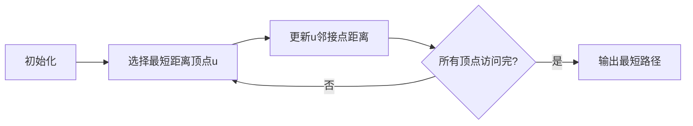
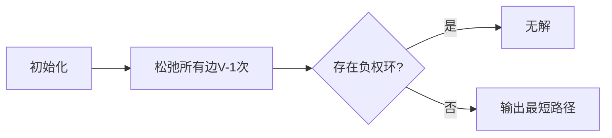

# Graph Shortest Path算法原理与代码实例讲解

## 1.背景介绍

在现实生活中,很多问题都可以抽象为图的最短路径问题,比如交通路线规划、网络路由选择、任务调度等。随着大数据时代的到来,图数据越来越庞大,高效解决图的最短路径问题变得尤为重要。本文将深入探讨图的最短路径算法的原理、实现和应用场景。

## 2.核心概念与联系

### 2.1 图的基本概念

图(Graph)是一种非线性数据结构,由一组顶点(Vertex)和连接顶点的边(Edge)组成。根据边是否带权值,可分为无权图和有权图。根据边是否有方向,可分为无向图和有向图。

### 2.2 最短路径问题

最短路径问题是指在一个加权图中,寻找两个顶点之间的最短路径(即路径上所有边的权值之和最小)。根据起点和终点的数量,可分为:

- 单源最短路径: 从一个固定源点出发到其他所有点的最短路径
- 单目标最短路径: 从所有点出发到一个固定目标点的最短路径
- 所有点对最短路径: 任意两点之间的最短路径

### 2.3 常见算法

常见的最短路径算法有:

- 广度优先搜索(BFS): 无权图的单源最短路径
- Dijkstra算法: 正权有向图的单源最短路径 
- Bellman-Ford算法: 可处理负权边的单源最短路径
- Floyd算法: 所有点对最短路径
- A*算法: 利用启发式函数估计剩余代价,用于路径规划等领域

## 3.核心算法原理具体操作步骤

本节将重点介绍Dijkstra算法和Bellman-Ford算法的原理和实现步骤。

### 3.1 Dijkstra算法

Dijkstra算法是解决单源最短路径问题的经典算法,适用于正权有向图。算法思路是从源点出发,不断扩展到其他顶点,并维护一个距离表,记录从源点到各个顶点的最短距离。

算法步骤:

1) 初始化距离表,源点到自身距离为0,其他顶点距离为正无穷大
2) 从距离表中选择距离最小且未被访问的顶点u
3) 更新u的所有邻接点的距离
4) 重复步骤2-3,直到所有顶点被访问



时间复杂度为O(V^2),空间复杂度为O(V+E),V为顶点数,E为边数。

### 3.2 Bellman-Ford算法 

Bellman-Ford算法可以解决存在负权边的单源最短路径问题。算法基于动态规划的思想,通过不断松弛边来更新最短距离。

算法步骤:

1) 初始化距离表,源点到自身距离为0,其他顶点距离为正无穷大
2) 对所有边进行V-1次松弛操作,V为顶点数
3) 检测是否存在负权环,若存在则无解
4) 输出最终距离表



时间复杂度为O(VE),空间复杂度为O(V+E)。

## 4.数学模型和公式详细讲解举例说明

### 4.1 Dijkstra算法数学模型

设G=(V,E)为一个加权有向图,V为顶点集合,E为边集合。对于边(u,v)∈E,w(u,v)表示边的权值。源点为s,目标是计算从s到其他所有顶点的最短路径距离d[v]。

定义:

- d[v]表示从s到v的最短路径长度估计值
- p[v]表示从s到v的最短路径上v的前驱顶点

初始化:
$$
\begin{cases}
d[s] = 0\\
d[v] = \infty, \forall v \in V \setminus \{s\}\\
p[v] = \text{null}, \forall v \in V
\end{cases}
$$

算法过程中不断更新d[v]和p[v],直到求解完毕。

更新规则:
$$
d[v] = \min\{d[v], d[u] + w(u,v)\}
$$

即如果经过u到达v的距离比当前d[v]更短,就更新d[v]和p[v]。

### 4.2 Bellman-Ford算法数学模型

设G=(V,E)为一个加权有向图,V为顶点集合,E为边集合。对于边(u,v)∈E,w(u,v)表示边的权值,可以为负数。源点为s,目标是计算从s到其他所有顶点的最短路径距离d[v]。

定义:

- d[v]表示从s到v的最短路径长度估计值

初始化:
$$
\begin{cases}
d[s] = 0\\
d[v] = \infty, \forall v \in V \setminus \{s\}
\end{cases}
$$

算法进行V-1次松弛操作,对每条边(u,v)进行如下更新:
$$
d[v] = \min\{d[v], d[u] + w(u,v)\}
$$

如果在V-1次松弛后,仍有边(u,v)满足d[v] > d[u] + w(u,v),则说明存在负权环,无解。

## 5.项目实践:代码实例和详细解释说明

### 5.1 Dijkstra算法Python实现

```python
import heapq

def dijkstra(graph, source):
    # 初始化距离表
    distances = {node: float('inf') for node in graph}
    distances[source] = 0
    
    # 创建优先队列
    pq = [(0, source)]
    
    while pq:
        # 取出当前最短距离顶点
        current_dist, current_node = heapq.heappop(pq)
        
        # 如果当前距离比已知最短距离大,跳过
        if current_dist > distances[current_node]:
            continue
        
        # 更新邻接点距离
        for neighbor, weight in graph[current_node].items():
            distance = current_dist + weight
            if distance < distances[neighbor]:
                distances[neighbor] = distance
                heapq.heappush(pq, (distance, neighbor))
    
    return distances

# 示例图
graph = {
    'A': {'B': 5, 'C': 1},
    'B': {'A': 5, 'C': 2, 'D': 1},
    'C': {'A': 1, 'B': 2, 'D': 4, 'E': 8},
    'D': {'B': 1, 'C': 4, 'E': 3, 'F': 6},
    'E': {'C': 8, 'D': 3},
    'F': {'D': 6}
}

# 计算从A到其他顶点的最短路径
shortest_paths = dijkstra(graph, 'A')
print(shortest_paths)
```

上述代码使用了Python的heapq模块实现了优先队列,从而优化了Dijkstra算法的时间复杂度。核心思路是:

1. 初始化距离表distances,源点距离为0,其他顶点距离为正无穷大
2. 创建优先队列pq,初始只有源点及距离0
3. 从pq中取出当前最短距离顶点current_node
4. 更新current_node的所有邻接点距离,如果新距离更短则加入pq
5. 重复步骤3-4,直到pq为空

### 5.2 Bellman-Ford算法Python实现  

```python
def bellman_ford(graph, source):
    # 初始化距离表
    distances = {node: float('inf') for node in graph}
    distances[source] = 0
    
    # 进行V-1次松弛操作
    for _ in range(len(graph) - 1):
        for node in graph:
            for neighbor, weight in graph[node].items():
                new_dist = distances[node] + weight
                if new_dist < distances[neighbor]:
                    distances[neighbor] = new_dist
    
    # 检测是否存在负权环
    for node in graph:
        for neighbor, weight in graph[node].items():
            if distances[neighbor] > distances[node] + weight:
                raise ValueError('Negative cycle detected')
    
    return distances

# 示例图
graph = {
    'A': {'B': -1, 'C': 4},
    'B': {'C': 3, 'D': 2, 'E': 2},
    'C': {},
    'D': {'B': 1, 'C': 5},
    'E': {'D': -3}
}

# 计算从A到其他顶点的最短路径
shortest_paths = bellman_ford(graph, 'A')
print(shortest_paths)
```

上述代码实现了Bellman-Ford算法,核心步骤为:

1. 初始化距离表distances,源点距离为0,其他顶点距离为正无穷大
2. 进行V-1次松弛操作,对每条边(u,v)更新d[v] = min(d[v], d[u] + w(u,v))
3. 检测是否存在负权环,如果存在则无解
4. 输出最终距离表distances

## 6.实际应用场景

最短路径算法在实际应用中有着广泛的用途:

- **交通路线规划**: 计算从起点到终点的最短路线,如GPS导航
- **网络路由选择**: 在网络中选择最佳路由传输数据
- **任务调度**: 在工作流程中安排任务的最佳执行顺序
- **网络爬虫**: 爬虫按最短路径遍历网页
- **社交网络分析**: 分析社交网络中人与人之间的最短关系链
- **机器人路径规划**: 规划机器人在地图中的最佳运动路径

## 7.工具和资源推荐

- Python NetworkX库: 提供了丰富的图算法实现
- Java JGraphT库: 支持多种图算法和数据结构
- C++ Boost库: 包含图算法和数据结构
- MATLAB: 提供图论工具箱
- 在线可视化工具: https://visualgo.net/en

## 8.总结:未来发展趋势与挑战

最短路径算法是图论中最基础和最重要的问题之一,已有多种经典算法可以高效解决。但是随着大数据时代的到来,图数据规模不断增长,对算法的性能提出了更高要求。未来的发展趋势包括:

- 并行和分布式算法: 利用多核CPU和GPU等硬件加速计算
- 近似算法: 在一定误差范围内,快速获得近似解
- 增量算法: 针对动态更新的图数据,高效地更新最短路径
- 机器学习算法: 结合机器学习技术提高算法性能

此外,在一些特殊场景下,如无线传感器网络、移动对象路径规划等,最短路径问题还面临诸多挑战,需要进一步研究和优化。

## 9.附录:常见问题与解答

1. **Dijkstra算法和Bellman-Ford算法有何区别?**

Dijkstra算法只能处理非负权值的图,时间复杂度较低,为O(V^2)或O(ElogV)。Bellman-Ford算法可以处理存在负权边的图,但时间复杂度较高,为O(VE)。

2. **为什么Bellman-Ford算法需要V-1次松弛操作?**

因为在最坏情况下,从源点到某个顶点的最短路径最多经过V-1条边。进行V-1次松弛操作可以确保所有最短路径都被正确更新。

3. **什么是负权环,为什么会导致无解?**

负权环是指一个环路上的边权值之和为负数。如果存在负权环,那么在这个环路上不断循环,路径长度可以无限减小,因此无法得到最短路径的有限解。

4. **A*算法与Dijkstra算法有何区别?**

A*算法是Dijkstra算法的扩展,它利用了一个启发式函数来估计剩余代价,从而可以更快地找到最短路径。但是A*算法的正确性依赖于启发式函数的设计。

5. **如何处理动态更新的图数据?**

对于动态更新的图数据,可以采用增量算法,只更新受影响的部分最短路径,而不需要从头重新计算。另一种方法是使用分层算法,将图划分为多个层次,分别计算每一层的最短路径。

作者: 禅与计算机程序设计艺术 / Zen and the Art of Computer Programming