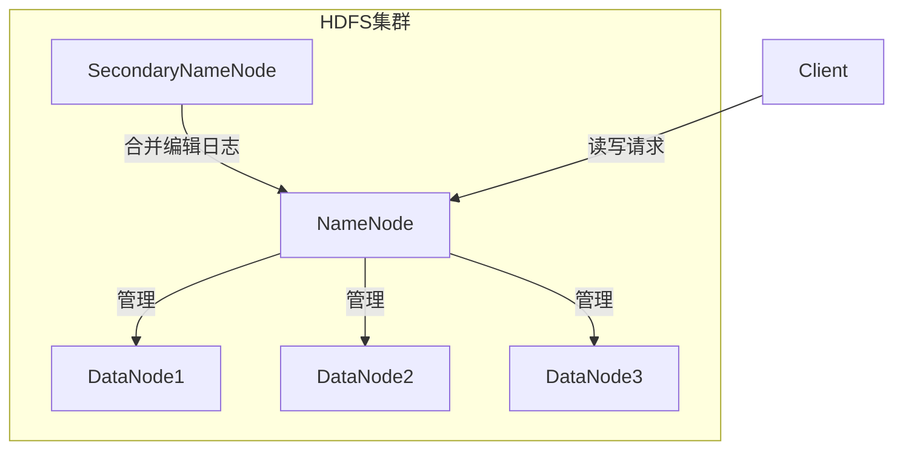
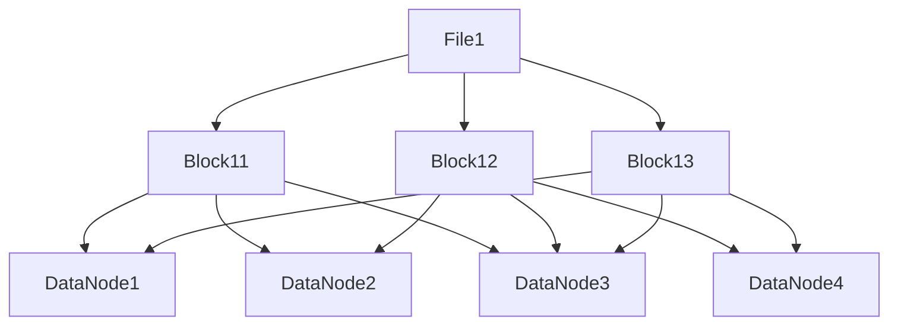
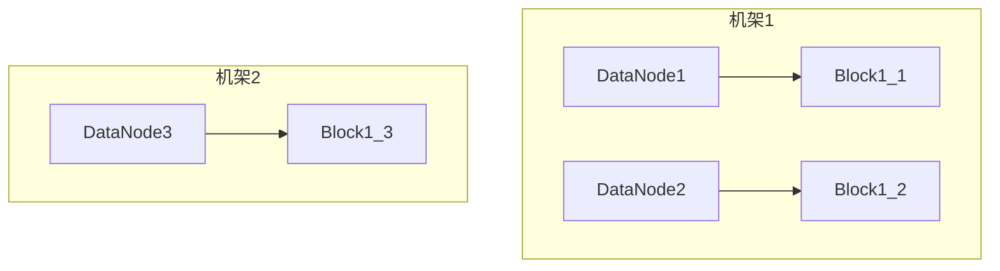
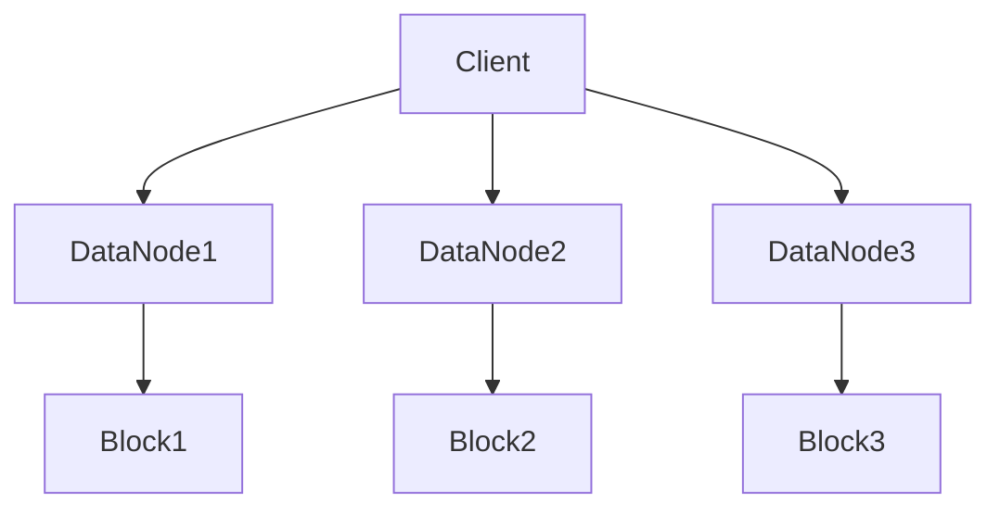

# HDFS 原理与代码实例讲解

## 1. 背景介绍

### 1.1 大数据时代的数据存储挑战

随着互联网、物联网、人工智能等新兴技术的快速发展,数据的产生量呈现爆炸式增长。传统的数据存储系统很难满足大数据时代对海量数据存储和处理的需求。因此,一种全新的、高度可扩展、高度容错的分布式文件系统应运而生,那就是HDFS(Hadoop Distributed File System)。

### 1.2 HDFS的设计目标

HDFS的设计目标是为大数据场景下的大规模数据集提供高吞吐量的数据访问。它具有以下主要特点:

- **高容错性**:通过数据块的复制和分布式存储,可以有效防止数据丢失。
- **高吞吐量**:HDFS针对大文件设计,支持数据的并行传输,实现高吞吐量数据访问。
- **可扩展性**:HDFS可以通过简单地增加更多的机器来线性扩展存储容量和计算能力。

### 1.3 HDFS的应用场景

HDFS被广泛应用于以下场景:

- **大数据分析**:作为Apache Hadoop生态系统的核心组件,HDFS为大数据分析应用提供了可靠的数据存储和访问服务。
- **大规模日志收集**:HDFS可以作为大规模日志收集系统的存储后端,确保日志数据的高可靠性和高吞吐量访问。
- **备份和归档**:HDFS可以用于存储企业级数据的备份和归档,提供高容错性和可扩展性。

## 2. 核心概念与联系

### 2.1 HDFS架构概览

HDFS采用主从架构,主要由以下几个组件组成:

- **NameNode**:HDFS集群的主节点,负责管理文件系统的命名空间和客户端对文件的访问。
- **DataNode**:HDFS集群的从节点,负责实际存储数据块并执行读写操作。
- **SecondaryNameNode**:周期性合并NameNode的编辑日志,防止NameNode的内存占用过高。
- **Client**:向HDFS发起读写请求的客户端程序。



### 2.2 HDFS文件块

HDFS将文件划分为一个个数据块(Block),默认块大小为128MB。每个数据块会被复制到多个DataNode上,以提高容错性和数据可靠性。



### 2.3 读写流程

**写入流程**:

1. Client向NameNode申请写入文件。
2. NameNode分配数据块ID并确定存储DataNode列表。
3. Client根据DataNode列表并行写入数据块。
4. Client完成写入后,通知NameNode。

**读取流程**:

1. Client向NameNode申请读取文件。
2. NameNode返回文件数据块信息和DataNode位置。
3. Client根据DataNode位置并行读取数据块。

## 3. 核心算法原理具体操作步骤

### 3.1 数据块复制与存储策略

HDFS采用了数据块复制和分布式存储策略,以提高数据可靠性和容错性。具体步骤如下:

1. **复制因子**:HDFS允许设置复制因子(默认为3),即每个数据块会被复制存储多少份。
2. **机架感知**:HDFS会尽量将数据块复制到不同的机架上,以防止单点故障导致数据丢失。
3. **副本放置**:第一个副本在本地节点,第二个副本在不同机架的节点,第三个副本在同一机架的不同节点。



### 3.2 数据块读取与负载均衡

HDFS在读取数据块时,会采用以下策略实现负载均衡:

1. **就近读取**:Client优先从距离最近的DataNode读取数据块,以减少网络开销。
2. **并行读取**:Client可以并行从多个DataNode读取数据块,提高读取吞吐量。
3. **错误处理**:如果某个DataNode发生故障,Client会自动从其他DataNode读取数据块。



### 3.3 数据块写入与Pipeline机制

HDFS采用Pipeline机制来实现数据块的写入,具体步骤如下:

1. Client向NameNode申请写入文件,NameNode返回DataNode列表。
2. Client与DataNode建立Pipeline,并将数据块写入第一个DataNode。
3. 第一个DataNode将数据块传递给下一个DataNode,依次类推。
4. 所有DataNode完成写入后,Client关闭Pipeline并通知NameNode。


## 4. 数学模型和公式详细讲解举例说明

### 4.1 数据块放置策略数学模型

HDFS采用一种基于概率的数据块放置策略,以实现数据块在集群中的均匀分布。该策略可以用以下数学模型表示:

设有N个DataNode,复制因子为r,则每个数据块的副本数量为r。我们希望每个DataNode上存储的数据块数量尽可能相等,即:

$$\sum_{i=1}^{N}(x_i - \bar{x})^2 = \min$$

其中,x_i表示第i个DataNode上存储的数据块数量,$\bar{x}$表示所有DataNode上数据块数量的平均值。

为了实现这一目标,HDFS采用了一种基于随机选择的策略。具体来说,对于每个新写入的数据块,HDFS会从所有DataNode中随机选择r个节点进行存储。这种随机选择策略可以保证数据块在集群中的均匀分布,从而实现负载均衡。

### 4.2 读取吞吐量模型

在HDFS中,读取吞吐量取决于以下几个因素:

- 磁盘读取速度
- 网络带宽
- 并行读取数量

我们可以用以下公式来估计读取吞吐量:

$$T = \min(D \times N, B)$$

其中,T表示读取吞吐量,D表示单个DataNode的磁盘读取速度,N表示并行读取的DataNode数量,B表示网络带宽。

这个公式说明,读取吞吐量受磁盘读取速度和网络带宽的限制。当并行读取的DataNode数量增加时,吞吐量会线性增加,直到达到磁盘读取速度或网络带宽的上限。

例如,假设单个DataNode的磁盘读取速度为100MB/s,网络带宽为1GB/s,并行读取的DataNode数量为10。根据上述公式,我们可以估计读取吞吐量为:

$$T = \min(100 \times 10, 1000) = 1000\text{MB/s}$$

因此,在这种情况下,读取吞吐量受网络带宽的限制,为1GB/s。

## 5. 项目实践:代码实例和详细解释说明

### 5.1 HDFS Java API示例

以下是使用HDFS Java API进行文件读写操作的示例代码:

```java
import org.apache.hadoop.conf.Configuration;
import org.apache.hadoop.fs.FileSystem;
import org.apache.hadoop.fs.Path;

public class HDFSExample {
    public static void main(String[] args) throws Exception {
        // 配置HDFS文件系统
        Configuration conf = new Configuration();
        conf.set("fs.defaultFS", "hdfs://namenode:9000");
        FileSystem fs = FileSystem.get(conf);

        // 写入文件
        Path path = new Path("/user/example/data.txt");
        byte[] content = "Hello, HDFS!".getBytes();
        fs.create(path).write(content);

        // 读取文件
        byte[] buffer = new byte[1024];
        int bytesRead = fs.open(path).read(buffer);
        System.out.println(new String(buffer, 0, bytesRead));

        // 关闭文件系统
        fs.close();
    }
}
```

代码解释:

1. 首先创建一个`Configuration`对象,并设置HDFS的NameNode地址。
2. 通过`FileSystem.get(conf)`方法获取HDFS文件系统实例。
3. 使用`fs.create(path)`方法创建一个新文件,并写入数据。
4. 使用`fs.open(path)`方法打开文件,并读取文件内容。
5. 最后关闭文件系统实例。

### 5.2 HDFS命令行操作

除了使用Java API,我们也可以通过HDFS提供的命令行工具进行文件操作。以下是一些常用命令:

- `hdfs dfs -ls /user/example`列出指定目录下的文件和目录。
- `hdfs dfs -put data.txt /user/example`将本地文件`data.txt`上传到HDFS。
- `hdfs dfs -get /user/example/data.txt`从HDFS下载文件`data.txt`到本地。
- `hdfs dfs -rm /user/example/data.txt`删除HDFS上的文件`data.txt`。
- `hdfs fsck /`检查HDFS文件系统的健康状态和数据块复制情况。

## 6. 实际应用场景

HDFS作为Apache Hadoop生态系统的核心组件,被广泛应用于以下场景:

### 6.1 大数据分析

HDFS为大数据分析应用提供了可靠的数据存储和访问服务。例如,Apache Spark、Apache Hive等大数据处理框架都可以直接读写HDFS上的数据。

### 6.2 日志收集和处理

HDFS可以作为大规模日志收集系统的存储后端,确保日志数据的高可靠性和高吞吐量访问。例如,Apache Kafka、Apache Flume等日志收集工具都支持将数据持久化到HDFS。

### 6.3 数据湖

HDFS可以作为企业数据湖的存储层,集中存储来自各个数据源的原始数据。数据湖提供了一个统一的数据平台,供各种数据分析工具和应用程序访问和处理数据。

### 6.4 备份和归档

由于HDFS的高容错性和可扩展性,它也可以用于存储企业级数据的备份和归档。相比传统的磁带备份,HDFS提供了更高的可靠性和更低的存储成本。

## 7. 工具和资源推荐

### 7.1 HDFS Web UI

HDFS提供了一个基于Web的用户界面,用于监控和管理HDFS集群。通过Web UI,我们可以查看集群状态、NameNode和DataNode的运行情况、文件系统的使用情况等。

### 7.2 HDFS命令行工具

HDFS自带了一系列命令行工具,用于管理和操作HDFS文件系统。常用的命令包括`hdfs dfs`、`hdfs fsck`、`hdfs balancer`等。

### 7.3 Apache Hadoop官方文档

Apache Hadoop官方文档提供了HDFS的详细介绍、配置指南、API参考等内容,是学习和使用HDFS的重要资源。

### 7.4 HDFS相关书籍

市面上有许多优秀的HDFS相关书籍,如《Hadoop权威指南》、《Hadoop实战手册》等,可以作为深入学习HDFS的参考资料。

## 8. 总结:未来发展趋势与挑战

### 8.1 HDFS的未来发展趋势

HDFS作为Apache Hadoop生态系统的核心组件,其未来发展趋势主要包括:

- **异构存储支持**:HDFS将支持更多种类的存储介质,如SSD、NVMe等,以提高I/O性能。
- **安全性和隐私性增强**:HDFS将加强对数据安全和隐私保护的支持,如数据加密、访问控制等。
- **元数据管理优化**:HDFS将优化NameNode的元数据管理机制,提高元数据操作的效率