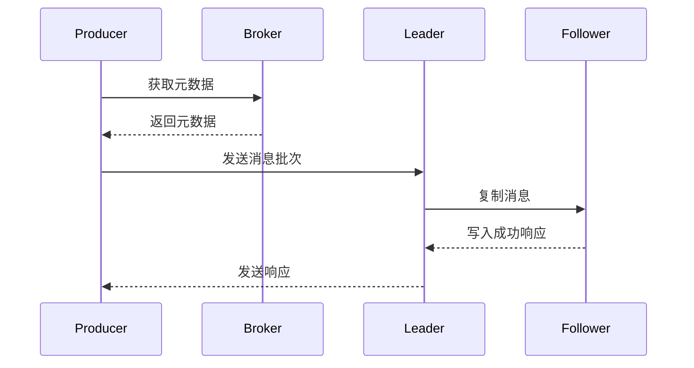

# Kafka Producer 原理与代码实例讲解

## 1. 背景介绍

Apache Kafka 是一个分布式流处理平台,被广泛应用于日志收集、消息系统、数据管道等场景。作为 Kafka 的核心组件之一,Producer 负责向 Kafka 集群发送消息。本文将深入探讨 Kafka Producer 的工作原理、关键配置参数以及代码实现细节,帮助读者全面了解 Producer 的运行机制。

## 2. 核心概念与联系

在讨论 Producer 原理之前,我们需要先了解几个关键概念:

1. **Topic**: Kafka 以 Topic 作为数据记录的逻辑单元,每个 Topic 可包含多个分区 (Partition)。

2. **Partition**: 分区是 Topic 的组成单元,每个分区都是一个有序、不可变的消息序列。分区可以实现数据的并行处理,提高吞吐量。

3. **Broker**: Kafka 集群由一个或多个服务器 (Broker) 组成,每个 Broker 存储一部分分区数据。

4. **Leader 和 Follower**: 每个分区都有一个 Leader 副本和若干 Follower 副本,Leader 负责读写请求,Follower 只负责备份数据。

5. **Replication Factor**: 副本因子,用于控制每个分区的副本数量,提高数据可靠性。

Producer 与上述概念的关系如下所示:

```mermaid
graph LR
    Producer --> |写入数据| Topic
    Topic --> |包含| Partition
    Partition --> |分布在| Broker
    Partition --> |具有| Leader
    Partition --> |具有| Follower
    Partition --> |具有| "Replication Factor"
```

## 3. 核心算法原理具体操作步骤

### 3.1 发送消息流程

Producer 发送消息的基本流程如下:

1. Producer 首先需要获取 Topic 的元数据信息,包括 Topic 的分区数量、Leader 副本所在的 Broker 等。

2. Producer 根据分区策略 (Partitioner) 选择将消息发送到哪个分区。常见的分区策略有:

   - 轮询 (Round-Robin)
   - 键值 (Key) 哈希
   - 自定义分区策略

3. Producer 将消息批量发送到选定的分区的 Leader 副本所在的 Broker。

4. Leader 副本将消息写入本地日志文件,并将消息复制到所有 Follower 副本。

5. 当所有同步副本 (In-Sync Replicas, ISR) 都成功写入消息后,Leader 向 Producer 返回一个响应。

6. Producer 根据响应信息更新消息的元数据,如设置消息偏移量 (Offset)。

整个发送流程如下图所示:



### 3.2 消息批次

为了提高吞吐量,Producer 会将多条消息组成一个批次 (Batch) 进行发送。批次大小由以下参数控制:

- `batch.size`: 单个批次的字节数上限。
- `linger.ms`: 延迟发送时间,Producer 会在该时间内等待更多消息加入批次。
- `max.request.size`: 单个请求的字节数上限。

Producer 会根据这些参数动态调整批次大小,在吞吐量和延迟之间寻求平衡。

### 3.3 幂等性

为了避免重复消息,Kafka 0.11 版本引入了幂等性 (Idempotent) 特性。Producer 会为每个消息分配一个序列号 (Sequence Number),并在发送时携带该序列号。Broker 会根据序列号判断是否为重复消息,从而保证幂等性。

### 3.4 事务性

Kafka 0.11 还引入了事务性 (Transactions) 特性,允许将多个操作 (如发送消息、提交偏移量等) 作为一个原子单元进行处理。这有助于实现精确一次 (Exactly Once) 语义,避免消息丢失或重复。

## 4. 数学模型和公式详细讲解举例说明

在 Kafka 中,分区副本的分布需要满足一定的约束条件,以确保数据的可靠性和可用性。这些约束条件可以用数学模型和公式来表示。

### 4.1 副本分布约束

假设一个 Topic 有 $N$ 个分区,副本因子为 $R$,集群中有 $B$ 个 Broker。那么,每个 Broker 最多可以存储 $\lfloor \frac{N \times R}{B} \rfloor$ 个副本。

$$
\text{Max Replicas Per Broker} = \left\lfloor \frac{N \times R}{B} \right\rfloor
$$

为了确保高可用性,Kafka 还要求每个分区的副本必须分布在不同的 Broker 上。这可以用以下约束来表示:

$$
\forall p \in \text{Partitions}, \forall r_1, r_2 \in \text{Replicas}(p): \text{Broker}(r_1) \neq \text{Broker}(r_2)
$$

其中, $\text{Replicas}(p)$ 表示分区 $p$ 的所有副本集合, $\text{Broker}(r)$ 表示副本 $r$ 所在的 Broker。

### 4.2 最小 In-Sync Replicas (ISR)

为了确保数据可靠性,Kafka 要求至少有一定数量的副本成功写入消息,才能向 Producer 返回成功响应。这个最小副本数量称为 `min.insync.replicas`。

设 $R$ 为副本因子, $I$ 为 `min.insync.replicas` 的值,那么必须满足:

$$
I \leq R
$$

通常情况下, $I$ 会设置为 $R$ 或 $R-1$,以在数据可靠性和可用性之间寻求平衡。

### 4.3 Leader 选举

当 Leader 副本出现故障时,Kafka 会从 ISR 集合中选举一个新的 Leader。选举算法如下:

1. 从 ISR 集合中选择副本偏移量最大的副本作为新 Leader。
2. 如果存在多个偏移量最大的副本,则选择副本 ID 最小的那个作为新 Leader。

这个选举过程可以用以下公式表示:

$$
\text{NewLeader} = \underset{r \in \text{ISR}}{\text{argmax}} \left( \text{Offset}(r) \right)
$$

$$
\text{If } \exists r_1, r_2 \in \text{ISR}: \text{Offset}(r_1) = \text{Offset}(r_2), \text{ then } \text{NewLeader} = \underset{r_1, r_2}{\text{argmin}} \left( \text{ReplicaID}(r) \right)
$$

其中, $\text{Offset}(r)$ 表示副本 $r$ 的当前偏移量, $\text{ReplicaID}(r)$ 表示副本 $r$ 的 ID。

通过这些数学模型和公式,我们可以更好地理解 Kafka 中副本分布、数据可靠性和 Leader 选举等机制的原理。

## 5. 项目实践: 代码实例和详细解释说明

接下来,我们将通过代码实例来深入了解 Kafka Producer 的实现细节。以下示例使用 Java 语言和 Kafka 官方客户端库 `kafka-clients`。

### 5.1 创建 Producer 实例

```java
Properties props = new Properties();
props.put("bootstrap.servers", "broker1:9092,broker2:9092");
props.put("key.serializer", "org.apache.kafka.common.serialization.StringSerializer");
props.put("value.serializer", "org.apache.kafka.common.serialization.StringSerializer");

Producer<String, String> producer = new KafkaProducer<>(props);
```

首先,我们需要设置 Producer 的配置参数,包括 Broker 列表、序列化器等。然后,使用这些配置创建 `KafkaProducer` 实例。

### 5.2 发送消息

```java
String topic = "my-topic";
String key = "message-key";
String value = "Hello, Kafka!";

ProducerRecord<String, String> record = new ProducerRecord<>(topic, key, value);
producer.send(record, new Callback() {
    @Override
    public void onCompletion(RecordMetadata metadata, Exception e) {
        if (e != null) {
            e.printStackTrace();
        } else {
            System.out.println("Message sent: " + metadata.toString());
        }
    }
});
```

我们创建一个 `ProducerRecord` 对象,包含 Topic、键值对等消息信息。然后,调用 `producer.send()` 方法发送消息。该方法是异步的,可以通过提供一个回调函数来处理发送结果。

### 5.3 同步发送

如果需要等待消息发送完成,可以使用 `get()` 方法:

```java
Future<RecordMetadata> future = producer.send(record);
RecordMetadata metadata = future.get();
System.out.println("Message sent: " + metadata.toString());
```

`get()` 方法会阻塞当前线程,直到消息发送完成或超时。

### 5.4 批次发送

为了提高吞吐量,我们可以使用 `batch.size` 和 `linger.ms` 参数来控制批次大小:

```java
props.put("batch.size", 16384); // 16 KB
props.put("linger.ms", 10); // 10 ms
```

Producer 会在 10 毫秒内等待更多消息加入批次,或者当批次大小达到 16 KB 时立即发送。

### 5.5 幂等性

要启用幂等性,只需设置 `enable.idempotence` 参数为 `true`:

```java
props.put("enable.idempotence", true);
```

启用幂等性后,Producer 会为每个消息分配一个序列号,并在发送时携带该序列号。Broker 会根据序列号判断是否为重复消息,从而保证幂等性。

### 5.6 事务性

下面是一个使用事务性的示例:

```java
producer.initTransactions();

try {
    producer.beginTransaction();

    producer.send(record1);
    producer.send(record2);
    producer.commitTransaction();
} catch (Exception e) {
    producer.abortTransaction();
}
```

我们首先调用 `initTransactions()` 初始化事务管理器。然后,在 `beginTransaction()` 和 `commitTransaction()` 之间发送多条消息。如果发生任何异常,可以调用 `abortTransaction()` 回滚事务。

事务性可以确保多个操作要么全部成功,要么全部失败,从而实现精确一次语义。

## 6. 实际应用场景

Kafka Producer 在以下场景中发挥着重要作用:

1. **日志收集**: 将应用程序的日志数据发送到 Kafka,实现集中式日志管理和分析。

2. **消息队列**: 作为分布式消息队列的生产者端,将消息发送到 Kafka,供多个消费者订阅和处理。

3. **数据管道**: 将数据从各种来源 (如数据库、文件等) 发送到 Kafka,构建数据管道,为下游系统 (如数据仓库、流处理等) 提供数据源。

4. **事件驱动架构**: 在事件驱动架构中,Producer 负责将事件数据发送到 Kafka,供其他系统订阅和响应。

5. **物联网 (IoT)**: 将来自各种传感器和设备的数据发送到 Kafka,用于实时监控、数据分析等。

6. **微服务架构**: 在微服务架构中,Producer 可以将各个微服务之间的消息发送到 Kafka,实现异步、解耦的通信机制。

## 7. 工具和资源推荐

以下是一些有用的 Kafka 工具和资源:

1. **Kafka Tool**: 一个基于 Web 的 Kafka 集群管理工具,提供了丰富的监控和管理功能。

2. **Kafka Manager**: 另一个流行的 Kafka 集群管理工具,具有友好的 Web 界面。

3. **Kafka Stream**: Kafka 官方提供的流处理库,可以方便地构建流处理应用程序。

4. **Confluent Platform**: Confluent 公司提供的 Kafka 发行版,包含了许多增强功能和工具。

5. **Kafka 官方文档**: Kafka 官方文档是学习和参考 Kafka 的重要资源。

6. **Kafka 官方示例**: Kafka 源码中包含了许多示例代码,可以帮助理解 Kafka 的使用方式。

7. **Kafka 相关书籍**: 如 "Kafka: The Definitive Guide" 等书籍,深入探讨了 Kafka 的架构、原理和实践。

8. **