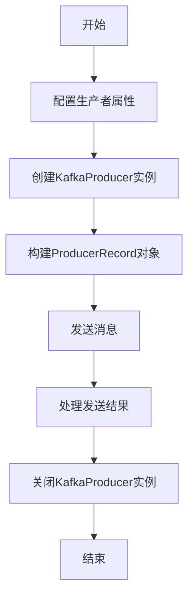

# KafkaGroup：实战代码示例-生产者API使用

## 1.背景介绍

Apache Kafka是一个分布式流处理平台,它提供了一种统一、高吞吐、低延迟的方式来处理实时数据流。Kafka被广泛应用于日志收集、消息系统、数据管道、流式处理、事件源等多种场景。其核心概念是将消息流组织为不同的主题(Topics)。

生产者(Producer)是Kafka的一个重要组件,它负责向Kafka集群发送消息。生产者可以是任何能够生成消息的应用程序或系统,例如Web服务器、物联网设备、日志文件等。生产者通过Kafka提供的API将消息发布到特定的主题中。

本文将重点介绍Kafka生产者API的使用,包括核心概念、关键算法原理、代码实现示例、实际应用场景等,旨在帮助读者深入理解并掌握Kafka生产者的使用方法。

## 2.核心概念与联系

在探讨Kafka生产者API之前,我们需要了解一些核心概念:

1. **Topic(主题)**: Topic是Kafka中的消息逻辑队列,生产者向Topic发送消息,消费者从Topic订阅并消费消息。每个Topic由一个或多个Partition组成。

2. **Partition(分区)**: Partition是Topic的物理分区,每个Partition都是一个有序、不可变的消息序列。Partition可以分布在不同的Broker上,以提供负载均衡和容错能力。

3. **Broker**: Broker是Kafka集群中的单个服务器实例,它负责维护一组Partition。生产者和消费者通过Broker与Kafka集群进行交互。

4. **Producer**: Producer是生产消息并将其发送到Kafka集群的应用程序或系统。

5. **Consumer**: Consumer是从Kafka集群订阅并消费消息的应用程序或系统。

6. **Replication(复制)**: Kafka通过在多个Broker上复制Partition来实现容错和高可用性。

7. **Leader和Follower**: 对于每个Partition,其中一个Broker被选举为Leader,负责处理生产者的写入请求和消费者的读取请求。其他Broker作为Follower,从Leader复制数据。

这些核心概念相互关联,构成了Kafka的基本架构和工作原理。生产者API主要与Topic、Partition、Broker等概念密切相关。

## 3.核心算法原理具体操作步骤

Kafka生产者API的核心算法原理包括以下几个方面:

1. **分区策略(Partitioning Strategy)**

生产者需要决定将消息发送到哪个Partition。Kafka提供了几种分区策略:

- 轮询(Round-Robin)策略: 将消息顺序发送到不同的Partition。
- 键(Key)哈希策略: 根据消息的键(Key)计算哈希值,将相同键的消息发送到同一个Partition。
- 自定义分区策略: 用户可以实现自己的分区策略。

2. **消息批处理(Message Batching)**

为了提高吞吐量,生产者会将多条消息批量发送到同一个Partition,而不是一次发送一条消息。

3. **消息压缩(Message Compression)**

为了减少网络传输开销,生产者可以对消息进行压缩,Kafka支持多种压缩算法,如GZIP、Snappy等。

4. **重试和故障恢复(Retries and Fault Tolerance)**

当发送消息失败时,生产者会自动重试。如果重试次数超过限制,生产者会将消息发送到其他Partition或Broker。

5. **幂等性(Idempotence)**

为了防止重复消息,Kafka生产者API支持幂等性。每条消息都有一个序列号,Broker会跟踪并去重相同序列号的消息。

6. **事务(Transactions)**

Kafka支持事务,允许将多个操作(如发送消息到多个Topic)作为一个原子单元执行,要么全部成功,要么全部失败。

以下是Kafka生产者API的典型使用步骤:

1. 创建`KafkaProducer`实例,配置必要的属性,如`bootstrap.servers`、`key.serializer`、`value.serializer`等。

2. 构建`ProducerRecord`对象,指定Topic、Partition、Key、Value等信息。

3. 调用`KafkaProducer.send()`方法发送消息,可选择同步或异步方式。

4. 处理发送结果,如检查异常、获取元数据等。

5. 关闭`KafkaProducer`实例。

## 4.数学模型和公式详细讲解举例说明

在Kafka生产者API中,分区策略和消息压缩涉及到一些数学模型和公式。

### 4.1 分区策略

Kafka的键(Key)哈希分区策略采用了一种简单但高效的哈希函数,称为murmur2哈希算法。该算法具有良好的性能和分布特性,可以将键均匀地分布到不同的Partition中。

murmur2哈希算法的核心公式如下:

$$
h = \text{murmur2}(key)
$$

$$
partition = h \bmod numPartitions
$$

其中,`key`是消息的键,`numPartitions`是Topic的分区数量。`murmur2()`函数将键映射到一个32位或64位的哈希值,然后对分区数量取模,得到目标Partition的索引。

例如,假设Topic有6个Partition,键为"hello"的消息经过murmur2哈希后得到哈希值`1234567`,则该消息将被发送到第`1234567 % 6 = 1`个Partition。

### 4.2 消息压缩

Kafka支持多种压缩算法,如GZIP、Snappy等。这些算法通过不同的数学模型和公式来实现数据压缩和解压缩。

以GZIP为例,它采用了DEFLATE算法进行压缩,DEFLATE算法基于LZ77编码和哈夫曼编码。LZ77编码利用数据中的重复模式来减小数据量,而哈夫曼编码则根据数据的统计特性为每个符号分配不同长度的编码。

GZIP压缩的核心公式如下:

$$
C(x) = LZ77(x) + Huffman(LZ77(x))
$$

其中,`C(x)`是压缩后的数据,`LZ77(x)`是LZ77编码的结果,`Huffman(LZ77(x))`是对LZ77编码结果进行哈夫曼编码的结果。

例如,假设原始数据为"aaaabbbcccdddd",经过LZ77编码后可表示为"a4b3c3d4",然后对"a4b3c3d4"进行哈夫曼编码,得到压缩后的数据。

## 5.项目实践：代码实例和详细解释说明

下面是一个使用Kafka生产者API发送消息的Java代码示例:

```java
import org.apache.kafka.clients.producer.KafkaProducer;
import org.apache.kafka.clients.producer.ProducerRecord;
import org.apache.kafka.common.serialization.StringSerializer;

import java.util.Properties;

public class KafkaProducerExample {
    public static void main(String[] args) {
        // 配置Kafka生产者属性
        Properties props = new Properties();
        props.put("bootstrap.servers", "localhost:9092");
        props.put("key.serializer", StringSerializer.class.getName());
        props.put("value.serializer", StringSerializer.class.getName());

        // 创建Kafka生产者实例
        KafkaProducer<String, String> producer = new KafkaProducer<>(props);

        // 构建ProducerRecord对象
        ProducerRecord<String, String> record = new ProducerRecord<>("my-topic", "key", "value");

        // 发送消息
        producer.send(record, (metadata, exception) -> {
            if (exception == null) {
                System.out.println("Message sent successfully: " + metadata.toString());
            } else {
                System.err.println("Failed to send message: " + exception.getMessage());
            }
        });

        // 关闭Kafka生产者
        producer.flush();
        producer.close();
    }
}
```

代码解释:

1. 首先配置Kafka生产者的属性,包括`bootstrap.servers`(Kafka集群地址)、`key.serializer`(键序列化器)和`value.serializer`(值序列化器)。

2. 创建`KafkaProducer`实例,传入配置属性。

3. 构建`ProducerRecord`对象,指定Topic名称、键(Key)和值(Value)。

4. 调用`KafkaProducer.send()`方法发送消息。该方法有两个参数:
   - `ProducerRecord`对象,包含要发送的消息数据。
   - 回调函数,用于处理发送结果。在回调函数中,可以获取消息元数据(如偏移量)或处理异常。

5. 调用`producer.flush()`将所有缓冲区数据刷新到Kafka集群。

6. 调用`producer.close()`关闭Kafka生产者实例。

### 5.1 Mermaid流程图

以下是Kafka生产者API发送消息的基本流程图:



### 5.2 代码详细解释

1. **配置生产者属性**

   ```java
   Properties props = new Properties();
   props.put("bootstrap.servers", "localhost:9092");
   props.put("key.serializer", StringSerializer.class.getName());
   props.put("value.serializer", StringSerializer.class.getName());
   ```

   这段代码配置了Kafka生产者的基本属性:

   - `bootstrap.servers`: Kafka集群地址,用于初始化连接。
   - `key.serializer`: 键序列化器,用于将键对象序列化为字节数组。这里使用`StringSerializer`将键序列化为字符串。
   - `value.serializer`: 值序列化器,用于将值对象序列化为字节数组。这里也使用`StringSerializer`将值序列化为字符串。

2. **创建KafkaProducer实例**

   ```java
   KafkaProducer<String, String> producer = new KafkaProducer<>(props);
   ```

   使用配置属性创建`KafkaProducer`实例。`KafkaProducer`是一个泛型类,需要指定键和值的类型。在这个例子中,键和值都是字符串类型。

3. **构建ProducerRecord对象**

   ```java
   ProducerRecord<String, String> record = new ProducerRecord<>("my-topic", "key", "value");
   ```

   构建`ProducerRecord`对象,该对象包含要发送的消息数据。`ProducerRecord`的构造函数接受以下参数:

   - `"my-topic"`: 目标Topic名称。
   - `"key"`: 消息的键。
   - `"value"`: 消息的值。

4. **发送消息**

   ```java
   producer.send(record, (metadata, exception) -> {
       if (exception == null) {
           System.out.println("Message sent successfully: " + metadata.toString());
       } else {
           System.err.println("Failed to send message: " + exception.getMessage());
       }
   });
   ```

   调用`KafkaProducer.send()`方法发送消息。该方法有两个参数:

   - `record`: 要发送的`ProducerRecord`对象。
   - 回调函数: 一个Lambda表达式,用于处理发送结果。回调函数接收两个参数:
     - `metadata`: 包含消息元数据的对象,如偏移量、分区等。
     - `exception`: 发送过程中抛出的任何异常。

   在回调函数中,我们检查`exception`是否为null。如果为null,则打印成功消息和元数据信息;否则,打印失败消息和异常信息。

5. **关闭KafkaProducer实例**

   ```java
   producer.flush();
   producer.close();
   ```

   发送完消息后,需要调用`producer.flush()`将所有缓冲区数据刷新到Kafka集群,然后调用`producer.close()`关闭`KafkaProducer`实例,释放资源。

## 6.实际应用场景

Kafka生产者API广泛应用于各种场景,包括但不限于:

1. **日志收集**: 将应用程序、系统或服务器的日志数据发送到Kafka,以便进行集中存储、处理和分析。

2. **消息队列**: Kafka可以作为一个高性能、可靠的消息队列系统,生产者将消息发送到Kafka,消费者从Kafka订阅并消费消息。

3. **数据管道**: 将各种来源的数据(如数据库、文件、传感器等)通过Kafka生产者发送到Kafka集群,构建实时数据管道。

4. **事件驱动架构**: 在事件驱动架构中,生产者将事件发布到Kafka,消费者订阅并响应这些事件。

5. **物联网(IoT)**: 将来自各种物联网设备的数据流通过Kafka生