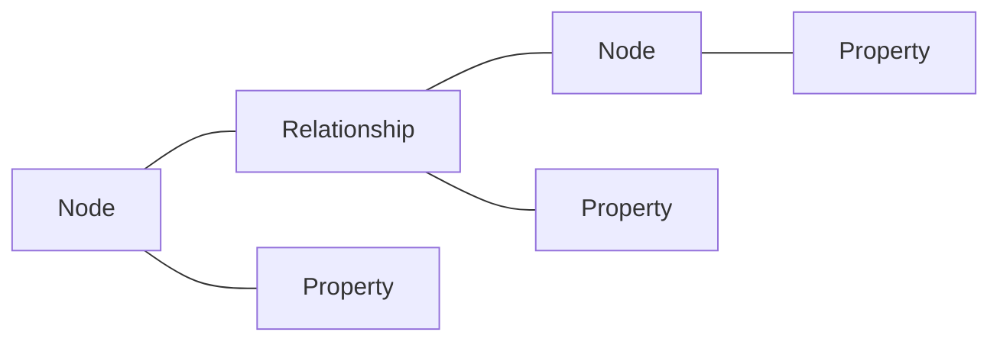

# Neo4j原理与代码实例讲解

## 1.背景介绍

### 1.1 图数据库的兴起

在大数据时代,传统的关系型数据库在处理高度关联的复杂数据时往往力不从心。图数据库作为一种新兴的 NoSQL 数据库,以图这种数据结构存储和查询数据,天然适合处理高度关联的数据。近年来,图数据库在社交网络、金融风控、知识图谱、推荐系统等领域得到广泛应用。

### 1.2 Neo4j 简介

Neo4j 是目前最流行的原生图数据库之一,使用属性图模型,具有高可用、高性能、ACID 事务等特性。Neo4j 使用 Cypher 作为查询语言,Cypher 是一种声明式的图查询语言,语法简洁,非常容易上手。同时 Neo4j 还提供了 Java、Python、JavaScript 等多种语言的驱动,方便集成到各种系统中。

## 2.核心概念与联系

### 2.1 属性图模型

Neo4j 使用属性图模型来表示和存储数据。属性图由节点(Node)和关系(Relationship)构成,节点和关系都可以包含属性(Property)。



### 2.2 节点

节点用来表示实体,例如人、地点、事物等。节点可以包含多个属性,属性是 key-value 对。例如:

```cypher
(p:Person {name: "John", age: 30})
```

### 2.3 关系

关系用来表示节点之间的联系,例如人际关系、位置关系等。关系有方向,包含起始节点和结束节点。关系也可以包含属性。例如:

```cypher
(p1:Person)-[:KNOWS {since: 2010}]->(p2:Person)
```

### 2.4 标签和索引

可以为节点设置一个或多个标签(Label),表示节点的类型或角色。标签可以用来归类节点,提高查询性能。Neo4j 支持在标签的属性上创建索引,来加速节点的查找。

## 3.核心算法原理具体操作步骤

### 3.1 Cypher 查询

Cypher 是 Neo4j 的声明式查询语言,用于在图数据库中检索和更新数据。Cypher 的语法模式类似于 SQL,但专门用于图数据。

Cypher 查询通常由以下几个部分组成:

1. 匹配(MATCH):指定要查找的节点和关系的模式。
2. 条件(WHERE):指定过滤条件。
3. 返回(RETURN):指定要返回的结果。
4. 创建(CREATE):创建新的节点和关系。
5. 删除(DELETE):删除节点和关系。

例如,查找名为 "John" 的人:

```cypher
MATCH (p:Person {name: "John"}) 
RETURN p
```

### 3.2 最短路径算法

图数据库的一个常见应用是寻找两个节点之间的最短路径。Neo4j 提供了内置的最短路径算法,可以高效地找到两个节点之间的最短路径。

最短路径查询的 Cypher 语法:

```cypher
MATCH path = shortestPath((src:Node)-[*]-(dest:Node))
WHERE src.id = 1 AND dest.id = 10
RETURN path
```

### 3.3 社区检测算法

社区检测是图数据分析的一个重要任务,目的是找到图中的紧密连接的节点社区。Neo4j 提供了几种常用的社区检测算法,例如 Label Propagation 算法和 Louvain 算法。

Label Propagation 算法的步骤:

1. 为每个节点分配一个唯一的标签。
2. 对每个节点,统计其邻居节点的标签,并将出现次数最多的标签作为该节点的新标签。
3. 重复步骤2,直到标签不再变化。

## 4.数学模型和公式详细讲解举例说明

### 4.1 图的数学定义

图 $G$ 由节点集 $V$ 和边集 $E$ 组成,记作 $G=(V,E)$。对于无向图,若节点 $v_i$ 和 $v_j$ 之间有边相连,则 $(v_i, v_j) \in E$;对于有向图,若存在从节点 $v_i$ 到 $v_j$ 的有向边,则 $(v_i, v_j) \in E$。

### 4.2 节点度和图密度

节点的度表示与该节点相连的边的数量。对于无向图,节点 $v_i$ 的度记作:

$$
degree(v_i) = \sum_{j=1}^{n} a_{ij}
$$

其中 $a_{ij}$ 是邻接矩阵的元素,当节点 $v_i$ 和 $v_j$ 之间有边相连时, $a_{ij}=1$,否则为0。

图的密度表示图中实际存在的边数与最大可能边数之比,对于无向图,密度为:

$$
density = \frac{2|E|}{|V|(|V|-1)}
$$

### 4.3 最短路径算法

Dijkstra 算法是一种经典的单源最短路径算法,用于计算从起始节点到图中其他所有节点的最短路径。算法的步骤如下:

1. 初始化起始节点的距离为0,其他节点的距离为无穷大。
2. 将起始节点加入已访问节点集合。
3. 对于已访问节点集合中的每个节点,更新其邻居节点的距离。
4. 从未访问节点集合中选择距离最小的节点,加入已访问节点集合。
5. 重复步骤3和4,直到所有节点都被访问。

设节点 $v_i$ 到起始节点的距离为 $d_i$,节点 $v_i$ 到节点 $v_j$ 的边权为 $w_{ij}$,则距离更新公式为:

$$
d_j = min(d_j, d_i + w_{ij})
$$

## 5.项目实践：代码实例和详细解释说明

### 5.1 创建和查询节点

```java
// 创建节点
Node john = tx.createNode(Label.label("Person"));
john.setProperty("name", "John");
john.setProperty("age", 30);

// 查询节点
try (Transaction tx = graphDb.beginTx()) {
    Result result = tx.execute("MATCH (p:Person {name: $name}) RETURN p", 
        parameters("name", "John"));
    while (result.hasNext()) {
        Node node = result.next().get("p").asNode();
        System.out.println("Found node: " + node.getProperty("name"));
    }
}
```

### 5.2 创建和查询关系

```java
// 创建关系
Node alice = tx.createNode(Label.label("Person"));
alice.setProperty("name", "Alice");
Relationship relationship = john.createRelationshipTo(alice, RelationshipType.withName("KNOWS"));
relationship.setProperty("since", 2010);

// 查询关系
try (Transaction tx = graphDb.beginTx()) {
    Result result = tx.execute("MATCH (p1:Person)-[r:KNOWS]->(p2:Person) RETURN p1, r, p2");
    while (result.hasNext()) {
        Map<String, Object> map = result.next();
        Node p1 = (Node) map.get("p1");
        Node p2 = (Node) map.get("p2");
        Relationship r = (Relationship) map.get("r");
        System.out.println(p1.getProperty("name") + " knows " + p2.getProperty("name") + " since " + r.getProperty("since"));
    }
}
```

### 5.3 最短路径查询

```java
try (Transaction tx = graphDb.beginTx()) {
    Result result = tx.execute("MATCH path = shortestPath((src:Person {name: $src})-[*]-(dest:Person {name: $dest})) RETURN path", 
        parameters("src", "John", "dest", "Alice"));
    while (result.hasNext()) {
        Map<String, Object> map = result.next();
        Path path = (Path) map.get("path");
        System.out.println("Shortest path: " + path);
    }
}
```

## 6.实际应用场景

### 6.1 社交网络分析

图数据库在社交网络分析中有着广泛的应用,例如:

- 好友推荐:通过分析用户的共同好友、兴趣爱好等,推荐潜在的好友。
- 社区发现:通过社区检测算法,发现社交网络中的紧密社区。
- 影响力分析:通过分析用户在社交网络中的影响力,发现关键意见领袖。

### 6.2 金融风控

在金融领域,图数据库可以用于风险控制和反欺诈,例如:

- 关联分析:通过分析交易、用户、设备等之间的关联,发现欺诈行为。
- 风险传播:通过分析风险在交易网络中的传播,评估系统性风险。

### 6.3 知识图谱

知识图谱是结构化的知识库,描述实体及其之间的关系。图数据库是构建知识图谱的理想选择。知识图谱的应用包括:

- 智能问答:通过知识图谱实现自然语言问答。
- 推荐系统:利用知识图谱为用户提供个性化推荐。

## 7.工具和资源推荐

- Neo4j 官方网站:https://neo4j.com/
- Neo4j 官方文档:https://neo4j.com/docs/
- Neo4j 社区:https://community.neo4j.com/
- Awesome Procedures on Cypher(APOC):Neo4j 的一个强大的存储过程库,https://neo4j.com/labs/apoc/
- Cypher 函数库:https://neo4j.com/docs/cypher-manual/current/functions/
- 图算法库:https://neo4j.com/docs/graph-algorithms/current/

## 8.总结：未来发展趋势与挑战

图数据库正处于快速发展阶段,未来的发展趋势包括:

- 图神经网络:将图神经网络与图数据库相结合,实现高效的图表示学习和图分析。
- 分布式图数据库:开发可扩展的分布式图数据库,支持大规模图数据的存储和计算。 
- 图可视化:开发更加友好、交互性更强的图可视化工具,方便用户探索和分析图数据。

图数据库也面临一些挑战:

- 标准化:目前图数据库领域缺乏统一的标准,不同的图数据库在数据模型、查询语言等方面存在差异。
- 性能优化:对于大规模图数据,如何优化存储和查询性能是一个挑战。
- 数据隐私:如何在图数据库中保护敏感数据的隐私和安全也是需要关注的问题。

## 9.附录：常见问题与解答

### 9.1 Neo4j 与关系型数据库有何区别?

Neo4j 是原生的图数据库,采用属性图模型,将数据以节点和关系的形式存储。关系型数据库采用表格模型,将数据存储在表和列中。图数据库更适合处理高度关联的数据,查询性能更好。

### 9.2 Neo4j 的 ACID 事务是如何实现的?

Neo4j 完全支持 ACID 事务。所有的读写操作都在事务中进行,可以保证数据的一致性和完整性。Neo4j 使用两阶段提交协议和 Write Ahead Log(WAL) 来实现事务。

### 9.3 Neo4j 如何保证高可用?

Neo4j 支持 Causal Clustering 架构,通过多个 Core 节点和 Read Replica 节点实现高可用。Core 节点负责处理写请求,Read Replica 节点负责处理读请求。当一个 Core 节点失效时,其他 Core 节点可以自动接管,保证系统的可用性。

### 9.4 如何将关系型数据库迁移到 Neo4j?

Neo4j 提供了一些工具,如 neo4j-admin import 命令、APOC 库等,可以将关系型数据库中的数据导入到 Neo4j 中。另外也可以编写程序,将关系型数据转换为 Cypher 语句,批量导入到 Neo4j 中。在迁移过程中,需要根据数据的特点,设计合理的图数据模型。

作者：禅与计算机程序设计艺术 / Zen and the Art of Computer Programming