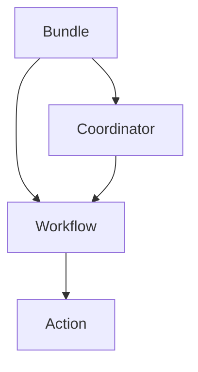
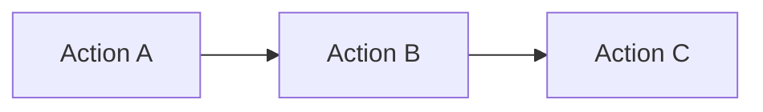

# OozieBundle应用场景:解锁大数据处理的新可能

## 1.背景介绍
### 1.1 大数据处理的挑战
在当今大数据时代,企业面临着海量数据处理的巨大挑战。传统的数据处理方式已经无法满足实时性、并发性和可扩展性的要求。如何高效、灵活地处理和分析大数据,成为企业迫切需要解决的问题。

### 1.2 Apache Oozie的诞生
Apache Oozie作为一个开源的工作流调度系统,应运而生。它为Hadoop生态系统中的各种大数据处理任务提供了统一的调度和管理功能。Oozie支持多种类型的任务,如MapReduce、Hive、Pig、Sqoop等,可以将它们组合成复杂的工作流。

### 1.3 OozieBundle的价值
在Oozie中,Bundle是一个更高层次的抽象概念,用于管理和调度相关的工作流。OozieBundle提供了一种灵活的方式来组织和调度多个工作流,使得大数据处理更加模块化和可重用。它为企业带来了诸多好处,例如简化工作流管理、提高资源利用率、增强任务调度的灵活性等。

## 2.核心概念与联系
### 2.1 Oozie工作流(Workflow)
Oozie工作流是一组有序的动作(Action)组成的有向无环图(DAG)。每个动作代表一个特定的任务,例如MapReduce作业、Hive查询等。工作流定义了任务之间的依赖关系和执行顺序。

### 2.2 Oozie协调器(Coordinator) 
Oozie协调器用于定义和管理基于时间和数据可用性的工作流调度。它允许用户指定工作流的执行时间和频率,以及输入数据的位置。协调器根据配置的时间和数据条件自动触发工作流的执行。

### 2.3 OozieBundle
OozieBundle是一组相关的协调器和工作流的集合。它提供了一种高层次的抽象,用于管理和调度多个协调器和工作流。Bundle允许用户定义一组共享相同配置和参数的协调器和工作流,并统一进行调度和管理。

### 2.4 核心概念之间的关系
下面是Oozie核心概念之间的关系图:



Bundle是最顶层的抽象,它包含了多个Coordinator和Workflow。每个Coordinator负责调度和管理一个或多个Workflow。Workflow由一系列有序的Action组成,每个Action表示一个具体的任务。

## 3.核心算法原理具体操作步骤
### 3.1 OozieBundle的定义
OozieBundle通过一个XML配置文件来定义。该文件包含了Bundle的基本信息、参数配置以及包含的协调器和工作流。下面是一个简单的Bundle定义示例:

```xml
<bundle-app name="my-bundle" xmlns="uri:oozie:bundle:0.2">
    <parameters>
        <property>
            <name>input.dir</name>
            <value>/user/input</value>
        </property>
        <property>
            <name>output.dir</name>
            <value>/user/output</value>
        </property>
    </parameters>

    <coordinator name="my-coord-1">
        <app-path>hdfs://coordinator1.xml</app-path>
        <configuration>
            <property>
                <name>input.dir</name>
                <value>${input.dir}/coord1</value>
            </property>
        </configuration>
    </coordinator>

    <coordinator name="my-coord-2">
        <app-path>hdfs://coordinator2.xml</app-path>
        <configuration>
            <property>
                <name>input.dir</name>
                <value>${input.dir}/coord2</value>
            </property>
        </configuration>
    </coordinator>
</bundle-app>
```

在这个示例中,Bundle包含了两个协调器`my-coord-1`和`my-coord-2`,它们分别对应不同的配置文件。Bundle还定义了一些全局参数,如`input.dir`和`output.dir`,这些参数可以在协调器配置中引用。

### 3.2 OozieBundle的提交和执行
一旦定义好Bundle配置文件,就可以将其提交给Oozie进行执行。提交Bundle的命令如下:

```bash
oozie job -run -config bundle.xml
```

Oozie接收到Bundle作业后,会解析配置文件,并根据定义的协调器和工作流开始调度执行。Bundle作业的执行过程如下:

1. Oozie解析Bundle配置文件,提取协调器和工作流信息。
2. 根据协调器的定义,Oozie创建对应的协调器作业,并开始调度执行。
3. 每个协调器作业根据配置的时间和数据条件,触发相应的工作流执行。
4. 工作流按照定义的任务依赖关系和执行顺序,依次执行各个Action。
5. 当所有协调器作业完成后,Bundle作业执行结束。

### 3.3 OozieBundle的监控和管理
Oozie提供了Web UI和REST API,用于监控和管理Bundle作业的执行情况。通过Web UI,用户可以查看Bundle作业的状态、进度、日志等信息。REST API允许用户以编程方式与Oozie进行交互,例如提交作业、查询状态、停止作业等。

下面是一个使用Oozie REST API提交Bundle作业的示例:

```bash
curl -v -X POST -H "Content-Type: application/xml" -d @bundle.xml http://localhost:11000/oozie/v1/jobs?action=start
```

## 4.数学模型和公式详细讲解举例说明
### 4.1 有向无环图(DAG)模型
Oozie工作流采用有向无环图(DAG)模型来表示任务之间的依赖关系和执行顺序。在DAG中,每个节点表示一个Action,有向边表示Action之间的依赖关系。

假设一个工作流包含三个Action: A、B和C,它们的依赖关系如下:
- A没有依赖,可以直接执行。
- B依赖于A,只有A执行成功后才能执行。
- C依赖于B,只有B执行成功后才能执行。

该工作流的DAG模型可以表示为:



数学上,DAG可以用邻接矩阵来表示。对于上述工作流,其邻接矩阵为:

$$
\begin{bmatrix}
0 & 1 & 0 \\
0 & 0 & 1 \\
0 & 0 & 0
\end{bmatrix}
$$

其中,`1`表示存在依赖关系,`0`表示不存在依赖关系。

### 4.2 时间窗口模型
Oozie协调器使用时间窗口模型来调度工作流的执行。时间窗口定义了一个时间范围,在该范围内,协调器会根据配置的频率触发工作流执行。

假设一个协调器配置如下:
- 开始时间: 2023-01-01T00:00Z
- 结束时间: 2023-01-05T00:00Z
- 频率: 1天

则协调器会在以下时间点触发工作流执行:
- 2023-01-01T00:00Z
- 2023-01-02T00:00Z
- 2023-01-03T00:00Z
- 2023-01-04T00:00Z

数学上,时间窗口可以用区间表示。对于上述协调器,其时间窗口为:

$$
[2023-01-01T00:00Z, 2023-01-05T00:00Z)
$$

协调器根据频率将时间窗口划分为多个子区间,每个子区间触发一次工作流执行。子区间的计算公式为:

$$
[start + i * frequency, start + (i+1) * frequency)
$$

其中,`start`为开始时间,`frequency`为频率,`i`为子区间编号,从0开始。

## 5.项目实践：代码实例和详细解释说明
下面是一个使用Java代码提交和监控OozieBundle作业的示例:

```java
import org.apache.oozie.client.BundleJob;
import org.apache.oozie.client.OozieClient;
import org.apache.oozie.client.OozieClientException;

public class OozieBundleExample {
    private static final String OOZIE_URL = "http://localhost:11000/oozie";
    private static final String BUNDLE_PATH = "/path/to/bundle.xml";

    public static void main(String[] args) throws OozieClientException {
        OozieClient oozieClient = new OozieClient(OOZIE_URL);

        // 提交Bundle作业
        String bundleId = oozieClient.run(BUNDLE_PATH);
        System.out.println("Bundle job submitted with ID: " + bundleId);

        // 监控Bundle作业状态
        while (true) {
            BundleJob bundleJob = oozieClient.getBundleJobInfo(bundleId);
            String status = bundleJob.getStatus().toString();
            System.out.println("Bundle job status: " + status);

            if (status.equals("SUCCEEDED") || status.equals("FAILED") || status.equals("KILLED")) {
                break;
            }

            Thread.sleep(5000); // 等待5秒后再次查询状态
        }

        System.out.println("Bundle job finished.");
    }
}
```

代码解释:
1. 创建一个`OozieClient`对象,指定Oozie服务的URL。
2. 调用`run`方法提交Bundle作业,传入Bundle配置文件的路径。该方法返回Bundle作业的ID。
3. 进入一个循环,不断查询Bundle作业的状态。
4. 使用`getBundleJobInfo`方法获取Bundle作业的信息,并获取其状态。
5. 如果状态为`SUCCEEDED`、`FAILED`或`KILLED`,表示作业已经结束,退出循环。
6. 如果作业还在运行,等待5秒后再次查询状态。

通过这个示例,可以看到使用Java代码与Oozie进行交互是非常简单和直观的。Oozie提供了丰富的客户端API,方便用户以编程方式管理和监控Bundle作业。

## 6.实际应用场景
OozieBundle在实际的大数据处理场景中有广泛的应用。下面是几个典型的应用场景:

### 6.1 数据仓库ETL
在数据仓库的ETL(提取、转换、加载)过程中,通常需要执行一系列的数据处理任务,如数据抽取、清洗、转换、聚合等。使用OozieBundle可以将这些任务组织成一个完整的工作流,并定义任务之间的依赖关系。通过协调器,可以实现定期执行ETL工作流,自动处理新增的数据。

### 6.2 日志分析
在日志分析场景中,经常需要对海量的日志数据进行处理和分析。使用OozieBundle可以定义一个日志处理的工作流,包括日志收集、解析、过滤、统计等步骤。通过协调器,可以实现每天定时执行日志分析工作流,生成报表和统计结果。

### 6.3 机器学习模型训练
机器学习模型的训练过程通常包括数据预处理、特征工程、模型训练、模型评估等步骤。使用OozieBundle可以将这些步骤组织成一个工作流,并定义步骤之间的依赖关系。通过协调器,可以实现定期执行模型训练工作流,自动使用新的训练数据更新模型。

### 6.4 数据管道
在数据管道场景中,数据需要经过一系列的处理和转换,最终流向下游的消费者。使用OozieBundle可以定义一个数据管道的工作流,包括数据采集、清洗、转换、发布等步骤。通过协调器,可以实现实时或准实时地执行数据管道工作流,保证数据的及时传递。

## 7.工具和资源推荐
### 7.1 Oozie官方文档
Oozie官方文档是学习和使用Oozie的重要资源。它提供了详细的用户指南、开发指南和API参考,涵盖了Oozie的各个方面。官方文档地址:https://oozie.apache.org/docs/

### 7.2 Oozie示例代码
Oozie官方提供了一组示例代码,演示了如何使用Oozie实现各种常见的工作流和协调器。这些示例代码是学习Oozie的好材料,可以帮助用户快速上手。示例代码地址:https://github.com/apache/oozie/tree/master/examples

### 7.3 Hue
Hue是一个开源的Hadoop用户界面,它集成了Oozie的功能,提供了可视化的工作流和协调器设计器。通过Hue,用户可以方便地设计、调度和监控Oozie作业,