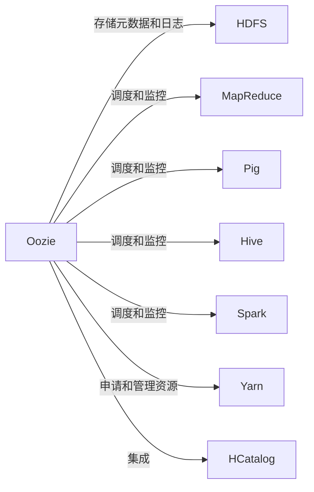
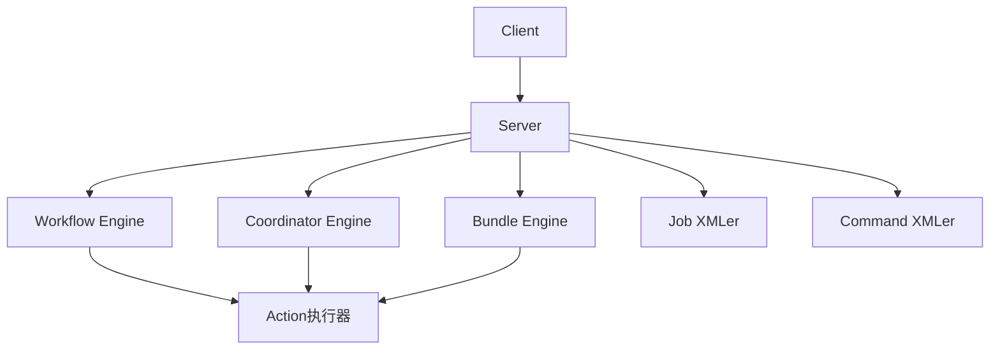

以下是《Oozie原理与代码实例讲解》这篇技术博客文章的正文内容：

# Oozie原理与代码实例讲解

## 1.背景介绍

### 1.1 大数据时代的到来

随着互联网、移动互联网以及物联网的快速发展,数据呈现出爆炸式增长的趋势。根据IDC的预测,到2025年,全球数据球将达到163ZB。传统的数据处理方式已经无法满足大数据时代的需求,这就催生了大数据技术的诞生和发展。

### 1.2 大数据处理的挑战

大数据处理面临着诸多挑战:

- 海量数据存储和管理
- 数据处理的高并发和高吞吐
- 数据处理作业的容错性和可靠性
- 作业调度和协调的复杂性

### 1.3 Hadoop生态系统

为了应对大数据处理的挑战,Hadoop生态圈应运而生。Hadoop生态系统包括了HDFS、MapReduce、Hive、Spark、Kafka、HBase等多种组件,涵盖了大数据处理的方方面面。作为其中的重要一员,Oozie为大数据作业的调度和协调提供了强有力的支持。

## 2.核心概念与联系

### 2.1 Oozie概述

Oozie是Apache旗下的一款开源工作流调度系统,主要用于在Hadoop集群上管理和监控各种作业(Job)。它支持多种类型的Hadoop作业(如Java MapReduce、Pig作业、Hive作业等),并且能够启动、监控和管理这些作业的执行。

### 2.2 Oozie核心概念

- **Workflow作业(WorkflowJob)**: 由一组有序控制的动作(Action)组成的作业。
- **协调作业(CoordinatorJob)**: 由一个或多个相关的Workflow作业组成,用于定期执行某些重复的工作流。
- **Bundle作业(BundleJob)**: 由多个协调作业组成,用于有效管理多个协调作业。

### 2.3 Oozie与Hadoop生态系统的关系

Oozie作为Hadoop生态系统中的工作流调度系统,与其他组件紧密配合:

- 利用HDFS存储作业的元数据和日志
- 调度和监控MapReduce、Pig、Hive等作业
- 与Yarn ResourceManager协作,申请和管理作业所需资源
- 与HCatalog集成,支持Hive元数据的访问



## 3.核心算法原理具体操作步骤 

### 3.1 Oozie体系架构

Oozie采用了经典的三层架构设计,包括Client、Server和Job执行三个层次:

1. **Client层**: 提供命令行或API接口,用于提交和管理作业。
2. **Server层**: 负责解析作业定义,生成并执行作业实例。包括以下关键组件:
   - Workflow Engine: 执行Workflow作业
   - Coordinator Engine: 执行Coordinator作业
   - Bundle Engine: 执行Bundle作业
   - Job XMLer: 解析作业定义XML
   - Command XMLer: 解析命令XML
3. **Job执行层**: 实际执行各种类型的Action。



### 3.2 作业执行流程

1. **Client提交作业**:
   - 用户通过CLI或API提交作业定义(XML文件)
   - Oozie Server接收并解析作业定义
2. **生成作业实例**:
   - Workflow作业: 生成WorkflowJob实例
   - Coordinator作业: 根据时间约束生成多个WorkflowJob实例
   - Bundle作业: 生成多个CoordinatorJob实例
3. **执行作业实例**:
   - Workflow作业: 按Action定义的有序执行流程执行各个Action
   - Coordinator作业: 定期启动对应的Workflow作业实例
   - Bundle作业: 启动对应的Coordinator作业实例
4. **监控和管理**:
   - 通过CLI或Web UI监控作业执行状态
   - 支持重运行、终止、暂停等操作

### 3.3 关键算法和策略

1. **作业调度算法**
   - 基于时间和数据约束触发Coordinator作业
   - 考虑作业优先级、资源可用情况等因素
2. **容错恢复机制**
   - 作业重试策略
   - 作业重启策略
   - 利用HDFS存储元数据和恢复点数据
3. **资源分配策略**
   - 与Yarn ResourceManager协作申请资源
   - 考虑作业优先级、公平调度等因素

## 4.数学模型和公式详细讲解举例说明

Oozie在作业调度和资源分配时,会涉及到一些数学模型和公式计算。下面我们就来详细讲解其中的一些关键模型。

### 4.1 作业优先级计算

Oozie会根据作业的优先级高低来调度作业的执行顺序。作业优先级的计算公式如下:

$$
P = \alpha * T + \beta * R + \gamma * U
$$

其中:
- $P$表示作业的优先级得分
- $T$表示作业的提交时间,越早提交的作业优先级越高
- $R$表示作业所需资源量,资源需求越大的作业优先级越高
- $U$表示作业的用户优先级,可由管理员手动设置
- $\alpha$、$\beta$、$\gamma$为权重系数,反映不同因素的重要程度

### 4.2 公平调度模型

为了防止某些用户的作业长期无法获取资源,Oozie采用了公平调度的策略。其核心思想是为每个用户或队列预留一定的资源量,并根据下面的公式动态调整:

$$
C_i(t+1) = \max\left(A_i(t+1), \min\left(C_i(t),\frac{1}{n}\sum_{i=1}^{n}C_i(t)\right)\right)
$$

其中:
- $C_i(t)$表示第$i$个用户在时刻$t$的资源量配额
- $A_i(t+1)$表示第$i$个用户在时刻$t+1$的资源需求量
- $n$表示用户总数

这个公式保证了每个用户获得的资源量至少为其需求量,同时也会逐步向资源占用较少的用户倾斜,以保证整体的公平性。

### 4.3 作业重试策略

对于失败的作业,Oozie支持重试执行。重试策略可由下面的指数退避公式描述:

$$
W_n = W_0 * \alpha^n
$$

其中:
- $W_n$表示第$n$次重试等待的时间
- $W_0$表示初始等待时间
- $\alpha$是一个大于1的常量,控制等待时间的增长速率

这种重试策略可以避免由于短暂的故障导致作业失败,同时也防止过于频繁的重试导致资源浪费。

## 5.项目实践:代码实例和详细解释说明

为了更好地理解Oozie的使用,我们来看一个基于Oozie的数据处理项目实践。该项目包括三个作业:

1. Hive作业: 从HDFS中抽取原始数据,进行ETL处理,并将结果存储到Hive表中。
2. Spark作业: 从Hive表中读取处理后的数据,利用机器学习算法构建模型。
3. MapReduce作业: 利用构建好的模型对新数据进行批量预测和处理。

### 5.1 项目结构

```
my-oozie-project/
  - workflows/
    - etl-wf.xml             # ETL Workflow作业定义
    - model-training-wf.xml  # 模型训练Workflow作业定义
    - prediction-wf.xml      # 预测Workflow作业定义
  - coordinators/
    - etl-coord.xml          # ETL Coordinator作业定义
    - model-training-coord.xml 
  - bundles/
    - data-processing-bundle.xml # Bundle作业定义
  - lib/                     # 依赖jar包
  - scripts/                 # 作业脚本
  - data/                    # 测试数据
```

### 5.2 作业定义示例

以ETL Workflow作业为例,其定义文件`etl-wf.xml`内容如下:

```xml
<workflow-app name="etl-wf" xmlns="uri:oozie:workflow:0.5">
  <start to="hive-node"/>
  
  <action name="hive-node">
    <hive xmlns="uri:oozie:hive-action:0.5">
      <job-tracker>${jobTracker}</job-tracker>
      <name-node>${nameNode}</name-node>
      <script>scripts/etl.hql</script>
      <file>lib/hive-script.jar</file>
    </hive>
    <ok to="end"/>
    <error to="kill"/>
  </action>
  
  <kill name="kill">
    <message>ETL failed, error message[${wf:errorMessage(wf:lastErrorNode())}]</message>
  </kill>
  
  <end name="end"/>
</workflow-app>
```

这个作业定义包含以下关键部分:

1. `<start>`: 定义作业的入口节点
2. `<action>`: 定义要执行的动作,这里是一个Hive作业
   - 指定Hadoop集群地址
   - 指定Hive脚本路径
   - 指定依赖jar包
3. `<ok>` 和 `<error>`: 定义动作成功和失败后的后续处理流程
4. `<kill>`: 定义作业失败时的错误处理
5. `<end>`: 定义作业的结束节点

### 5.3 作业提交和监控

提交ETL Workflow作业:

```bash
oozie job -config job.properties -run -debug
```

其中`job.properties`包含作业所需的配置参数:

```properties
nameNode=hdfs://nn.example.com:8020
jobTracker=hdfs://jt.example.com:8032
queueName=default

oozie.wf.application.path=${nameNode}/user/${user.name}/my-oozie-project/workflows/etl-wf.xml
```

监控作业状态:

```bash
oozie job -info ${jobId}
```

作业日志:

```
http://oozie.example.com:11000/oozie/?job=${jobId}
```

### 5.4 作业协调

为了定期执行ETL作业,我们可以定义一个Coordinator作业,例如`etl-coord.xml`:

```xml
<coordinator-app ...>
  <start>2023-05-01T08:00Z</start>
  <end>2023-05-31T20:00Z</end>
  <frequency-sync-time>0 1 * * *</frequency-sync-time>
  
  <action>
    <workflow>
      <app-path>${nameNode}/user/${user.name}/my-oozie-project/workflows/etl-wf.xml</app-path>
    </workflow>
  </action>
</coordinator-app>
```

这个作业定义规定了:

1. 作业执行的开始和结束时间范围
2. 作业执行的频率(这里是每天1点执行一次)
3. 要执行的Workflow作业路径

我们可以通过`oozie job -start coord-job.xml`来提交Coordinator作业。

## 6.实际应用场景

Oozie作为大数据领域的工作流调度引擎,可以广泛应用于各种场景,例如:

1. **数据处理流水线**
   - 定期从各种数据源抽取数据
   - 对数据进行清洗、转换和加载到数据仓库
   - 生成数据产品或应用于机器学习模型训练
2. **大数据分析**
   - 协调Hive、Spark等分析作业的执行
   - 生成分析报告并发送给订阅者
3. **ETL数据集成**
   - 从多个异构数据源提取数据
   - 转换并加载到统一的数据平台
4. **机器学习流水线**
   - 从数据源获取训练数据
   - 训练模型并评估性能
   - 将模型部署到生产环境
5. **数据质量监控**
   - 定期执行数据质量检查作业
   - 生成报告并发送告警

## 7.工具和资源推荐

在使用Oozie进行大数据工作流调度时,以下工