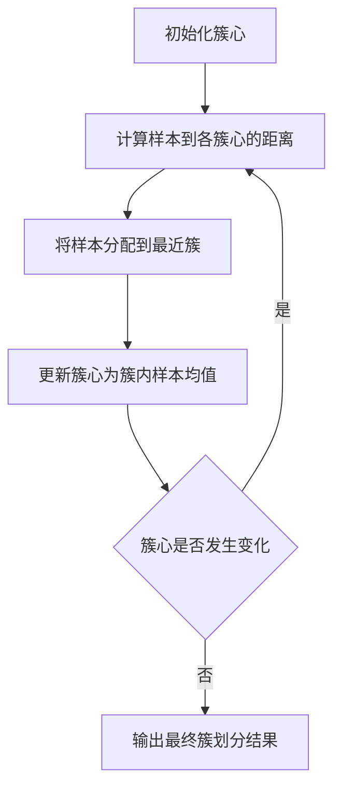

# Python机器学习实战：K均值聚类算法及其在Python中的实战

## 1.背景介绍

### 1.1 什么是聚类

聚类是一种无监督学习技术,旨在将未标记的数据对象划分为多个组(称为簇或聚类),使得同一簇内的对象相似度较高,而不同簇之间的对象相似度较低。聚类分析广泛应用于数据挖掘、图像分析、生物信息学、计算机视觉等领域。

### 1.2 聚类算法分类

常见的聚类算法有:

- **分区聚类算法**:K-Means、K-Medoids
- **层次聚类算法**:BIRCH、CURE
- **密度聚类算法**:DBSCAN、OPTICS
- **基于网格的算法**:STING
- **基于模型的算法**:EM算法、概率聚类模型

其中,K-Means是最经典和最广泛使用的聚类算法之一。

### 1.3 K-Means聚类算法概述

K-Means聚类算法的核心思想是通过迭代最小化样本到聚类中心的距离平方和,将数据集划分为K个互不相交的簇。算法具有以下优点:

- 原理简单、容易实现
- 可伸缩性好,适用于大规模数据集
- 高效率,时间复杂度为O(nkt),n为样本数,k为簇数,t为迭代次数

但K-Means也存在一些缺陷,如簇形状受限于球形、对噪声和异常值敏感等。

## 2.核心概念与联系

### 2.1 簇心

簇心(Cluster Centroid)是簇内所有样本的中心点,可以是样本的均值或中位数。K-Means使用簇内样本的均值作为簇心。

### 2.2 簇间距离度量

K-Means通常采用欧几里得距离或曼哈顿距离来度量样本与簇心之间的距离。

欧几里得距离:
$$dist(x,c)=\sqrt{\sum_{i=1}^{n}(x_i-c_i)^2}$$

曼哈顿距离:
$$dist(x,c)=\sum_{i=1}^{n}|x_i-c_i|$$

其中$x$为样本点,$c$为簇心。

### 2.3 簇内平方和

簇内平方和(Within-Cluster Sum of Squares,WCSS)是衡量簇内样本与簇心距离的指标,用于评估聚类质量。WCSS值越小,说明簇内样本越紧凑。

$$WCSS=\sum_{i=1}^{k}\sum_{x\in C_i}dist(x,c_i)^2$$

其中$k$为簇数,$C_i$为第$i$个簇,$c_i$为第$i$个簇的簇心。

## 3.核心算法原理具体操作步骤 

K-Means算法的执行步骤如下:



1. **初始化簇心**:从数据集中随机选择K个样本作为初始簇心。
2. **计算样本到各簇心的距离**:对于每个样本,计算其到K个簇心的距离。
3. **将样本分配到最近簇**:将每个样本分配到距离最近的簇。
4. **更新簇心**:重新计算每个簇的簇心,即簇内所有样本的均值。
5. **判断簇心是否变化**:如果簇心发生变化,则回到步骤2,重复迭代;否则算法收敛,输出最终簇划分结果。

该算法通过不断迭代优化簇心和样本分配,最终使WCSS达到局部最小值。

## 4.数学模型和公式详细讲解举例说明

### 4.1 K-Means目标函数

K-Means的目标是最小化所有簇的WCSS,即:

$$\underset{S}{\mathrm{minimize}}\sum_{i=1}^{k}\sum_{x\in C_i}dist(x,c_i)^2$$

其中$S=\{C_1,C_2,...,C_k\}$表示数据集$X$的一种划分,$c_i$为第$i$个簇的簇心。

### 4.2 期望最大化算法求解

K-Means可以通过期望最大化(Expectation-Maximization,EM)算法求解。具体步骤如下:

1. **E步骤(Expectation)**:计算每个样本$x$属于第$j$个簇的概率(后验概率):

$$p(j|x)=\frac{\pi_jN(x|\mu_j,\Sigma_j)}{\sum_{l=1}^k\pi_lN(x|\mu_l,\Sigma_l)}$$

其中$\pi_j$为第$j$个簇的先验概率,$N(x|\mu_j,\Sigma_j)$为$x$在第$j$个簇的高斯分布密度。

2. **M步骤(Maximization)**:根据后验概率,更新每个簇的参数(均值向量$\mu_j$、协方差矩阵$\Sigma_j$和先验概率$\pi_j$):

$$\mu_j=\frac{1}{N_j}\sum_{n=1}^Np(j|x_n)x_n$$
$$\Sigma_j=\frac{1}{N_j}\sum_{n=1}^Np(j|x_n)(x_n-\mu_j)(x_n-\mu_j)^T$$
$$\pi_j=\frac{N_j}{N}$$

其中$N_j=\sum_{n=1}^Np(j|x_n)$为第$j$个簇的有效样本数。

3. 重复E步骤和M步骤,直至收敛。

通过EM算法,K-Means可以找到局部最优解,但结果依赖于初始簇心的选择。

### 4.3 算法复杂度分析

假设数据集包含$N$个$D$维样本,聚类簇数为$K$,迭代次数为$t$:

- 计算样本到簇心距离的时间复杂度为$O(NKD)$
- 更新簇心的时间复杂度为$O(NKD)$
- 总的时间复杂度为$O(NKDt)$

当$K\ll N$时,算法对大规模数据集有良好的可伸缩性。

### 4.4 K-Means算法缺陷

尽管K-Means算法简单高效,但也存在一些缺陷:

- 需要预先指定簇数K,不同K值会导致结果差异较大
- 对异常值和噪声敏感,簇心会受到异常点的影响
- 只能发现球形或同心圆形状的簇,对其他形状簇效果不佳
- 可能收敛于局部最优解,结果依赖于初始簇心选择

因此,K-Means适用于发现球形簇的场景,对于其他形状簇或有噪声数据,需结合其他聚类算法使用。

## 5.项目实践:代码实例和详细解释说明

以下是使用Python的Scikit-Learn库实现K-Means聚类的代码示例:

```python
from sklearn.cluster import KMeans
import numpy as np

# 生成示例数据
X = np.array([[1, 2], [1, 4], [1, 0],
              [10, 2], [10, 4], [10, 0]])

# 初始化KMeans模型,设置簇数为2              
kmeans = KMeans(n_clusters=2, random_state=0)

# 模型训练
kmeans.fit(X)

# 输出簇心
print("Cluster Centers:")
print(kmeans.cluster_centers_)

# 输出每个样本的簇标签
print("Labels:")  
print(kmeans.labels_)

# 输出WCSS得分
print("WCSS Score:")
print(kmeans.inertia_)
```

代码解释:

1. 导入KMeans类和NumPy库。
2. 创建一个包含6个二维样本点的示例数据集X。
3. 初始化KMeans模型,设置簇数为2,random_state用于重现结果。
4. 在数据集X上训练模型,通过fit()方法确定簇心和样本簇划分。
5. 输出模型得到的簇心坐标。
6. 输出每个样本的簇标签(0或1)。
7. 输出模型的WCSS得分,用于评估聚类质量。

运行结果:

```
Cluster Centers:
[[10.          2.        ]
 [ 1.          2.        ]]
Labels:
[1 1 1 0 0 0]
WCSS Score:
8.000000000000002
```

可以看出,算法将6个样本划分为两个簇,簇心分别为(10.0, 2.0)和(1.0, 2.0)。WCSS得分为8.0,表示簇内样本与簇心的距离平方和。

## 6.实际应用场景

K-Means聚类算法在现实世界中有广泛的应用,包括但不限于:

### 6.1 客户细分

在市场营销领域,K-Means可用于根据客户的购买模式、人口统计特征等将客户划分为不同的细分市场,从而制定有针对性的营销策略。

### 6.2 图像分割

在计算机视觉领域,K-Means可用于将图像像素根据颜色或纹理特征划分为不同的簇,实现图像分割。

### 6.3 异常检测

通过将正常数据聚类,异常数据将远离任何簇心,从而可以检测出异常值。

### 6.4 推荐系统

在推荐系统中,可以根据用户的浏览记录、购买历史等对用户进行聚类,为相似用户推荐相似的商品或内容。

### 6.5 基因表达分析

在生物信息学中,K-Means可用于根据基因表达水平对基因进行聚类,发现具有相似表达模式的基因组。

## 7.工具和资源推荐

### 7.1 Python库

- **Scikit-Learn**: 机器学习库,提供了KMeans类的实现
- **Pandas**: 数据分析库,用于数据预处理
- **NumPy**: 科学计算库,提供数值计算支持
- **Matplotlib**: 数据可视化库,用于绘制聚类结果

### 7.2 在线工具

- **Weka**: 开源的数据挖掘软件,提供了K-Means等聚类算法
- **Azure ML Studio**: Microsoft的云机器学习工作室,支持可视化构建聚类模型

### 7.3 教程和文档

- 《Python数据挖掘入门与实践》
- 《机器学习实战:基于Scikit-Learn、Keras与TensorFlow》
- Scikit-Learn官方文档:https://scikit-learn.org/stable/modules/clustering.html

## 8.总结:未来发展趋势与挑战

### 8.1 发展趋势

- **集成聚类算法**:结合多种聚类算法的优点,提高聚类性能
- **基于密度的聚类**:能发现任意形状簇,对噪声更加鲁棒
- **半监督聚类**:利用少量标记数据提高聚类质量
- **深度聚类**:将深度学习模型应用于聚类任务
- **流式聚类**:能够高效处理动态数据流

### 8.2 挑战

- **高维数据聚类**:在高维空间中,距离计算失去意义,传统聚类算法效果下降
- **异构数据聚类**:如何有效聚类包含不同数据类型(数值、类别等)的异构数据
- **大规模数据聚类**:对于海量数据,现有算法在计算和存储方面面临挑战
- **聚类评估**:缺乏统一的聚类质量评估标准
- **可解释性**:聚类结果缺乏可解释性,难以被人类理解

## 9.附录:常见问题与解答

### 9.1 如何选择最佳簇数K?

没有放之四射的方法确定最优K值。常用的方法包括:

- **肘部法则**:通过绘制WCSS-K曲线,选取曲线拐点处的K值
- **轮廓系数**:计算簇内相似度和簇间相似度的比值,选取最大值对应的K
- **Gap统计量**:通过对参考数据集(无簇结构)的WCSS进行标准化,选取Gap值最大时的K

### 9.2 K-Means收敛于局部最优解怎么办?

可以尝试以下策略:

- 多次随机初始化簇心,选取WCSS最小的结果