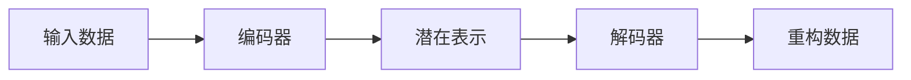

# Python深度学习实践：自动编码器在数据降维中的应用

## 1.背景介绍

在现代数据科学和机器学习领域中,高维数据处理是一个常见的挑战。许多真实世界的数据集包含大量的特征,这些特征往往存在高度的冗余和噪声。高维数据不仅增加了计算复杂性,还容易导致维数灾难(curse of dimensionality)问题,从而影响模型的性能和泛化能力。因此,数据降维技术应运而生,旨在从高维数据中提取出最有价值的低维表示,同时保留数据的主要特征和结构。

自动编码器(Autoencoder)是一种无监督深度学习模型,被广泛应用于数据降维、特征提取和表示学习等领域。它通过学习数据的压缩表示和重构过程,实现了对高维数据的有效降维,并且能够捕捉数据的内在结构和模式。自动编码器的优势在于无需人工设计特征提取算法,而是通过端到端的训练自动学习数据的低维表示。

## 2.核心概念与联系

### 2.1 自动编码器的基本结构

自动编码器由两部分组成:编码器(Encoder)和解码器(Decoder)。编码器将高维输入数据映射到低维潜在空间,而解码器则将低维潜在表示重构回原始高维空间。这种结构使自动编码器能够同时学习数据的压缩表示和重构过程。



### 2.2 自动编码器的损失函数

自动编码器的训练目标是使重构数据尽可能接近原始输入数据。因此,损失函数通常定义为输入数据和重构数据之间的差异,例如均方误差(MSE)或交叉熵损失。通过最小化损失函数,自动编码器可以学习到最优的编码器和解码器参数。

$$J(\theta) = \frac{1}{n}\sum_{i=1}^{n}L(x^{(i)}, \hat{x}^{(i)})$$

其中,$J(\theta)$是损失函数,$x^{(i)}$是输入数据,$\hat{x}^{(i)}$是重构数据,$L$是指定的损失函数,$\theta$是自动编码器的参数。

## 3.核心算法原理具体操作步骤

### 3.1 编码器

编码器的作用是将高维输入数据$x$映射到低维潜在表示$z$。这通常由一系列全连接层或卷积层组成,每一层都会逐步降低数据的维度。编码器的输出$z$就是压缩后的低维表示,它捕捉了输入数据的最重要特征。

$$z = f_{\theta}(x)$$

其中,$f_{\theta}$是编码器的函数,由神经网络参数$\theta$确定。

### 3.2 解码器

解码器的作用是将低维潜在表示$z$重构回高维空间,得到与原始输入$x$尽可能接近的重构数据$\hat{x}$。解码器的结构通常是编码器的逆过程,由一系列上采样或反卷积层组成。

$$\hat{x} = g_{\phi}(z)$$

其中,$g_{\phi}$是解码器的函数,由神经网络参数$\phi$确定。

### 3.3 训练过程

自动编码器的训练过程是端到端的,即同时优化编码器和解码器的参数。具体步骤如下:

1. 初始化编码器和解码器的参数$\theta$和$\phi$。
2. 对于每个输入样本$x^{(i)}$:
   - 通过编码器得到潜在表示$z^{(i)} = f_{\theta}(x^{(i)})$。
   - 通过解码器得到重构数据$\hat{x}^{(i)} = g_{\phi}(z^{(i)})$。
   - 计算重构损失$L(x^{(i)}, \hat{x}^{(i)})$。
3. 计算整个数据集上的总损失$J(\theta, \phi)$。
4. 通过反向传播算法计算参数梯度,并使用优化算法(如随机梯度下降)更新参数$\theta$和$\phi$。
5. 重复步骤2-4,直到模型收敛或达到最大迭代次数。

通过这种端到端的训练方式,自动编码器可以自动学习到最优的编码器和解码器参数,从而实现高效的数据降维和重构。

## 4.数学模型和公式详细讲解举例说明

### 4.1 稀疏自动编码器

为了获得更加鲁棒和具有判别力的特征表示,我们可以在自动编码器的基础上引入稀疏性约束。稀疏自动编码器通过在损失函数中添加正则化项,鼓励潜在表示$z$的活跃单元(非零值)保持在一定的稀疏程度。

$$J_{sparse}(\theta, \phi) = J(\theta, \phi) + \Omega(z)$$

其中,$\Omega(z)$是稀疏性正则化项,可以采用$L_1$范数或KL散度等形式。

例如,使用KL散度作为稀疏性约束:

$$\Omega(z) = \sum_{j=1}^{d_z}\rho\log\frac{\rho}{\hat{\rho}_j} + (1-\rho)\log\frac{1-\rho}{1-\hat{\rho}_j}$$

其中,$d_z$是潜在表示$z$的维度,$\rho$是期望的稀疏程度(活跃单元的比例),$\hat{\rho}_j$是第$j$个单元的实际活跃程度。

通过引入稀疏性约束,自动编码器能够学习到更加鲁棒和具有判别力的特征表示,从而提高模型的性能和泛化能力。

### 4.2 变分自动编码器

变分自动编码器(Variational Autoencoder, VAE)是一种基于贝叶斯原理的生成模型,它将自动编码器与变分推断(Variational Inference)相结合,旨在学习数据的潜在分布。与传统自动编码器不同,VAE假设潜在表示$z$服从某种先验分布(通常是高斯分布),并通过变分推断的方式近似后验分布$q(z|x)$。

VAE的损失函数包括两个部分:重构损失和KL散度项。

$$J_{VAE}(\theta, \phi) = \mathbb{E}_{q(z|x)}[\log p_{\theta}(x|z)] - \beta D_{KL}(q_{\phi}(z|x)||p(z))$$

其中,$p_{\theta}(x|z)$是解码器的条件概率分布,$q_{\phi}(z|x)$是编码器的变分近似后验分布,$p(z)$是潜在变量$z$的先验分布,$\beta$是KL项的权重系数。

通过优化这个损失函数,VAE可以同时学习数据的生成过程和潜在分布,从而实现更加有效的数据降维和生成。VAE在许多领域都有广泛的应用,如图像生成、语音合成和异常检测等。

## 5.项目实践:代码实例和详细解释说明

在这一部分,我们将通过一个实际的代码示例,演示如何使用Python和深度学习框架(如PyTorch或TensorFlow)构建和训练一个自动编码器模型,并将其应用于数据降维任务。

### 5.1 数据准备

首先,我们需要准备一个高维数据集,例如MNIST手写数字数据集或Fashion-MNIST服装图像数据集。这些数据集通常包含大量的特征(像素值),非常适合用于数据降维的实践。

```python
import torch
from torchvision import datasets, transforms

# 加载MNIST数据集
transform = transforms.ToTensor()
train_data = datasets.MNIST(root='data', train=True, download=True, transform=transform)
test_data = datasets.MNIST(root='data', train=False, download=True, transform=transform)
```

### 5.2 构建自动编码器模型

接下来,我们定义自动编码器的结构,包括编码器和解码器的网络架构。以下是一个简单的示例,使用全连接层构建自动编码器:

```python
import torch.nn as nn

class Autoencoder(nn.Module):
    def __init__(self, input_dim, hidden_dim, latent_dim):
        super(Autoencoder, self).__init__()
        
        # 编码器
        self.encoder = nn.Sequential(
            nn.Linear(input_dim, hidden_dim),
            nn.ReLU(),
            nn.Linear(hidden_dim, latent_dim)
        )
        
        # 解码器
        self.decoder = nn.Sequential(
            nn.Linear(latent_dim, hidden_dim),
            nn.ReLU(),
            nn.Linear(hidden_dim, input_dim),
            nn.Sigmoid()
        )

    def forward(self, x):
        z = self.encoder(x)
        x_recon = self.decoder(z)
        return x_recon
```

在这个示例中,我们定义了一个具有单隐藏层的自动编码器。编码器将输入数据压缩到低维潜在表示$z$,而解码器则将$z$重构回原始输入维度。

### 5.3 训练自动编码器

定义好模型后,我们可以开始训练过程。以下是一个基本的训练循环:

```python
import torch.optim as optim

# 初始化模型和优化器
model = Autoencoder(input_dim=28*28, hidden_dim=512, latent_dim=32)
optimizer = optim.Adam(model.parameters(), lr=0.001)
criterion = nn.MSELoss()

# 训练循环
for epoch in range(num_epochs):
    for data, _ in train_loader:
        data = data.view(-1, 28*28)
        
        # 前向传播
        output = model(data)
        loss = criterion(output, data)
        
        # 反向传播和优化
        optimizer.zero_grad()
        loss.backward()
        optimizer.step()
    
    # 监控训练过程
    print(f'Epoch {epoch+1}/{num_epochs}, Loss: {loss.item():.4f}')
```

在训练过程中,我们将输入数据传递给自动编码器模型,计算重构损失(这里使用均方误差损失),并通过反向传播算法更新模型参数。同时,我们还可以监控训练过程中的损失值变化情况。

### 5.4 数据降维和可视化

训练完成后,我们可以使用自动编码器的编码器部分提取输入数据的低维表示,从而实现数据降维。以下是一个示例:

```python
# 提取测试集的低维表示
latent_representations = []
with torch.no_grad():
    for data, _ in test_loader:
        data = data.view(-1, 28*28)
        z = model.encoder(data)
        latent_representations.append(z)
latent_representations = torch.cat(latent_representations, dim=0)
```

在这个示例中,我们遍历测试集,将每个输入数据传递给编码器,并收集得到的低维表示$z$。最终,我们获得了一个包含所有测试样本低维表示的张量`latent_representations`。

接下来,我们可以使用降维后的数据进行可视化或其他下游任务。例如,我们可以使用t-SNE或UMAP等技术将低维表示投影到二维或三维空间,并绘制散点图进行可视化。

```python
import matplotlib.pyplot as plt
from sklearn.manifold import TSNE

# 使用t-SNE进行可视化
tsne = TSNE(n_components=2)
latent_tsne = tsne.fit_transform(latent_representations.numpy())

# 绘制散点图
plt.scatter(latent_tsne[:, 0], latent_tsne[:, 1], c=test_labels, cmap='viridis')
plt.colorbar()
plt.show()
```

通过可视化,我们可以直观地观察到自动编码器是否成功地将高维数据映射到了有意义的低维空间,并捕捉了数据的内在结构和模式。

## 6.实际应用场景

自动编码器在数据降维领域有着广泛的应用,包括但不限于以下场景:

1. **图像处理**: 自动编码器可以用于图像压缩、去噪和特征提取。例如,在医学图像分析中,自动编码器可以从高维医学影像数据中提取出有价值的低维特征,为后续的疾病诊断和分析提供支持。

2. **推荐系统**: 在推荐系统中,自动编码器可以用于学习用户和商品的低维表示,从而实现基于内容和协同过滤的个性化推荐。

3. **异常检测**: 由于自动编码器能够学习数据的内在结构和模式,因此它可以用于检测异常数据。通