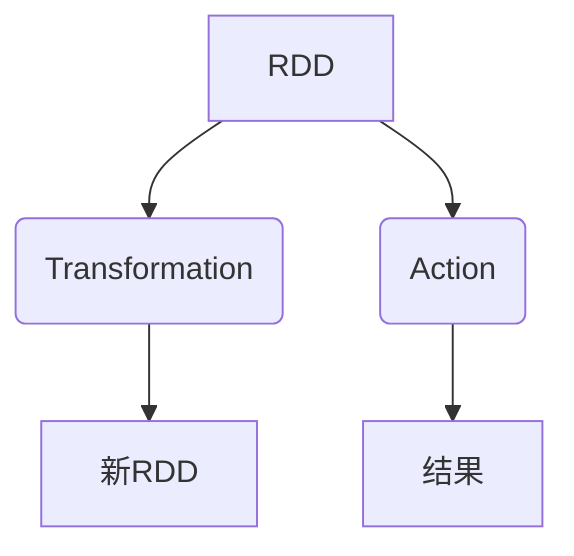
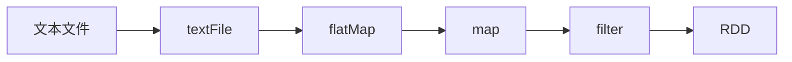

# RDD 原理与代码实例讲解

## 1.背景介绍

在大数据时代,数据处理和分析成为了一个巨大的挑战。Apache Spark 作为一种快速、通用的大规模数据处理引擎,凭借其优秀的性能和易用性,已经成为大数据领域不可或缺的重要组成部分。Spark 的核心数据结构 RDD(Resilient Distributed Dataset)是实现分布式内存计算的关键。本文将深入探讨 RDD 的原理、实现及应用,为读者提供全面的理解和实践指导。

## 2.核心概念与联系

### 2.1 RDD 概念

RDD(Resilient Distributed Dataset)是 Spark 中最核心的数据抽象,它是一个不可变、分区的记录集合,可以缓存在内存中以重用。RDD 支持两种操作:transformation(从前一个数据集创建一个新的数据集)和action(对数据集进行计算后将结果返回到驱动器程序)。

### 2.2 RDD 特性

- **不可变性(Immutable)**: RDD 是只读的,不能直接修改,每次转换都会生成一个新的 RDD。
- **分区(Partitioned)**: RDD 由多个分区组成,分区是 RDD 在集群上并行计算的基础单元。
- **有血统(Lineage)**: RDD 通过一系列确定性操作从其他 RDD 衍生而来,这些操作的集合就构成了 RDD 的血统。
- **缓存或持久化(Cache or Persist)**: RDD 可以缓存或持久化到内存或磁盘中,以加快迭代计算的速度。
- **容错(Fault-Tolerant)**: 由于 RDD 的不可变性和血统,Spark 可以通过重新计算丢失的分区来实现容错。

### 2.3 RDD 与其他数据模型的关系

RDD 与传统数据库中的表、Hadoop 中的 HDFS 文件等概念类似,但又有所不同。与表相比,RDD 不支持随机写操作;与 HDFS 文件相比,RDD 可以缓存在内存中,并支持更丰富的转换操作。RDD 可以视为在大数据场景下的"分布式内存数据集"。



## 3.核心算法原理具体操作步骤  

### 3.1 RDD 创建

RDD 可以通过两种方式创建:

1. **从集群外部数据源创建**,如本地文件系统、HDFS、HBase 或者任何 Hadoop 数据源。
2. **从现有的 RDD 转换而来**,通过各种转换操作(map、filter、flatMap等)生成新的 RDD。

```scala
// 从文件创建 RDD
val fileRDD = sc.textFile("path/to/file")

// 从集合创建 RDD  
val collectionRDD = sc.parallelize(List(1,2,3,4))

// 通过转换操作创建新的 RDD
val lineLengths = fileRDD.map(line => line.length)
```

### 3.2 RDD 转换操作

转换操作是从现有的 RDD 生成新 RDD 的函数,Spark 提供了丰富的转换操作,如 map、filter、flatMap、union、join 等。这些操作都是延迟计算的,只有在执行 Action 操作时才会真正触发计算。

```scala
// map 转换
val squaredRDD = numbersRDD.map(x => x * x)

// filter 转换 
val evenRDD = numbersRDD.filter(x => x % 2 == 0)

// flatMap 转换
val wordRDD = textRDD.flatMap(line => line.split(" "))
```

### 3.3 RDD Action 操作

Action 操作会触发实际的计算,并将结果返回到驱动器程序或将结果保存到外部存储系统。常见的 Action 操作有 reduce、collect、count、saveAsTextFile 等。

```scala
// reduce Action
val sum = numbersRDD.reduce((x, y) => x + y)

// collect Action 
val data = numbersRDD.collect()

// count Action
val numElements = numbersRDD.count()
```

### 3.4 RDD 依赖关系

RDD 之间存在着两种依赖关系:

1. **窄依赖(Narrow Dependency)**: 每个父 RDD 的分区最多被子 RDD 的一个分区使用,如 map、filter 等操作。
2. **宽依赖(Wide Dependency)**: 多个子 RDD 的分区可能依赖于同一个父 RDD 的分区,如 groupByKey、reduceByKey 等操作涉及数据洗牌(Shuffle)。

Spark 优化了窄依赖的计算,可以通过管道化(Pipelining)的方式在同一个集群节点上进行计算。而宽依赖则需要先进行 Shuffle 操作,将相关数据拉取到同一个节点上进行计算。

### 3.5 RDD 血统

RDD 的血统记录了从一个 RDD 到另一个 RDD 的转换路径,当 RDD 的部分分区数据丢失时,它可以根据血统重新计算并恢复这些丢失的数据分区,从而实现了容错机制。



## 4.数学模型和公式详细讲解举例说明

在 Spark 中,RDD 的核心思想是基于函数式编程范式,通过一系列确定性的转换操作从一个 RDD 生成新的 RDD。这种思想可以用数学模型来表示。

假设有一个初始 RDD $R_0$,经过一系列转换操作 $f_1, f_2, \ldots, f_n$,生成了新的 RDD $R_1, R_2, \ldots, R_n$,则它们之间的关系可以表示为:

$$
\begin{align*}
R_1 &= f_1(R_0) \\
R_2 &= f_2(R_1) = f_2(f_1(R_0)) \\
&\vdots \\
R_n &= f_n(R_{n-1}) = f_n(f_{n-1}(\ldots f_1(R_0)\ldots))
\end{align*}
$$

其中,每个转换操作 $f_i$ 都是一个确定性的、无副作用的纯函数,它将一个 RDD 映射为另一个 RDD。这种函数式编程范式使得 RDD 具有不可变性,同时也为容错机制提供了基础。

例如,对于一个文本文件 RDD,我们可以通过以下转换操作得到单词计数的结果:

$$
\begin{align*}
R_0 &= \text{textFile("path/to/file")} \\
R_1 &= \text{flatMap}(R_0, \text{line} \mapsto \text{line.split(" ")}) \\
R_2 &= \text{map}(R_1, \text{word} \mapsto (\text{word}, 1)) \\
R_3 &= \text{reduceByKey}(R_2, (x, y) \mapsto x + y)
\end{align*}
$$

其中,`flatMap` 将每一行文本拆分为单词,`map` 将每个单词映射为 (word, 1) 形式的键值对,`reduceByKey` 则对相同的键(单词)进行值(计数)的累加操作。最终 $R_3$ 就是包含每个单词及其出现次数的 RDD。

## 5.项目实践:代码实例和详细解释说明

下面是一个使用 Spark 进行单词计数的完整代码示例,它包括了 RDD 的创建、转换和 Action 操作:

```scala
import org.apache.spark.SparkContext
import org.apache.spark.SparkConf

object WordCount {
  def main(args: Array[String]): Unit = {
    // 创建 SparkConf 和 SparkContext
    val conf = new SparkConf().setAppName("WordCount")
    val sc = new SparkContext(conf)

    // 从文件创建 RDD
    val fileRDD = sc.textFile("path/to/file.txt")

    // 转换操作
    val wordRDD = fileRDD.flatMap(line => line.split(" "))
    val pairRDD = wordRDD.map(word => (word, 1))
    val countRDD = pairRDD.reduceByKey((x, y) => x + y)

    // Action 操作
    val wordCounts = countRDD.collect()
    wordCounts.foreach(println)

    // 停止 SparkContext
    sc.stop()
  }
}
```

代码解释:

1. 首先创建 `SparkConf` 和 `SparkContext` 对象,`SparkContext` 是 Spark 应用程序的入口点。
2. 使用 `sc.textFile` 从文件系统中读取文本文件,创建初始 RDD `fileRDD`。
3. 对 `fileRDD` 执行一系列转换操作:
   - `flatMap` 将每一行拆分为单词,生成 `wordRDD`。
   - `map` 将每个单词映射为 (word, 1) 形式的键值对,生成 `pairRDD`。
   - `reduceByKey` 对相同的键(单词)进行值(计数)的累加操作,生成 `countRDD`。
4. 执行 `collect` Action 操作,将 `countRDD` 中的所有元素收集到驱动器程序中。
5. 遍历打印每个 (word, count) 对。
6. 最后调用 `sc.stop()` 停止 `SparkContext`。

通过这个示例,我们可以看到 RDD 的创建、转换和 Action 操作是如何协同工作的。转换操作构建了数据处理管道,而 Action 操作则触发了实际的计算。

## 6.实际应用场景

RDD 作为 Spark 的核心数据结构,在各种大数据处理场景中都有广泛的应用,例如:

1. **批量数据处理**: 利用 RDD 的分布式计算能力,可以高效地处理大规模的数据集,如日志分析、网页排名等。
2. **机器学习和数据挖掘**: Spark 提供了基于 RDD 的机器学习库 MLlib,可以用于构建并行化的机器学习管道,如分类、聚类、推荐系统等。
3. **流式数据处理**: Spark Streaming 基于微批次的方式将流数据划分为一系列的 RDD,从而实现了准实时的流式计算。
4. **图计算**: Spark 提供了 GraphX 库,利用 RDD 可以高效地执行图并行计算,如页面排名、社交网络分析等。

总的来说,RDD 为 Spark 提供了一种通用的、可扩展的数据抽象,使其能够应对各种大数据处理场景。

## 7.工具和资源推荐

1. **Apache Spark 官方网站**: https://spark.apache.org/
2. **Spark 编程指南**: https://spark.apache.org/docs/latest/rdd-programming-guide.html
3. **Spark 示例程序**: https://github.com/apache/spark/tree/master/examples
4. **Spark 在线训练课程**: https://www.edx.org/course/introduction-to-apache-spark
5. **Spark 书籍**:
   - "Learning Spark: Lightning-Fast Big Data Analytics" by Holden Karau, Andy Konwinski, Patrick Wendell, Matei Zaharia
   - "Spark: The Definitive Guide" by Bill Chambers, Matei Zaharia

## 8.总结:未来发展趋势与挑战

Apache Spark 凭借其优秀的性能、易用性和丰富的生态系统,已经成为大数据处理领域的事实标准。然而,随着数据量的不断增长和计算需求的日益复杂,Spark 也面临着一些挑战和发展趋势:

1. **性能优化**: 继续优化 Spark 的内存管理、任务调度和数据局部性,提高计算效率和资源利用率。
2. **流式处理增强**: 进一步改进 Spark Streaming,支持更低延迟和更高吞吐量的流式计算。
3. **机器学习和 AI 支持**: 加强 Spark 在机器学习和人工智能领域的支持,提供更多的算法和工具。
4. **云原生支持**: 更好地与云计算平台集成,支持自动扩展和容器化部署。
5. **安全性和隐私保护**: 加强 Spark 在数据安全和隐私保护方面的能力,满足企业级应用的需求。

总的来说,RDD 作为 Spark 的核心数据结构,将继续在大数据处理领域发挥重要作用。随着技术的进步和需求的变化,RDD 也将不断演进和优化,以适应未来的挑战。

## 9.附录:常见问题与解答

1. **RDD 和常规集合有什么区别?**

   RDD 是分布