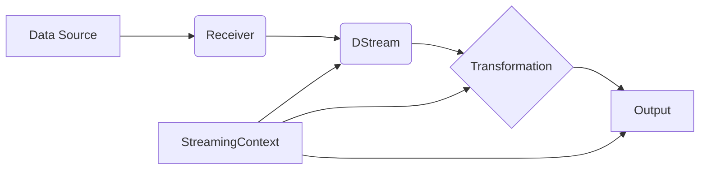

# Spark Streaming原理与代码实例讲解

## 1. 背景介绍

### 1.1 大数据处理的挑战
在当今大数据时代,海量数据的实时处理已成为企业的迫切需求。传统的批处理方式难以满足实时性要求,而Spark Streaming应运而生,为流式数据处理提供了高效、可靠的解决方案。

### 1.2 Spark Streaming的优势
Spark Streaming基于Apache Spark,继承了Spark快速、通用、易用的特点。它支持多种数据源,可实现高吞吐、低延迟的实时流处理,广泛应用于日志分析、欺诈检测、实时推荐等领域。

### 1.3 本文的主要内容
本文将深入探讨Spark Streaming的原理,并结合代码实例进行讲解,帮助读者全面掌握Spark Streaming的使用。

## 2. 核心概念与联系

### 2.1 DStream
DStream(Discretized Stream)是Spark Streaming的核心抽象,代表持续不断的数据流。DStream由一系列RDD(弹性分布式数据集)组成,每个RDD包含一个时间间隔内的数据。

### 2.2 Receiver
Receiver是数据接收器,负责从数据源接收数据并将其存储到Spark的内存中。常见的Receiver包括Kafka、Flume、HDFS等。

### 2.3 StreamingContext
StreamingContext是Spark Streaming的主入口,用于创建DStream并对其进行转换和输出操作。StreamingContext需要指定批处理时间间隔。

### 2.4 核心概念关系图



## 3. 核心算法原理与具体操作步骤

### 3.1 数据接收与分发
1. Receiver从数据源接收数据,并将数据分成小批次存储在Spark Executor的内存中。
2. Receiver将数据的元数据信息(如偏移量)发送给Driver,Driver根据元数据生成DStream的RDD。
3. Driver将RDD分发给Executor进行计算。

### 3.2 数据处理与输出
1. 对DStream应用转换操作(如map、filter等),生成新的DStream。转换操作是惰性的,只有在执行输出操作时才会触发计算。
2. 对DStream应用输出操作(如print、saveAsTextFiles等),将计算结果输出到外部系统。
3. StreamingContext按照指定的批处理间隔不断执行上述步骤,实现连续的流式数据处理。

## 4. 数学模型和公式详细讲解

### 4.1 滑动窗口模型
Spark Streaming引入了滑动窗口的概念,可以在一个时间窗口内对数据进行聚合操作。滑动窗口由两个参数定义:
- 窗口长度(window length):每个窗口的持续时间。
- 滑动间隔(sliding interval):窗口滑动的时间间隔。

设窗口长度为$L$,滑动间隔为$I$,当前时间为$T$,则当前窗口包含的数据时间范围为:

$$ [T-L, T-L+I), [T-L+I, T-L+2I), ..., [T-I, T) $$

### 4.2 窗口操作示例
假设窗口长度为10分钟,滑动间隔为5分钟,当前时间为12:30,则当前窗口包含以下四个时间范围的数据:
- [12:20, 12:25)
- [12:15, 12:20)
- [12:10, 12:15)
- [12:05, 12:10)

对这四个时间范围的数据进行聚合操作,即可得到当前窗口的计算结果。

## 5. 项目实践:代码实例与详细解释

下面通过一个简单的词频统计示例,演示Spark Streaming的基本使用:

```scala
import org.apache.spark._
import org.apache.spark.streaming._

object WordCount {
  def main(args: Array[String]) {
    // 创建StreamingContext,批处理间隔为5秒
    val conf = new SparkConf().setAppName("WordCount")
    val ssc = new StreamingContext(conf, Seconds(5))
    
    // 从Socket接收数据,创建DStream
    val lines = ssc.socketTextStream("localhost", 9999)
    
    // 对DStream应用转换操作
    val words = lines.flatMap(_.split(" "))
    val pairs = words.map(word => (word, 1))
    val wordCounts = pairs.reduceByKey(_ + _)
    
    // 输出结果到控制台
    wordCounts.print()
    
    // 启动流式计算
    ssc.start()
    ssc.awaitTermination()
  }
}
```

代码解释:
1. 创建StreamingContext,设置批处理间隔为5秒。
2. 通过socketTextStream从Socket接收文本数据,创建DStream。
3. 对DStream应用flatMap、map、reduceByKey等转换操作,实现词频统计。
4. 通过print输出每个批次的计算结果。
5. 启动流式计算,并等待计算终止。

## 6. 实际应用场景

Spark Streaming在多个领域有广泛应用,包括:
- 实时日志分析:对服务器日志进行实时分析,监控系统异常。
- 实时欺诈检测:对交易数据进行实时分析,识别可疑交易。
- 实时推荐:根据用户的实时行为数据,生成个性化推荐。
- 实时数据聚合:对传感器数据进行实时聚合,监控设备状态。

## 7. 工具和资源推荐
- Spark官方文档:提供了Spark Streaming的详细介绍和API参考。
- Spark Github仓库:包含Spark Streaming的源码和示例程序。
- Spark Summit:Spark领域的顶级会议,分享Spark Streaming的最新进展和实践经验。
- Coursera Spark课程:由Spark创始人授课,系统讲解Spark原理和使用。

## 8. 总结:未来发展趋势与挑战

### 8.1 发展趋势
- 与机器学习和图计算的结合:Spark Streaming将与MLlib、GraphX等组件深度集成,支持实时机器学习和图计算。
- 更低的延迟:Spark Streaming将优化数据接收和处理流程,进一步降低端到端延迟。
- 更丰富的数据源:Spark Streaming将支持更多的数据源,如Kafka、Kinesis等。

### 8.2 面临的挑战
- 数据丢失和重复:在节点失败等异常情况下,如何保证数据的一致性和完整性。
- 状态管理:如何高效地管理和恢复流计算的中间状态。
- 数据倾斜:如何应对数据分布不均带来的性能问题。

## 9. 附录:常见问题与解答

### 9.1 Spark Streaming与Storm的区别?
- Spark Streaming基于微批次处理,延迟略高但吞吐量大;Storm基于事件处理,延迟低但吞吐量小。
- Spark Streaming与Spark其他组件无缝集成;Storm与Hadoop生态系统集成较好。

### 9.2 Spark Streaming如何保证数据一致性?
- Receiver接收到的数据会复制到其他节点,保证数据不会丢失。
- 通过WAL(Write Ahead Log)和Checkpoint机制,保证数据的一致性和容错性。

### 9.3 Spark Streaming如何处理数据倾斜?
- 使用Repartition操作,将数据均匀地分配到各个分区。
- 使用Combiner,在Map端对数据进行局部聚合,减少网络传输。

Spark Streaming是大数据实时处理的重要利器。本文系统阐述了Spark Streaming的原理和使用方法,并探讨了其应用场景和未来趋势。相信通过本文,读者能够对Spark Streaming有更深入的理解,并能够运用Spark Streaming解决实际问题。让我们共同期待Spark Streaming的美好未来!

作者：禅与计算机程序设计艺术 / Zen and the Art of Computer Programming