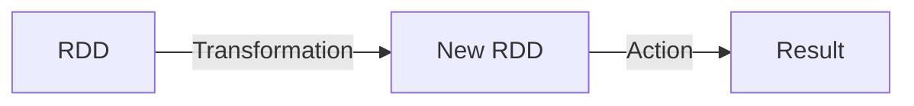
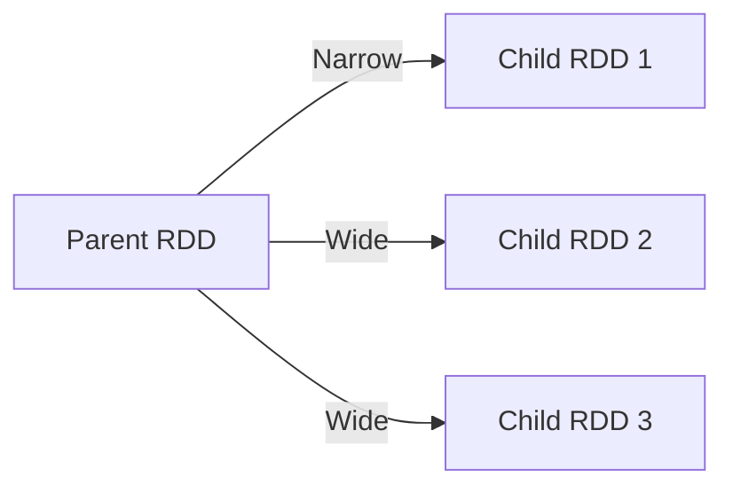
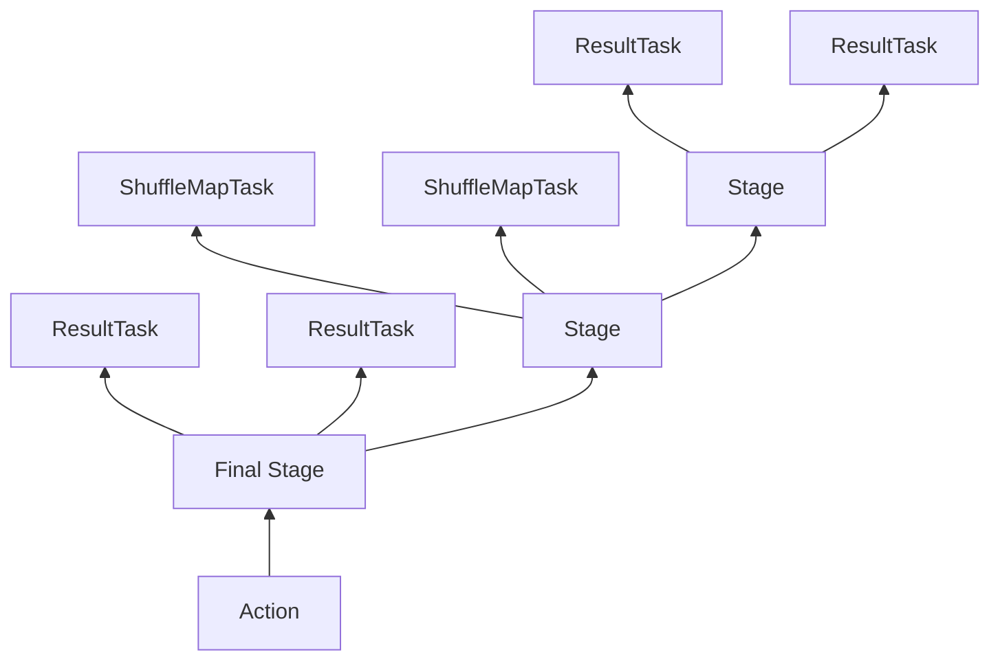

# Spark原理与代码实例讲解

## 1.背景介绍

Apache Spark是一种快速、通用、可扩展的大数据处理引擎。它最初是由加州大学伯克利分校的AMPLab所开发,并于2010年开源。Spark是为了应对大数据时代的计算挑战而设计的,它可以高效地在整个计算机集群上运行,并且能够在内存中进行数据处理,从而大大提高了运行效率。

Spark的核心设计理念是RDD(Resilient Distributed Dataset,弹性分布式数据集),它是一种分布式内存抽象,能够让用户高效地执行数据并行操作。RDD的出现解决了MapReduce编程模型中存在的诸多问题,如数据有效重用、容错性、任务调度等,从而使得Spark在大数据处理领域有了革命性的突破。

近年来,Spark生态系统日益壮大,涵盖了SQL查询(Spark SQL)、机器学习(MLlib)、流式计算(Spark Streaming)、图计算(GraphX)等多个模块,成为大数据处理的事实标准。Spark凭借其强大的计算能力和丰富的生态系统,被广泛应用于诸如日志挖掘、实时数据分析、推荐系统、机器学习等多个领域。

## 2.核心概念与联系

### 2.1 RDD(Resilient Distributed Dataset)

RDD是Spark最核心的数据抽象,它是一个不可变、分区的记录集合,可以缓存在内存中以重用。RDD支持两种操作:转换(Transformation)和动作(Action)。

转换操作会从现有RDD创建出新的RDD,如`map`、`filter`、`flatMap`、`union`等。动作操作则用于指导Spark去并行计算RDD中的数据,如`reduce`、`collect`、`count`等。转换操作是懒加载的,只有在执行动作操作时,才会触发实际的计算过程。



### 2.2 RDD的依赖关系

RDD之间存在着依赖关系,新创建的RDD会依赖于父RDD。依赖关系有两种:

1. **窄依赖(Narrow Dependency)**: 每个父RDD的分区最多被子RDD的一个分区使用,如`map`、`filter`等。
2. **宽依赖(Wide Dependency)**: 多个子RDD的分区会依赖同一个父RDD的分区,如`groupByKey`、`reduceByKey`等。

窄依赖允许流水线计算,可以获得更好的性能;而宽依赖会导致数据洗牌,性能开销较大。



### 2.3 Spark执行模型

Spark采用了基于stage的执行模型。当一个动作操作被触发时,Spark会根据RDD的血缘关系构建出DAG(Directed Acyclic Graph,有向无环图),并划分出不同的stage。每个stage是一组需要在集群上并行计算的任务。



## 3.核心算法原理具体操作步骤  

### 3.1 RDD的创建

RDD可以通过两种方式创建:

1. **从集群中的文件或其他数据源创建**: 使用`SparkContext`的`textFile`、`wholeTextFiles`等方法从外部数据源创建RDD。

```scala
val textRDD = sc.textFile("path/to/file.txt")
```

2. **从Driver程序中的集合对象创建**: 使用`SparkContext`的`parallelize`方法从集合创建RDD。

```scala
val numbersRDD = sc.parallelize(List(1, 2, 3, 4, 5))
```

### 3.2 RDD的转换操作

转换操作会从现有RDD创建出新的RDD,常用的转换操作包括:

- `map(func)`: 对RDD中的每个元素应用函数`func`。
- `filter(func)`: 返回RDD中满足函数`func`的元素。
- `flatMap(func)`: 对RDD中的每个元素应用函数`func`,并将结果扁平化。
- `union(otherRDD)`: 返回一个新的RDD,包含源RDD和`otherRDD`的所有元素。
- `distinct()`: 返回一个新的RDD,去除重复元素。

```scala
val squaredRDD = numbersRDD.map(x => x * x)
val evenRDD = numbersRDD.filter(x => x % 2 == 0)
```

### 3.3 RDD的动作操作

动作操作会触发Spark作业的执行,常用的动作操作包括:

- `reduce(func)`: 使用函数`func`聚合RDD中的所有元素。
- `collect()`: 将RDD中的所有元素拉取到Driver程序中,形成数组。
- `count()`: 返回RDD中元素的个数。
- `take(n)`: 返回RDD中的前`n`个元素。
- `saveAsTextFile(path)`: 将RDD的元素以文本文件的形式保存到指定目录。

```scala
val sum = numbersRDD.reduce((x, y) => x + y)
val first = numbersRDD.take(1) // Returns: Array(1)
numbersRDD.saveAsTextFile("path/to/output")
```

## 4.数学模型和公式详细讲解举例说明

在Spark中,一些常见的数学运算和统计函数都有相应的实现,下面我们来看一些例子。

### 4.1 平均值

计算RDD中元素的平均值可以使用`mean`操作:

$$\overline{x} = \frac{1}{n}\sum_{i=1}^{n}x_i$$

其中$\overline{x}$表示平均值,$x_i$表示RDD中的第$i$个元素,共有$n$个元素。

```scala
val numbers = sc.parallelize(List(1.0, 2.0, 3.0, 4.0, 5.0))
val mean = numbers.mean() // Returns: 3.0
```

### 4.2 标准差

计算RDD中元素的标准差可以使用`stdev`操作:

$$s = \sqrt{\frac{1}{n}\sum_{i=1}^{n}(x_i - \overline{x})^2}$$

其中$s$表示标准差,$x_i$表示RDD中的第$i$个元素,$\overline{x}$表示平均值,共有$n$个元素。

```scala
val numbers = sc.parallelize(List(1.0, 2.0, 3.0, 4.0, 5.0))
val stdev = numbers.stdev() // Returns: 1.4142135623730951
```

### 4.3 相关系数

计算两个RDD之间的相关系数(皮尔逊相关系数)可以使用`corr`操作:

$$r = \frac{\sum_{i=1}^{n}(x_i - \overline{x})(y_i - \overline{y})}{\sqrt{\sum_{i=1}^{n}(x_i - \overline{x})^2}\sqrt{\sum_{i=1}^{n}(y_i - \overline{y})^2}}$$

其中$r$表示相关系数,$x_i$和$y_i$分别表示两个RDD中的第$i$个元素,$\overline{x}$和$\overline{y}$分别表示两个RDD的平均值,共有$n$个元素对。

```scala
val x = sc.parallelize(List(1.0, 2.0, 3.0, 4.0, 5.0))
val y = sc.parallelize(List(2.0, 4.0, 6.0, 8.0, 10.0))
val corr = x.corr(y) // Returns: 1.0
```

## 5.项目实践：代码实例和详细解释说明

让我们通过一个实际的例子来演示如何使用Spark进行数据处理。我们将使用Spark处理一个包含用户评分数据的数据集,并计算每个电影的平均评分。

### 5.1 数据准备

我们使用的数据集是MovieLens 100K数据集,它包含了100,000个评分数据,由以下几个文件组成:

- `u.data`: 用户对电影的评分数据,每行包含用户ID、电影ID、评分和时间戳。
- `u.item`: 电影信息,包括电影ID、电影名称和其他元数据。
- `u.user`: 用户信息,包括用户ID、年龄、性别、职业等。

我们将使用`u.data`文件进行处理。

### 5.2 代码实现

```scala
import org.apache.spark.sql.SparkSession

object MovieRatings {
  def main(args: Array[String]): Unit = {
    // 创建SparkSession
    val spark = SparkSession.builder()
      .appName("MovieRatings")
      .getOrCreate()

    // 读取数据
    val ratingsData = spark.read
      .option("inferSchema", "true")
      .csv("path/to/u.data")
      .toDF("userId", "movieId", "rating", "timestamp")

    // 计算每个电影的平均评分
    val averageRatings = ratingsData
      .groupBy("movieId")
      .agg(avg("rating").alias("avgRating"))
      .orderBy(desc("avgRating"))

    // 显示结果
    averageRatings.show(10, false)

    // 停止SparkSession
    spark.stop()
  }
}
```

代码解释:

1. 首先,我们创建一个`SparkSession`对象,它是Spark程序的入口点。
2. 使用`spark.read.csv`方法读取`u.data`文件,并将其转换为DataFrame。
3. 在DataFrame上调用`groupBy`和`agg`操作,按照`movieId`分组,并计算每个组的`rating`平均值。
4. 使用`orderBy`对结果进行排序,按照`avgRating`降序排列。
5. 调用`show`方法显示前10个结果。
6. 最后,停止`SparkSession`。

运行上述代码,我们将得到类似如下的输出:

```
+-------+------------------+
|movieId|avgRating         |
+-------+------------------+
|1265   |5.0               |
|1212   |5.0               |
|594    |5.0               |
|1091   |5.0               |
|1049   |5.0               |
|1093   |5.0               |
|1097   |5.0               |
|1035   |5.0               |
|1061   |5.0               |
|1082   |5.0               |
+-------+------------------+
```

这个例子展示了如何使用Spark进行数据处理和分析。我们读取了原始的评分数据,并计算了每个电影的平均评分。这种处理方式可以应用于各种数据分析场景,如用户行为分析、推荐系统等。

## 6.实际应用场景

Spark由于其强大的计算能力和丰富的生态系统,在实际应用中被广泛使用。下面是一些典型的应用场景:

### 6.1 日志分析

Spark可以高效地处理大规模的日志数据,用于提取有价值的信息。例如,我们可以分析网站访问日志,了解用户行为模式、热门页面等,从而优化网站设计和内容。

### 6.2 实时数据处理

利用Spark Streaming模块,我们可以构建实时数据处理管道,对流式数据(如社交媒体数据、传感器数据等)进行实时分析和响应。这在物联网、金融交易、网络安全等领域有着广泛的应用。

### 6.3 机器学习

Spark MLlib提供了丰富的机器学习算法和工具,可以在大数据集上高效地训练模型。我们可以使用Spark进行推荐系统、文本挖掘、图像识别等机器学习任务。

### 6.4 图计算

Spark GraphX模块支持图计算,可以用于社交网络分析、网页排名、交通路线规划等应用场景。

### 6.5 SQL查询

Spark SQL模块提供了结构化数据处理能力,支持使用SQL语句查询和分析数据。这使得Spark可以与传统的数据仓库和商业智能工具无缝集成。

## 7.工具和资源推荐

在使用Spark进行开发和学习时,有许多优秀的工具和资源可以利用:

### 7.1 集成开发环境(IDE)

- IntelliJ IDEA: 具有良好的Scala插件支持,可以方便地编写和调试Spark应用程序。
- PyCharm: 适用于使用Python开发Spark应用程序。
- Zeppelin Notebook: 一种基于Web的