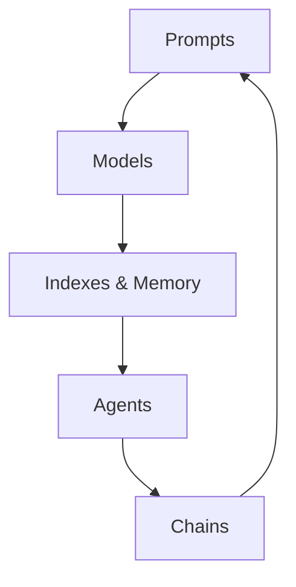

# 【LangChain编程：从入门到实践】LangChain社区介绍

## 1. 背景介绍
### 1.1 LangChain的诞生
在人工智能飞速发展的今天，大语言模型（LLM）已经成为了自然语言处理领域的重要突破。然而，如何更好地利用LLM的能力，为实际应用赋能，仍然是一个亟待解决的问题。LangChain应运而生，它为连接LLM与外部应用提供了一套全面的框架，让开发者能够更轻松地构建基于LLM的应用程序。

### 1.2 LangChain的定位
LangChain是一个基于Python的框架，旨在帮助开发者构建由语言模型驱动的应用程序。它提供了一系列工具和组件，可以轻松地与LLM进行交互，访问外部数据源，并将LLM集成到应用程序中。LangChain的目标是降低构建LLM应用的门槛，加速LLM技术的普及和应用。

### 1.3 LangChain的发展现状
自2021年发布以来，LangChain迅速获得了开发者社区的关注和认可。越来越多的开发者开始使用LangChain构建创新的LLM应用，涵盖了问答系统、文本生成、数据分析等多个领域。LangChain也在不断迭代更新，引入新的功能和改进，以满足开发者日益增长的需求。

## 2. 核心概念与联系
### 2.1 Prompts 提示
Prompt是LangChain的核心概念之一，它定义了如何与LLM进行交互。通过设计合适的Prompt，我们可以引导LLM生成我们期望的输出。LangChain提供了一系列工具，帮助我们管理和优化Prompt，例如PromptTemplate和FewShotPromptTemplate等。

### 2.2 Models 模型
LangChain支持多种LLM，包括OpenAI的GPT系列、Anthropic的Claude、Cohere等。通过统一的接口，我们可以轻松地切换和比较不同的模型。LangChain还提供了一些实用工具，例如LLMChain，可以将多个LLM组合成pipeline，解决更复杂的任务。

### 2.3 Indexes & Memory 索引与记忆
在许多应用场景中，LLM需要访问外部知识来回答问题或生成内容。LangChain通过Indexes和Memory机制，让LLM能够存储和检索相关信息。例如，我们可以使用VectorStoreIndexCreator将文档转化为向量存储，然后在问答时让LLM从这些向量中检索相关知识。

### 2.4 Agents 代理
Agent是LangChain的另一个重要概念，它允许我们创建由LLM驱动的自主代理。Agent可以根据用户输入，自主决策和执行一系列行动，例如访问工具、提取信息、更新记忆等。LangChain提供了多种Agent实现，例如ZeroShotAgent、ConversationalAgent等。

### 2.5 Chains 链式调用
Chain是将多个组件组合成一个大的工作流的方式。例如，我们可以将一个Prompt、一个LLM和一个Parser组合成一个Chain，用于执行特定的任务。LangChain提供了丰富的Chain模板，例如LLMChain、SequentialChain等，让我们可以快速构建复杂的工作流。

下面是这些核心概念之间的关系图：



## 3. 核心算法原理具体操作步骤
### 3.1 Prompt优化
1. 明确任务目标，确定Prompt的输入和期望输出
2. 选择合适的Prompt模板，例如FewShotPromptTemplate
3. 准备少量示例数据，展示期望的输入输出对
4. 将示例数据填充到Prompt模板中
5. 调用LLM，生成Prompt
6. 评估Prompt的效果，必要时进行调整和迭代

### 3.2 索引构建
1. 准备需要索引的文档数据
2. 选择合适的向量存储，例如Chroma、Pinecone等  
3. 将文档数据转化为向量表示，例如使用OpenAIEmbeddings
4. 将向量存储到选定的向量存储中
5. 构建索引，例如使用VectorStoreIndexCreator
6. 测试索引的检索效果，必要时调整向量化参数

### 3.3 代理设计
1. 明确代理的目标和可用操作
2. 选择合适的代理类型，例如ZeroShotAgent
3. 定义代理的Prompt，描述其目标和可用操作
4. 选择代理使用的工具，例如搜索引擎、计算器等
5. 初始化代理，连接其使用的LLM和工具
6. 测试代理的决策和执行效果，必要时调整Prompt和工具

### 3.4 链式调用构建
1. 明确任务目标，拆分为多个子任务
2. 为每个子任务选择合适的组件，例如Prompt、LLM、Tool等
3. 使用合适的Chain模板，将组件连接起来  
4. 定义Chain的输入和输出，确保数据在组件间正确流动
5. 执行Chain，观察每个组件的输出和整体效果
6. 调试和优化Chain，提高其准确性和效率

## 4. 数学模型和公式详细讲解举例说明
在LangChain中，许多组件的实现都涉及了数学模型和公式。以下是一些常见的数学模型：

### 4.1 向量空间模型
在索引和检索的过程中，文本数据通常会被转化为向量表示。假设有一个文档$D$，其中包含$n$个不同的词$t_1, t_2, ..., t_n$，每个词的权重为$w_1, w_2, ..., w_n$，则文档$D$的向量表示为：

$$\vec{D} = (w_1, w_2, ..., w_n)$$

两个文档$D_1$和$D_2$的相似度可以通过它们的向量表示计算，例如使用余弦相似度：

$$\text{sim}(D_1, D_2) = \frac{\vec{D_1} \cdot \vec{D_2}}{\|\vec{D_1}\| \|\vec{D_2}\|}$$

其中$\cdot$表示向量点积，$\|\vec{D}\|$表示向量$\vec{D}$的模。

### 4.2 Transformer模型
大多数LLM都基于Transformer架构。Transformer的核心是自注意力机制，可以捕捉词之间的长距离依赖关系。对于一个输入序列$x_1, x_2, ..., x_n$，自注意力的计算过程如下：

1. 将每个输入$x_i$映射为查询向量$q_i$、键向量$k_i$和值向量$v_i$：

$$q_i = W_Q x_i, \quad k_i = W_K x_i, \quad v_i = W_V x_i$$

2. 计算每个查询向量与所有键向量的注意力分数：

$$\alpha_{ij} = \frac{\exp(q_i \cdot k_j / \sqrt{d})}{\sum_{l=1}^n \exp(q_i \cdot k_l / \sqrt{d})}$$

3. 将注意力分数与值向量加权求和，得到输出：

$$y_i = \sum_{j=1}^n \alpha_{ij} v_j$$

通过堆叠多个Transformer块，LLM可以学习到高级的语言表示和生成能力。

## 5. 项目实践：代码实例和详细解释说明
下面是一个使用LangChain构建问答系统的简单示例：

```python
from langchain.prompts import PromptTemplate
from langchain.llms import OpenAI
from langchain.chains import LLMChain

# 定义Prompt模板
template = """
请根据以下背景知识回答问题。如果无法从背景知识中得到答案，请回答"不知道"。

背景知识：
{context}

问题：{question}

回答：
"""

prompt = PromptTemplate(
    input_variables=["context", "question"], 
    template=template
)

# 初始化LLM
llm = OpenAI(temperature=0)

# 创建问答Chain
chain = LLMChain(llm=llm, prompt=prompt)

# 准备背景知识和问题
context = "LangChain是一个基于Python的框架，旨在帮助开发者构建由语言模型驱动的应用程序。"
question = "LangChain是用什么语言编写的？"

# 执行问答
result = chain.run(context=context, question=question)

print(result)
```

这个示例的流程如下：

1. 定义了一个Prompt模板，其中包含背景知识和问题两个变量。
2. 初始化了一个OpenAI的LLM，设置temperature为0以得到确定性的输出。
3. 创建了一个LLMChain，将LLM和Prompt连接起来。
4. 准备了一段背景知识和一个问题。
5. 执行Chain，将背景知识和问题传入，得到LLM的回答。

运行这段代码，我们可以得到输出：

```
Python
```

这说明LLM成功地从背景知识中提取出了LangChain是用Python编写的信息。

通过这个简单的例子，我们可以看到LangChain如何帮助我们快速构建一个基于LLM的问答系统。在实际应用中，我们还可以加入更多的组件，例如索引、代理等，来构建更加强大和灵活的LLM应用。

## 6. 实际应用场景
LangChain的应用场景非常广泛，下面是一些具体的例子：

### 6.1 智能客服
利用LangChain，我们可以构建一个基于LLM的智能客服系统。系统可以理解用户的问题，从知识库中检索相关信息，并生成自然、准确的回答。相比传统的基于规则的客服系统，基于LangChain的智能客服可以处理更加开放和复杂的问题，提供更好的用户体验。

### 6.2 个性化推荐
LangChain可以帮助我们构建个性化推荐系统。通过分析用户的历史行为和偏好，系统可以生成个性化的商品、内容或服务推荐。LLM可以根据用户的反馈，不断优化推荐策略，提高推荐的准确性和多样性。

### 6.3 智能写作助手
LangChain可以用于构建智能写作助手。用户可以输入主题、关键词、写作风格等要求，系统可以自动生成符合要求的文章、报告、邮件等。LLM可以确保生成的内容在语法、逻辑和风格上的一致性，同时也能够根据用户的反馈进行调整和优化。

### 6.4 数据分析与可视化
LangChain可以与数据分析和可视化工具结合，帮助用户更好地理解和探索数据。用户可以用自然语言提出问题，系统可以自动执行相应的数据分析操作，并生成易于理解的可视化结果。这种交互方式可以大大降低数据分析的门槛，让更多人能够从数据中获得洞见。

## 7. 工具和资源推荐
以下是一些有助于学习和使用LangChain的工具和资源：

### 7.1 官方文档
LangChain的官方文档是学习和使用该框架的最佳资源。文档提供了全面的教程、API参考和最佳实践指南，涵盖了LangChain的方方面面。

链接：https://docs.langchain.com/

### 7.2 示例项目
LangChain的GitHub仓库中包含了大量的示例项目，展示了如何使用LangChain构建各种LLM应用。这些项目可以作为学习和参考的起点，帮助我们快速上手LangChain。

链接：https://github.com/hwchase17/langchain/tree/master/examples

### 7.3 社区论坛
LangChain的社区论坛是一个活跃的交流平台，汇聚了众多LangChain的开发者和爱好者。在这里，我们可以提出问题、分享经验、探讨最新的技术和应用。

链接：https://community.langchain.com/

### 7.4 相关博客和教程
除了官方文档，网上还有许多优秀的博客和教程，从不同的角度介绍LangChain的使用和最佳实践。以下是一些值得关注的资源：

- https://blog.langchain.dev/
- https://www.pinecone.io/learn/langchain-intro/
- https://www.anthropic.com/blog/langchain

## 8. 总结：未来发展趋势与挑战
LangChain正在快