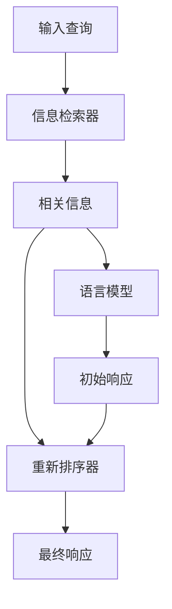

# 【LangChain编程：从入门到实践】RAG技术的关键挑战

## 1.背景介绍

### 1.1 什么是LangChain?

LangChain是一个用于构建可扩展的AI应用程序的Python库。它旨在帮助开发人员更轻松地构建和部署大型语言模型(LLM)驱动的应用程序。LangChain提供了一组模块化的构建块,可以轻松地将LLM与其他组件(如数据检索、文本摘要等)集成,从而构建强大的AI系统。

### 1.2 什么是RAG(Retrieval Augmented Generation)?

RAG(Retrieval Augmented Generation)是一种用于提高LLM性能的技术。它将LLM与信息检索系统(如Wikipedia)相结合,以增强LLM的知识库和推理能力。在生成响应之前,RAG首先从外部知识源(如维基百科)检索相关信息,然后将这些信息与LLM的输出相结合,从而产生更准确、更信息丰富的响应。

## 2.核心概念与联系

### 2.1 RAG架构概述

RAG架构由三个主要组件组成:

1. **信息检索器(Retriever)**:用于从外部知识源(如维基百科)检索相关信息。
2. **语言模型(LLM)**:用于生成初始响应。
3. **重新排序器(Re-ranker)**:用于根据生成的响应重新排序检索到的相关信息。

这三个组件紧密协作,形成了RAG的核心流程。下面是RAG架构的Mermaid流程图:



### 2.2 RAG工作流程

1. 用户提供一个查询。
2. 信息检索器从外部知识源(如维基百科)检索与查询相关的信息片段。
3. 语言模型(LLM)基于查询和检索到的信息片段生成一个初始响应。
4. 重新排序器根据生成的初始响应,对检索到的信息片段进行重新排序和过滤。
5. 最终响应由重新排序后的信息片段和LLM生成的响应组合而成。

## 3.核心算法原理具体操作步骤

### 3.1 信息检索器

信息检索器的主要任务是从外部知识源(如维基百科)检索与查询相关的信息片段。常用的信息检索技术包括:

1. **TF-IDF(Term Frequency-Inverse Document Frequency)**:基于词频和逆文档频率计算查询和文档之间的相似度。
2. **BM25(Best Matching 25)**:一种改进的TF-IDF算法,考虑了文档长度和查询词频率等因素。
3. **向量空间模型(Vector Space Model)**:将查询和文档表示为向量,并计算它们之间的相似度(如余弦相似度)。

LangChain中提供了多种信息检索器的实现,如`TF-IDF Retriever`、`BM25Retriever`和`DPRRetriever`(基于密集向量检索)等。

### 3.2 语言模型

语言模型(LLM)的主要任务是基于查询和检索到的信息片段生成初始响应。常用的LLM包括GPT-3、BERT、XLNet等。LangChain支持多种LLM的集成,如`OpenAI`、`Anthropic`、`Hugging Face`等。

### 3.3 重新排序器

重新排序器的主要任务是根据LLM生成的初始响应,对检索到的信息片段进行重新排序和过滤。常用的重新排序技术包括:

1. **交叉注意力(Cross-Attention)**:计算初始响应和每个信息片段之间的相关性分数。
2. **序列对比(Sequence Scoring)**:计算初始响应和每个信息片段的序列对比分数。
3. **监督学习(Supervised Learning)**:使用标注数据训练一个重新排序模型。

LangChain中提供了多种重新排序器的实现,如`CrossAttentionReranker`、`SequenceScoreReranker`和`TrainedReranker`等。

## 4.数学模型和公式详细讲解举例说明

### 4.1 TF-IDF

TF-IDF(Term Frequency-Inverse Document Frequency)是一种常用的信息检索算法,用于计算查询和文档之间的相似度。它由两部分组成:

1. **词频(Term Frequency, TF)**:表示一个词在文档中出现的频率。

$$TF(t, d) = \frac{count(t, d)}{|d|}$$

其中,`count(t, d)`表示词`t`在文档`d`中出现的次数,`|d|`表示文档`d`的总词数。

2. **逆文档频率(Inverse Document Frequency, IDF)**:表示一个词在整个语料库中的重要性。

$$IDF(t, D) = \log\frac{|D|}{|\{d \in D: t \in d\}|}$$

其中,`|D|`表示语料库中文档的总数,`|\{d \in D: t \in d\}|`表示包含词`t`的文档数量。

TF-IDF将TF和IDF相乘,用于计算查询和文档之间的相似度:

$$\text{TF-IDF}(t, d, D) = TF(t, d) \times IDF(t, D)$$

### 4.2 BM25

BM25是一种改进的TF-IDF算法,它考虑了文档长度和查询词频率等因素。BM25分数计算公式如下:

$$\text{BM25}(d, q) = \sum_{t \in q} \text{IDF}(t) \cdot \frac{f(t, d) \cdot (k_1 + 1)}{f(t, d) + k_1 \cdot \left(1 - b + b \cdot \frac{|d|}{avgdl}\right)}$$

其中:

- `f(t, d)`表示词`t`在文档`d`中出现的次数。
- `|d|`表示文档`d`的长度(词数)。
- `avgdl`表示语料库中所有文档的平均长度。
- `k_1`和`b`是可调参数,用于控制词频和文档长度的影响。

BM25算法通过引入文档长度和查询词频率等因素,可以更准确地计算查询和文档之间的相似度。

## 5.项目实践:代码实例和详细解释说明

下面是一个使用LangChain实现RAG的示例代码:

```python
from langchain.llms import OpenAI
from langchain.retrievers import WikipediaRetriever
from langchain.chains import RetrievalQA
from langchain.chains.question_answering import load_qa_chain

# 初始化LLM
llm = OpenAI(temperature=0)

# 初始化信息检索器
retriever = WikipediaRetriever(
    wiki_chunk_size=100,
    wiki_chunk_overlap=20,
    use_semantic_retrieval=True,
)

# 初始化RAG链
qa_chain = load_qa_chain(
    llm,
    chain_type="stuff",
    retriever=retriever,
    return_intermediate_steps=True,
)

# 提出查询
query = "What is the capital of France?"
result = qa_chain({"query": query})

# 输出结果
print(f"Query: {query}")
print(f"Result: {result['result']}")
```

代码解释:

1. 首先,我们初始化一个LLM(这里使用OpenAI的GPT-3)。
2. 然后,我们初始化一个信息检索器(`WikipediaRetriever`)。它将从维基百科中检索与查询相关的信息片段。
3. 接下来,我们使用`load_qa_chain`函数初始化一个RAG链。这里我们使用了`stuff`模式,它将检索到的信息片段直接注入LLM的输入中。
4. 我们提出一个查询`"What is the capital of France?"`。
5. `qa_chain`函数将查询传递给RAG链,并返回最终结果。
6. 最后,我们打印出查询和结果。

在这个示例中,RAG链将从维基百科中检索与"法国首都"相关的信息片段,并将这些信息与LLM的输出相结合,生成最终响应。

## 6.实际应用场景

RAG技术在多个领域都有广泛的应用,包括:

1. **问答系统**:RAG可以用于构建基于知识的问答系统,提供更准确、更丰富的答案。
2. **信息检索**:RAG可以用于改进传统的信息检索系统,提供更相关、更上下文化的搜索结果。
3. **内容生成**:RAG可以用于生成基于知识的内容,如新闻报道、博客文章等。
4. **任务辅助**:RAG可以用于提供任务相关的知识支持,如写作辅助、代码生成等。
5. **教育和学习**:RAG可以用于构建智能教育系统,提供个性化的学习资源和解释。

## 7.工具和资源推荐

如果你想进一步学习和实践RAG技术,以下是一些有用的工具和资源:

1. **LangChain**:一个用于构建可扩展的AI应用程序的Python库,提供了RAG的实现。
2. **Hugging Face Transformers**:一个流行的自然语言处理库,提供了多种预训练语言模型和工具。
3. **Haystack**:一个开源的问答系统框架,支持RAG技术。
4. **Semantic Kernel**:一个基于RAG技术的开源问答系统。
5. **RAG论文和教程**:Google的RAG论文和相关教程,提供了RAG技术的详细介绍和实现细节。

## 8.总结:未来发展趋势与挑战

RAG技术为构建智能问答系统和知识增强应用程序提供了强大的支持。然而,它也面临一些挑战和未来发展趋势:

1. **知识源的覆盖范围**:目前,RAG主要依赖于维基百科等开放知识源。如何整合更广泛的知识源(如专业领域知识库、企业内部知识库等)是一个重要挑战。
2. **知识更新和一致性**:随着时间推移,知识源会不断更新和变化。如何确保RAG系统的知识始终保持最新和一致是一个需要解决的问题。
3. **知识组合和推理**:RAG目前主要依赖于检索和组合现有知识。未来,如何实现更高级的知识组合和推理能力将是一个重要的发展方向。
4. **隐私和安全**:随着RAG系统的广泛应用,确保知识源的隐私和安全将变得越来越重要。
5. **人机协作**:RAG系统可以与人类专家协作,形成人机协作的智能系统。探索人机协作模式将是一个有趣的研究方向。

总的来说,RAG技术为构建智能知识增强系统提供了强大的支持,但也面临着一些挑战和发展机遇。未来,RAG技术将继续在多个领域发挥重要作用。

## 9.附录:常见问题与解答

### 9.1 RAG和传统信息检索系统有什么区别?

传统的信息检索系统(如搜索引擎)主要依赖于关键词匹配和排名算法来检索相关文档。而RAG系统则将信息检索与语言模型相结合,可以更好地理解查询的语义,并生成更准确、更丰富的响应。

### 9.2 RAG系统是否需要大量的计算资源?

RAG系统的计算资源需求取决于所使用的语言模型和信息检索器。一般来说,大型语言模型(如GPT-3)和密集向量检索器(如DPR)会需要更多的计算资源。但是,也有一些轻量级的选择,如使用小型语言模型和基于TF-IDF的检索器。

### 9.3 RAG系统是否可以处理多语言查询?

RAG系统可以处理多语言查询,前提是所使用的语言模型和知识源支持相应的语言。例如,可以使用多语言预训练语言模型(如mT5或XLM-R)和多语言知识源(如多语种维基百科)来构建多语言RAG系统。

### 9.4 RAG系统如何确保生成响应的一致性和可靠性?

RAG系统通过将检索到的相关信息与语言模型的输出相结合,可以提高生成响应的一致性和可靠性。但是,也需要注意知识源的质量和准确性,以及语言模型的偏差和局限性。一些常见的技术,如结果过滤、多模型集成和人工审核,可以进一步提高响应的质量。

### 9.