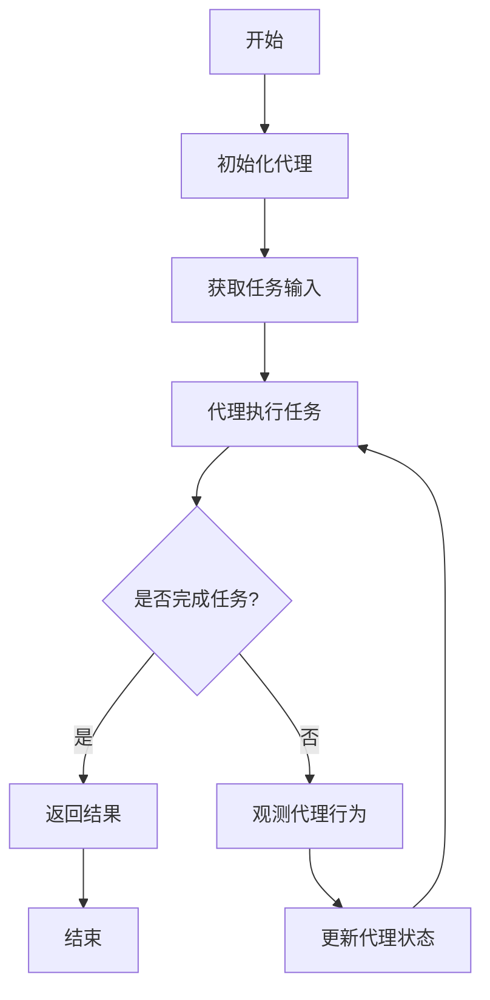

# 【LangChain编程：从入门到实践】使用LangSmith进行观测

## 1. 背景介绍

### 1.1 什么是LangChain?

LangChain是一个用于构建应用程序的框架,这些应用程序利用大型语言模型(LLM)来与数据和服务进行交互。它旨在简化与LLM的交互,并提供了一种结构化和可组合的方式来构建应用程序。LangChain支持多种LLM,包括OpenAI的GPT-3、Anthropic的Claude、Cohere等。

### 1.2 什么是LangSmith?

LangSmith是LangChain的一个重要组成部分,它是一个用于观测LangChain代理的工具。它允许您跟踪代理的思维过程,了解它是如何执行任务的。这对于调试、优化和理解代理行为非常有用。

## 2. 核心概念与联系

### 2.1 LangChain代理

LangChain代理是一种特殊的LLM,它被设计用于执行特定的任务。代理可以与各种工具(如Python REPL、Google搜索、Wikipedia查询等)进行交互,以完成任务。代理使用LLM来决定何时以及如何使用这些工具。

### 2.2 LangSmith观测

LangSmith观测是一种跟踪代理思维过程的方式。它记录了代理在执行任务时的每一步操作,包括它使用的工具、生成的响应以及内部思考过程。这些观测数据可以用于调试、优化和理解代理行为。

### 2.3 观测类型

LangSmith支持多种观测类型,包括:

- **响应观测**: 记录代理生成的响应
- **LLMChain观测**: 记录代理与LLM的交互
- **工具观测**: 记录代理与工具的交互
- **中间步骤观测**: 记录代理内部思考过程的中间步骤

这些观测类型可以组合使用,以获得更全面的洞察。

## 3. 核心算法原理具体操作步骤

LangSmith的核心算法原理是基于代理执行任务的过程。以下是具体的操作步骤:



1. **初始化代理**: 根据任务需求,初始化一个合适的LangChain代理。这可能涉及配置LLM、工具以及其他设置。

2. **获取任务输入**: 从用户或其他来源获取任务输入。

3. **代理执行任务**: 代理开始执行任务。它可能会与LLM进行交互,以决定下一步操作。它还可能会使用各种工具来获取所需的信息或执行特定操作。

4. **是否完成任务?**: 检查代理是否已经完成任务。如果是,则返回结果并结束过程。否则,进入观测步骤。

5. **观测代理行为**: LangSmith观测代理的行为,记录它与LLM和工具的交互,以及内部思考过程的中间步骤。

6. **更新代理状态**: 根据观测结果,更新代理的状态。这可能涉及调整代理的参数或策略。

7. **重复执行任务**: 代理继续执行任务,直到完成为止。

在整个过程中,LangSmith会记录所有观测数据,以供后续分析和调试。

## 4. 数学模型和公式详细讲解举例说明

虽然LangSmith本身并不涉及复杂的数学模型或公式,但它所观测的LangChain代理可能会使用各种数学模型和公式。以下是一些常见的例子:

### 4.1 语言模型

LangChain代理通常会使用大型语言模型(LLM)来生成文本。这些LLM通常基于transformer架构,使用自注意力机制来捕获长距离依赖关系。transformer模型的核心公式之一是缩放点积注意力(Scaled Dot-Product Attention):

$$\text{Attention}(Q, K, V) = \text{softmax}\left(\frac{QK^T}{\sqrt{d_k}}\right)V$$

其中 $Q$ 表示查询(Query)矩阵, $K$ 表示键(Key)矩阵, $V$ 表示值(Value)矩阵, $d_k$ 是缩放因子。

### 4.2 聚类算法

在某些任务中,LangChain代理可能需要对数据进行聚类。常见的聚类算法包括K-Means算法,其目标是最小化聚类内部的平方和:

$$J = \sum_{j=1}^{k}\sum_{i=1}^{n}||x_i^{(j)} - c_j||^2$$

其中 $k$ 是聚类数量, $n$ 是数据点数量, $x_i^{(j)}$ 表示属于第 $j$ 个聚类的第 $i$ 个数据点, $c_j$ 表示第 $j$ 个聚类的质心。

### 4.3 其他模型

根据具体任务,LangChain代理可能会使用各种其他数学模型,如线性回归、逻辑回归、决策树等。这些模型的数学公式和细节超出了本文的范围,但LangSmith可以帮助您观测代理在使用这些模型时的行为。

## 5. 项目实践: 代码实例和详细解释说明

为了更好地理解LangSmith的使用,让我们通过一个简单的示例来演示如何观测LangChain代理的行为。

### 5.1 安装依赖

首先,我们需要安装LangChain和LangSmith:

```bash
pip install langchain langsmith
```

### 5.2 导入所需模块

```python
from langchain.agents import initialize_agent, Tool
from langchain.llms import OpenAI
from langsmith import watch
```

### 5.3 定义工具

我们将定义一个简单的工具,用于将文本转换为大写:

```python
def uppercase_tool(text):
    return text.upper()

uppercase_tool = Tool(
    name="UppercaseTool",
    description="将给定的文本转换为大写",
    func=uppercase_tool
)
```

### 5.4 初始化代理

接下来,我们初始化一个LangChain代理,并提供工具和LLM:

```python
llm = OpenAI(temperature=0)
tools = [uppercase_tool]
agent = initialize_agent(tools, llm, agent="zero-shot-react-description", verbose=True)
```

### 5.5 观测代理行为

现在,我们可以使用LangSmith来观测代理的行为:

```python
with watch(agent, show_output=True):
    result = agent.run("请将以下文本转换为大写: 'hello world'")
    print(result)
```

在这个示例中,我们使用 `watch` 上下文管理器来观测代理的行为。`show_output=True` 参数确保观测输出被打印到控制台。

代理将执行给定的任务("请将以下文本转换为大写: 'hello world'"),并使用提供的工具(UppercaseTool)来完成任务。LangSmith将记录代理的每一步操作,包括它与LLM的交互、使用的工具以及生成的响应。

最终,代理将返回大写后的文本("HELLO WORLD"),并将其打印到控制台。

### 5.6 观测输出

LangSmith将输出以下内容:

```
> Entering new AgentExecutor chain...
Thought: 我需要使用 UppercaseTool 将给定的文本转换为大写。
Action: UppercaseTool
Observation: HELLO WORLD
Thought: 任务已经完成,我可以返回结果了。
Final Answer: HELLO WORLD

> Finished chain.
```

这个输出显示了代理的思维过程:

1. 代理意识到它需要使用 UppercaseTool 来完成任务。
2. 代理使用 UppercaseTool,并观察到结果是 "HELLO WORLD"。
3. 代理认为任务已经完成,可以返回结果了。

通过观测这些步骤,我们可以更好地了解代理是如何执行任务的,并在必要时进行调试和优化。

## 6. 实际应用场景

LangSmith可以在各种场景下用于观测LangChain代理的行为,以便调试、优化和理解代理的决策过程。以下是一些常见的应用场景:

### 6.1 调试代理行为

如果LangChain代理出现了意外或错误的行为,LangSmith可以帮助您跟踪代理的执行过程,找出问题所在。通过观测代理与LLM和工具的交互,以及内部思考过程的中间步骤,您可以更好地了解代理做出特定决策的原因。

### 6.2 优化代理性能

LangSmith可以帮助您识别代理执行任务时的瓶颈和低效步骤。通过分析观测数据,您可以发现代理在哪些步骤上花费了大量时间或资源,从而优化代理的性能和效率。

### 6.3 理解代理决策过程

观测代理的行为可以帮助您更好地理解它是如何做出决策的。这对于解释代理的输出和行为非常有用,尤其是在处理敏感或重要任务时。通过了解代理的思维过程,您可以评估其决策的合理性和可靠性。

### 6.4 教育和培训

LangSmith可以用于教育和培训目的。通过观测代理的行为,学生和开发人员可以更好地理解LangChain代理是如何工作的,以及它们是如何与LLM和各种工具进行交互的。这有助于提高对代理系统的理解和掌握。

### 6.5 研究和探索

对于研究人员和探索者来说,LangSmith提供了一种观测和分析LangChain代理行为的方式。通过收集和分析观测数据,他们可以发现新的模式和见解,从而推进代理系统的发展和改进。

## 7. 工具和资源推荐

在使用LangSmith进行观测时,以下工具和资源可能会有所帮助:

### 7.1 LangChain文档

LangChain的官方文档提供了详细的指南和示例,涵盖了代理、工具、LLM等各个方面。它是学习和使用LangChain的绝佳资源。

- 官方文档: https://python.langchain.com/en/latest/index.html

### 7.2 LangSmith文档

LangSmith的文档介绍了如何使用该工具进行观测,以及各种观测类型和配置选项。它是了解和利用LangSmith的关键资源。

- 官方文档: https://python.langsmith.com/en/latest/index.html

### 7.3 LangChain社区

LangChain拥有一个活跃的社区,包括Discord服务器、GitHub仓库和在线论坛。在这里,您可以与其他用户交流、提出问题并获得支持。

- Discord服务器: https://discord.gg/dZcffFrVjZ
- GitHub仓库: https://github.com/hwchase17/langchain
- 论坛: https://www.reddit.com/r/langchain/

### 7.4 LangChain示例

LangChain提供了许多示例代码和项目,展示了如何使用代理和工具来解决各种任务。这些示例可以帮助您快速入门,并为您自己的项目提供灵感。

- 示例代码: https://github.com/hwchase17/langchain/tree/main/examples

### 7.5 LangChain课程和教程

如果您希望系统地学习LangChain,一些在线课程和教程可能会很有用。这些资源通常提供结构化的学习路径,涵盖从基础知识到高级主题。

- LangChain课程(Anthropic): https://www.anthropic.com/learn/langchain
- LangChain教程(YouTube): https://www.youtube.com/playlist?list=PLDoBxHBTk7tJXDFJXBdKqmFuHDrwkdOTa

## 8. 总结: 未来发展趋势与挑战

LangChain和LangSmith为构建和观测基于LLM的应用程序提供了强大的工具。然而,随着这一领域的不断发展,我们也面临着一些挑战和趋势。

### 8.1 LLM的持续进化

大型语言模型(LLM)正在快速发展,提供更强大的语言理解和生成能力。未来,LangChain和LangSmith需要与时俱进,支持新的LLM并利用它们的新功能。

### 8.2 隐私和安全考虑

随着LLM应用程序的日益普及,隐私和安全问