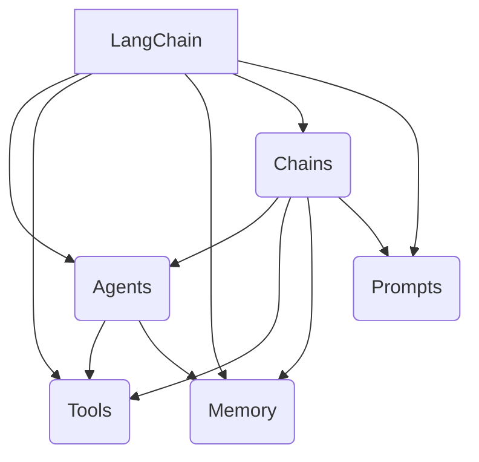

# 【LangChain编程：从入门到实践】社区和资源

## 1.背景介绍

### 1.1 人工智能的兴起

人工智能(AI)已经成为当今科技领域最热门的话题之一。随着计算能力的不断提高和算法的快速发展,AI技术在各个领域都有了广泛的应用,从语音识别、图像处理到自然语言处理等,AI正在改变着我们的生活和工作方式。

### 1.2 LangChain的诞生

在AI的浪潮中,自然语言处理(NLP)技术扮演着重要角色。LangChain是一个用于构建应用程序的框架,旨在通过统一的接口和抽象,简化了与各种大型语言模型(LLM)的集成。它的出现为开发人员提供了一种更加高效和灵活的方式来利用NLP技术,加速了AI应用的开发和部署。

## 2.核心概念与联系

### 2.1 LangChain的核心概念

LangChain的核心概念包括以下几个方面:

1. **Agents**: 代理是LangChain中的一个重要概念,它代表了一个具有特定功能的实体,如问答代理、分析代理等。代理可以组合多个工具来完成复杂的任务。

2. **Tools**: 工具是代理可以使用的各种功能,如搜索引擎、数据库查询等。工具为代理提供了与外部世界交互的能力。

3. **Memory**: 内存用于存储代理在执行过程中产生的中间结果和上下文信息,以供后续使用。

4. **Chains**: 链是将多个组件(如代理、工具、内存等)连接在一起的逻辑单元,用于构建复杂的应用程序。

5. **Prompts**: 提示是与语言模型进行交互的关键,它们定义了模型应该如何处理输入并生成输出。

这些核心概念相互关联,共同构建了LangChain的基础架构。开发人员可以灵活地组合和扩展这些概念,以满足各种应用场景的需求。



### 2.2 LangChain与其他NLP框架的关系

LangChain与其他NLP框架(如Hugging Face的Transformers、spaCy等)有着密切的关系。LangChain可以与这些框架无缝集成,利用它们提供的语言模型和NLP功能。同时,LangChain也提供了更高层次的抽象和组件,使开发人员能够更加专注于应用程序的逻辑,而不必过多关注底层细节。

## 3.核心算法原理具体操作步骤

LangChain的核心算法原理主要涉及以下几个方面:

### 3.1 代理(Agents)的工作原理

代理是LangChain中的核心组件,它们负责执行特定的任务。代理的工作原理可以概括为以下步骤:

1. 接收输入和上下文信息。
2. 根据输入和上下文,确定需要执行的操作序列。
3. 调用相关工具执行每个操作。
4. 将操作结果存储在内存中,供后续使用。
5. 根据中间结果和上下文,决定是否需要继续执行其他操作。
6. 最终生成输出结果。

代理的行为由其内部的决策逻辑和规则所驱动。LangChain提供了多种预定义的代理,如序列代理(Sequential Agent)、反思代理(Reflective Agent)等,同时也支持自定义代理的开发。

### 3.2 链(Chains)的构建过程

链是将多个组件(如代理、工具、内存等)连接在一起的逻辑单元。构建链的过程通常包括以下步骤:

1. 定义链的输入和输出格式。
2. 选择合适的代理、工具和内存组件。
3. 根据应用场景,确定组件之间的交互逻辑。
4. 使用LangChain提供的API将组件组装成链。
5. 测试和调试链的行为。

链的构建过程需要开发人员对应用场景有深入的理解,并熟悉LangChain提供的各种组件和API。

### 3.3 提示(Prompts)的设计原则

提示是与语言模型进行交互的关键。设计高质量的提示需要遵循以下原则:

1. **清晰性**: 提示应该清晰地表达期望的输出,避免歧义和模糊性。
2. **简洁性**: 提示应该尽可能简洁,不要包含多余的信息。
3. **一致性**: 对于相似的任务,应该使用一致的提示格式和语言。
4. **指导性**: 提示可以包含一些示例或指导,帮助语言模型更好地理解期望的输出。
5. **可扩展性**: 提示应该设计得足够灵活,以便于在不同场景下进行调整和扩展。

提示的设计需要反复迭代和测试,以确保其能够有效地指导语言模型生成所需的输出。

## 4.数学模型和公式详细讲解举例说明

在自然语言处理领域,数学模型和公式扮演着重要的角色。LangChain与各种语言模型紧密集成,因此了解一些常见的数学模型和公式对于更好地利用LangChain是很有帮助的。

### 4.1 Transformer模型

Transformer是一种广泛应用于自然语言处理任务的模型架构。它的核心思想是使用自注意力(Self-Attention)机制来捕捉输入序列中元素之间的依赖关系。Transformer模型的数学表示如下:

$$
\begin{aligned}
\text{Attention}(Q, K, V) &= \text{softmax}\left(\frac{QK^T}{\sqrt{d_k}}\right)V \\
\text{MultiHead}(Q, K, V) &= \text{Concat}(head_1, \dots, head_h)W^O \\
\text{where} \; head_i &= \text{Attention}(QW_i^Q, KW_i^K, VW_i^V)
\end{aligned}
$$

其中,$Q$、$K$和$V$分别表示查询(Query)、键(Key)和值(Value)矩阵。$d_k$是缩放因子,用于防止点积的值过大或过小。MultiHead表示多头注意力机制,它将注意力分成多个子空间,每个子空间都有自己的权重矩阵$W_i^Q$、$W_i^K$和$W_i^V$,最后将所有子空间的结果拼接起来。

Transformer模型在各种NLP任务中表现出色,如机器翻译、文本生成等,它也是许多大型语言模型(如GPT、BERT等)的核心组成部分。

### 4.2 语言模型的目标函数

语言模型的目标是学习一个概率分布,能够准确地预测给定上下文下的下一个词。对于一个长度为$T$的序列$\{x_1, x_2, \dots, x_T\}$,语言模型的目标函数可以表示为:

$$
\begin{aligned}
\mathcal{L}(\theta) &= -\frac{1}{T}\sum_{t=1}^{T}\log P(x_t|x_{<t}; \theta) \\
&= -\frac{1}{T}\sum_{t=1}^{T}\log \frac{\exp(h_\theta(x_{<t})^\top e(x_t))}{\sum_{x'}\exp(h_\theta(x_{<t})^\top e(x'))}
\end{aligned}
$$

其中,$\theta$表示模型的参数,$h_\theta$是一个编码函数,将上下文$x_{<t}$映射到一个向量表示,$e(x_t)$是词$x_t$的embedding向量。目标是最小化这个负对数似然损失函数,使模型能够更好地预测下一个词。

通过学习这种条件概率分布,语言模型可以捕捉到语言的结构和模式,从而在各种NLP任务中发挥作用。

## 5.项目实践:代码实例和详细解释说明

为了更好地理解LangChain的使用,我们将通过一个简单的示例项目来演示如何使用LangChain构建一个问答系统。

### 5.1 项目概述

在这个示例项目中,我们将构建一个基于LangChain的问答系统,能够回答有关"Python编程"主题的问题。系统将利用Wikipedia作为知识来源,并使用OpenAI的GPT-3语言模型来生成答案。

### 5.2 安装依赖

首先,我们需要安装所需的Python包:

```bash
pip install langchain openai wikipedia
```

### 5.3 加载数据

我们将从Wikipedia上获取与"Python编程"相关的页面内容,作为问答系统的知识库。

```python
from langchain.document_loaders import WikipediaLoader

loader = WikipediaLoader(["Python (programming language)"])
data = loader.load()
```

### 5.4 创建向量存储

为了加速问题与知识库的匹配过程,我们将使用向量存储来存储文档的向量表示。

```python
from langchain.text_splitter import CharacterTextSplitter
from langchain.vectorstores import Chroma

text_splitter = CharacterTextSplitter(chunk_size=1000, chunk_overlap=0)
texts = text_splitter.split_documents(data)

from langchain.embeddings import OpenAIEmbeddings
embeddings = OpenAIEmbeddings()

vectorstore = Chroma.from_documents(texts, embeddings)
```

### 5.5 创建问答链

接下来,我们将创建一个问答链,用于处理用户的查询并生成答案。

```python
from langchain.chains import RetrievalQA
from langchain.llms import OpenAI

qa = RetrievalQA.from_chain_type(
    llm=OpenAI(),
    chain_type="stuff",
    retriever=vectorstore.as_retriever(),
    return_source_documents=True,
)
```

### 5.6 提问并获取答案

现在,我们可以向问答系统提出问题,并获取相应的答案。

```python
query = "What is Python used for?"
result = qa({"query": query})
print(result['result'])
```

输出结果将包含生成的答案以及相关的源文档。

### 5.7 代码解释

1. 我们首先使用`WikipediaLoader`从Wikipedia上加载与"Python编程"相关的页面内容。
2. 然后,我们使用`CharacterTextSplitter`将长文档拆分成多个较短的文本块,以便更好地处理。
3. 接下来,我们使用OpenAI的embedding服务为每个文本块生成向量表示,并将这些向量存储在`Chroma`向量存储中。
4. 我们创建一个`RetrievalQA`链,它将使用向量存储来检索与用户查询相关的文档,并使用OpenAI的GPT-3语言模型生成答案。
5. 最后,我们可以向问答系统提出问题,它将返回生成的答案以及相关的源文档。

通过这个示例,您可以了解到如何使用LangChain构建一个简单的问答系统。当然,在实际应用中,您可以根据需求进一步扩展和定制系统,例如使用不同的数据源、语言模型或添加更多功能。

## 6.实际应用场景

LangChain提供了一种灵活和可扩展的方式来构建各种自然语言处理应用程序。以下是一些LangChain可能被应用的场景:

### 6.1 智能问答系统

如我们在上一节中所示,LangChain可以用于构建智能问答系统。这种系统可以应用于客户服务、知识库查询、教育辅助等领域,为用户提供准确、及时的答复。

### 6.2 自动化任务处理

LangChain可以用于自动化各种任务,如数据提取、文本摘要、内容生成等。通过将多个工具和代理组合在一起,LangChain可以帮助简化复杂的工作流程,提高效率。

### 6.3 个性化推荐系统

利用LangChain的自然语言处理能力,可以构建个性化推荐系统,根据用户的偏好和行为提供个性化的内容推荐,如新闻、产品、娱乐等。

### 6.4 智能写作辅助

LangChain可以用于辅助写作,如自动生成文本、校对错误、提供写作建议等。这对于内容创作者、作家、学生等群体来说都是非常有用的。

### 6.5 情感分析和观点挖掘

通过与情感分析和观点挖掘模型的集成,LangChain可以用于分析社交媒体数据