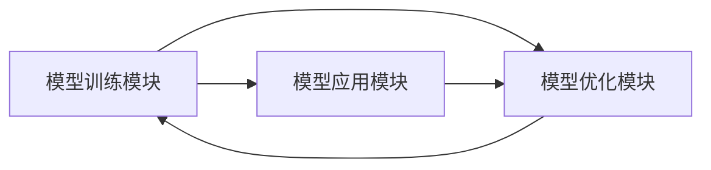
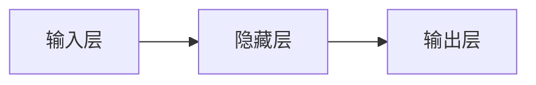

## 1.背景介绍
在当前的人工智能领域，大模型的应用开发已经成为了一个趋势。大模型的优势在于其可以处理更复杂的任务，提供更高的准确率。然而，大模型的开发和应用也面临着一些挑战，例如模型的训练和优化，以及如何将大模型应用到实际的业务场景中。为了解决这些问题，我们提出了一个名为AutoGen的框架，该框架可以帮助开发者更方便地开发和应用大模型。本文将详细介绍AutoGen的设计原理和使用方法，以及如何通过AutoGen进行大模型的应用开发。

## 2.核心概念与联系
AutoGen是一个用于大模型应用开发的框架，其核心理念是将模型的训练和应用过程自动化，使得开发者可以更加专注于模型的设计和优化，而不需要关心模型的训练和应用过程。AutoGen的核心组件包括模型训练模块、模型应用模块和模型优化模块。

- 模型训练模块：该模块负责模型的训练过程，包括数据的预处理、模型的训练和模型的验证。
- 模型应用模块：该模块负责将训练好的模型应用到实际的业务场景中，包括模型的部署和模型的调用。
- 模型优化模块：该模块负责模型的优化，包括模型的参数优化和模型的结构优化。

这三个模块之间的关系如下图所示：


## 3.核心算法原理具体操作步骤
AutoGen的核心算法包括模型的训练算法、模型的应用算法和模型的优化算法。

- 模型训练算法：该算法主要包括数据的预处理、模型的训练和模型的验证。数据的预处理主要是将原始数据转换为模型可以接受的格式；模型的训练则是通过反向传播算法来更新模型的参数；模型的验证则是通过验证集来评估模型的性能。
- 模型应用算法：该算法主要包括模型的部署和模型的调用。模型的部署是将训练好的模型部署到实际的业务场景中；模型的调用则是通过API接口来调用部署好的模型。
- 模型优化算法：该算法主要包括模型的参数优化和模型的结构优化。模型的参数优化是通过优化算法来寻找最优的模型参数；模型的结构优化则是通过剪枝和量化等技术来优化模型的结构。

## 4.数学模型和公式详细讲解举例说明
在AutoGen中，我们使用反向传播算法来进行模型的训练。反向传播算法的数学模型如下：

假设我们的模型是一个多层感知机（MLP），其结构如下图所示：

其中，输入层到隐藏层的权重为$W_{1}$，隐藏层到输出层的权重为$W_{2}$。我们的目标是最小化模型的损失函数$L$，其定义为：
$$
L = \frac{1}{2} (y - \hat{y})^2
$$
其中，$y$是真实值，$\hat{y}$是模型的预测值。

在反向传播算法中，我们首先计算损失函数关于权重的梯度，然后根据梯度来更新权重。具体的计算公式如下：
$$
\frac{\partial L}{\partial W_{1}} = \frac{\partial L}{\partial \hat{y}} \frac{\partial \hat{y}}{\partial h} \frac{\partial h}{\partial W_{1}}
$$
$$
\frac{\partial L}{\partial W_{2}} = \frac{\partial L}{\partial \hat{y}} \frac{\partial \hat{y}}{\partial W_{2}}
$$
其中，$h$是隐藏层的输出。通过这两个公式，我们可以计算出损失函数关于权重的梯度，然后根据梯度来更新权重。

## 5.项目实践：代码实例和详细解释说明
下面我们将通过一个简单的例子来说明如何使用AutoGen进行大模型的应用开发。我们的任务是使用MLP模型来进行手写数字的识别。

首先，我们需要安装AutoGen框架，安装命令如下：
```bash
pip install autogen
```

然后，我们可以使用以下代码来训练模型：
```python
from autogen import AutoGen

# 创建AutoGen对象
ag = AutoGen()

# 加载数据
ag.load_data('mnist')

# 定义模型
ag.define_model('mlp', input_dim=784, hidden_dim=100, output_dim=10)

# 训练模型
ag.train_model(epochs=10)

# 保存模型
ag.save_model('mlp_model')
```

接下来，我们可以使用以下代码来部署模型：
```python
from autogen import AutoGen

# 创建AutoGen对象
ag = AutoGen()

# 加载模型
ag.load_model('mlp_model')

# 部署模型
ag.deploy_model()
```

最后，我们可以使用以下代码来调用模型：
```python
from autogen import AutoGen

# 创建AutoGen对象
ag = AutoGen()

# 调用模型
result = ag.call_model('image.jpg')

# 打印结果
print(result)
```

## 6.实际应用场景
AutoGen可以应用于各种需要使用大模型的场景，例如图像识别、语音识别、自然语言处理等。例如，在图像识别中，我们可以使用AutoGen来训练和应用深度学习模型，如卷积神经网络（CNN）；在语音识别中，我们可以使用AutoGen来训练和应用循环神经网络（RNN）；在自然语言处理中，我们可以使用AutoGen来训练和应用Transformer模型。

## 7.工具和资源推荐
在使用AutoGen进行大模型应用开发时，我们推荐以下工具和资源：

- TensorFlow：一个强大的深度学习框架，可以用于模型的训练和应用。
- Keras：一个基于TensorFlow的高级深度学习框架，可以简化模型的定义和训练过程。
- PyTorch：一个动态图的深度学习框架，可以提供更直观和灵活的模型定义和训练方式。
- Scikit-learn：一个强大的机器学习库，提供了大量的机器学习算法和工具。

## 8.总结：未来发展趋势与挑战
随着人工智能的发展，大模型的应用开发将成为趋势。然而，大模型的开发和应用也面临着一些挑战，例如模型的训练和优化，以及如何将大模型应用到实际的业务场景中。为了解决这些问题，我们提出了AutoGen这样的框架，希望能够帮助开发者更方便地开发和应用大模型。未来，我们将继续优化AutoGen，使其更好地服务于大模型的应用开发。

## 9.附录：常见问题与解答
1. Q: AutoGen支持哪些模型？
   A: AutoGen支持各种深度学习模型，包括MLP、CNN、RNN、Transformer等。

2. Q: AutoGen如何进行模型的训练？
   A: AutoGen使用反向传播算法进行模型的训练。

3. Q: AutoGen如何进行模型的优化？
   A: AutoGen可以进行模型的参数优化和模型的结构优化。

4. Q: AutoGen如何进行模型的部署和调用？
   A: AutoGen提供了模型的部署和调用接口，开发者可以通过这些接口来部署和调用模型。

作者：禅与计算机程序设计艺术 / Zen and the Art of Computer Programming