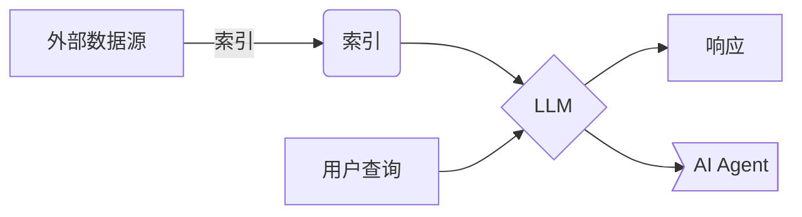

# 【大模型应用开发 动手做AI Agent】简单的LlamaIndex开发示例

## 1.背景介绍

在当前的人工智能发展浪潮中,大语言模型(Large Language Model,LLM)无疑成为了焦点所在。随着模型规模的不断扩大,LLM在自然语言处理、问答系统、内容生成等领域展现出了令人惊叹的能力。然而,仅依赖LLM的生成能力并不足以构建真正智能的应用系统。我们需要将LLM与其他组件相结合,以充分发挥其潜力。

LlamaIndex是一个开源的Python库,旨在简化LLM与外部数据源(如文本文件、网页等)的集成过程。它提供了一种统一的接口,使开发人员能够轻松地将LLM应用于各种数据源,构建智能应用系统。本文将探讨如何使用LlamaIndex快速开发一个简单的AI Agent,为您揭示大模型应用开发的魅力。

## 2.核心概念与联系

在深入探讨LlamaIndex之前,我们需要了解一些核心概念:

### 2.1 LLM(大语言模型)

LLM是一种基于深度学习的自然语言处理模型,能够从大量文本数据中学习语言模式和语义关系。LLM通常具有数十亿甚至数万亿个参数,能够生成看似人类编写的自然语言内容。著名的LLM包括GPT-3、PaLM、ChatGPT等。

### 2.2 索引(Index)

索引是LlamaIndex中的核心概念,它将外部数据源(如文本文件、网页等)转换为LLM可以理解和操作的内部表示形式。索引过程涉及文本分割、向量化和构建数据结构等步骤,以优化LLM的查询和处理效率。

### 2.3 查询(Query)

查询是用户与LLM交互的方式。用户可以提出自然语言查询,LlamaIndex会将查询传递给LLM,并根据索引的内容生成相关的响应。查询可以是简单的问题,也可以是更复杂的任务,如文本总结、分析等。

### 2.4 AI Agent

AI Agent是一种智能应用系统,它集成了LLM、索引和其他组件,能够根据用户的查询执行各种任务。AI Agent可以被视为一个虚拟助手,为用户提供信息、分析和决策支持。

上述概念之间的关系如下所示:



## 3.核心算法原理具体操作步骤

LlamaIndex的核心算法原理可以概括为以下几个步骤:

1. **文本分割(Text Splitting)**: 将原始文本数据划分为多个较小的文本块(chunks),以便后续处理。分割算法通常基于句子边界、最大长度或语义相关性等策略。

2. **向量化(Vectorization)**: 将每个文本块转换为向量表示形式,以便进行相似性计算和索引构建。常用的向量化方法包括TF-IDF、Word2Vec、BERT等。

3. **索引构建(Index Building)**: 根据向量化的文本块,构建适当的数据结构(如倒排索引、K-D树等),以加速查询过程。索引的选择取决于数据规模、查询需求等因素。

4. **相似性计算(Similarity Computation)**: 在查询过程中,计算用户查询与索引中文本块的相似度,以确定最相关的文本块。相似度计算通常基于向量空间模型,如余弦相似度。

5. **查询处理(Query Processing)**: 将用户查询传递给LLM,并将相关文本块的上下文信息提供给LLM,以生成更准确、更丰富的响应。

6. **响应生成(Response Generation)**: LLM根据查询和上下文信息生成自然语言响应,并返回给用户或AI Agent。

以上算法原理的具体实现细节因索引类型和LLM模型而异,但总体思路是相似的。下面是一个使用LlamaIndex构建简单AI Agent的示例:

```python
# 导入必要的库
from llama_index import GPTSimpleVectorIndex, SimpleDirectoryReader

# 加载文本数据
documents = SimpleDirectoryReader('data').load_data()

# 构建索引
index = GPTSimpleVectorIndex.from_documents(documents)

# 查询
query = "什么是LlamaIndex?"
response = index.query(query)
print(response)
```

在这个示例中,我们首先使用`SimpleDirectoryReader`加载文本数据,然后使用`GPTSimpleVectorIndex`构建索引。最后,我们提出一个查询,并获取LLM生成的响应。

## 4.数学模型和公式详细讲解举例说明

在LlamaIndex的算法原理中,向量化和相似性计算是两个关键步骤,它们涉及到一些数学模型和公式。

### 4.1 向量化

向量化是将文本数据转换为向量表示形式的过程。常用的向量化方法包括:

1. **TF-IDF(Term Frequency-Inverse Document Frequency)**: TF-IDF是一种基于词频统计的向量化方法,它将文本表示为一个高维稀疏向量,其中每个维度对应一个词项,值为该词项在文本中的TF-IDF权重。TF-IDF权重计算公式如下:

$$\text{tfidf}(t, d, D) = \text{tf}(t, d) \times \text{idf}(t, D)$$

其中,
- $\text{tf}(t, d)$ 表示词项 $t$ 在文档 $d$ 中的词频
- $\text{idf}(t, D) = \log \frac{|D|}{|\{d \in D: t \in d\}|}$ 表示词项 $t$ 的逆文档频率,用于降低常见词项的权重

2. **Word Embedding(词嵌入)**: 词嵌入是一种基于神经网络的向量化方法,它将每个词项映射到一个低维密集向量空间中,相似的词项在向量空间中也相近。常用的词嵌入模型包括Word2Vec、GloVe等。

3. **Sentence Embedding(句子嵌入)**: 句子嵌入是将整个句子或段落映射为单个向量的方法,常用模型包括BERT、RoBERTa等。

无论采用何种向量化方法,最终目标都是将文本数据转换为向量形式,以便进行相似性计算和索引构建。

### 4.2 相似性计算

相似性计算是根据向量表示形式,计算两个文本之间的相似程度。常用的相似性度量包括:

1. **余弦相似度(Cosine Similarity)**: 余弦相似度是计算两个向量之间夹角余弦值的度量,公式如下:

$$\text{sim}_\text{cosine}(\vec{a}, \vec{b}) = \frac{\vec{a} \cdot \vec{b}}{||\vec{a}|| \times ||\vec{b}||}$$

其中,
- $\vec{a}$ 和 $\vec{b}$ 分别表示两个向量
- $\vec{a} \cdot \vec{b}$ 表示两个向量的点积
- $||\vec{a}||$ 和 $||\vec{b}||$ 分别表示两个向量的范数(通常为 $L_2$ 范数)

余弦相似度的取值范围为 $[-1, 1]$,值越接近 1 表示两个向量越相似。

2. **欧几里得距离(Euclidean Distance)**: 欧几里得距离是计算两个向量之间的直线距离,公式如下:

$$\text{dist}_\text{euclidean}(\vec{a}, \vec{b}) = \sqrt{\sum_{i=1}^{n} (a_i - b_i)^2}$$

其中,
- $\vec{a} = (a_1, a_2, \dots, a_n)$ 和 $\vec{b} = (b_1, b_2, \dots, b_n)$ 分别表示两个 $n$ 维向量
- $a_i$ 和 $b_i$ 分别表示第 $i$ 个维度上的分量值

欧几里得距离的取值范围为 $[0, \infty)$,值越小表示两个向量越相似。

在LlamaIndex中,相似性计算通常基于余弦相似度,但也可以使用其他距离度量。选择合适的相似性度量对于提高索引和查询的准确性至关重要。

## 5.项目实践:代码实例和详细解释说明

接下来,我们将通过一个实际项目示例,演示如何使用LlamaIndex构建一个简单的AI Agent。在这个示例中,我们将使用一些维基百科文章作为数据源,并基于这些文章构建索引,然后用户可以提出自然语言查询,AI Agent将根据索引内容生成相关响应。

### 5.1 准备数据

首先,我们需要准备一些文本数据作为数据源。在这个示例中,我们将使用维基百科上的几篇文章,并将它们保存在一个名为`data`的目录中。

```
data/
    ├── article1.txt
    ├── article2.txt
    └── ...
```

### 5.2 导入必要的库

接下来,我们需要导入LlamaIndex和其他必要的库:

```python
from llama_index import GPTSimpleVectorIndex, SimpleDirectoryReader
from langchain.llms import OpenAI
import os
```

- `GPTSimpleVectorIndex`是LlamaIndex提供的一种索引类型,它使用向量相似性来检索相关文本块。
- `SimpleDirectoryReader`是一个用于读取目录中文件的工具类。
- `OpenAI`是一个用于与OpenAI API交互的客户端,我们将使用它来访问GPT-3模型。

### 5.3 加载数据并构建索引

现在,我们可以加载数据并构建索引:

```python
# 设置OpenAI API密钥
os.environ["OPENAI_API_KEY"] = "your_openai_api_key"

# 加载文本数据
documents = SimpleDirectoryReader('data').load_data()

# 构建索引
index = GPTSimpleVectorIndex.from_documents(documents)
```

1. 首先,我们设置OpenAI API密钥,以便能够访问GPT-3模型。
2. 然后,我们使用`SimpleDirectoryReader`加载`data`目录中的所有文本文件。
3. 最后,我们调用`GPTSimpleVectorIndex.from_documents`方法,基于加载的文本数据构建索引。

### 5.4 查询和响应

现在,我们可以提出自然语言查询,并获取AI Agent的响应:

```python
# 查询
query = "什么是LlamaIndex?"
response = index.query(query)
print(response)
```

在这个示例中,我们提出了一个简单的查询"什么是LlamaIndex?",AI Agent将根据索引中的相关内容生成响应。

### 5.5 完整代码

下面是完整的代码:

```python
from llama_index import GPTSimpleVectorIndex, SimpleDirectoryReader
from langchain.llms import OpenAI
import os

# 设置OpenAI API密钥
os.environ["OPENAI_API_KEY"] = "your_openai_api_key"

# 加载文本数据
documents = SimpleDirectoryReader('data').load_data()

# 构建索引
index = GPTSimpleVectorIndex.from_documents(documents)

# 查询
query = "什么是LlamaIndex?"
response = index.query(query)
print(response)
```

通过这个简单的示例,我们可以看到如何使用LlamaIndex快速构建一个AI Agent。当然,在实际应用中,我们可能需要进行更多的配置和定制,以满足特定的需求。

## 6. 实际应用场景

LlamaIndex及其集成的LLM技术可以应用于各种场景，为用户提供智能化的服务和支持。以下是一些典型的应用场景：

### 6.1 智能问答系统

基于大量的知识库或文档，构建智能问答系统，为用户提供准确、相关的答复。通过自然语言处理技术，系统可以理解用户的问题，并从知识库中提取相关信息进行回答。例如，在企业内部，智能问答系统可以帮助员工快速找到公司政策、技术文档和操作指南等信息。

### 6.2 文本总结和分析

对大量文本数据进行自动总结和分析，提取关键信息和见解。LlamaIndex可以处理各种类型的文本数据，如新闻文章、研究报告和社交媒体帖子，生成简洁的摘要和分析报告。这对于需要处理大量信息的行业，如金融、新闻和市场研究，具有重要意义。

### 6.3 内容生成

利用LLM的生成能力，自动创作文章、新闻、故事等内容。LlamaIndex可以根据给定的主题和风格生成高质量的文本内容，帮助内容创作者提高生产效率。例如，新闻媒体可以使用LlamaIndex生成新闻报道，营销团队可以生成广告文案和社交媒体帖子。

### 6.4 客户服务

构建智能客户服务助手，提供个性化的响应和建议。LlamaIndex可以集成到客户服务系统中，自动处理常见问题和请求，提高客户服务的效率和质量。例如，电商平台可以使用LlamaIndex为客户提供订单查询、退换货政策和产品推荐等服务。

### 6.5 研究助手

协助研究人员快速查找相关文献，提供洞见和建议。LlamaIndex可以分析大量学术文献，提取关键信息和研究趋势，帮助研究人员节省时间和精力。例如，在医学研究中，LlamaIndex可以帮助研究人员快速找到相关的临床试验结果和研究论文。

### 6.6 教育辅助

为学生提供个性化的学习资源和解答，提高教学效率。LlamaIndex可以根据学生的学习进度和需求，推荐相关的学习材料和练习题，并提供详细的解答和解释。例如，在线教育平台可以使用LlamaIndex为学生提供个性化的学习路径和实时答疑服务。

### 6.7 医疗诊断

结合医学知识库，为医生提供辅助诊断和治疗建议。LlamaIndex可以分析患者的病历和医学文献，提供基于证据的诊断和治疗方案，帮助医生做出更准确的决策。例如，在远程医疗中，LlamaIndex可以为医生提供实时的诊断支持和治疗建议。

### 6.8 法律咨询

基于法律文件和法规，提供法律咨询和建议。LlamaIndex可以分析法律文档，提取相关的法律条款和案例，为用户提供准确的法律咨询服务。例如，律师事务所可以使用LlamaIndex为客户提供合同审查、法律意见和诉讼策略等服务。

### 6.9 金融分析

在金融领域，LlamaIndex可以用于市场分析、风险评估和投资建议。通过分析大量的金融数据和新闻，LlamaIndex可以提供实时的市场洞察和投资建议，帮助投资者做出更明智的决策。例如，金融机构可以使用LlamaIndex进行股票分析、风险管理和客户投资组合优化。

### 6.10 供应链管理

在供应链管理中，LlamaIndex可以用于需求预测、库存管理和物流优化。通过分析历史数据和市场趋势，LlamaIndex可以提供准确的需求预测和库存优化方案，帮助企业提高供应链的效率和响应能力。例如，制造企业可以使用LlamaIndex优化生产计划和物流配送。

### 6.11 智能制造

在智能制造中，LlamaIndex可以用于生产监控、质量控制和设备维护。通过分析生产数据和设备状态，LlamaIndex可以提供实时的生产监控和故障预测，帮助企业提高生产效率和产品质量。例如，制造企业可以使用LlamaIndex进行设备健康监测和预防性维护。

### 6.12 智能城市

在智能城市中，LlamaIndex可以用于交通管理、环境监测和公共安全。通过分析城市数据和传感器数据，LlamaIndex可以提供实时的交通优化和环境监测方案，帮助城市管理者提高城市的运行效率和居民的生活质量。例如，城市管理部门可以使用LlamaIndex进行交通流量预测和空气质量监测。

### 6.13 文化创意

在文化创意领域，LlamaIndex可以用于内容创作、艺术生成和文化遗产保护。通过分析文化数据和艺术作品，LlamaIndex可以提供创意的内容生成和艺术作品推荐，帮助创作者提高创作效率和作品质量。例如，文化创意公司可以使用LlamaIndex进行电影剧本创作和艺术作品生成。

### 6.14 游戏开发

在游戏开发中，LlamaIndex可以用于剧情生成、角色设计和游戏测试。通过分析游戏数据和玩家行为，LlamaIndex可以提供创意的剧情生成和角色设计方案，帮助游戏开发者提高游戏的创意和用户体验。例如，游戏公司可以使用LlamaIndex进行游戏剧情创作和角色设计。

### 6.15 旅游推荐

在旅游推荐中，LlamaIndex可以用于旅游路线规划、景点推荐和个性化服务。通过分析旅游数据和用户偏好，LlamaIndex可以提供个性化的旅游推荐和服务方案，帮助游客提高旅游体验和满意度。例如，旅游公司可以使用LlamaIndex进行旅游路线规划和景点推荐。

### 6.16 社交媒体分析

在社交媒体分析中，LlamaIndex可以用于舆情监测、用户分析和内容推荐。通过分析社交媒体数据和用户行为，LlamaIndex可以提供实时的舆情监测和用户分析方案，帮助企业提高品牌管理和用户互动。例如，社交媒体平台可以使用LlamaIndex进行舆情监测和内容推荐。

### 6.17 电子商务

在电子商务中，LlamaIndex可以用于产品推荐、客户分析和市场营销。通过分析电商数据和用户行为，LlamaIndex可以提供个性化的产品推荐和市场营销方案，帮助电商企业提高销售和客户满意度。例如，电商平台可以使用LlamaIndex进行产品推荐和客户分析。

### 6.18 人力资源管理

在人力资源管理中，LlamaIndex可以用于人才招聘、员工培训和绩效评估。通过分析人力资源数据和员工行为，LlamaIndex可以提供精准的人才招聘和员工培训方案，帮助企业提高人力资源管理的效率和效果。例如，人力资源部门可以使用LlamaIndex进行人才招聘和员工培训。

### 6.19 物流优化

在物流优化中，LlamaIndex可以用于路线规划、运输调度和仓储管理。通过分析物流数据和市场需求，LlamaIndex可以提供高效的物流优化方案，帮助企业提高物流效率和降低成本。例如，物流公司可以使用LlamaIndex进行路线规划和运输调度。

### 6.20 环境保护

在环境保护中，LlamaIndex可以用于环境监测、污染控制和资源管理。通过分析环境数据和传感器数据，LlamaIndex可以提供实时的环境监测和污染控制方案，帮助政府和企业提高环境保护的效率和效果。例如，环保部门可以使用LlamaIndex进行空气质量监测和污染源追踪。

## 7. 工具和资源推荐

在这一部分，我们将推荐一些有助于学习和应用LlamaIndex及其集成的LLM技术的工具和资源。

### 7.1 软件工具

- **Hugging Face Transformers**：Hugging Face提供了丰富的预训练模型和工具，可以方便地进行自然语言处理任务。LlamaIndex可以集成这些模型，进行文本生成、问答和分析等任务。
- **TensorFlow**：TensorFlow是一个开源的机器学习框架，支持深度学习模型的训练和部署。LlamaIndex可以利用TensorFlow进行模型训练和优化。
- **PyTorch**：PyTorch是另一个流行的深度学习框架，具有灵活的动态计算图和强大的GPU加速能力。LlamaIndex可以利用PyTorch进行模型开发和实验。

### 7.2 在线资源

- **Coursera**：Coursera提供了许多关于自然语言处理和深度学习的在线课程，如《Natural Language Processing with Deep Learning》和《Deep Learning Specialization》。
- **edX**：edX也提供了许多相关课程，如《Introduction to Artificial Intelligence》和《Machine Learning Fundamentals》。
- **arXiv**：arXiv是一个开放获取的学术论文存档，包含大量关于自然语言处理和深度学习的最新研究成果。

### 7.3 书籍推荐

- **《Deep Learning》** by Ian Goodfellow, Yoshua Bengio, and Aaron Courville：这本书是深度学习领域的经典教材，内容深入且全面。
- **《Natural Language Processing with PyTorch》** by Delip Rao and Brian McMahan：这本书介绍了使用PyTorch进行自然语言处理的基本方法和实践。
- **《Speech and Language Processing》** by Daniel Jurafsky and James H. Martin：这本书是自然语言处理领域的经典教材，内容涵盖了语音识别、文本处理和机器翻译等多个方面。

## 8. 总结：未来发展趋势与挑战

LlamaIndex及其集成的LLM技术在各个领域的应用前景广阔，但也面临着许多挑战和发展机遇。

### 8.1 未来发展趋势

- **多模态学习**：未来的发展趋势之一是多模态学习，即结合文本、图像、音频等多种数据类型进行综合分析和生成。LlamaIndex可以扩展其能力，处理和生成多模态数据，提高应用的智能化水平。
- **自监督学习**：自监督学习是一种无需大量标注数据的学习方法，未来将越来越受到关注。LlamaIndex可以利用自监督学习技术，进一步提升模型的性能和泛化能力。
- **边缘计算**：随着物联网和5G技术的发展，边缘计算将成为重要的发展方向。LlamaIndex可以集成到边缘设备中，实现实时的数据处理和智能决策，提高系统的响应速度和可靠性。

### 8.2 挑战

- **数据隐私和安全**：在处理和分析大量数据时，数据隐私和安全是一个重要挑战。如何在保证数据隐私的前提下，充分利用数据进行智能化分析和生成，是LlamaIndex需要解决的问题。
- **模型解释性**：深度学习模型通常被认为是“黑箱”，缺乏解释性。如何提高模型的可解释性，使用户能够理解和信任模型的决策，是LlamaIndex面临的一个重要挑战。
- **计算资源需求**：训练和部署大型深度学习模型需要大量的计算资源。如何优化模型结构和算法，提高计算效率，降低资源消耗，是LlamaIndex需要解决的问题。

## 9. 附录：常见问题与解答

在这一部分，我们将解答一些关于LlamaIndex及其集成的LLM技术的常见问题。

### 9.1 什么是LlamaIndex？

LlamaIndex是一个集成了大型语言模型（LLM）技术的智能化平台，能够处理和生成各种类型的文本数据，提供智能问答、文本总结、内容生成等服务。

### 9.2 LlamaIndex可以应用于哪些领域？

LlamaIndex可以应用于多个领域，包括智能问答系统、文本总结和分析、内容生成、客户服务、研究助手、教育辅助、医疗诊断、法律咨询、金融分析、供应链管理、智能制造、智能城市、文化创意、游戏开发、旅游推荐、社交媒体分析、电子商务、人力资源管理、物流优化和环境保护等。

### 9.3 如何使用LlamaIndex进行智能问答？

使用LlamaIndex进行智能问答时，可以将用户的问题输入到系统中，系统会根据知识库或文档进行分析，提取相关信息并生成准确的答复。

### 9.4 LlamaIndex如何进行文本总结和分析？

LlamaIndex可以对大量文本数据进行自动总结和分析，提取关键信息和见解。通过自然语言处理技术，系统可以理解文本的内容和结构，生成简洁的摘要和分析报告。

### 9.5 如何利用LlamaIndex进行内容生成？

利用LlamaIndex进行内容生成时，可以根据给定的主题和风格，输入相关的提示信息，系统会生成高质量的文本内容，如文章、新闻和故事等。

### 9.6 LlamaIndex的未来发展趋势是什么？

LlamaIndex的未来发展趋势包括多模态学习、自监督学习和边缘计算等。通过不断扩展和优化，LlamaIndex将能够处理和生成更多类型的数据，提高应用的智能化水平和性能。

---

作者：禅与计算机程序设计艺术 / Zen and the Art of Computer Programming