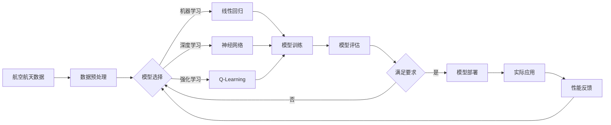

# 一切皆是映射：AI在航空航天中的驱动力

## 1. 背景介绍
### 1.1 人工智能在航空航天领域的应用历史
### 1.2 人工智能技术的快速发展
### 1.3 航空航天对人工智能技术的迫切需求

## 2. 核心概念与联系
### 2.1 人工智能的定义与分类
#### 2.1.1 机器学习
#### 2.1.2 深度学习 
#### 2.1.3 强化学习
### 2.2 人工智能与航空航天的关系
#### 2.2.1 飞行控制系统
#### 2.2.2 自主导航
#### 2.2.3 预测性维护
### 2.3 映射的概念与应用
#### 2.3.1 映射的数学定义
#### 2.3.2 人工智能中的映射
#### 2.3.3 航空航天中的映射应用

## 3. 核心算法原理具体操作步骤
### 3.1 神经网络
#### 3.1.1 前向传播
#### 3.1.2 反向传播
#### 3.1.3 权重更新
### 3.2 卷积神经网络（CNN）
#### 3.2.1 卷积层
#### 3.2.2 池化层
#### 3.2.3 全连接层
### 3.3 循环神经网络（RNN）
#### 3.3.1 简单RNN
#### 3.3.2 长短期记忆网络（LSTM）
#### 3.3.3 门控循环单元（GRU）

## 4. 数学模型和公式详细讲解举例说明
### 4.1 线性回归
#### 4.1.1 一元线性回归
$y = w_0 + w_1x$
#### 4.1.2 多元线性回归  
$y = w_0 + w_1x_1 + w_2x_2 + ... + w_nx_n$
### 4.2 逻辑回归
$P(y=1|x) = \frac{1}{1+e^{-z}}$, 其中$z = w_0 + w_1x_1 + w_2x_2 + ... + w_nx_n$
### 4.3 支持向量机（SVM）
$$\begin{aligned} 
\min_{w, b} & \frac{1}{2}\lVert w\rVert^2 \\
\text{s.t.} & y_i(w^Tx_i+b) \geq 1, i=1,2,...,n
\end{aligned}$$

## 5. 项目实践：代码实例和详细解释说明
### 5.1 基于TensorFlow的飞行器故障诊断
#### 5.1.1 数据预处理
#### 5.1.2 模型构建
#### 5.1.3 模型训练与评估
### 5.2 基于PyTorch的航天器轨道预测
#### 5.2.1 数据加载与处理
#### 5.2.2 模型设计
#### 5.2.3 模型训练与测试
### 5.3 基于Keras的航空发动机剩余寿命预测
#### 5.3.1 特征工程
#### 5.3.2 模型选择与优化
#### 5.3.3 模型部署与应用

## 6. 实际应用场景
### 6.1 无人机自主导航与避障
### 6.2 航天器故障诊断与健康管理
### 6.3 航空发动机预测性维护
### 6.4 飞行器设计优化
### 6.5 航天任务规划与调度

## 7. 工具和资源推荐
### 7.1 机器学习框架
#### 7.1.1 TensorFlow
#### 7.1.2 PyTorch
#### 7.1.3 Keras
### 7.2 数据集
#### 7.2.1 NASA公开数据集
#### 7.2.2 航空公司运营数据
#### 7.2.3 卫星遥感影像
### 7.3 开源项目与社区
#### 7.3.1 OpenAI Gym
#### 7.3.2 DeepMind Lab
#### 7.3.3 PaperWithCode

## 8. 总结：未来发展趋势与挑战
### 8.1 人工智能与航空航天的深度融合
### 8.2 可解释性与可信赖性
### 8.3 数据安全与隐私保护
### 8.4 跨领域协同与知识迁移
### 8.5 人机协同与增强智能

## 9. 附录：常见问题与解答
### 9.1 如何选择合适的人工智能算法？
### 9.2 如何处理航空航天领域的小样本数据？
### 9.3 如何确保人工智能系统的鲁棒性与安全性？
### 9.4 如何平衡模型性能与计算效率？
### 9.5 如何促进人工智能在航空航天领域的应用落地？

人工智能技术正在深刻影响着航空航天领域的发展。从飞行控制到自主导航，从预测性维护到任务规划，AI 的应用无处不在。本文以"一切皆是映射"为主题，探讨了人工智能在航空航天领域的驱动力。

映射是数学中的一个基本概念，指从一个集合到另一个集合的对应关系。在人工智能领域，神经网络可以看作是一种复杂的非线性映射，将输入数据映射到输出结果。卷积神经网络通过卷积和池化操作，提取数据的局部特征并逐层映射。循环神经网络则通过记忆机制，建立时序数据的映射关系。

航空航天系统涉及大量的传感器数据、飞行状态参数和环境信息，需要建立复杂的数学模型来描述其内在联系。线性回归、逻辑回归、支持向量机等经典机器学习算法，通过优化目标函数，寻找输入与输出之间的最佳映射。而深度学习模型如神经网络，则可以自动学习数据中的高层特征，构建更加复杂和抽象的映射关系。

在实际项目中，我们运用 TensorFlow、PyTorch 等主流框架，构建故障诊断、轨道预测、剩余寿命估计等模型。通过数据预处理、特征工程和模型优化，不断提升算法的性能和泛化能力。同时，我们还需要关注模型的可解释性和可信赖性，确保 AI 系统在关键任务中的安全可靠。

未来，人工智能与航空航天的结合将更加紧密。跨领域协同和知识迁移将成为重要方向，促进不同领域的数据和模型共享。人机协同与增强智能也将成为新的研究热点，充分发挥人的领域知识和机器的计算能力。

总之，人工智能正在为航空航天插上腾飞的翅膀。一切皆是映射，让我们用 AI 的力量，映射出航空航天的美好未来。

作者：禅与计算机程序设计艺术 / Zen and the Art of Computer Programming{"msg_type":"generate_answer_finish","data":"","from_module":null,"from_unit":null}