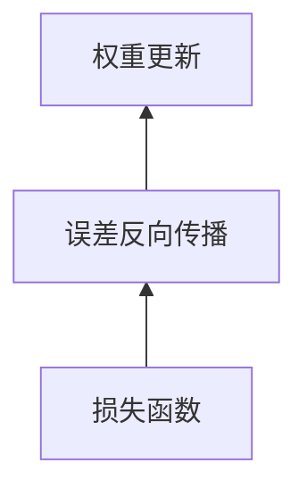

# 一切皆是映射：反向传播机制的直观理解

## 1.背景介绍

在深度学习领域,反向传播算法是训练神经网络的核心机制之一。它通过计算每个权重对最终输出的影响程度,从而确定如何调整权重以最小化损失函数。虽然数学公式看起来复杂,但本质上,反向传播算法可以被视为一种映射过程。

## 2.核心概念与联系

### 2.1 神经网络与函数映射

神经网络本质上是一个由多层函数组成的复合函数。每一层都将输入映射到输出,形成一个新的中间表示。这种层层映射的过程可以表示非常复杂的函数,从而实现诸如图像分类、语音识别等任务。


### 2.2 损失函数与误差反向传播

为了训练神经网络,我们需要定义一个损失函数来衡量预测输出与真实标签之间的差异。目标是通过调整网络权重,最小化这个损失函数。反向传播算法就是一种高效计算每个权重对损失函数影响的方法。



## 3.核心算法原理具体操作步骤

反向传播算法的核心思想是利用链式法则计算每个权重对损失函数的梯度,然后沿着梯度的反方向更新权重。具体步骤如下:

1. 前向传播:输入样本通过网络,计算每一层的输出。
2. 计算损失:将网络最终输出与真实标签进行比较,计算损失函数值。
3. 反向传播:从输出层开始,利用链式法则计算每个权重对损失函数的梯度。
4. 权重更新:沿着梯度的反方向,更新每个权重的值。
5. 重复以上步骤,直到损失函数收敛。

## 4.数学模型和公式详细讲解举例说明

### 4.1 前向传播

假设我们有一个简单的两层神经网络,其中 $W_1$、$W_2$ 分别表示第一层和第二层的权重矩阵, $b_1$、$b_2$ 表示偏置项。给定输入 $x$,前向传播过程可以表示为:

$$
h = \sigma(W_1 x + b_1) \\
y = \sigma(W_2 h + b_2)
$$

其中 $\sigma$ 是激活函数,如 ReLU 或 Sigmoid。

### 4.2 损失函数

对于分类任务,我们通常使用交叉熵损失函数:

$$
L = -\sum_i t_i \log(y_i)
$$

其中 $t$ 是一个热编码向量,表示真实标签, $y$ 是网络输出。

### 4.3 反向传播

反向传播的目标是计算每个权重 $w$ 对损失函数 $L$ 的梯度 $\frac{\partial L}{\partial w}$。利用链式法则,我们可以将梯度分解为:

$$
\frac{\partial L}{\partial w} = \frac{\partial L}{\partial y} \cdot \frac{\partial y}{\partial w}
$$

其中 $\frac{\partial L}{\partial y}$ 可以直接计算,而 $\frac{\partial y}{\partial w}$ 需要通过反向传播层层计算。以上述两层网络为例:

$$
\frac{\partial L}{\partial W_2} = \frac{\partial L}{\partial y} \cdot \frac{\partial y}{\partial W_2} = \frac{\partial L}{\partial y} \cdot \sigma'(W_2 h + b_2) \otimes h^T \\
\frac{\partial L}{\partial W_1} = \frac{\partial L}{\partial y} \cdot \frac{\partial y}{\partial h} \cdot \frac{\partial h}{\partial W_1} = \frac{\partial L}{\partial y} \cdot W_2^T \cdot \sigma'(W_1 x + b_1) \otimes x^T
$$

其中 $\otimes$ 表示矩阵外积, $\sigma'$ 是激活函数的导数。

### 4.4 权重更新

计算出每个权重的梯度后,我们可以采用梯度下降法更新权重:

$$
W \leftarrow W - \eta \frac{\partial L}{\partial W}
$$

其中 $\eta$ 是学习率,控制更新的步长。

## 5.项目实践:代码实例和详细解释说明

以下是一个使用 PyTorch 实现的简单两层神经网络示例,用于对 MNIST 手写数字进行分类:

```python
import torch
import torch.nn as nn
import torch.nn.functional as F

# 定义神经网络
class Net(nn.Module):
    def __init__(self):
        super(Net, self).__init__()
        self.fc1 = nn.Linear(28 * 28, 500)
        self.fc2 = nn.Linear(500, 10)

    def forward(self, x):
        x = x.view(-1, 28 * 28)
        x = F.relu(self.fc1(x))
        x = self.fc2(x)
        return x

# 实例化网络
net = Net()

# 定义损失函数和优化器
criterion = nn.CrossEntropyLoss()
optimizer = torch.optim.SGD(net.parameters(), lr=0.01)

# 训练循环
for epoch in range(10):
    for data in train_loader:
        inputs, labels = data
        
        # 前向传播
        outputs = net(inputs)
        loss = criterion(outputs, labels)
        
        # 反向传播
        optimizer.zero_grad()
        loss.backward()
        optimizer.step()
```

在这个示例中:

1. 我们定义了一个两层全连接神经网络 `Net`。
2. 使用交叉熵损失函数 `CrossEntropyLoss` 和随机梯度下降优化器 `SGD`。
3. 在训练循环中,我们执行前向传播计算网络输出和损失,然后执行反向传播计算梯度并更新权重。

## 6.实际应用场景

反向传播算法在深度学习的诸多领域都有广泛应用,例如:

- **计算机视觉**: 卷积神经网络在图像分类、目标检测、语义分割等任务中表现出色。
- **自然语言处理**: 循环神经网络和Transformer模型在机器翻译、文本生成等任务中发挥关键作用。
- **推荐系统**: 深度学习模型可以从用户行为数据中学习用户偏好,为用户推荐个性化内容。
- **强化学习**: 结合深度神经网络,强化学习算法可以在复杂环境中学习最优策略,应用于游戏AI、机器人控制等领域。

## 7.工具和资源推荐

- **PyTorch**: 一个流行的深度学习框架,提供了反向传播等核心功能的高效实现。
- **TensorFlow**: 另一个知名的深度学习框架,同样支持自动微分和反向传播。
- **深度学习书籍**: 如《深度学习》(Goodfellow et al.)、《模式识别与机器学习》(Bishop)等经典著作,对反向传播算法有深入探讨。
- **在线课程**: 像 Coursera、edX 等平台上有许多优质的深度学习课程,有助于掌握反向传播等核心概念。
- **开源项目**: 在 GitHub 上有许多开源的深度学习项目,可以学习和参考其中的反向传播实现。

## 8.总结:未来发展趋势与挑战

反向传播算法虽然强大,但也存在一些局限性和挑战:

- **消失/爆炸梯度问题**: 在深层网络中,梯度可能会在反向传播过程中逐层衰减或爆炸,导致训练困难。
- **对抗样本**: 添加微小扰动可能会使深度模型产生完全不同的预测结果,这暴露了模型的脆弱性。
- **可解释性**: 深度神经网络常被视为"黑箱",缺乏可解释性,限制了其在一些关键领域(如医疗)的应用。
- **能效问题**: 训练大型深度模型需要消耗大量的计算资源和能源。

未来,研究人员将继续努力解决这些挑战,例如探索新的优化算法、设计更加鲁棒的网络架构、提高模型的可解释性等。同时,随着硬件加速器(如 TPU)的发展,训练大型模型的效率也将得到提高。

此外,结合其他技术(如强化学习、对抗生成网络等)有望进一步扩展深度学习的应用范围。总的来说,反向传播算法仍将是深度学习不可或缺的核心部分。

## 9.附录:常见问题与解答

**Q: 为什么需要反向传播算法?直接计算每个权重对损失函数的梯度不可以吗?**

A: 直接计算每个权重对损失函数的梯度是可行的,但是计算量将呈指数级增长。反向传播算法利用链式法则和动态规划的思想,大大降低了计算复杂度,使得在深层网络中也可以高效计算梯度。

**Q: 为什么要使用激活函数?**

A: 激活函数引入了非线性,使得神经网络能够拟合更加复杂的函数。如果没有激活函数,整个网络将等价于一个单层的线性模型,表达能力将受到严重限制。

**Q: 如何选择合适的学习率?**

A: 学习率的选择对模型收敛至关重要。过大的学习率可能导致无法收敛,而过小的学习率则可能需要更多的迭代次数。通常可以采用一些自适应学习率算法(如 Adam)或者在训练过程中动态调整学习率。

**Q: 深度学习模型是否一定需要大量数据?**

A: 深度学习模型通常需要大量数据进行训练,但是也有一些技术(如迁移学习、数据增广等)可以在数据量有限的情况下提高模型性能。同时,一些新兴的元学习方法也在探索如何使用少量数据快速适应新任务。

作者: 禅与计算机程序设计艺术 / Zen and the Art of Computer Programming