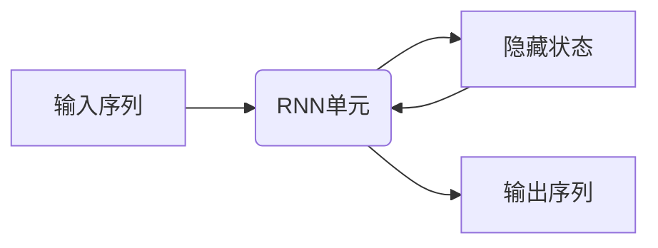
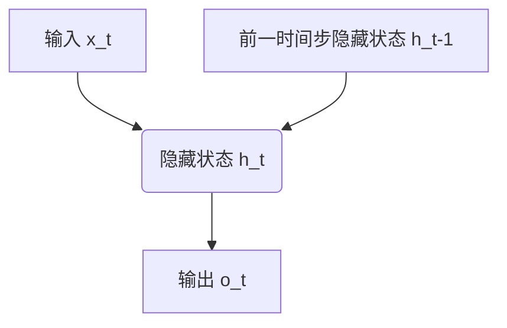

# 一切皆是映射：循环神经网络(RNNs)在时间序列分析中的作用

## 1.背景介绍

### 1.1 时间序列数据的重要性

在当今数据驱动的世界中,时间序列数据无处不在。从金融市场的股票价格走势到气象预报的温度变化,从语音识别到自然语言处理,时间序列数据都扮演着关键角色。准确分析和预测时间序列数据对于各行各业都具有重大意义。

### 1.2 传统方法的局限性  

传统的时间序列分析方法,如自回归移动平均模型(ARIMA)和指数平滑模型,虽然在处理线性问题时表现不错,但在面对非线性、高维和长期依赖的复杂时间序列数据时,它们的性能就大打折扣了。

### 1.3 循环神经网络(RNNs)的兴起

循环神经网络(Recurrent Neural Networks,RNNs)作为一种强大的深度学习模型,凭借其独特的循环结构和内存机制,可以很好地捕捉时间序列数据中的长期依赖关系,从而在时间序列分析领域取得了卓越的成就。

## 2.核心概念与联系

### 2.1 循环神经网络的基本思想

循环神经网络的核心思想是将序列数据视为一个整体,利用内部的循环机制来处理序列中的每个元素。与传统的前馈神经网络不同,RNNs在处理序列时,不仅考虑当前输入,还会综合之前状态的信息,从而能够很好地捕捉序列数据中的长期依赖关系。



### 2.2 RNNs与序列映射的联系

在时间序列分析中,我们常常需要将一个输入序列映射为一个输出序列。循环神经网络恰好提供了一种优雅的方式来实现这种映射。通过在每个时间步上传递隐藏状态,RNNs可以学习到输入和输出序列之间的复杂映射关系。


### 2.3 RNNs在时间序列分析中的应用

循环神经网络在时间序列分析中有广泛的应用,包括但不限于:

- 序列预测: 如股票价格预测、销售预测等
- 序列生成: 如文本生成、音乐作曲等
- 序列标注: 如命名实体识别、情感分析等
- 序列分类: 如垃圾邮件检测、异常检测等

## 3.核心算法原理具体操作步骤  

### 3.1 RNN的前向传播过程

在前向传播过程中,RNN会逐个处理输入序列中的每个元素,并更新其隐藏状态和输出。具体步骤如下:

1. 初始化隐藏状态 $h_0$
2. 对于每个时间步 $t$:
    - 计算当前时间步的隐藏状态: $h_t = \tanh(W_{hh}h_{t-1} + W_{xh}x_t + b_h)$
    - 计算当前时间步的输出: $o_t = W_{ho}h_t + b_o$
3. 返回最终的输出序列 $\{o_1, o_2, \dots, o_T\}$

其中, $W$ 表示权重矩阵, $b$ 表示偏置向量, $\tanh$ 是双曲正切激活函数。



### 3.2 RNN的反向传播过程

在反向传播过程中,我们需要计算损失函数关于模型参数的梯度,并使用优化算法(如随机梯度下降)来更新参数,从而最小化损失函数。具体步骤如下:

1. 初始化梯度为0: $\frac{\partial L}{\partial W} = 0, \frac{\partial L}{\partial b} = 0$
2. 对于每个时间步 $t$:
    - 计算当前时间步的梯度: $\frac{\partial L}{\partial o_t}, \frac{\partial L}{\partial h_t}$
    - 反向传播梯度: $\frac{\partial L}{\partial W_{ho}} += \frac{\partial L}{\partial o_t}h_t^T, \frac{\partial L}{\partial b_o} += \frac{\partial L}{\partial o_t}$
    - $\frac{\partial L}{\partial h_{t-1}} = \frac{\partial L}{\partial h_t}W_{hh}^T$
    - $\frac{\partial L}{\partial W_{hh}} += \frac{\partial L}{\partial h_t}h_{t-1}^T, \frac{\partial L}{\partial W_{xh}} += \frac{\partial L}{\partial h_t}x_t^T, \frac{\partial L}{\partial b_h} += \frac{\partial L}{\partial h_t}$
3. 使用优化算法更新参数

其中, $L$ 表示损失函数。通过反向传播,我们可以获得模型参数的梯度,并不断调整参数以最小化损失函数。

### 3.3 RNN的变种

基于标准RNN,研究人员提出了多种变种,以解决梯度消失/爆炸等问题,提高模型性能。一些常见的RNN变种包括:

- 长短期记忆网络(LSTMs)
- 门控循环单元(GRUs)
- 双向RNNs
- 深层RNNs
- 注意力机制

这些变种通过引入门控机制、双向传播或注意力机制等技术,显著提高了RNN在处理长期依赖和捕捉关键信息方面的能力。

## 4.数学模型和公式详细讲解举例说明

### 4.1 RNN的数学表示

我们可以使用以下公式来表示RNN的前向传播过程:

$$h_t = f(W_{hh}h_{t-1} + W_{xh}x_t + b_h)$$
$$o_t = g(W_{ho}h_t + b_o)$$

其中:

- $x_t$ 是时间步 $t$ 的输入
- $h_t$ 是时间步 $t$ 的隐藏状态
- $o_t$ 是时间步 $t$ 的输出
- $W$ 表示权重矩阵
- $b$ 表示偏置向量
- $f$ 和 $g$ 分别是隐藏层和输出层的激活函数,通常使用 $\tanh$ 或 $\text{ReLU}$

### 4.2 LSTM细节

长短期记忆网络(LSTM)是RNN的一种变种,它通过引入门控机制来解决梯度消失/爆炸问题,并提高了捕捉长期依赖的能力。LSTM在每个时间步上维护一个细胞状态 $c_t$,并通过遗忘门 $f_t$、输入门 $i_t$ 和输出门 $o_t$ 来控制信息的流动。

LSTM的前向传播过程可以表示为:

$$\begin{aligned}
f_t &= \sigma(W_f[h_{t-1}, x_t] + b_f) \\
i_t &= \sigma(W_i[h_{t-1}, x_t] + b_i) \\
o_t &= \sigma(W_o[h_{t-1}, x_t] + b_o) \\
\tilde{c}_t &= \tanh(W_c[h_{t-1}, x_t] + b_c) \\
c_t &= f_t \odot c_{t-1} + i_t \odot \tilde{c}_t \\
h_t &= o_t \odot \tanh(c_t)
\end{aligned}$$

其中 $\sigma$ 是sigmoid函数, $\odot$ 表示元素wise乘积。通过精心设计的门控机制,LSTM能够很好地捕捉长期依赖,并在各种序列建模任务中取得卓越表现。

### 4.3 注意力机制

注意力机制是一种重要的技术,可以帮助RNN更好地关注输入序列中的关键信息。在每个时间步上,注意力机制会为输入序列中的每个元素分配一个注意力权重,然后根据这些权重对隐藏状态进行加权求和,从而获得注意力向量。

具体来说,给定一个输入序列 $\{x_1, x_2, \dots, x_T\}$ 和当前隐藏状态 $h_t$,注意力机制的计算过程如下:

$$\begin{aligned}
e_i &= \text{score}(h_t, x_i) \\
\alpha_i &= \frac{\exp(e_i)}{\sum_j \exp(e_j)} \\
c_t &= \sum_i \alpha_i h_i
\end{aligned}$$

其中 $\text{score}$ 是一个评分函数,用于衡量当前隐藏状态 $h_t$ 与输入 $x_i$ 之间的相关性。$\alpha_i$ 是归一化后的注意力权重,而 $c_t$ 就是注意力向量。

通过引入注意力机制,RNN能够动态地关注输入序列中的关键信息,从而提高模型的性能。

## 5.项目实践:代码实例和详细解释说明

为了更好地理解RNN的工作原理,我们来看一个基于PyTorch的简单示例,实现一个基本的RNN模型来预测sin函数的值。

### 5.1 准备数据

首先,我们需要准备训练数据和测试数据。这里我们使用sin函数生成时间序列数据:

```python
import torch
import math

# 生成数据
T = 20 # 时间步数
L = 1000 # 序列长度
N = 100 # 批量大小

x = torch.zeros((L, N, T))
y = torch.zeros((L, N))

for l in range(L):
    start = l * math.pi / (L / 2)
    for n in range(N):
        for t in range(T):
            x[l, n, t] = start + t * 2 * math.pi / T
            y[l, n] = math.sin(start)
```

### 5.2 定义RNN模型

接下来,我们定义一个基本的RNN模型:

```python
import torch.nn as nn

class RNN(nn.Module):
    def __init__(self, input_size, hidden_size, output_size):
        super(RNN, self).__init__()
        self.hidden_size = hidden_size
        self.rnn = nn.RNN(input_size, hidden_size, batch_first=True)
        self.fc = nn.Linear(hidden_size, output_size)

    def forward(self, x):
        out, _ = self.rnn(x)
        out = self.fc(out[:, -1, :])
        return out
```

在这个简单的RNN模型中,我们首先使用PyTorch的`nn.RNN`模块来处理输入序列,获得最后一个时间步的隐藏状态。然后,我们将这个隐藏状态传递给一个全连接层,得到最终的输出。

### 5.3 训练模型

现在,我们可以开始训练模型了:

```python
import torch.optim as optim

model = RNN(1, 32, 1)
criterion = nn.MSELoss()
optimizer = optim.Adam(model.parameters(), lr=0.01)

for epoch in range(100):
    for l in range(L):
        inputs = x[l]
        targets = y[l]
        
        outputs = model(inputs)
        loss = criterion(outputs, targets)
        
        optimizer.zero_grad()
        loss.backward()
        optimizer.step()
    
    if (epoch + 1) % 10 == 0:
        print(f'Epoch: {epoch+1}, Loss: {loss.item():.4f}')
```

在这个示例中,我们使用均方误差(MSE)作为损失函数,并使用Adam优化器来更新模型参数。训练过程包括前向传播、计算损失、反向传播和优化器更新参数这几个步骤。

### 5.4 评估模型

最后,我们可以在测试数据集上评估模型的性能:

```python
model.eval()
with torch.no_grad():
    test_inputs = x[:10]
    test_targets = y[:10]
    test_outputs = model(test_inputs)
    test_loss = criterion(test_outputs, test_targets)
    print(f'Test Loss: {test_loss.item():.4f}')
```

通过这个简单的示例,我们可以更好地理解RNN的工作原理,并熟悉如何使用PyTorch来构建和训练RNN模型。

## 6.实际应用场景

循环神经网络在各种时间序列分析任务中都有广泛的应用,包括但不限于:

### 6.1 自然语言处理