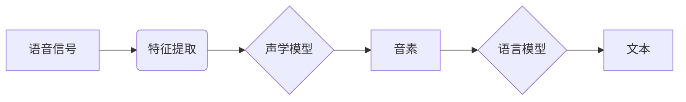

# 一切皆是映射：语音到文本的自然语言理解过程

## 1. 背景介绍
### 1.1 自然语言理解的重要性
在人工智能和人机交互领域,自然语言理解(Natural Language Understanding, NLU)扮演着至关重要的角色。它使计算机能够理解人类语言,并根据语义执行相应的任务。NLU 技术的进步推动了智能助理、聊天机器人、语音控制等应用的发展,极大地改善了人机交互体验。

### 1.2 语音到文本转换的挑战
语音到文本(Speech-to-Text, STT)转换是 NLU 的重要组成部分。它将语音信号转换为计算机可读的文本,为后续的语义理解奠定基础。然而,语音信号具有连续、变化多端、噪声干扰等特点,给准确识别带来挑战。此外,不同人群的口音、语速、语调差异也增加了转换难度。

### 1.3 映射思想在 NLU 中的应用  
映射(Mapping)是数学和计算机科学中的重要概念。它描述了两个集合之间元素的对应关系。在 NLU 领域,我们可以将语音信号看作一个集合,将文本看作另一个集合。语音到文本的转换过程,本质上就是寻找两个集合之间的映射关系。基于映射思想,研究者提出了多种语音识别模型和算法。

## 2. 核心概念与联系
### 2.1 语音信号的数字化
- 采样(Sampling):将连续的模拟语音信号转换为离散的数字信号。
- 量化(Quantization):将采样得到的信号幅值近似为有限个离散值。
- 编码(Encoding):将量化后的信号转换为二进制编码。

### 2.2 语音特征提取
- 梅尔频率倒谱系数(MFCC):反映语音信号的频谱特性,常用于语音识别。
- 线性预测系数(LPC):通过线性组合预测语音信号,提取语音的共振峰特征。  
- 基音周期(Pitch Period):描述声带振动的基本周期,反映语音的音高。

### 2.3 声学模型
- 隐马尔可夫模型(HMM):描述语音信号的时序变化,将语音建模为状态序列。
- 高斯混合模型(GMM):用多个高斯分布的加权和来拟合语音特征的概率分布。
- 深度神经网络(DNN):用于声学建模,学习语音特征到音素的复杂映射关系。

### 2.4 语言模型  
- N-gram:基于词序列出现概率的统计语言模型。
- 循环神经网络(RNN):捕捉文本的长距离依赖,生成更自然、连贯的语句。
- Transformer:基于自注意力机制的语言模型,在机器翻译等任务上取得了显著成果。

### 2.5 映射关系
- 声学到音素的映射:将语音信号的声学特征映射到基本语音单元音素。
- 音素到词的映射:根据发音词典,将音素序列映射为词。  
- 词到句的映射:根据语言模型,将词序列组合成符合语法、语义的句子。



## 3. 核心算法原理具体操作步骤
### 3.1 梅尔频率倒谱系数(MFCC)提取
1. 预加重:对语音信号进行高通滤波,增强高频部分。 
2. 分帧:将语音信号划分为固定长度的帧,帧与帧之间通常有一定重叠。
3. 加窗:对每一帧语音信号加窗(如汉明窗),减少频谱泄漏。
4. 傅里叶变换:对加窗后的语音信号进行快速傅里叶变换(FFT),得到频谱。
5. 梅尔滤波器组:将频谱通过一组梅尔尺度的三角型滤波器,得到梅尔频谱。
6. 取对数:对梅尔频谱取对数,得到对数梅尔频谱。
7. 离散余弦变换(DCT):对对数梅尔频谱进行 DCT,得到 MFCC 特征。

### 3.2 隐马尔可夫模型(HMM)声学建模
1. 定义 HMM 拓扑结构:根据先验知识,确定状态数目和状态之间的转移关系。
2. 初始化 HMM 参数:随机初始化状态转移概率矩阵和观测概率分布参数。
3. 前向-后向算法:计算给定观测序列和模型参数下,每个状态在每个时刻的前向概率和后向概率。
4. Baum-Welch 算法:基于前向-后向概率,迭代估计模型参数,使观测序列的生成概率最大化。
5. Viterbi 算法:在给定观测序列和训练好的模型参数下,寻找最优状态序列。

### 3.3 语言模型训练
1. 语料预处理:对大规模文本语料进行清洗、分词、去除停用词等预处理操作。
2. 建立词表:根据语料中词频,选取覆盖率高的词构建词表。
3. N-gram 统计:统计语料中长度为 N 的词序列出现的频次,估计 N-gram 概率。
4. 平滑处理:对未出现或低频的 N-gram 进行平滑,避免概率为零。
5. 模型评估:在开发集上评估语言模型的性能,如困惑度(Perplexity)。

## 4. 数学模型和公式详细讲解举例说明
### 4.1 隐马尔可夫模型(HMM)
HMM 是一种统计模型,用于描述一个隐藏的马尔可夫过程。它由以下五元组定义:

$$\lambda=(S,V,\pi,A,B)$$

- $S$:隐藏状态集合,$S={s_1,s_2,...,s_N}$。
- $V$:观测集合,$V={v_1,v_2,...,v_M}$。
- $\pi$:初始状态概率分布,$\pi={\pi_i},\pi_i=P(q_1=s_i),1 \leq i \leq N$。  
- $A$:状态转移概率矩阵,$A={a_{ij}},a_{ij}=P(q_{t+1}=s_j|q_t=s_i),1 \leq i,j \leq N$。
- $B$:观测概率矩阵,$B={b_j(k)},b_j(k)=P(o_t=v_k|q_t=s_j),1 \leq j \leq N,1 \leq k \leq M$。

其中,$q_t$表示 $t$ 时刻的隐藏状态,$o_t$表示 $t$ 时刻的观测。

在语音识别中,隐藏状态可以是音素,观测可以是语音特征向量(如 MFCC)。HMM 的三个基本问题:

1. 评估问题:给定模型 $\lambda$ 和观测序列 $O$,计算 $P(O|\lambda)$。前向算法可以解决。  
2. 解码问题:给定模型 $\lambda$ 和观测序列 $O$,找到最可能的隐藏状态序列 $Q$。Viterbi 算法可以解决。
3. 学习问题:给定观测序列 $O$,估计模型参数 $\lambda$ 使 $P(O|\lambda)$ 最大化。Baum-Welch 算法可以解决。

### 4.2 语言模型
N-gram 语言模型基于马尔可夫假设,即一个词的出现只与前面 $n-1$ 个词相关。N-gram 的概率可以表示为:

$$P(w_1,w_2,...,w_T)=\prod_{t=1}^T P(w_t|w_{t-n+1},...,w_{t-1})$$

其中,$w_t$ 表示第 $t$ 个词,$T$ 为文本长度。

以 2-gram(bigram)为例,词序列 $w_1,w_2,...,w_T$ 的概率可以近似为:

$$P(w_1,w_2,...,w_T) \approx \prod_{t=1}^T P(w_t|w_{t-1})$$

bigram 的条件概率 $P(w_t|w_{t-1})$ 可以通过极大似然估计(MLE)求得:

$$P(w_t|w_{t-1})=\frac{Count(w_{t-1},w_t)}{Count(w_{t-1})}$$

其中,$Count(w_{t-1},w_t)$ 为 $w_{t-1},w_t$ 在语料中出现的次数,$Count(w_{t-1})$ 为 $w_{t-1}$ 出现的次数。

为了避免零概率问题,可以对 N-gram 进行平滑处理,如加法平滑(Add-k Smoothing):

$$P(w_t|w_{t-1})=\frac{Count(w_{t-1},w_t)+k}{Count(w_{t-1})+kV}$$

其中,$k$ 为平滑参数,$V$ 为词表大小。

## 5. 项目实践：代码实例和详细解释说明
下面是使用 Python 实现语音识别的简单示例,基于 Google 的语音识别 API。

```python
import speech_recognition as sr

def recognize_speech_from_mic(recognizer, microphone):
    """
    从麦克风获取音频并进行语音识别
    """
    with microphone as source:
        # 调整识别器的噪声阈值
        recognizer.adjust_for_ambient_noise(source)
        print("请说话...")
        audio = recognizer.listen(source)

    response = {
        "success": True,
        "error": None,
        "transcription": None
    }

    try:
        response["transcription"] = recognizer.recognize_google(audio, language="zh-CN")
    except sr.RequestError:
        # API 请求失败
        response["success"] = False
        response["error"] = "请求失败"
    except sr.UnknownValueError:
        # 无法识别语音
        response["error"] = "无法识别语音"

    return response

if __name__ == "__main__":
    recognizer = sr.Recognizer()
    microphone = sr.Microphone()

    while True:
        result = recognize_speech_from_mic(recognizer, microphone)
        if result["success"]:
            print("识别结果: " + result["transcription"])
        elif result["error"]:
            print("错误: " + result["error"])
```

代码解释:

1. 导入 `speech_recognition` 模块,用于语音识别。
2. 定义 `recognize_speech_from_mic` 函数,从麦克风获取音频并进行语音识别。
   - 将麦克风作为音频源,调整识别器的噪声阈值。
   - 提示用户开始说话,并使用 `recognizer.listen` 录制音频。
   - 创建一个字典 `response`,用于存储识别结果和错误信息。
   - 使用 `recognizer.recognize_google` 进行语音识别,设置语言为简体中文。
   - 捕获可能的异常:请求失败或无法识别语音,并更新 `response`。
3. 在主函数中:
   - 创建 `Recognizer` 和 `Microphone` 对象。
   - 进入循环,不断调用 `recognize_speech_from_mic` 函数进行语音识别。
   - 根据返回的 `response`,打印识别结果或错误信息。

该示例展示了如何使用现有的语音识别 API 实现语音到文本的转换。在实际项目中,还需要考虑音频预处理、特征提取、声学模型训练、语言模型集成等环节。

## 6. 实际应用场景
语音到文本转换技术在多个领域有广泛应用,例如:

1. 智能助理:如 Apple Siri、Google Assistant、Amazon Alexa 等,通过语音交互执行任务。
2. 语音搜索:用户可以通过语音输入进行网页搜索,提高搜索效率。
3. 语音控制:通过语音指令控制智能家居设备、车载系统等。
4. 会议记录:自动将会议内容转换为文本,方便后续查阅和分析。
5. 医疗记录:医生可以通过语音输入生成患者病历,提高效率。
6. 客服自动化:通过语音识别和自然语言处理,实现客服业务的自动化。
7. 无障碍辅助:为听力障碍人士提供字幕,帮助他们理解语音内容。

## 7. 工具和资源推荐
1. 开源工具包:
   - Kaldi:基于{"msg_type":"generate_answer_finish","data":"","from_module":null,"from_unit":null}