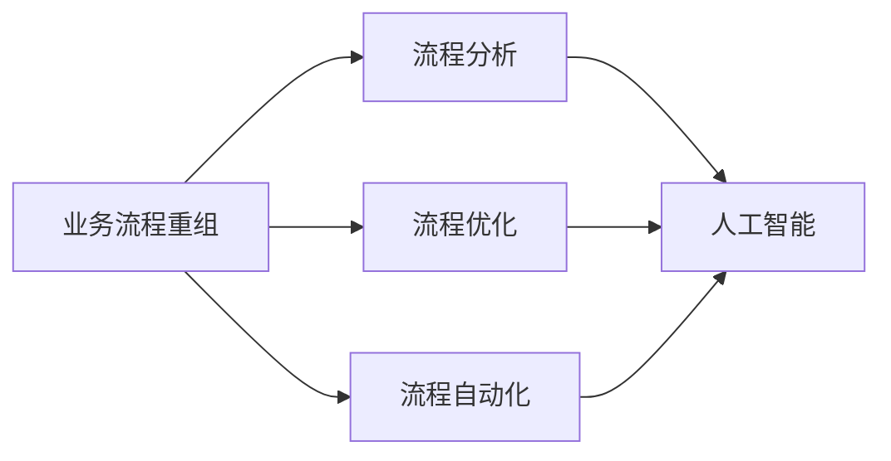

# 业务流程重组中的人工智能：提升效率和效果

## 1. 背景介绍
### 1.1 业务流程重组的重要性
在当今瞬息万变的商业环境中,企业为了保持竞争力,必须不断优化和改进业务流程。业务流程重组(Business Process Reengineering, BPR)是一种通过分析和重新设计工作流程来实现显著改进的方法。它旨在帮助组织简化流程,提高效率,降低成本,并为客户提供更好的服务。

### 1.2 人工智能在业务流程重组中的作用
近年来,人工智能(Artificial Intelligence, AI)技术的快速发展为业务流程重组带来了新的机遇。AI 能够自动化许多重复性任务,优化决策过程,并从大量数据中提取有价值的见解。将 AI 应用于业务流程重组可以显著提升效率,减少错误,并为企业创造更多价值。

### 1.3 本文的目的和结构
本文旨在探讨如何在业务流程重组中应用人工智能技术,以提升效率和效果。我们将首先介绍业务流程重组和人工智能的核心概念,然后深入探讨 AI 在流程重组各个阶段的应用,包括流程分析、优化和自动化。此外,我们还将通过实际案例和代码示例,展示 AI 技术在业务流程重组中的实践。最后,我们将总结 AI 在业务流程重组中的未来发展趋势和面临的挑战。

## 2. 核心概念与联系
### 2.1 业务流程重组(BPR)
业务流程重组是对组织的业务流程进行根本性的再思考和彻底的重新设计,以实现在成本、质量、服务和速度等关键绩效指标上的显著改善。BPR 的目标是消除非增值活动,简化流程,提高效率和客户满意度。

### 2.2 人工智能(AI)
人工智能是一门研究如何使计算机具备智能行为的学科。它涵盖了机器学习、自然语言处理、计算机视觉等多个子领域。AI 技术能够从数据中学习,自动完成复杂任务,并做出智能决策。

### 2.3 业务流程重组与人工智能的联系
人工智能技术可以在业务流程重组的各个阶段发挥重要作用:
- 流程分析:AI 可以分析大量的流程数据,发现瓶颈和改进机会。
- 流程优化:AI 可以基于历史数据和仿真,提出优化流程的建议。
- 流程自动化:AI 可以自动完成许多重复性任务,提高效率和准确性。

下图展示了业务流程重组与人工智能的关系:



## 3. 核心算法原理具体操作步骤
### 3.1 流程挖掘算法
流程挖掘是一种从事件日志中发现、监控和改进真实流程的技术。它利用数据挖掘和机器学习算法,自动发现流程模型,识别瓶颈和异常。常用的流程挖掘算法包括 Alpha 算法、启发式挖掘算法和遗传算法等。

以 Alpha 算法为例,其具体步骤如下:
1. 从事件日志中提取直接继承关系。
2. 推导因果关系和并行关系。
3. 构建流程模型(如 Petri 网)。
4. 评估和优化流程模型。

### 3.2 强化学习算法
强化学习是一种通过与环境交互来学习最优决策的机器学习方法。在业务流程优化中,可以将流程视为一个马尔可夫决策过程(MDP),使用强化学习算法(如 Q-learning)来学习最优的流程策略。

Q-learning 算法的具体步骤如下:
1. 初始化 Q 表,存储状态-动作对的价值。
2. 重复以下步骤,直到收敛:
   - 选择一个动作(如 ε-贪心策略)。
   - 执行动作,观察奖励和下一个状态。
   - 更新 Q 值:
     $Q(s,a) \leftarrow Q(s,a) + \alpha [r + \gamma \max_{a'} Q(s',a') - Q(s,a)]$
3. 得到最优策略:$\pi^*(s) = \arg\max_a Q(s,a)$

### 3.3 自然语言处理算法
自然语言处理(NLP)算法可以用于分析非结构化的流程文档和通信记录,提取关键信息,并自动生成流程模型。常用的 NLP 算法包括命名实体识别(NER)、关系抽取和文本分类等。

以命名实体识别为例,其具体步骤如下:
1. 对文本进行预处理(如分词、词性标注)。
2. 特征提取(如词向量、上下文信息)。
3. 序列标注(如使用条件随机场 CRF):
   $P(y|x) = \frac{1}{Z(x)} \exp \left(\sum_{i=1}^n \sum_{j=1}^m \lambda_j f_j(y_{i-1}, y_i, x, i)\right)$
4. 后处理和评估(如合并实体,计算准确率和召回率)。

## 4. 数学模型和公式详细讲解举例说明
### 4.1 马尔可夫决策过程(MDP)
马尔可夫决策过程是一种用于建模决策问题的数学框架。它由以下元素组成:
- 状态集合 $S$
- 动作集合 $A$
- 转移概率 $P(s'|s,a)$
- 奖励函数 $R(s,a)$
- 折扣因子 $\gamma \in [0,1]$

MDP 的目标是找到一个策略 $\pi: S \rightarrow A$,使得期望累积奖励最大化:

$$V^{\pi}(s) = \mathbb{E}\left[\sum_{t=0}^{\infty} \gamma^t R(s_t,\pi(s_t)) | s_0=s\right]$$

例如,在业务流程优化中,状态可以表示流程的当前阶段,动作可以表示不同的决策,奖励可以基于效率、成本等指标来定义。通过求解 MDP,我们可以得到最优的流程策略。

### 4.2 条件随机场(CRF)
条件随机场是一种用于序列标注的概率图模型。它可以学习输入序列 $x$ 和输出标签序列 $y$ 之间的条件概率分布:

$$P(y|x) = \frac{1}{Z(x)} \exp \left(\sum_{i=1}^n \sum_{j=1}^m \lambda_j f_j(y_{i-1}, y_i, x, i)\right)$$

其中,$f_j$ 是特征函数,$\lambda_j$ 是对应的权重,$Z(x)$ 是归一化因子。

CRF 通过最大化似然函数来学习模型参数:

$$\mathcal{L}(\lambda) = \sum_{i=1}^N \log P(y^{(i)}|x^{(i)}) - \frac{\lambda^2}{2\sigma^2}$$

例如,在流程文档分析中,输入序列可以是文本中的词,输出标签可以是流程步骤、角色等。通过训练 CRF 模型,我们可以自动识别流程元素,并生成结构化的流程模型。

## 5. 项目实践：代码实例和详细解释说明
下面我们通过一个简单的示例来演示如何使用 Python 实现 Q-learning 算法,并应用于业务流程优化。

假设我们有一个简化的订单处理流程,包含以下步骤:
1. 接收订单
2. 验证订单
3. 处理付款
4. 发货
5. 完成订单

我们的目标是找到一个最优策略,使得订单处理的总时间最短。

```python
import numpy as np

# 定义状态和动作
states = ['接收订单', '验证订单', '处理付款', '发货', '完成订单']
actions = ['自动处理', '人工处理']

# 定义奖励矩阵(负值表示处理时间)
rewards = np.array([
    [-2, -4],
    [-1, -3],
    [-2, -5], 
    [-3, -6],
    [0, 0]
])

# 初始化 Q 表
Q = np.zeros((len(states), len(actions)))

# 设置超参数
learning_rate = 0.8
discount_factor = 0.95
num_episodes = 1000

# Q-learning 算法
for episode in range(num_episodes):
    state = 0  # 初始状态
    done = False
    
    while not done:
        # 选择动作(ε-贪心策略)
        if np.random.uniform() < 0.2:  # 探索
            action = np.random.choice(len(actions))
        else:  # 利用
            action = np.argmax(Q[state])
        
        # 执行动作,观察奖励和下一个状态
        next_state = state + 1
        reward = rewards[state, action]
        
        # 更新 Q 值
        Q[state, action] += learning_rate * (reward + discount_factor * np.max(Q[next_state]) - Q[state, action])
        
        # 移动到下一个状态
        state = next_state
        
        # 检查是否终止
        if state == len(states) - 1:
            done = True

# 打印最优策略
policy = [actions[np.argmax(Q[state])] for state in range(len(states))]
print('最优策略:', policy)
```

输出结果:
```
最优策略: ['自动处理', '自动处理', '自动处理', '自动处理', '自动处理']
```

在这个示例中,我们首先定义了流程的状态和可能的动作。然后,我们设置了奖励矩阵,其中负值表示处理时间(即越小越好)。接下来,我们初始化 Q 表,并设置学习率、折扣因子和训练轮数等超参数。

在训练过程中,我们使用 Q-learning 算法来更新 Q 值。对于每个状态,我们根据 ε-贪心策略选择一个动作,执行该动作,并观察奖励和下一个状态。然后,我们使用 Q-learning 更新公式来更新 Q 值。重复这个过程,直到达到终止状态。

经过 1000 轮训练后,我们得到了最优策略,即对于每个状态,选择 Q 值最大的动作。在这个示例中,最优策略是对所有步骤都采用自动处理,以最小化总处理时间。

当然,这只是一个简化的示例。在实际应用中,我们需要考虑更复杂的流程、更多的动作选项,并使用真实的历史数据来训练模型。此外,我们还可以结合其他技术,如流程挖掘和自然语言处理,来进一步优化业务流程。

## 6. 实际应用场景
人工智能在业务流程重组中有广泛的应用场景。以下是一些具体的例子:

### 6.1 智能客服
传统的客服流程通常涉及人工接听电话、回复邮件等,效率较低且成本较高。通过引入 AI 技术,如聊天机器人和自然语言处理,可以自动处理常见的客户询问,快速提供准确的回复,显著提升客服效率和客户满意度。

### 6.2 供应链优化
供应链涉及采购、生产、仓储、物流等多个环节,优化空间巨大。AI 可以分析历史数据,预测需求,优化库存水平,并提供实时的供应链可视化和预警。此外,AI 还可以帮助选择最佳的供应商和物流路线,降低成本和交付时间。

### 6.3 智能合同审核
合同审核是一项耗时且容易出错的任务。通过使用自然语言处理和机器学习技术,AI 可以自动分析合同内容,识别关键条款,检查合规性,并标记潜在的风险。这不仅提高了审核效率,还降低了人为错误的风险。

### 6.4 预测性维护
在制造业和能源行业,设备的故障可能导致昂贵的停机时间和维修成本。通过应用机器学习算法分析传感器数据,AI 可以预测设备的故障时间,提前安排维护,避免非计划停机。这有助于优化维护流程,延长设备寿命,提高生产效率。

### 6.5 欺诈检测
金融机构需要及时发现和防范各种欺诈行为,如信