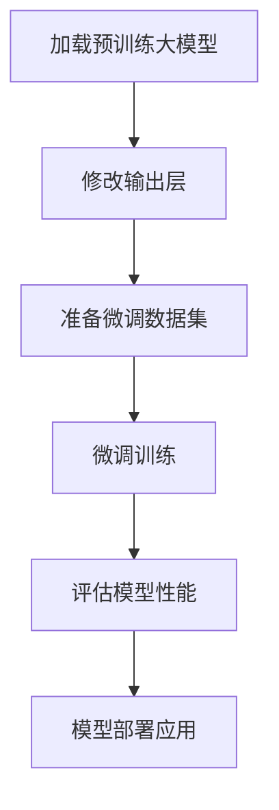

# 从零开始大模型开发与微调：其他细节

## 1.背景介绍

随着人工智能技术的不断发展,大型语言模型已经成为当前最受关注的研究热点之一。这些模型通过在海量文本数据上进行预训练,学习到了丰富的语言知识,并展现出惊人的泛化能力。大模型可用于多种自然语言处理任务,如机器翻译、文本生成、问答系统等,极大推动了人工智能技术的发展。

然而,训练这样的大模型需要耗费大量的计算资源,对于普通开发者来说,从头开始训练一个大模型是一件极其困难的事情。幸运的是,目前已有一些优秀的大模型可供调用和微调,如GPT、BERT、XLNet等,这使得普通开发者也能享受大模型的红利。本文将介绍如何基于现有的大模型,进行微调和开发,以满足特定的应用需求。

## 2.核心概念与联系

### 2.1 大模型

所谓大模型,是指参数量极大(通常超过十亿)、在大规模语料库上进行预训练的语言模型。这些模型能够捕捉到丰富的语义和语法知识,为下游任务提供有力的基础。常见的大模型有:

- GPT(Generative Pre-trained Transformer):由OpenAI开发,是一种自回归语言模型,擅长生成类任务。
- BERT(Bidirectional Encoder Representations from Transformers):由谷歌开发,是一种双向编码器模型,擅长理解类任务。
- XLNet:由卡内基梅隆大学与谷歌合作开发,是一种泛化的自回归预训练模型。

### 2.2 微调(Fine-tuning)

虽然大模型已经学习到了丰富的语言知识,但它们在特定领域或任务上的表现可能并不理想。这时,我们可以在大模型的基础上,使用与目标任务相关的数据进行进一步的微调训练,使模型适应特定的应用场景。微调的过程通常包括:

1. 加载预训练好的大模型权重
2. 对模型的输出层进行修改,使其适配目标任务
3. 在目标任务的数据集上进行训练,更新模型参数

经过微调后,大模型的性能会在目标任务上得到显著提升。

### 2.3 Mermaid流程图

以下是大模型微调的基本流程:



## 3.核心算法原理具体操作步骤  

### 3.1 加载预训练模型

第一步是加载我们需要使用的预训练大模型。以PyTorch的Transformers库为例,可以使用如下代码加载BERT模型:

```python
from transformers import BertModel, BertTokenizer

# 加载预训练模型和分词器
model = BertModel.from_pretrained('bert-base-uncased')
tokenizer = BertTokenizer.from_pretrained('bert-base-uncased')
```

### 3.2 修改输出层

由于预训练模型的输出层是为了完成预训练任务(如掩码语言模型、下一句预测)而设计的,因此我们需要根据目标任务对输出层进行修改。以文本分类任务为例,我们可以在BERT的输出上添加一个线性层,将输出映射到类别数量的维度:

```python
from transformers import BertForSequenceClassification

# 加载分类模型
model = BertForSequenceClassification.from_pretrained('bert-base-uncased', num_labels=num_labels)
```

### 3.3 准备微调数据集

接下来,我们需要准备用于微调的数据集。数据集通常需要进行tokenization、padding、truncating等预处理操作,以满足模型的输入要求。以文本分类任务为例:

```python
# 对数据进行tokenization
encodings = tokenizer(texts, truncation=True, padding=True)

# 构建DataLoader
dataset = Dataset(encodings, labels)
dataloader = DataLoader(dataset, batch_size=batch_size, shuffle=True)
```

### 3.4 微调训练

有了数据后,我们就可以开始微调训练了。训练过程与普通的模型训练类似,只是我们使用的是预训练模型的参数作为初始值。以PyTorch为例:

```python
# 定义优化器和损失函数
optimizer = AdamW(model.parameters(), lr=learning_rate)
loss_fn = nn.CrossEntropyLoss()

# 训练循环
for epoch in range(num_epochs):
    for batch in dataloader:
        # 前向传播
        outputs = model(**batch)
        logits = outputs.logits
        
        # 计算损失
        loss = loss_fn(logits, batch['labels'])
        
        # 反向传播
        loss.backward()
        optimizer.step()
        optimizer.zero_grad()
```

### 3.5 评估和部署

训练结束后,我们可以在验证集或测试集上评估模型的性能。如果结果令人满意,就可以将模型部署到生产环境中,用于实际应用。

```python
# 评估模型
model.eval()
with torch.no_grad():
    for batch in eval_dataloader:
        outputs = model(**batch)
        logits = outputs.logits
        predictions = torch.argmax(logits, dim=-1)
        # 计算评估指标
        
# 保存模型
model.save_pretrained('finetuned_model')
```

## 4.数学模型和公式详细讲解举例说明

在大模型的训练过程中,涉及到一些重要的数学概念和公式,下面将对其进行详细的讲解和举例说明。

### 4.1 自注意力机制(Self-Attention)

自注意力机制是Transformer模型的核心,它能够捕捉输入序列中任意两个位置之间的依赖关系。给定一个查询向量$\boldsymbol{q}$、键向量$\boldsymbol{k}$和值向量$\boldsymbol{v}$,自注意力的计算公式如下:

$$\mathrm{Attention}(\boldsymbol{Q}, \boldsymbol{K}, \boldsymbol{V}) = \mathrm{softmax}\left(\frac{\boldsymbol{Q}\boldsymbol{K}^\top}{\sqrt{d_k}}\right)\boldsymbol{V}$$

其中,$d_k$是缩放因子,用于防止点积的值过大导致softmax函数的梯度较小。

自注意力机制能够自动学习输入序列中不同位置之间的相关性,从而更好地建模长距离依赖关系。

### 4.2 掩码语言模型(Masked Language Model)

掩码语言模型是BERT等模型的预训练目标之一。它的基本思想是在输入序列中随机掩码一些词,然后让模型根据上下文预测被掩码的词。具体来说,给定一个输入序列$\boldsymbol{x} = (x_1, x_2, \dots, x_n)$,我们随机选择一些位置$\boldsymbol{m} = (m_1, m_2, \dots, m_k)$,将对应的词$x_{m_i}$替换为特殊的掩码符号[MASK]。模型的目标是最大化以下条件概率:

$$\mathcal{L}_{\text{MLM}} = \mathbb{E}_{\boldsymbol{x}, \boldsymbol{m}}\left[\sum_{i=1}^{k}\log P(x_{m_i}|\boldsymbol{x}_{\backslash m_i})\right]$$

其中,$\boldsymbol{x}_{\backslash m_i}$表示将$x_{m_i}$掩码后的输入序列。通过这种方式,模型可以学习到丰富的语义和语法知识。

### 4.3 下一句预测(Next Sentence Prediction)

下一句预测是BERT预训练的另一个目标,它的目的是让模型学习理解跨句之间的关系。具体来说,给定两个句子$\boldsymbol{s}_1$和$\boldsymbol{s}_2$,模型需要预测$\boldsymbol{s}_2$是否为$\boldsymbol{s}_1$的下一句。我们定义一个二元标签$y \in \{0, 1\}$,其中$y=1$表示$\boldsymbol{s}_2$是$\boldsymbol{s}_1$的下一句,$y=0$表示不是。模型的目标是最大化以下条件概率:

$$\mathcal{L}_{\text{NSP}} = \mathbb{E}_{\boldsymbol{s}_1, \boldsymbol{s}_2, y}\left[\log P(y|\boldsymbol{s}_1, \boldsymbol{s}_2)\right]$$

通过这种方式,模型可以学习到跨句之间的逻辑关系和语义连贯性。

## 5.项目实践:代码实例和详细解释说明

在这一部分,我们将通过一个实际的项目实践,来演示如何基于预训练的BERT模型进行微调,完成一个文本分类任务。我们将使用PyTorch的Transformers库和Datasets库。

### 5.1 加载数据集

首先,我们需要加载数据集。这里我们使用的是一个电影评论数据集,任务是根据评论内容判断评论的情感倾向(正面或负面)。

```python
from datasets import load_dataset

# 加载数据集
dataset = load_dataset('csv', data_files='reviews.csv')

# 查看数据集
dataset
```

### 5.2 数据预处理

接下来,我们需要对数据进行预处理,包括tokenization、padding和truncating等操作。

```python
from transformers import BertTokenizer

# 加载分词器
tokenizer = BertTokenizer.from_pretrained('bert-base-uncased')

# 定义预处理函数
def preprocess(examples):
    return tokenizer(examples['text'], truncation=True, padding='max_length', max_length=512)

# 对数据进行预处理
dataset = dataset.map(preprocess, batched=True, remove_columns=['text'])
dataset.set_format(type='torch', columns=['input_ids', 'token_type_ids', 'attention_mask', 'label'])
```

### 5.3 加载模型

现在,我们可以加载预训练的BERT模型,并根据任务需求修改输出层。

```python
from transformers import BertForSequenceClassification

# 加载模型
model = BertForSequenceClassification.from_pretrained('bert-base-uncased', num_labels=2)
```

### 5.4 微调训练

有了数据和模型后,我们就可以开始微调训练了。

```python
from transformers import Trainer, TrainingArguments

# 定义训练参数
training_args = TrainingArguments(
    output_dir='./results',
    num_train_epochs=3,
    per_device_train_batch_size=16,
    per_device_eval_batch_size=64,
    warmup_steps=500,
    weight_decay=0.01,
    logging_dir='./logs',
    logging_steps=10,
)

# 定义Trainer
trainer = Trainer(
    model=model,
    args=training_args,
    train_dataset=dataset['train'],
    eval_dataset=dataset['test'],
)

# 开始训练
trainer.train()
```

### 5.5 评估和部署

训练结束后,我们可以在测试集上评估模型的性能,并将模型保存下来,以便后续部署。

```python
# 评估模型
eval_result = trainer.evaluate()
print(f"Evaluation result: {eval_result}")

# 保存模型
trainer.save_model("finetuned_model")
```

通过上面的实践,我们成功地基于预训练的BERT模型,完成了一个文本分类任务的微调和开发。在实际应用中,你可以根据具体的任务需求,选择合适的大模型和微调策略,以获得更好的性能。

## 6.实际应用场景

大模型微调技术在自然语言处理领域有着广泛的应用,下面列举了一些典型的应用场景:

1. **文本分类**: 将文本数据分类到预定义的类别中,如情感分析、新闻分类、垃圾邮件检测等。

2. **机器翻译**: 将一种语言的文本翻译成另一种语言,如英语到中文的翻译。

3. **问答系统**: 根据问题的语义,从知识库中检索相关的答案。

4. **文本摘要**: 自动生成文本的摘要,捕捉文本的核心内容。

5. **对话系统**: 根据上下文生成自然的对话响应,实现人机对话。

6. **关系抽取**: 从文本中抽取出实体之间的关系,构建知识图谱。

7. **文本生成**: 根据给定的提示或上下文,生成连贯、流畅的文本内容。

8. **语音识别**: 将语音信号转录为文本,实现语音到文本的转换。

9. **代码生成**: 根据给定的需求描述,自动生成相应的代码。

10. **内容审核**: 自动检