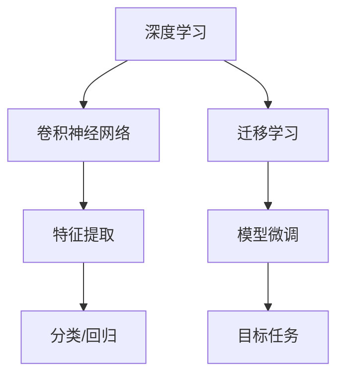

# 从零开始大模型开发与微调：实战MNIST手写体识别

## 1. 背景介绍

### 1.1 手写体识别的重要性

在当今数字时代,手写体识别技术已经广泛应用于多个领域,如邮件分拣、银行支票处理、表格数据输入等。随着人工智能技术的不断发展,手写体识别的准确性和效率也在不断提高。本文将探讨如何从零开始开发和微调大型神经网络模型,并将其应用于经典的MNIST手写体数字识别任务。

### 1.2 MNIST数据集介绍

MNIST (Mixed National Institute of Standards and Technology)数据集是一个入门级的计算机视觉数据集,由来自250种不同人手写的数字图像构成。该数据集包含60,000个训练样本和10,000个测试样本,每个样本都是一张28x28像素的手写数字图像,对应标签为0到9之间的数字。MNIST数据集被广泛用于机器学习和深度学习算法的基准测试。

## 2. 核心概念与联系

### 2.1 深度学习概述

深度学习是机器学习的一个子领域,它利用具有多层非线性变换单元的人工神经网络来模拟人脑的工作原理,从而实现特征学习和模式识别。与传统的机器学习算法相比,深度学习能够自动从原始数据中学习出多层次的抽象特征表示,从而更好地解决复杂的任务。

### 2.2 卷积神经网络

卷积神经网络(Convolutional Neural Network, CNN)是一种深度前馈神经网络,专门用于处理具有网格拓扑结构的数据,如图像、视频和语音等。CNN通过交替使用卷积层和池化层来提取输入数据的局部特征,并通过全连接层进行分类或回归。由于卷积操作可以有效地捕获输入数据的空间和时间相关性,因此CNN在计算机视觉和自然语言处理等领域表现出色。

### 2.3 迁移学习与模型微调

迁移学习是一种通过利用在源领域学习到的知识来改善在目标领域的学习效果的技术。在深度学习中,常见的迁移学习方法是模型微调(Fine-tuning),即在源任务上预训练一个神经网络模型,然后将其作为初始化模型,在目标任务上进行进一步的训练和调整。通过模型微调,可以充分利用预训练模型中已经学习到的有用特征,从而加快目标任务的训练速度,并提高模型的泛化能力。



## 3. 核心算法原理具体操作步骤

### 3.1 CNN模型架构

对于MNIST手写体数字识别任务,我们将构建一个包含卷积层、池化层和全连接层的CNN模型。具体架构如下:

1. 卷积层1: 输入通道数为1,输出通道数为32,卷积核大小为5x5,步长为1,使用ReLU激活函数。
2. 最大池化层1: 池化核大小为2x2,步长为2。
3. 卷积层2: 输入通道数为32,输出通道数为64,卷积核大小为3x3,步长为1,使用ReLU激活函数。
4. 最大池化层2: 池化核大小为2x2,步长为2。
5. 全连接层1: 输入维度为64*7*7,输出维度为128,使用ReLU激活函数。
6. 全连接层2: 输入维度为128,输出维度为10,使用Softmax激活函数进行多分类。

### 3.2 模型训练

在训练CNN模型之前,我们需要对MNIST数据集进行预处理,包括数据归一化和数据增强等步骤。然后,我们将定义模型的损失函数、优化器和评估指标。在每个训练epoch中,我们将按批次(batch)对模型进行前向传播和反向传播,并根据损失函数值更新模型参数。同时,我们还需要监控模型在验证集上的表现,以防止过拟合。

### 3.3 模型微调

在完成MNIST数据集上的初始训练后,我们可以将训练好的模型作为预训练模型,在其他手写体数字识别任务上进行模型微调。具体步骤如下:

1. 冻结预训练模型的部分层,如卷积层,只对全连接层进行微调。
2. 使用较小的学习率对模型进行微调训练。
3. 根据目标任务的性能,决定是否解冻更多层进行进一步微调。

通过模型微调,我们可以充分利用预训练模型中已经学习到的有用特征,从而加快目标任务的训练速度,并提高模型的泛化能力。

## 4. 数学模型和公式详细讲解举例说明

### 4.1 卷积运算

卷积运算是CNN中的核心操作,它通过在输入数据上滑动卷积核来提取局部特征。对于二维输入数据(如图像),卷积运算可以表示为:

$$
(I * K)(i, j) = \sum_{m} \sum_{n} I(i+m, j+n) K(m, n)
$$

其中,$I$表示输入数据,$K$表示卷积核,$(i, j)$表示输出特征图的位置。卷积运算可以看作是在输入数据上滑动卷积核,并在每个位置计算输入数据与卷积核的元素级乘积之和。

### 4.2 池化运算

池化运算是CNN中另一个重要操作,它用于降低特征图的空间维度,从而减少计算量和参数数量。最常见的池化方法是最大池化,它在池化窗口内选取最大值作为输出:

$$
(I \circledast K)(i, j) = \max_{(m, n) \in R} I(i+m, j+n)
$$

其中,$I$表示输入特征图,$K$表示池化窗口,$R$表示池化窗口的区域,$(i, j)$表示输出特征图的位置。最大池化操作可以保留输入特征图中的最显著特征,同时抑制了不相关的细节信息。

### 4.3 全连接层与Softmax

全连接层是CNN中用于分类或回归的最后一层,它将前面卷积层和池化层提取的高级特征进行整合。对于多分类任务,我们通常在全连接层之后使用Softmax激活函数,将输出值映射到(0,1)范围内的概率分布:

$$
\sigma(z)_i = \frac{e^{z_i}}{\sum_{j=1}^K e^{z_j}}
$$

其中,$z$是全连接层的输出,$K$是类别数量。Softmax函数可以保证输出概率之和为1,因此我们可以将最大概率对应的类别作为预测结果。

## 5. 项目实践:代码实例和详细解释说明

在这一部分,我们将使用Python和PyTorch深度学习框架来实现MNIST手写体数字识别任务。完整代码如下:

```python
import torch
import torchvision
import torchvision.transforms as transforms

# 定义数据预处理
transform = transforms.Compose([
    transforms.ToTensor(),
    transforms.Normalize((0.1307,), (0.3081,))
])

# 加载MNIST数据集
trainset = torchvision.datasets.MNIST(root='./data', train=True, download=True, transform=transform)
trainloader = torch.utils.data.DataLoader(trainset, batch_size=64, shuffle=True)

testset = torchvision.datasets.MNIST(root='./data', train=False, download=True, transform=transform)
testloader = torch.utils.data.DataLoader(testset, batch_size=64, shuffle=False)

# 定义CNN模型
import torch.nn as nn
import torch.nn.functional as F

class Net(nn.Module):
    def __init__(self):
        super(Net, self).__init__()
        self.conv1 = nn.Conv2d(1, 32, 5)
        self.pool1 = nn.MaxPool2d(2, 2)
        self.conv2 = nn.Conv2d(32, 64, 3)
        self.pool2 = nn.MaxPool2d(2, 2)
        self.fc1 = nn.Linear(64 * 7 * 7, 128)
        self.fc2 = nn.Linear(128, 10)

    def forward(self, x):
        x = self.pool1(F.relu(self.conv1(x)))
        x = self.pool2(F.relu(self.conv2(x)))
        x = x.view(-1, 64 * 7 * 7)
        x = F.relu(self.fc1(x))
        x = self.fc2(x)
        return x

# 实例化模型
model = Net()

# 定义损失函数和优化器
import torch.optim as optim
criterion = nn.CrossEntropyLoss()
optimizer = optim.SGD(model.parameters(), lr=0.001, momentum=0.9)

# 训练模型
for epoch in range(10):
    running_loss = 0.0
    for i, data in enumerate(trainloader, 0):
        inputs, labels = data
        optimizer.zero_grad()

        outputs = model(inputs)
        loss = criterion(outputs, labels)
        loss.backward()
        optimizer.step()

        running_loss += loss.item()
        if i % 200 == 199:
            print('[%d, %5d] loss: %.3f' % (epoch + 1, i + 1, running_loss / 200))
            running_loss = 0.0

# 测试模型
correct = 0
total = 0
with torch.no_grad():
    for data in testloader:
        images, labels = data
        outputs = model(images)
        _, predicted = torch.max(outputs.data, 1)
        total += labels.size(0)
        correct += (predicted == labels).sum().item()

print('Accuracy of the network on the 10000 test images: %d %%' % (100 * correct / total))
```

上述代码实现了以下关键步骤:

1. 加载并预处理MNIST数据集。
2. 定义CNN模型架构,包括两个卷积层、两个池化层和两个全连接层。
3. 定义交叉熵损失函数和SGD优化器。
4. 进行10个epoch的模型训练,每200个batch打印一次损失值。
5. 在测试集上评估模型的准确率。

通过运行上述代码,我们可以获得MNIST数据集上的高准确率模型。此外,我们还可以尝试对预训练模型进行微调,以提高在其他手写体数字识别任务上的性能。

## 6. 实际应用场景

手写体识别技术在现实生活中有着广泛的应用场景,包括但不限于:

1. **邮件分拣**: 自动识别邮件上的地址,以实现高效的邮件分拣和投递。
2. **银行支票处理**: 识别支票上的金额数字,自动化支票的清算和入账流程。
3. **表格数据输入**: 从纸质表格中提取数字和文本信息,将其转换为电子数据。
4. **智能教育**: 在线评阅学生的手写作业,提供自动化的批改和反馈。
5. **签名验证**: 验证签名的真实性,用于合同、协议等法律文件的签署。
6. **车牌识别**: 在交通监控和停车场管理中,识别车辆的牌照号码。

随着深度学习技术的不断发展,手写体识别的准确率和鲁棒性将进一步提高,在更多领域发挥重要作用。

## 7. 工具和资源推荐

在开发和微调大型神经网络模型时,有许多优秀的工具和资源可以提供帮助:

1. **深度学习框架**:
   - PyTorch: 一个基于Python的开源深度学习框架,具有动态计算图和强大的GPU加速能力。
   - TensorFlow: 另一个流行的深度学习框架,由Google开发和维护。
   - Keras: 一个高级的神经网络API,可以在TensorFlow或Theano之上运行。

2. **数据集**:
   - MNIST: 手写数字识别的经典数据集。
   - EMNIST: MNIST的扩展版本,包含更多样本和字符类型。
   - IAM手写数据库: 包含大量手写英文文本行的数据集。

3. **预训练模型**:
   - Model Zoo: PyTorch和TensorFlow提供了各种预训练模型的集合,可用于迁移学习和模型微调。
   - Hugging Face: 一个开源的自然语言处理模型库,提供了大量预训练的语言模型。

4. **在线资源**:
   - Deep Learning Book: 由Ian Goodfellow等人撰写的深度学习经典教材。
   - PyTorch官方教程: PyTorch提供了全面的在线教