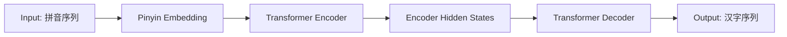

# 从零开始大模型开发与微调：解码器实战—拼音汉字翻译模型

## 1. 背景介绍
### 1.1 大模型的发展现状
近年来,自然语言处理(NLP)领域出现了一系列重大突破,其中最引人注目的就是大规模预训练语言模型(Pre-trained Language Models, PLMs)的崛起。从2018年Google推出BERT(Bidirectional Encoder Representations from Transformers)模型开始,PLMs以其强大的语言理解和生成能力,在各类NLP任务上取得了state-of-the-art的表现,成为当前NLP技术发展的主流范式。

### 1.2 大模型微调的意义
尽管PLMs展现出了令人惊叹的能力,但它们通常是在大规模通用语料上进行预训练的,因此要将其应用到特定的下游任务中,还需要在任务相关数据上进行微调(fine-tuning)。通过微调,可以使PLMs更好地适应目标任务的数据分布和目标函数,从而获得更优的性能。

### 1.3 拼音-汉字转换任务简介
拼音-汉字转换是一项具有实际应用价值的NLP任务,其目标是将以拼音序列形式给出的输入,转换为对应的汉字序列输出。这一任务可用于输入法、语音识别、OCR后处理等多个场景。传统的拼音-汉字转换方法主要基于统计语言模型,而本文将探索如何利用PLMs的强大建模能力,构建一个高效准确的端到端解码器模型。

## 2. 核心概念与联系
### 2.1 Transformer 架构
Transformer是当前主流的神经网络架构,广泛应用于NLP领域。其核心思想是通过自注意力机制(Self-Attention)建模输入序列内部和输出序列内部的长距离依赖关系。一个标准的Transformer由若干个编码器(Encoder)层和解码器(Decoder)层组成,分别用于对输入和输出序列进行建模。

### 2.2 自回归语言模型
自回归语言模型(Auto-regressive Language Model)是一类重要的语言生成模型,其基本思路是根据前面已生成的token序列,预测下一个token的概率分布。形式化地,给定token序列$x_1,\cdots,x_T$,自回归语言模型的目标是最大化如下条件概率:

$$p(x_1,\cdots,x_T)=\prod_{t=1}^T p(x_t|x_1,\cdots,x_{t-1}) \tag{1}$$

### 2.3 Encoder-Decoder框架
Encoder-Decoder框架是构建序列到序列(Seq2Seq)模型的经典范式。其中,Encoder负责将输入序列编码为一个固定长度的隐向量(hidden vector),Decoder则根据该隐向量自回归地生成输出序列。将Transformer架构应用到Encoder-Decoder框架,即可得到Transformer Seq2Seq模型。

### 2.4 PLMs 的微调
PLMs的微调过程,本质上是在下游任务数据上对预训练参数进行再训练(retrain)的过程。通过引入任务相关的损失函数,并利用反向传播算法更新模型参数,可以使PLMs更好地适应目标任务。微调的关键在于如何设计合适的输入表示以及损失函数,以充分利用预训练参数中蕴含的语言知识。

## 3. 核心算法原理与具体操作步骤
### 3.1 基于Transformer的拼音-汉字转换模型
本文采用Transformer Encoder-Decoder框架构建拼音-汉字转换模型,其结构如下图所示:



具体地,模型的训练过程分为以下几个步骤:

1. 将输入的拼音序列通过Embedding层映射为实值向量表示。
2. 将拼音Embedding序列输入到Transformer Encoder中,经过若干个Encoder层的计算,得到最终的Encoder隐状态序列。
3. 将Encoder的输出隐状态序列作为Transformer Decoder的输入,并结合之前解码步骤生成的汉字序列,计算Decoder的隐状态序列。
4. 将Decoder的输出隐状态经过线性变换和Softmax归一化,得到下一个汉字的概率分布。重复步骤3-4,直到生成完整的汉字序列。
5. 根据预测的汉字序列和真实的目标汉字序列,计算交叉熵损失,并利用Adam优化器更新模型参数。

### 3.2 基于BERT的拼音表示
传统的拼音-汉字转换模型通常使用one-hot或word2vec等方法对拼音进行表示,但这些方法无法很好地刻画拼音之间的语义关系。为了获得更加语义化的拼音表示,本文提出利用中文BERT模型对拼音序列进行编码。

具体地,将拼音序列输入到预训练的BERT模型中,提取最后一层Transformer块的输出,作为各个拼音的Embedding表示。这种基于BERT的表示方法可以充分利用预训练参数中蕴含的语言知识,从而为后续的解码过程提供更加丰富的先验信息。

## 4. 数学模型和公式详细讲解举例说明
### 4.1 Transformer Encoder 计算过程
对于输入的拼音Embedding序列$\mathbf{X}=(\mathbf{x}_1,\cdots,\mathbf{x}_n)$,Transformer Encoder的计算过程可描述为:

$$
\begin{aligned}
\mathbf{Q},\mathbf{K},\mathbf{V} &= \mathbf{X}\mathbf{W}^Q,\mathbf{X}\mathbf{W}^K,\mathbf{X}\mathbf{W}^V \\
\mathbf{A} &= \text{Softmax}\left(\frac{\mathbf{Q}\mathbf{K}^T}{\sqrt{d}}\right)\mathbf{V} \\
\mathbf{H} &= \text{LayerNorm}(\mathbf{X}+\text{FFN}(\mathbf{A}))
\end{aligned}
\tag{2}
$$

其中,$\mathbf{W}^Q,\mathbf{W}^K,\mathbf{W}^V$为注意力机制的权重矩阵,$d$为隐向量维度,FFN为前馈神经网络,LayerNorm为层归一化操作。通过堆叠多个Encoder层,可以建模输入序列的深层次语义信息。

### 4.2 Transformer Decoder 计算过程
记Encoder的输出隐状态序列为$\mathbf{H}^e=(\mathbf{h}_1^e,\cdots,\mathbf{h}_n^e)$,Decoder在第$t$步的隐状态为$\mathbf{s}_t$,则Decoder的计算过程为:

$$
\begin{aligned}
\mathbf{Q}_t,\mathbf{K}_t,\mathbf{V}_t &= \mathbf{s}_{t-1}\mathbf{W}_d^Q,\mathbf{H}^e\mathbf{W}_d^K,\mathbf{H}^e\mathbf{W}_d^V \\  
\mathbf{C}_t &= \text{Softmax}\left(\frac{\mathbf{Q}_t\mathbf{K}_t^T}{\sqrt{d}}\right)\mathbf{V}_t \\
\mathbf{s}_t &= \text{LayerNorm}(\mathbf{s}_{t-1}+\text{FFN}(\mathbf{C}_t))
\end{aligned}
\tag{3}
$$

其中,$\mathbf{W}_d^Q,\mathbf{W}_d^K,\mathbf{W}_d^V$为Decoder注意力机制的权重矩阵。Decoder的输出隐状态$\mathbf{s}_t$经过线性变换和Softmax归一化,即可得到第$t$步的汉字概率分布:

$$p(y_t|y_{<t},\mathbf{X})=\text{Softmax}(\mathbf{s}_t\mathbf{W}_o+\mathbf{b}_o) \tag{4}$$

其中$\mathbf{W}_o,\mathbf{b}_o$为输出层的参数。

### 4.3 训练目标与损失函数
记训练样本为$(\mathbf{X},\mathbf{Y})$,其中$\mathbf{X}=(\mathbf{x}_1,\cdots,\mathbf{x}_n)$为输入拼音序列,$\mathbf{Y}=(y_1,\cdots,y_m)$为目标汉字序列。模型训练的目标是最大化如下条件概率:

$$p(\mathbf{Y}|\mathbf{X})=\prod_{t=1}^m p(y_t|y_{<t},\mathbf{X}) \tag{5}$$

等价于最小化如下交叉熵损失:

$$\mathcal{L}(\theta)=-\sum_{t=1}^m \log p(y_t|y_{<t},\mathbf{X};\theta) \tag{6}$$

其中$\theta$为模型参数。利用随机梯度下降法优化上述损失函数,即可完成模型训练。

## 5. 项目实践：代码实例和详细解释说明
下面给出基于PyTorch实现拼音-汉字转换模型的核心代码:

```python
import torch
import torch.nn as nn
import torch.optim as optim

class PinyinToHanziModel(nn.Module):
    def __init__(self, pinyin_vocab_size, hanzi_vocab_size, embed_dim, hidden_dim, num_layers):
        super(PinyinToHanziModel, self).__init__()
        
        self.embedding = nn.Embedding(pinyin_vocab_size, embed_dim)
        self.encoder = nn.TransformerEncoder(
            nn.TransformerEncoderLayer(embed_dim, nhead=8, dim_feedforward=hidden_dim),
            num_layers=num_layers
        )
        self.decoder = nn.TransformerDecoder(
            nn.TransformerDecoderLayer(embed_dim, nhead=8, dim_feedforward=hidden_dim),
            num_layers=num_layers
        )
        self.fc = nn.Linear(embed_dim, hanzi_vocab_size)
        
    def forward(self, pinyin_seq, hanzi_seq):
        pinyin_embed = self.embedding(pinyin_seq)
        encoder_output = self.encoder(pinyin_embed)
        
        hanzi_embed = self.embedding(hanzi_seq)
        decoder_output = self.decoder(hanzi_embed, encoder_output)
        
        output = self.fc(decoder_output)
        return output
        
# 训练代码
model = PinyinToHanziModel(pinyin_vocab_size, hanzi_vocab_size, embed_dim, hidden_dim, num_layers)
criterion = nn.CrossEntropyLoss()
optimizer = optim.Adam(model.parameters(), lr=1e-4)

for epoch in range(num_epochs):
    for pinyin_seq, hanzi_seq in data_loader:
        optimizer.zero_grad()
        output = model(pinyin_seq, hanzi_seq[:,:-1])
        loss = criterion(output.view(-1, hanzi_vocab_size), hanzi_seq[:,1:].contiguous().view(-1))
        loss.backward()
        optimizer.step()
```

以上代码中,`PinyinToHanziModel`定义了基于Transformer的拼音-汉字转换模型,其中`__init__`方法完成了模型各个组件的初始化,`forward`方法则实现了模型的前向计算过程。在训练代码部分,使用了交叉熵损失函数`CrossEntropyLoss`和Adam优化器,并通过随机小批量梯度下降法对模型进行训练。

需要注意的是,由于Decoder是自回归的,因此在训练时需要将目标汉字序列向右移动一个token作为Decoder的输入,并与Decoder的输出计算损失。这可以通过`hanzi_seq[:,:-1]`和`hanzi_seq[:,1:]`实现。

## 6. 实际应用场景
拼音-汉字转换模型可应用于以下实际场景:

1. 智能输入法:用户输入拼音序列,模型自动预测对应的汉字序列,从而提高输入效率。
2. 语音识别后处理:将语音识别得到的拼音序列转换为对应的汉字序列,提高语音输入的准确率。
3. OCR后处理:将图像识别得到的拼音序列转换为对应的汉字序列,提高文字识别的准确率。
4. 拼音输入的错误纠正:自动纠正用户输入的拼音序列中的错误,提高输入的鲁棒性。

在实际应用中,还需要考虑模型的推理速度和内存占用等因素,可以通过模型压缩、量化、剪枝等技术进行优化。此外,还可以利用语言模型对解码结果进行重新排序,以进一步提高转换的准确率。

## 7. 工具和资源推荐
以下是一些可用于拼音-汉字转